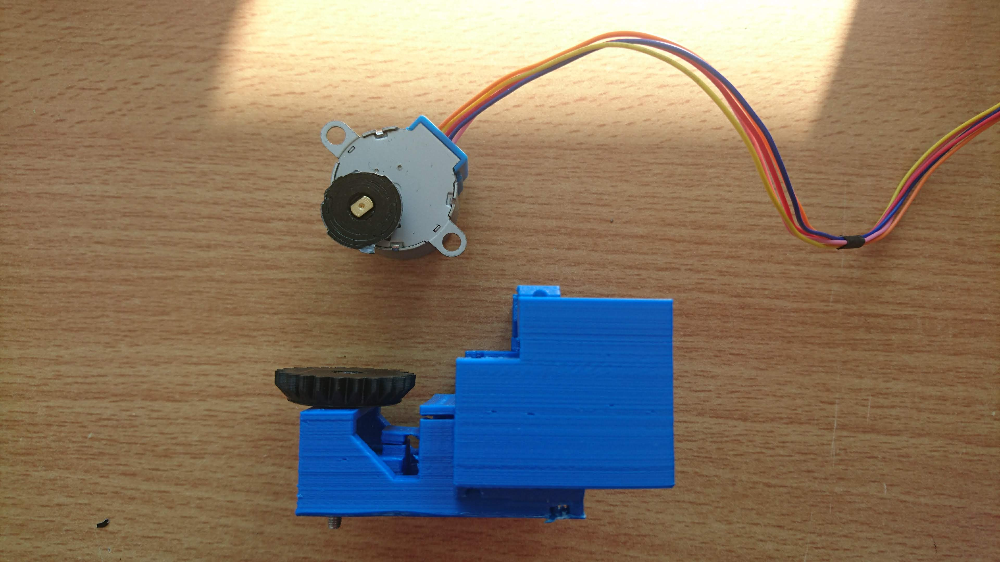
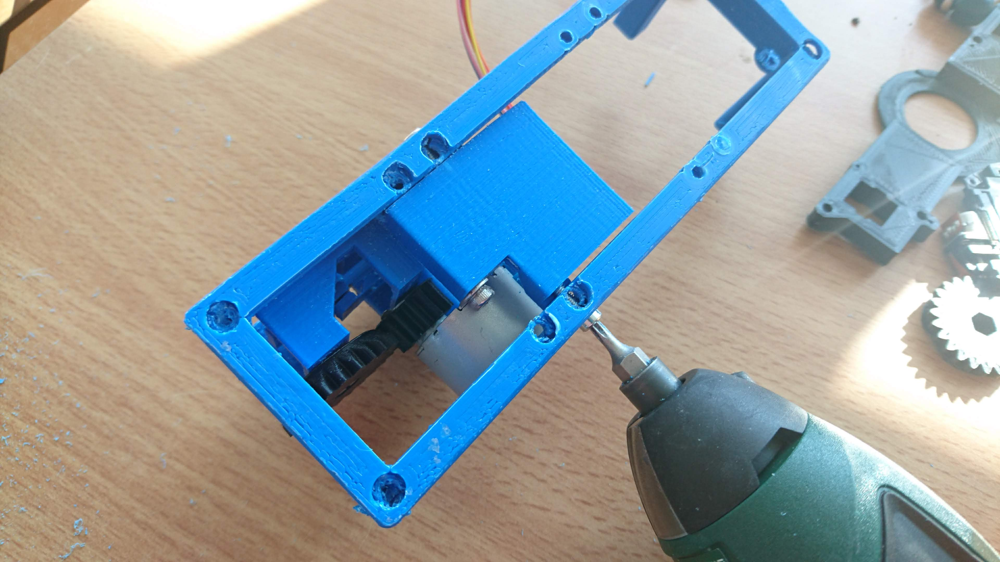
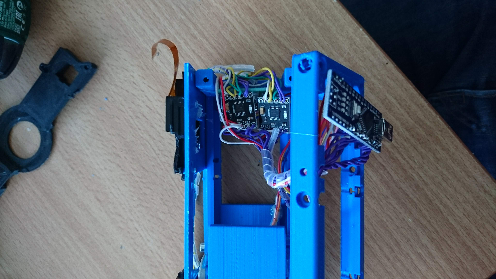
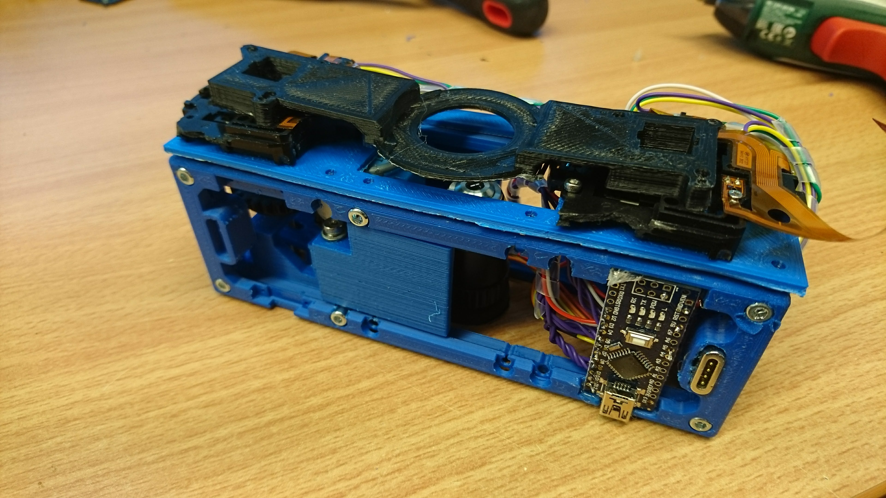

## XYZ-Stage
Here you can find the necessary .stl-parts for the XYZ-Stage.

A detailed description of the assembly process can be found ***[here](./DOCUMENTS/TUT_Assembly_XYZ_Stage.pdf)***

## Electronics and wiring
A detailed explanation about the ***Z-Stage*** can be found [here](/ELECTRONICS/Z-Stage).

A detailed explanation about the XY-Stage can be found [here](/ELECTRONICS/XY-Stage).

## 3D printing files
All files can be found in the folder [STL](./STL).

## Assembly Tutorial

### 1. All parts

### 2. Connect Motor to Gears and Z-Stage

### 3. Connect Motor to Gears and Z-Stage

### 4. Mount Z-Stage to Cube

### 5. Mount Z-Stage to Cube

### 6. Wire the Stepper Motor to the Arduino Nano + Stepper Drivers

### 7. Wire XY-Stages to Stepper-Drivers and Arduino

### 8. It should look like that now; Flash the Example code to test XYZ motion

### 9. Mount the XY-Stage to the frame; Include Sample Bridge

### 10. Put everything together

### 11. Done!

## Video
You can find a video of the ready-to-use stage [here](https://www.youtube.com/watch?v=G8IHuMSYpv0&feature=youtu.be).
