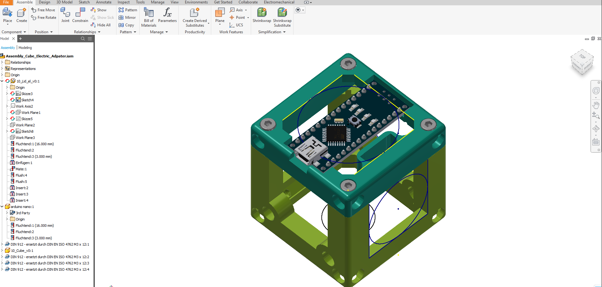

## BASE CUBE Design Files 

These files were generated using Autodesk Inventor 2019 Student Version. 

To start working on it, you have to do the following steps:

1. Open Inventor and import existing project
2. Select filename `Assembly_Cube_Electric_Adpater.ipj`
3. Then open the assembly `Assembly_Cube_Electric_Adpater.iam` inside inventor 
4. The base-cube has two components: `10_Lid_el_v0.ipt` and `10_Cube_v0.ipt` which can be modified to personal needs. 

Screenshot of the cube in Invetor:

Alternatively the cube can also be used in the free (educational purposes) CAD software Autodesk Fusion 360 by first importing all components:

and then opening the `.iam`-file:

