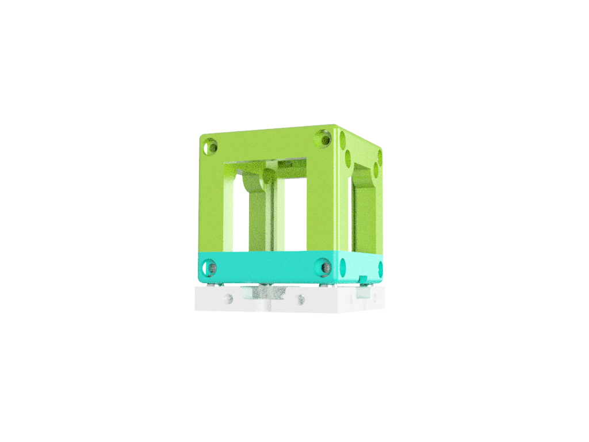

## BASE CUBE 
This is the repository for the base-cube design. The design-files can be found in the folder [INVENTOR](./INVENTOR).

The Base-Cube consists of only 3 components. 

1. **The Base** where the ball magnets will be fed in
2. **The Lid** where the Arduino + Electronics finds its place
3. **The Cube** which will be screwed to the Lid. Here all the functions (i.e. Mirrors, LED's etc.) find their place

The function which fits into the cube is not necessarily bound to optics. It can be everything! 
An example of a mirror or raspi-cam adapter can be found in the In-Incubator Folder.

### 3D Printing:

### Devices features:

	* Click-Mount via Ball-Magnets/Screws 
	* Possible electic connection
	* Fill in whatever function you want
	* modularized design
	* Low-cost production
	* Very precise
	* Open-Source
	* Mount it in all possible directions 