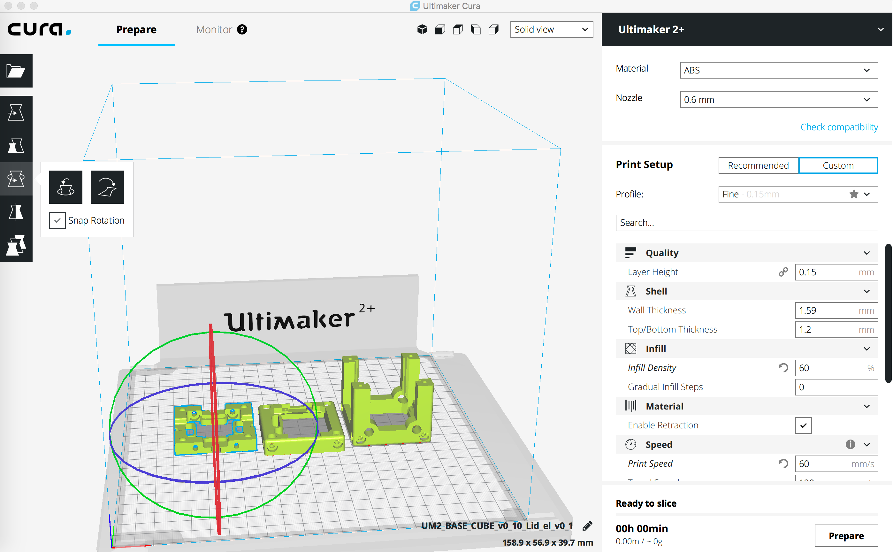

## BASE CUBE - 3D printing files
The `.stl`-files can directly be printed using off-the-shelf 3D printer. We rely on the Ultimaker 2+ which uses Cura as a slicing software. 

An archive with all the files can be found [here](BASECUBE_v0.zip).

###3D-printing settings:

- Default settings were used
- No supporting mater
- Infill: >60% 
- Printing Speed: 60mm/s
- Brim: 4mm 
- Material: ABS/PLA 

## Screenshot CURA 3.2.1

If you need further assistance please file an issue. Thank you. 