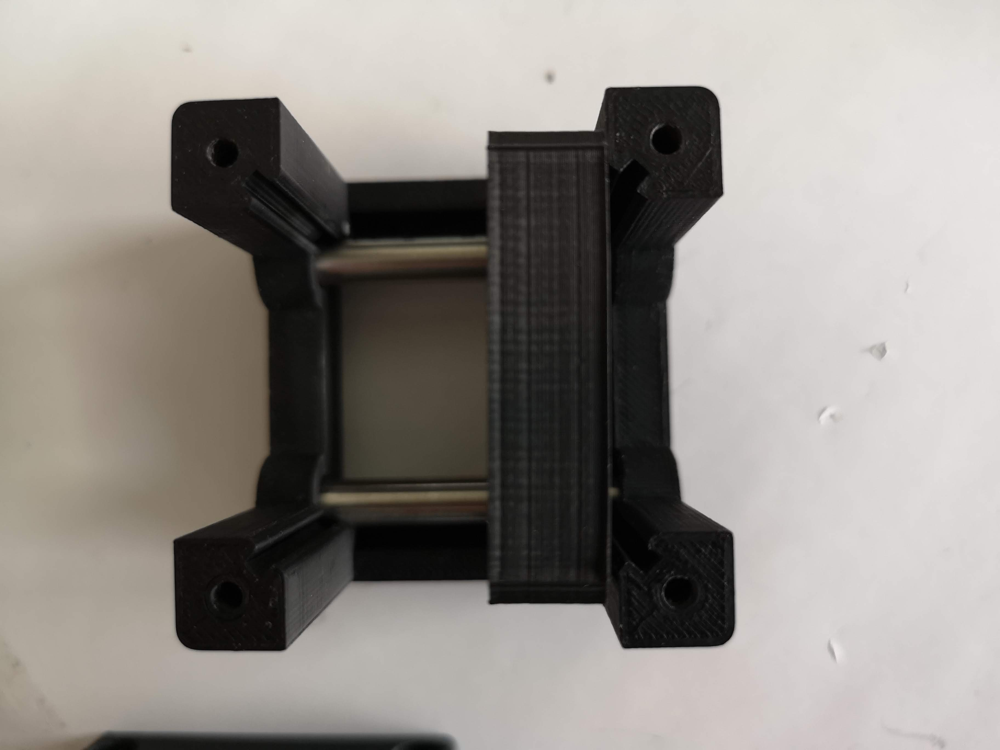
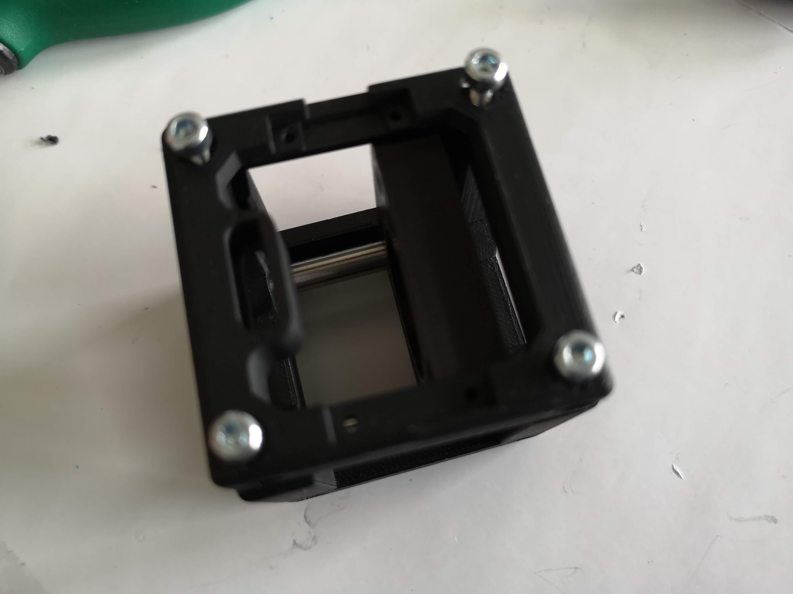
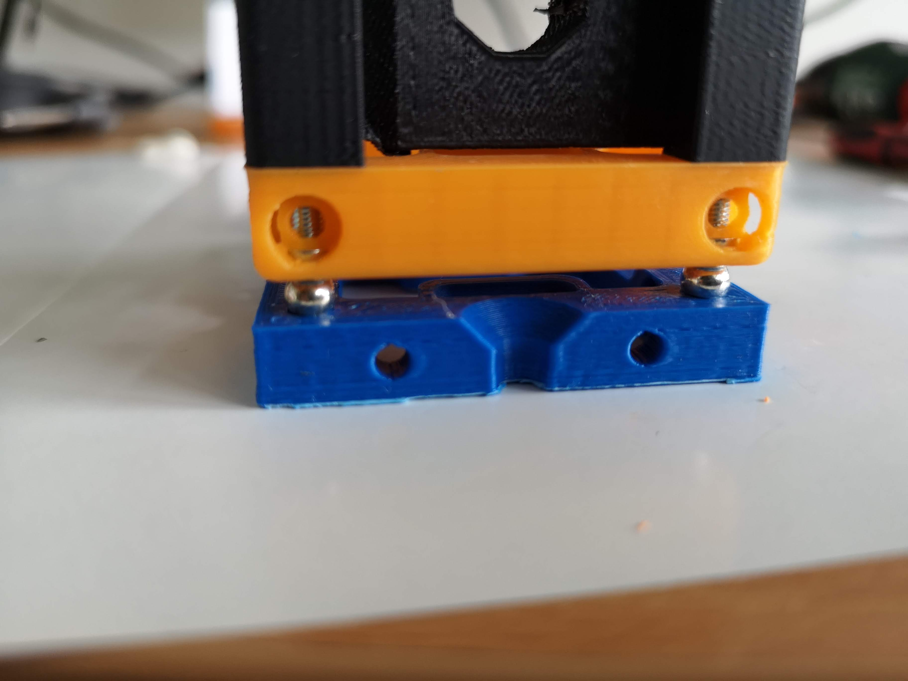

## BASE CUBE 
This is the repository for the base-cube design. The design-files can be found in the folder [INVENTOR](./INVENTOR).

A 3D-printing quick-start-guide can be found [here](./STL)
The Base-Cube consists of only 3 components. 

1. **The Base** where the ball magnets will be fed in
2. **The Lid** where the Arduino + Electronics finds its place
3. **The Cube** which will be screwed to the Lid. Here all the functions (i.e. Mirrors, LED's etc.) find their place

The function which fits into the cube is not necessarily bound to optics. It can be everything! 
An example of a mirror or raspi-cam adapter can be found in the In-Incubator Folder.

### 3D Printing:

A quick printing tutorial can be found here:

##Assembly-Tutorial with images (Cube)

1. All parts for this model

1. Widen the holes to <~5.9mm with a drillin-tool

1. Insert the lens inside the part (don't touch it!)

1. Add the fixation ring

1. Fix the ring so that the lens is not loose - don't touch the lens!

1. Insert rods inside the cube

1. Mount the lens on the rods

1. Fasten the rods

1. Add the lid to the cube and screw it

1. Check if it's tilting - if so: Align screws!

1. Done!

##Assembly-Tutorial with images (Base)

1. All parts for this model

1. Place the magnets on the screws and center the cube on the Base 

1. Apply some force to press-fit the magnets into their desired wholes

1. Done!

### Electronics
The Arduino can be introduced with hot-glue or some screws.

### Devices features:

	* Click-Mount via Ball-Magnets/Screws 
	* Possible electic connection
	* Fill in whatever function you want
	* modularized design
	* Low-cost production
	* Very precise
	* Open-Source
	* Mount it in all possible directions 