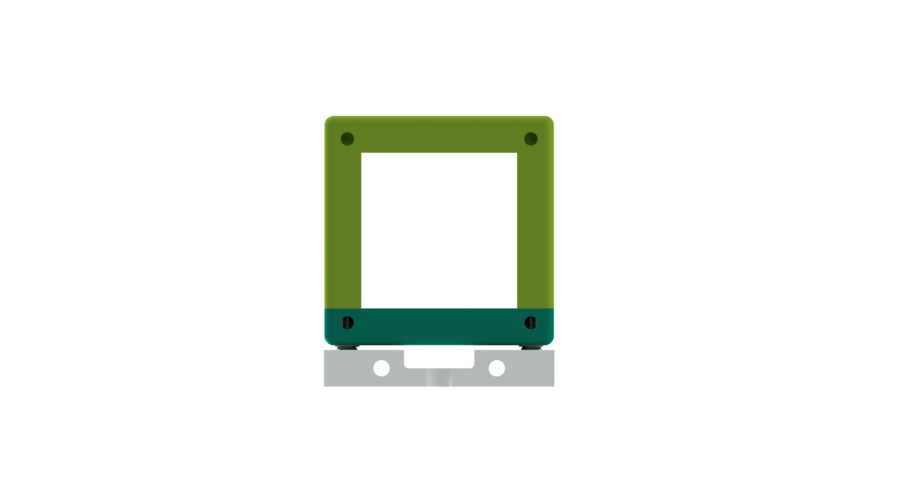

# Part Name
This is the repository for the design of XXX. The stl-files can be found in the folder [STL](./STL).

## Purpose
What do we need this assembly for?

### Properties
The basic properties/features of the assembly go here.

## Parts

###  3D printing parts
* No support needed in all designs
* Carefully remove all support structures (if applicable)

The Cube consists of the following components.

* **The Lid** where the Arduino + Electronics finds its place
* **The Cube** which will be screwed to the Lid. Here all the functions (i.e. Mirrors, LED's etc.) find their place
* **The Insert**

The function which fits into the cube is not necessarily bound to optics. It can be anything!

### Additional parts
Here we list all parts which need to be bought from different sources.

### Tricks
Anything which need to get mentioned here?

## Assembly
Rough text-based assembly guide goes here. Also include images from the ./IMAGES folder.

## Electronics
if applicable

## Safety
Be careful!
