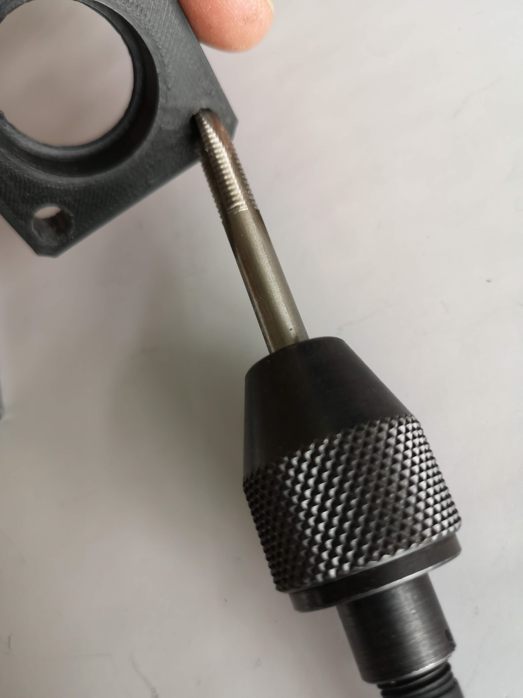
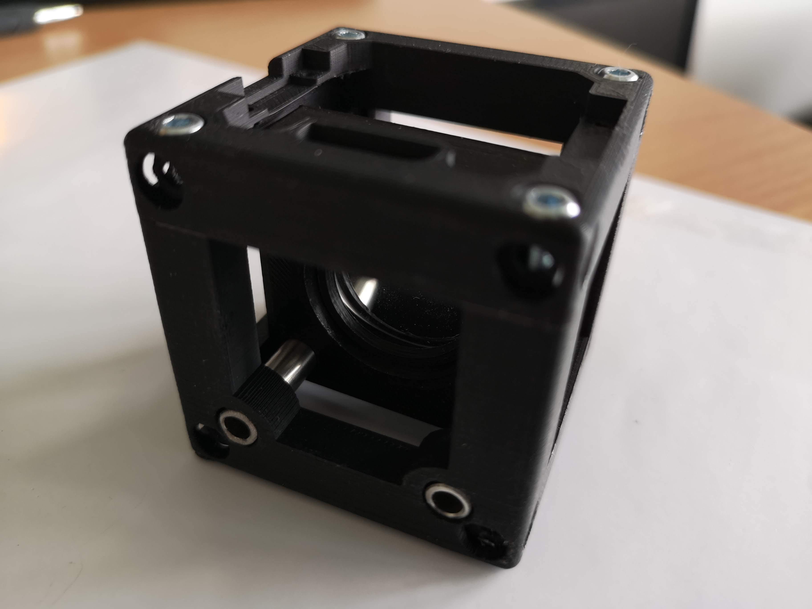
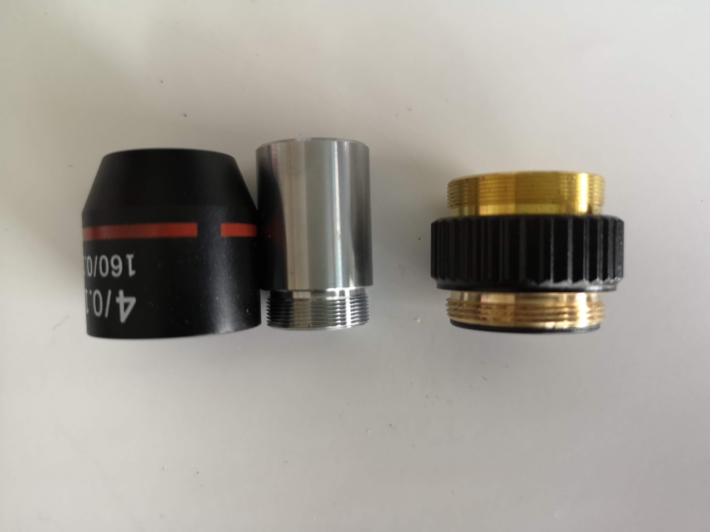
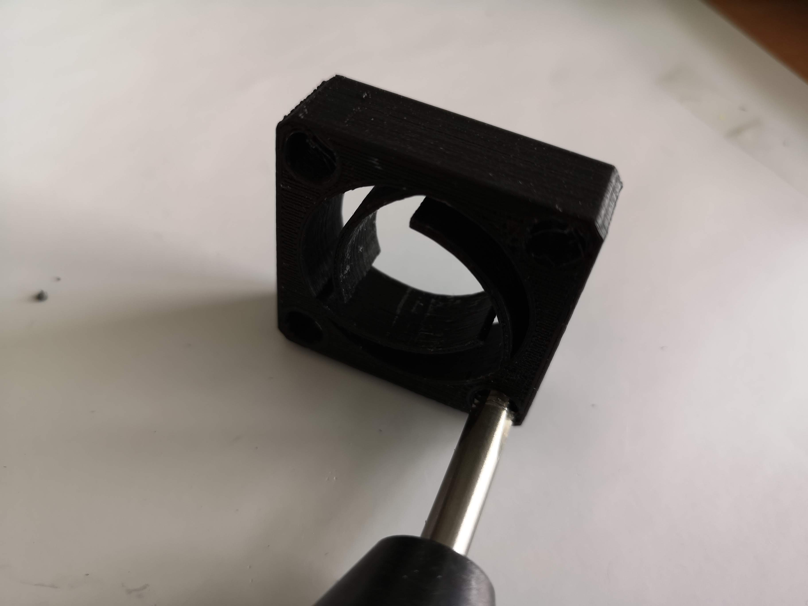
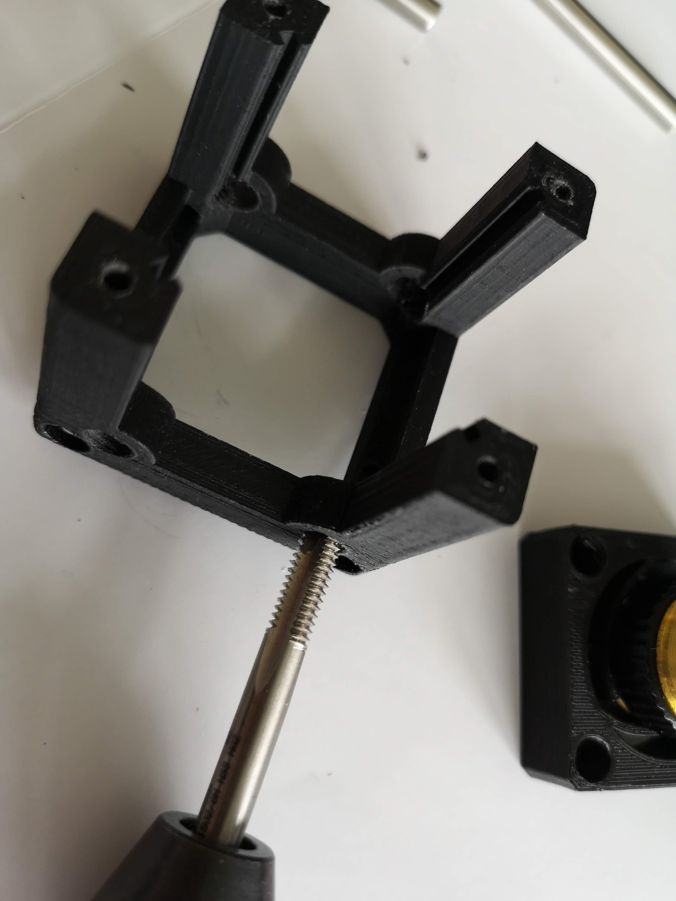
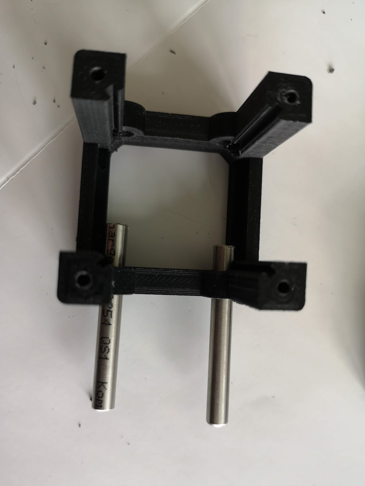
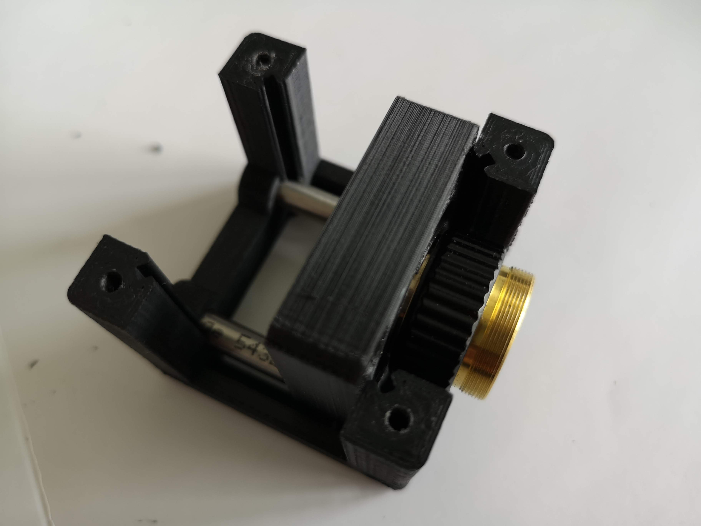
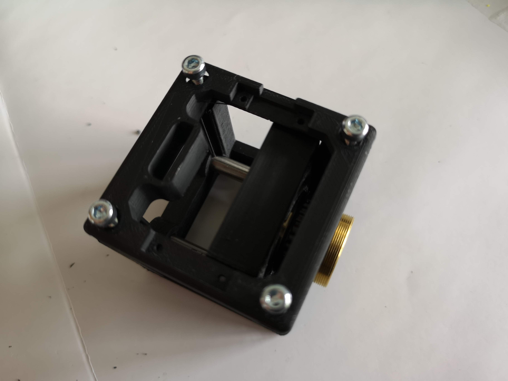

# Generic Lensholder Cube
This is the repository for the Generic Lensholder Cube. 

The stl-files can be found in the folder [STL](./STL).

### Purpose 
It adapts any circular symmetric lens with varying diameter to the UC2 system.

### Cylindrical lens (in the lightsheet)
Like any other lens, a cylindrical lens focuses the incoming light. In case of a positive focal length, the focal spot can be found right after the lens inside the back focal plane (BFP), usually measured as the focal length of the lens. In case of a cylindrical lens, the focus spot is not a single point as in a rotationally symmetric lens, but rather a line like focus. This is because an incoming parallel beam gets focussed only in one direction. In the eye this sometimes happens and hinders clear eysigth by introducing astigmatism (greek point-less)

More information: 

* [https://www.edmundoptics.com/resources/application-notes/optics/what-are-cylinder-lenses/](https://www.edmundoptics.com/resources/application-notes/optics/what-are-cylinder-lenses/)
* Comar Optics, 63 YE 25, cylindrical lens 63, coated
* 

### Properties
* design is derived from the base-cube
* the adapter can hold a large variety of different lenses (differnt diameters/threads)
* the spiral automatically centers the lens to the optical axis 
* the here used objective lens has the following parameters:
	* Thread: RMS
	* Magnification: 4x 
	* NA: 0.1
	* Finite Corrected Optics

## Parts

### 3D printing parts 
The Part consists of the following components. 

* **The Lid** where the Arduino + Electronics finds its place ([LID](./STL/Assembly_Cube_Objectiveholder_10_Lid_el_v0_1.stl))
* **The Cube** which will be screwed to the Lid. Here all the functions (i.e. Mirrors, LED's etc.) find their place ([BASE](./STL/Assembly_Cube_Objectiveholder_10_Cube_v0_2.stl))
* **The Objective/Lens Holder** which holds a lens with varying dimater and adapts it to the base cube ([LENSHOLDER](./STL/Assembly_Cube_Objectiveholder_11_Cube_Adapter_RMS_lens_2.stl))

### Additional parts 
* 4x DIN912 M3*12 screws (non stainless steel)
* Microscopic Objective lens, 4x, 0.1NA, RMS-Thread, Finite corrected
* 2x Rods, 50*6mm, steel/allimimium

## Remarks and Tips 
### 3D Printing:
* No support required in all designs 
* Carefully remove all support structures (if applicable)

## Assembly
* Unscrew the cap of the objective lens
* Widen the 4 holes of the RMS adapter, so that it fits on the rods using a 4mm drilling tool (not too loose, not too stiff)
* Insert the 4x objective lens into the RMS-Adapter
* Insert the rods on one side of the cube
* Put the lensm mount adapter inside the cube and mount it on the rods by sliding the rods throught the holes 
* Add the lid to the cube and fix it with the 4 M3 screws
* Done!

###Tutorial with images (LENSHOLDER)
Don't insert batteries in the laser yet!!

1. All parts for this model

1. Widen the holes to <~5.9mm with a drillin-tool

1. Insert the lens inside the part (don't touch it!)

1. Add the fixation ring

1. Fix the ring so that the lens is not loose - don't touch the lens!

1. Insert rods inside the cube

1. Mount the lens on the rods

1. Fasten the rods

1. Add the lid to the cube and screw it

1. Check if it's tilting - if so: Align screws!

1. Done!

###Tutorial with images (OBJECTIVE HOLDER)
Don't insert batteries in the laser yet!!

1. All parts for this model

1. Remove the metal cap

1. Remove the metal cap II

1. Widen the holes to <~5.9mm with a drillin-tool

1. Insert the objective into the spiral thread

1. Widen the holes to <~5.9mm with a drillin-tool

1. Insert the rods into the cube

1. Mount the objectiveholder on the rods and fasten it

1. Add the screws and fix it

1. Done!

## Safety
Attention, don't cut your fingers while removing the lens from the iPhone sensor! 

Never (!) look into the laser pointer! It will damage your eye immediately!

* ATTENTION: NEVER WATCH DIRECTLY INTO THE LASER! EYE WILL BE DAMAGED DIRECTLY
* NEVER SWITCH ON THE LASER WITHOUT INTEDED USE 
* BEAM HAS TO GO AWAY FROM ONESELF - ALWAYS!
