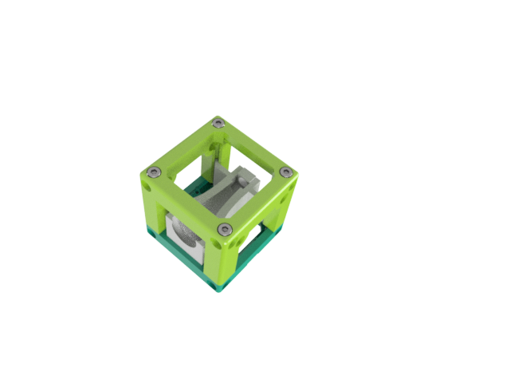

# Integrated Telescope/Beam-Expander Cube
This is the repository for the Integrated Telescope Cube. 

The stl-files can be found in the folder [STL](./STL).

### Purpose
It adapts a very small beam-expander to the UC2 system.

Sometimes one need to increase the diameter of an illuminating beam. This is necessary for the Light-sheet microscopy setup for example. Here we have a laser-pointer which comes with a relatively small beam-diamter of about 2mm. By using a telescope, this can be magnified by a factor of e.g. 8 which results in a beam-dimater of 16 mm. This is necerssary to overfill the aperture of the following illumination objective lens.	

In order to achieve this, we first need to focus the beam with a low focal length lens (e.g. cellphone lens, f'=3mm) and then re-collimate the lens with a second lens with a larger focal length e.g. f'=25 mm. 

We designed a telescope where an iPhone 5 lens and an ordinary 25mm lens can be inserted in an adpater, which finds its place inside an ordinary UC2-cube as visualized in the image above. 

## Properties
* design is derived from the base-cube
* the adapter for the telescope can be adjusted for different magnifications and lenses
* the beam height can be adjusted by sliding the the telescope along the axis 
* the degree of collimation can be adjusted beforehand  * very cost-effecient beam-exander at a fairly good quality as the cellphone lens is diffraction limited (overall costs ~15€) 
* Magnification : m=f_tl/f_ep = 25/3 = 8.33

## Parts

### 3D printing parts 
The Part consists of the following components. 

* **The Lid** where the Arduino + Electronics finds its place ([LID](./STL/Assembly_Cube_prettytelescope_10_Lid_el_v0_1.stl))
* **The Cube** which will be screwed to the Lid. Here all the functions (i.e. Mirrors, LED's etc.) find their place ([BASE](./STL/Assembly_Cube_prettytelescope_10_Cube_v0_2.stl))
* **The Telescope** which holds the two lenses  adapts it to the base cube ([TELESCOPE](./STL/Assembly_Cube_prettytelescope_01_pretty_telescope_iphone_12.stl))

### Additional parts 
* 4x DIN912 M3*12 screws (non stainless steel)
* iPhone 5 lens (serperated from an iPhone camera spare part), f'=3mm 
* biconved/plan-convex lens, f'=25mm, diameter=20mm, thickness=4mm

## Remarks and Tips 
### 3D Printing:
* No support required in all designs 
* Carefully remove all support structures (if applicable)

## Assembly
* Remove the iPhone lens from the camera (a dedicated tutorial can be found in the [UC2 Tutorial-Section](/TUTORIAL). 
* Insert the lenses inside the telescope adapter (orientation of the iPhone has to be the way, that the small aperture - hole - has to face the other bigger lens as indicated by the photo)

* Take the laser-pointer
* Point the laser towards the iPhone Lens
* Adjust the distance between the two lenses, so that the beam is collimated (=the beam diamter right after the telescope should not change over any distance)
* Put the telescope inside the cube by sliding it along the slides

* Add the lid to the cube and fix it with the 4 M3 screws
* Done! 

## Safety
Attention, don't cut your fingers while removing the lens from the iPhone sensor! 

Never (!) look into the laser pointer! It will damage your eye immediately!

* ATTENTION: NEVER WATCH DIRECTLY INTO THE LASER! EYE WILL BE DAMAGED DIRECTLY
* NEVER SWITCH ON THE LASER WITHOUT INTEDED USE 
* BEAM HAS TO GO AWAY FROM ONESELF - ALWAYS!
