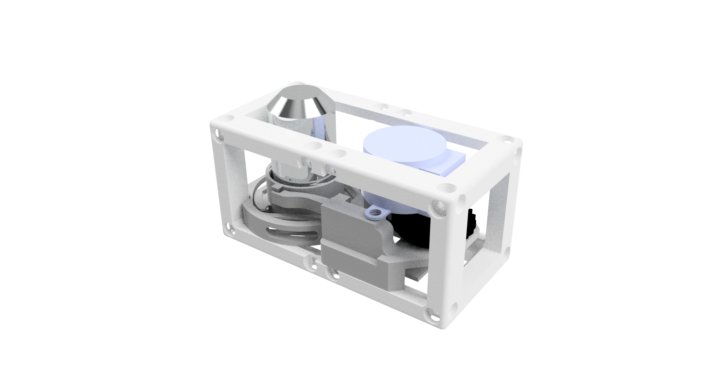

# Z-Stage (Objective) Cube
This is the repository for the Z-Stage (Sample) Cube. 

The stl-files can be found in the folder [STL](./STL).

### Purpose
The stage 

Due to limited space, we need to fold the beam using a mirror. This is done by reflecting the incoming light under an angle of 45°. It follows in a change of the optical axis by 90° 

## Properties
* design is derived from the base-cube
* the adapter holds a 1 inch circular mirror (e.g. Thorlabs part) at 45 degrees in a UC2 base cube 
* the angle of the mirror can be varied in a limited range (e.g. +/- 5°-10°) using a flexure bearing driven by a screw and nut + spring to aply pre-force
* the here used mirror has the following parameters:
	* Diameter: 25,4mm
	* Reflectance 
	* Surface Flatness: (Peak to Valley) λ/10 @ 633 nm
	* Substrate Fused: Silica
	* Thickness: 6.0 mm (0.24")

## Parts

### 3D printing parts 
The Part consists of the following components. 

* **The Lid** where the Arduino + Electronics finds its place ([LID](./STL/Assembly_Cube_Mirror_Tilt_10_Lid_el_v0_1.stl))
* **The Cube** which will be screwed to the Lid. Here all the functions (i.e. Mirrors, LED's etc.) find their place ([BASE](./STL/Assembly_Cube_Mirror_Tilt_10_Cube_v0_2.stl))
* **The Adjustable Mirror Holder** which holds a 1 inch Mirror and adapts it to the base cube ([LENSHOLDER](./STL/Assembly_Cube_Mirror_Tilt_01_Cube_Inlet_Mirrir_Tilt_12.stl))

### Additional parts 
* 5x DIN912 M3*12 screws (non stainless steel)
* 1x M3 Nut 
* 1x Thorlabs PF10-03-P01 - Protected Silver Mirror

## Remarks and Tips 
### 3D Printing:
* No support required in all designs 
* Carefully remove all support structures (if applicable)

## Assembly
* Insert the screw and nut in the appropriate place
* Add a spring between the part which gets bended and the back (non-moving part). 
* Remove any support and clean the part
* Insert the mirror in the appropriate hole
* Slide in the assembled Mirror part into the Cube-Base
* Add the lid and fix it using a set of M3 screws
* Done!

## Safety
Don't touch the silver surface! 

Attention, don't cut your fingers while removing the lens from the iPhone sensor! 

Never (!) look into the laser pointer! It will damage your eye immediately!

* ATTENTION: NEVER WATCH DIRECTLY INTO THE LASER! EYE WILL BE DAMAGED DIRECTLY
* NEVER SWITCH ON THE LASER WITHOUT INTEDED USE 
* BEAM HAS TO GO AWAY FROM ONESELF - ALWAYS!

