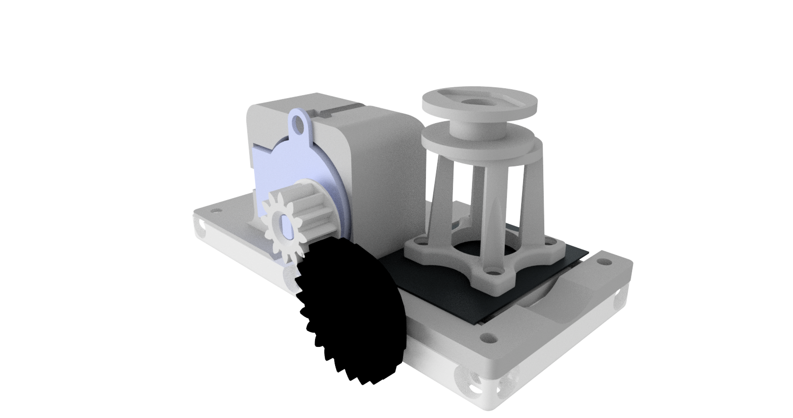

# Z-Stage (Sample) Cube
This is the repository for the Z-Stage (Sample) Cube. 

The stl-files can be found in the folder [STL](./STL).

### Purpose
In light-sheet microscopy one often needs the ability to move the sample trought the illuminating light-sheet in order to capture the 3D information from the sample. This can either be done by scanning the light-sheet and focussing the objective lens simultaneously or by simply moving the sample along the optical axis w.r.t. the detection objective lens. 

To keep the setup as simple as possible we decided to mount the sample (e.g. beads in agarose prepared in a syringe) on a stage which linearly moves it back and forth. Therefore, the light-sheet and objective lens once aligned can always stay in the same position. 

***The mechanism is as follows***: A stepper motor (28-BYJ) drives a small gearbox which rotates a screw. On the screw, there is a nut which acts as a worm-drive. The conversion of the rotational into linear movement pushes/pulls a small table which is formed by a set of flexure-bearings. The syringe can be placed on a dedicated stand which is mounted using magnets on a ferro-magnetic metal plate itself glued to the moving table. 

## Properties
* theoretically no play due to the use of flexure berings
* moving range around +/- 10mm
* very low cost by relying on off-the-shelf components 

## Parts

### 3D printing parts 
The Part consists of the following components. 

* **The Lid (Special)** where the Arduino + Electronics finds its place ([LID](./STL/Assembly_XY_Translator_Lightsheet_10_Lid_el_2x_v0_X_translator_1.stl))
* **The Cube** which will be screwed to the Lid. Here all the functions (i.e. Mirrors, LED's etc.) find their place ([BASE](./STL/Assembly_Cube_Mirror_Tilt_10_Cube_v0_2.stl))
* **The Syringe Holder - I** which holds a Syringe ([Syringe Holder - I](./STL/Assembly_XY_Translator_Lightsheet_00_Syringe_holder_lid_8.stl))
* **The Syringe Holder - II** which holds a Syringe ([Syringe Holder - II](./STL/Assembly_XY_Translator_Lightsheet_10_Syringe_holder_7.stl))
* **The Z-Stage and Motor Holder** which moves the sample and holds the stepper motor ([Z-Stage](./STL/Assembly_XY_Translator_Lightsheet_00_X_Translator_Lightsheet_v3_5.stl))
* **The Gear (large)** which drives the wormdrive - borrowed from BOWMAN'S flexurescope ([gear (large)](./STL/Assembly_XY_Translator_Lightsheet_large_gear_4.stl))
* **The Gear (small)** which drives the wormdrive - borrowed from BOWMAN'S flexurescope ([gear (small)](./STL/Assembly_XY_Translator_Lightsheet_large_gear_4.stl))

### Additional parts 
* 4x DIN912 M3*12 screws (non stainless steel)
* 3x M3 Nut 
* 1x M3 Screw, 26 mm
* 1x M4 Screw, 16 mm + M4 Nut
* 1x ferro-magnetic plate ~ 15x15 mm, 1mm thickness
* 1x 28-BYJ stepper motor
* 1x Driving electronic
* 1x ESP32 for controlling the motor
* 1x USB Micro Cable 

## Remarks and Tips 
### 3D Printing:
* No support required in all designs 
* Carefully remove all support structures (if applicable)

## Assembly
* Detailed description coming soon
* Add motor and small gear, fix it with M4 screw
* Add the M3 nut in the dedicted hole close to the moving stage
* Add M3x26mm screw with mounted large gear at one end and insert it into the hole. 
* rotate the M3x26 screw so that it pushes the moving z-stage
* Wire the motor, test it
* Done!

## Safety
Be careful!
