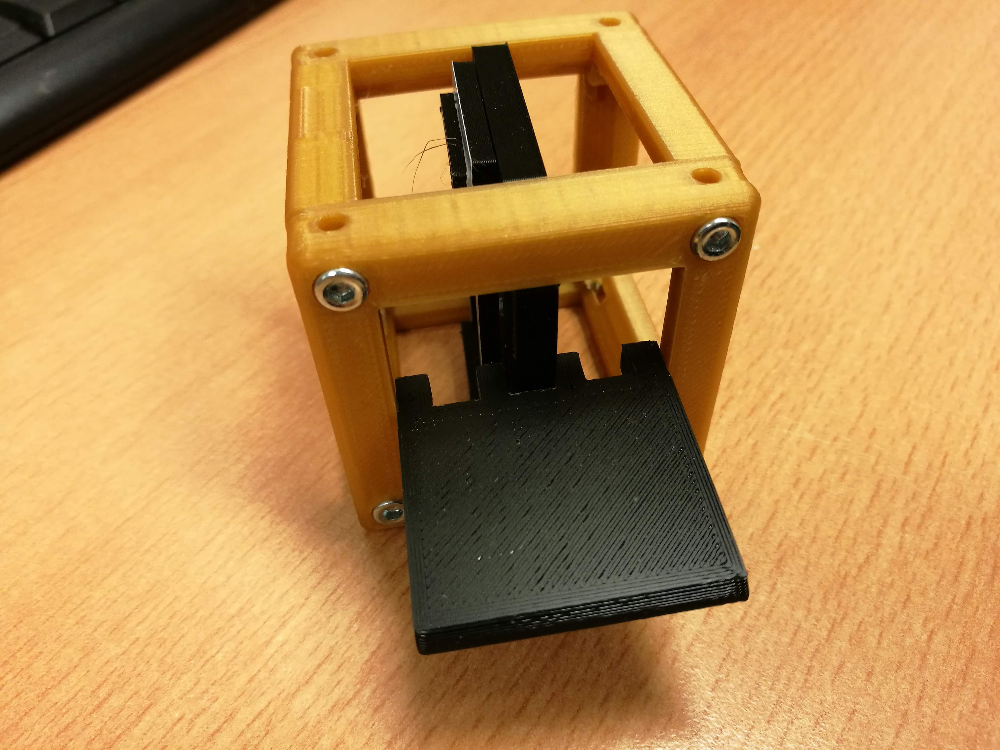

# Alignment Tool for Cube Inserts

This part helps to align parts to a certain position inside the cube along the optical axis. It works like template. By adjusting the edge-length it can be tuned to individual needs.

## Purpose
Helps to align lenses - should be shipped with more complex setups to help others to replicate it. 

## Properties

A costumizable tool will come soon. Now it just makes sure, that the insert is exactly in the center of the cube. 

It works like a fork, where the insert is hold between the two bars. 

## Parts

### 3D printing parts
..can be found in the [STL](./STL)-folder.

1. **The Alignment Tool** which centers the insert into the center. 

### Additional parts
 -

## Remarks and Tips

If an insert should go to a different position, please adjust it to your individual needs. An openscad version will come soon. 

### 3D Printing
Print as is without support. Infill can be around 30%.

## Safety
Take care in case you're dealing with lasers. Don't burn yourself if you solder the part!
