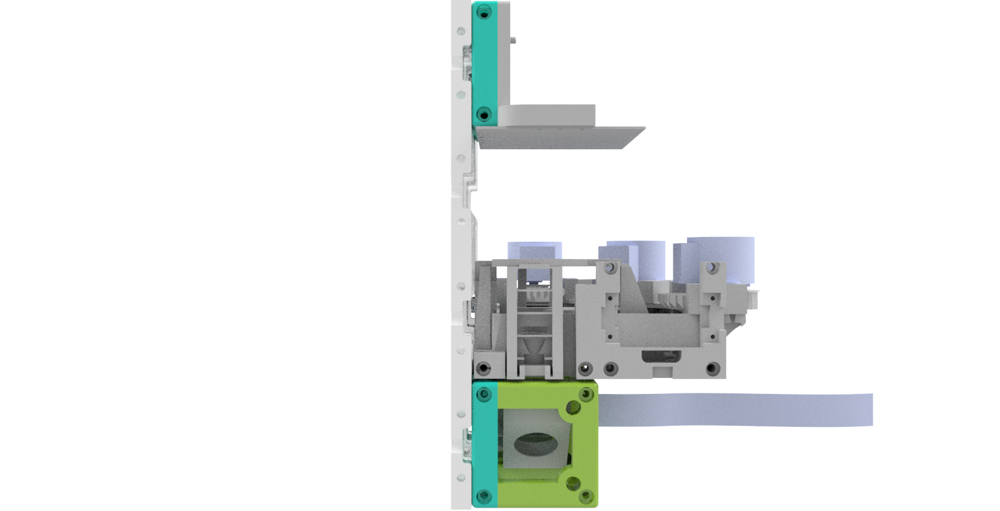

## In-Incubator Microscpe
This is the repository for the in-incubator microscope. It is capable to acquire Time-Lapse videos from living cells inside an incubator. 

The current version is derived from Bowman's stage design, but will be replaced by the low-cost x/y-stage design in the future.

Each functional block has an Arduino acting as a BUS-communicator. Therefore it's possible to control (i.e. swith on/off) devices from the MASTER-device (i.e. Raspberry pi). We aim to build a low-cost solution for high throughput acquisitions, acting as a new tools for (not only) biologists. 

It is a very early developer version. Please feel free to contribute to the documentation. 

Devices features:

	* X/Y/Z/t Acquisitions possible
	* Fluorescent imaging 
	* Quantitative Phase Imaging
	* modularized design
	* Low-cost acquisition
	* based on off-the-shelf components (please see the bill of materials in the (./../DOCUMENTS) DOCUMENTS folder)
	* Open-Source