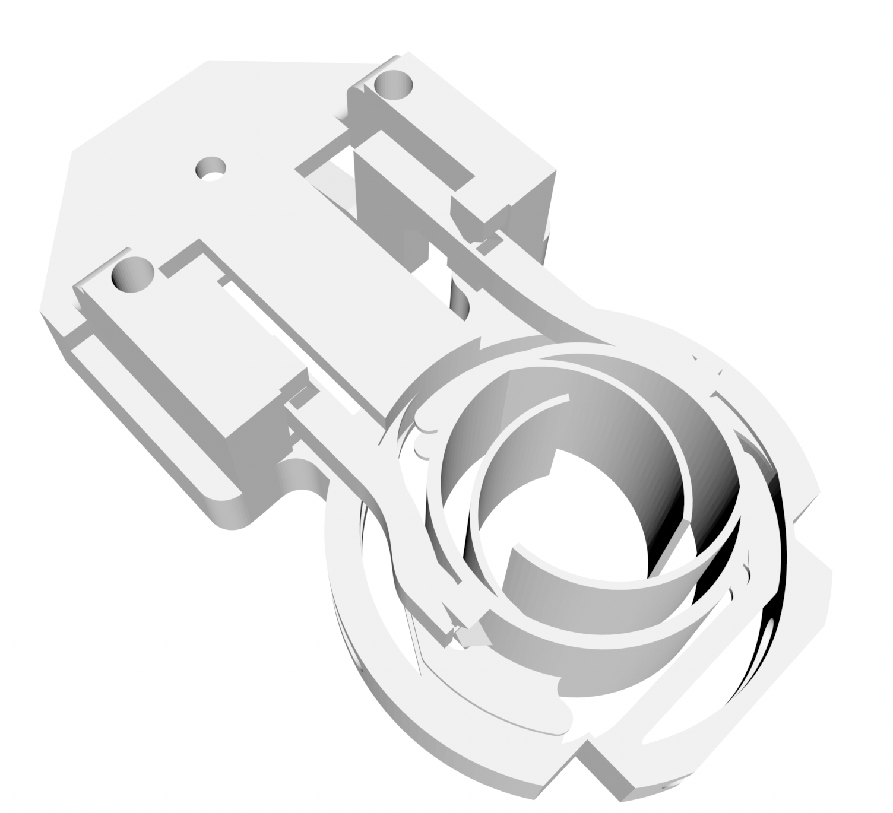
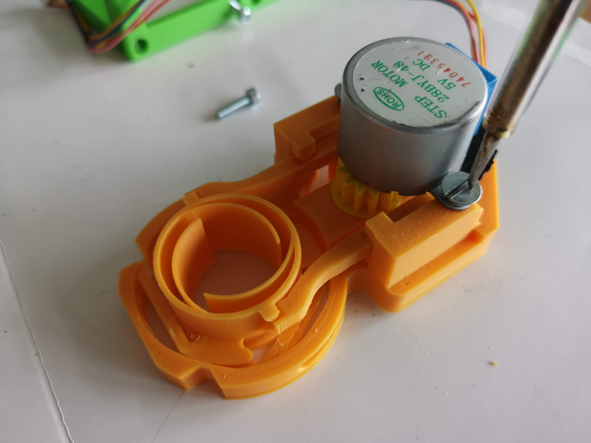
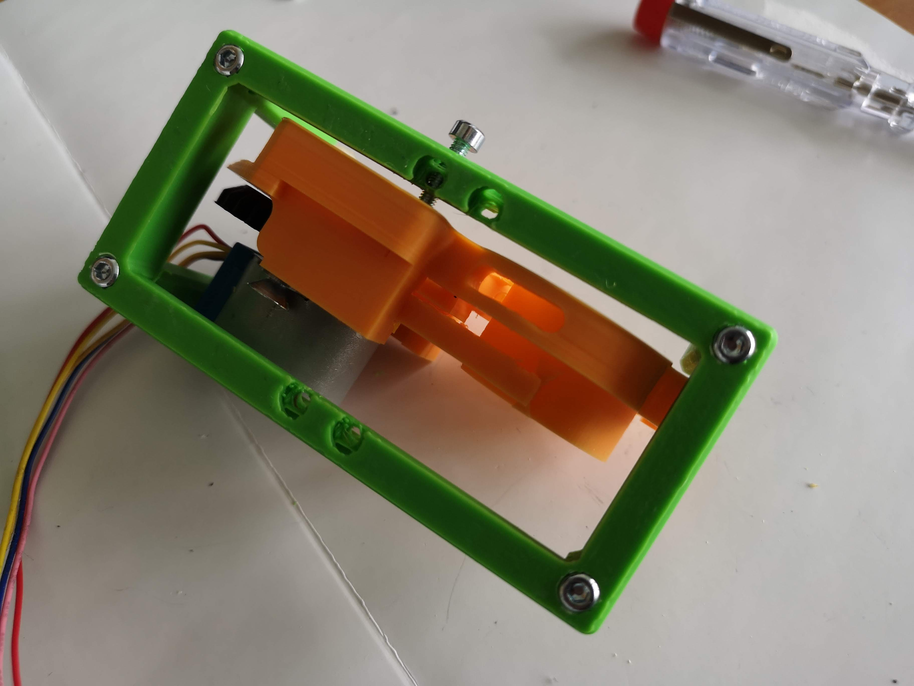

# Z-Stage (Objective) Cube
This is the repository for the Z-Stage (Objective) Cube. 

The stl-files can be found in the folder [STL](./STL).

### Purpose
In microscopy one often needs the ability to move the objective along the optical axis in order to refocus a given 3D sample. 
In order to automate this, we designed a very simple z-stage itself reyling on flexure bearings also knwon from Bowman's flexurescope. The main difference here is, that we rely on a spiral-design which avoids the parallel-shift of the objective lens and makes the entire design very robust. 

***The mechanism is as follows***: A stepper motor (28-BYJ) drives a small gearbox which rotates a screw. On the screw, there is a nut which acts as a worm-drive. The conversion of the rotational into linear movement pushes/pulls a small level-arm which is connected to the spiral spring-like linear actuator. It can thus move up-and down around the resting position. 
Another spiral-like spring can hold an objective lens with varying sizes. It also allows coarse z-focussing.  

## Properties
* theoretically no play due to the use of flexure berings
* moving range
	* fine: around +/- 8mm
	* coarse: around +/- 20 mm (shifting the objective lens inside the spiral-like spring
* very low cost by relying on off-the-shelf components 

## Parts

### 3D printing parts 
The Part consists of the following components. 

* **The Lid (2x1)** where the Arduino + Electronics finds its place ([LID](./STL/Assembly_Z_Focus_Spiralbearing_v3_10_Lid_2x_v0_non-el_2.stl))
* **The Cube (2x1)** which will be screwed to the Lid. Here all the functions (i.e. Mirrors, LED's etc.) find their place ([BASE](./STL/Assembly_Z_Focus_Spiralbearing_v3_10_Cube_2x_v0_no-rods_1.stl))
* **The Z-Stage and Motor Holder** which moves the objective and holds the stepper motor ([Z-Stage](./STL/Assembly_Z_Focus_Spiralbearing_v3_00_focus_inlet_triangle_spiral_v5_3.stl)
* **The Gear (large)** which drives the wormdrive - borrowed from BOWMAN'S flexurescope ([gear (large)](./STL/Assembly_Z_Focus_Spiralbearing_v3_00_large_gear_4.stl))
* **The Gear (small)** which drives the wormdrive - borrowed from BOWMAN'S flexurescope ([gear (small)](./STL/Assembly_Z_Focus_Spiralbearing_v3_00_small_gear_5.stl))

### Additional parts 
* 8x DIN912 M3*12 screws (non stainless steel)
* 3x M3 Nut 
* 1x M3 Screw, 26 mm
* 1x M4 Screw, 16 mm + M4 Nut
* 1x 28-BYJ stepper motor
* 1x Driving electronic
* 1x ESP32 for controlling the motor
* 1x USB Micro Cable 

## Remarks and Tips 
### 3D Printing:
* No support required in all designs except the sprial focussing mechanism (use sparse support!) 
* Carefully remove all support structures (if applicable)

## Assembly
* Detailed description coming soon
* Add motor and small gear, fix it with M4 screw
* Add the M3 nut in the dedicted hole close to the moving stage
* Add M3x26mm screw with mounted large gear at one end and insert it into the hole. 
* rotate the M3x26 screw so that it pushes the moving z-stage
* Wire the motor, test it
* Done!

###Tutorial with images
Don't insert batteries in the laser yet!!

1. All parts for this model

1. Add the M3 screw and the spring right here. Use some (hot) glue, so that the screw cannot rotate anymore.

1. Add a M3 Washer

1. Mount the large Gear using a M3 nut

1. Add the small gear

1. Attach the stepper Motor (28BYJ)

1. Fix the stepper motor with some screws

1. Mount the focus inlet to the 2x1 Base cube using a M3 screw

1. Fasten the screw

1. Do the same thing on the other side

1. Fix all screws 

1. Add the objective lens

1. Put the objective lens in the correct position - Done! 

## Safety
Be careful!
