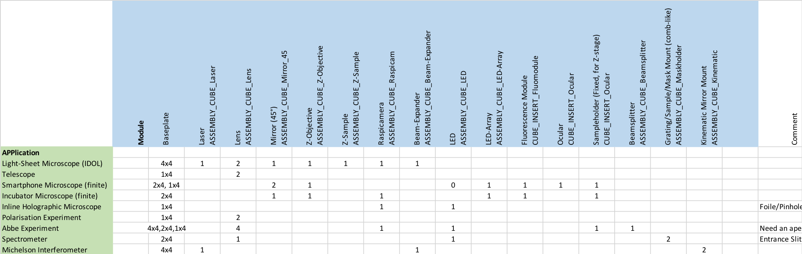
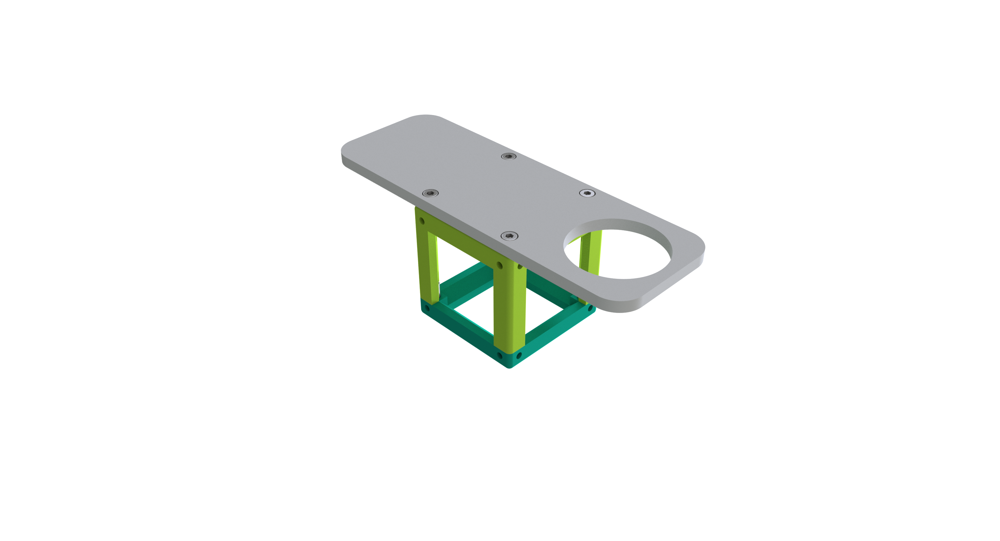
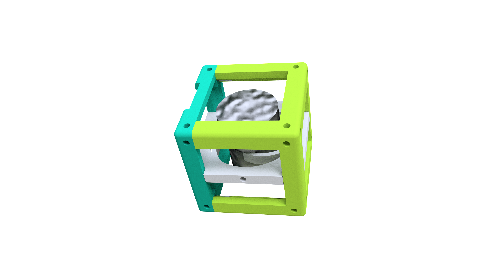
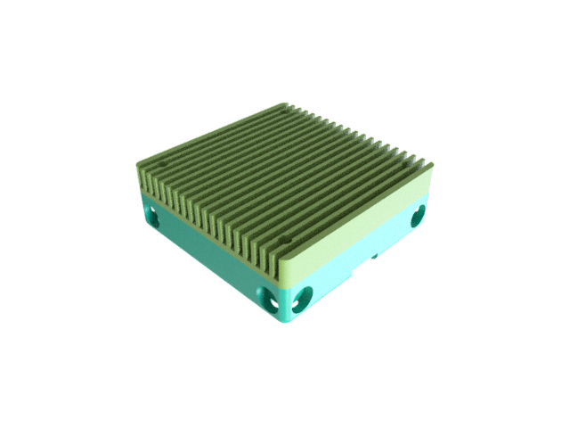
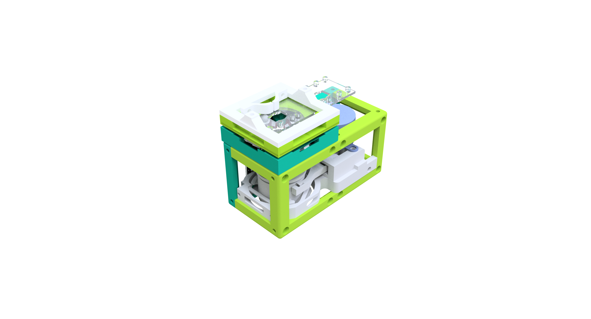

## CAD-Files
Here you can find the necessary .stl-parts for the different modules (cubes) and setups (apps).

This will be a growing list of available optical setups coming along with tutorials and build instructions. The most important part is the core building block as you can also find it in every modular toolbox. A detailed description of the the **UC2** cube can be found [here](./ASSEMBLY_CUBE_Base_v2/Readme.md).

We have Tutorials with images now! :-)

## General Naming Convetion and Structure of UC2

##   Ready-to-use box

The detailed up-to-date list of all components can be found in this [google-spreadsheet](https://drive.google.com/file/d/1Vh9hyDPg2nbcnaBAXX8jAnEIwKx_D-sa/view?usp=sharing).

## Confusion about version 1.0 vs. Version 2.0

We made a change in the CAD-design of the cube in order to be more generic (e.g. point symmetry around the centre). We're trying hard to update the APPlications so that everything is based on the new desing. If you want to print something, have a look on the date when it was last updated. The newer it is, the more likely it is that the cube's have been updated.

The overall dimensions stay the same, but the inserts change!

##  Printing
The .stl files can be downloaded and printed. We use an Ultimaker 2+/3 and DeeGreen which is precise enough. Note, that not all parts might be necessary to print. A detailed description or compiled list of necessary parts will follow soon.

##  List of available Modules (CUBEs):
Each folder contains a step-by-step tutorial which describes how the module has to be assembled.

Link             |  Image of the part
:-------------------------:|:-------------------------:
[Base Plate (1x4,2x4,4x4)](./ASSEMBLY_Baseplate_v2)  |  
[CUBE Base](./ASSEMBLY_CUBE_Base_v2)  |  
[Beam Expander](./ASSEMBLY_CUBE_Beamexpander_v2)  |  
[Beamsplitter](./ASSEMBLY_CUBE_Beamsplitter_v2)  |  
[Smartphone Holder](./ASSEMBLY_CUBE_Cellphonemount) | 
[Dichroic Beamsplitter](./ASSEMBLY_CUBE_Dichroic_Beamsplitter_v2) | 
[Eyepiece ](./ASSEMBLY_CUBE_Eyepiece_v2) | 
[Laser](./ASSEMBLY_CUBE_Laser_v2) | 
[LED Matrix](./ASSEMBLY_CUBE_LED_Matrix_v2) | 
[LED Star](./ASSEMBLY_CUBE_LED_v2) | 
[Lens (cylindrical)](./ASSEMBLY_CUBE_Lens_CYLINDRICAL_v2) | 
[Lens (circular)](./ASSEMBLY_CUBE_Lens_v2) | 
[Mirror (45°)](./ASSEMBLY_CUBE_Mirror_45_v2) | 
[Mirror, kinematic (45°)](./ASSEMBLY_CUBE_Mirror_Kinematic_45_v2) | 
[Mirror, kinematic (0°)](./ASSEMBLY_CUBE_Mirror_Kinematic_v2) | 
[Basler Cam](./ASSEMBLY_CUBE_BaslerCam) | 
[Allied Vision Cam](./ASSEMBLY_CUBE_AlliedVision_Alvium) | 
[Raspi Cam](./ASSEMBLY_CUBE_RaspiCam_v2) | 
[S-Stage](./ASSEMBLY_CUBE_S-STAGE_v2) | 
[Sample Holder Cube](./ASSEMBLY_CUBE_Sample_Holder_v2) | 
[Sample Holder Comb](./ASSEMBLY_CUBE_Sample_Holder_v2) | 
[Z-Stage + Flomodle](./ASSEMBLY_CUBE_Z-STAGE_v2) | 
[Thorlabs Adapter](./ASSEMBLY_CUBE_Thorlabs_v2) | 
[XYZ-Stage v0](./ASSEMBLY_XYZ-STAGE) | 

## List of available Supplements:
* [ELECTONICS-RaspiTFT-Case](./EXT_ELECTONICS-RaspiTFT-Case)
* [ELECTRONICS-Mount](./EXT_ELECTRONICS-Mount)
* [openSIM - Module](./ASSEMBLY_CUBE_openSIM)

##  List of available Applications (APPs):
- [Abbe Diffraction Experiment](./APP_Abbe_Setup)
- [Incubator Microscope (Old)](./APP_Incubator_Microscope)
- [Smartphone Microscope](./APP_SMARTPHONE_MICROSCOPE)
- [Inline Holographical Microscope](./APP_INLINE_HOLOGRAM)
- [Lightsheet Microscope](./APP_LIGHTSHEET_Workshop)
- [Simple Telescope](./APP_SIMPLE-Telescope)
- [Michelson Interferometer](APP_Michelson_Interferometer)
- [Spectrometer](APP_Spectrometer)

More setups are coming soon!
Inspire us with your ideas - we try to make it work! :-)

##  Participate
If you have a cool idea, please don't hesitate to write us a line, we are happy to incorporate it in our design to make it even better.
