## CAD Files
 Here you can find the necessary .stl parts for the different modules (cubes) and setups ([APPs](../APPLICATIONS)).

* For complete setups go to [APPLICATIONS](../APPLICATIONS)
* For setups compilations go to [TheBOX](../TheBOX)
* For beginner's tutorials, how-to guides and more guidelines go to [TUTORIALS](../TUTORIALS)
* For information on the electronic parts go to [ELECTRONICS](../ELECTRONICS)
* For information on the software go to the dedicated repository [UC2-Software-GIT](https://github.com/bionanoimaging/UC2-Software-GIT)
* For the Bill of Materials go to [RESOURCES](../TUTORIALS/RESOURCES)
* For anything else, have a look at the [SITEMAP](../SITEMAP.md)

This is a growing list of available modules coming along with tutorials and assembly instructions. The most important part is the core building block as you find in every modular toolbox. A detailed description of the **UC2** cube can be found [here](./ASSEMBLY_CUBE_Base_v2/Readme.md).

## General Naming Convention and Structure of UC2

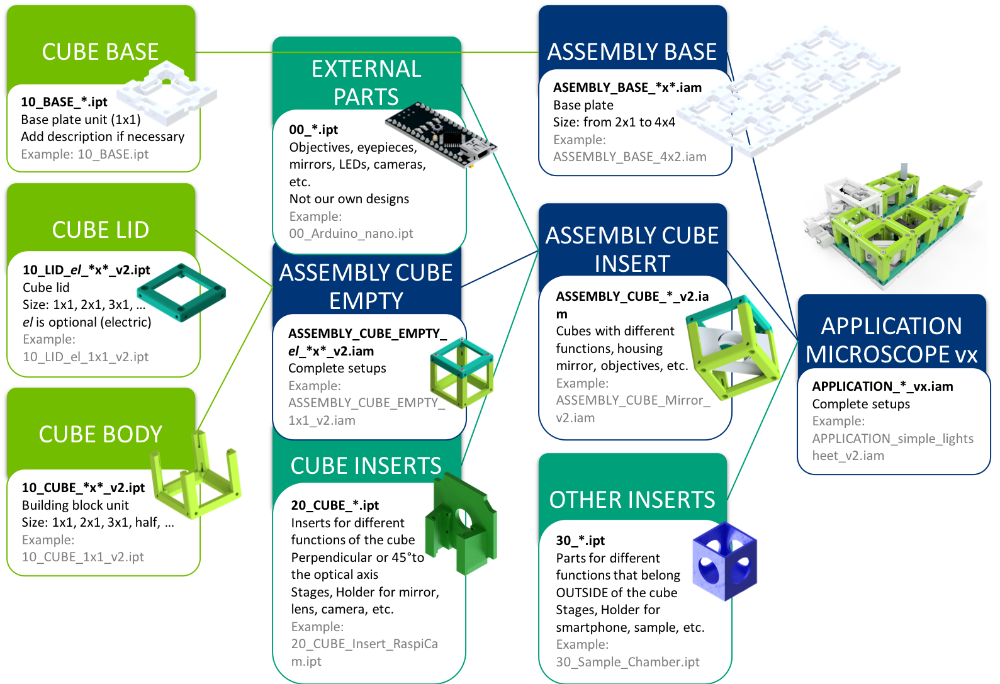

## Confusion about version v0 vs. version v2

We made a change in the CAD design of the cube in order to be more generic (e.g. point symmetry around the center). We're trying hard to update the APPlications so that everything is based on the new design, but it's a lot of files and there are probably still some forgotten v0 parts.

If you're unsure, check out the [Modular Developer Kit](../MDK) - there you find a general definition of the shape and size of the inserts which is up to date!

The outer cube dimensions stayed the same, but the inserts changed completely!

##  Printing
The .stl files of the respective modules can be downloaded and printed. Have a look at our [TUTORIALS](../TUTORIALS) section for some introductory information regarding 3D printing, shopping for components and more.

## List of available Modules (CUBEs):
Each folder contains a step-by-step tutorial which describes how the module has to be assembled.

Link             |  Image of the part
:-------------------------:|:-------------------------:
[Base Plate (1x4,2x4,4x4)](./ASSEMBLY_Baseplate_v2)  |  [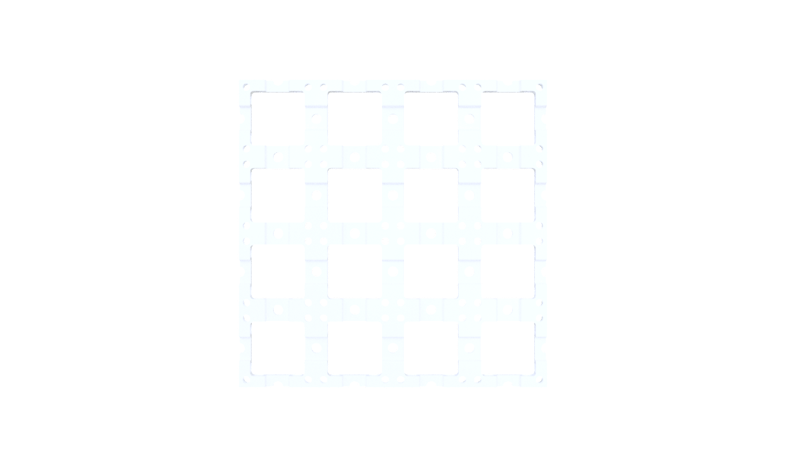](./ASSEMBLY_Baseplate_v2)
[CUBE Base](./ASSEMBLY_CUBE_Base_v2)  |  
[Allied Vision Cam](./ASSEMBLY_CUBE_AlliedVision_Alvium) | [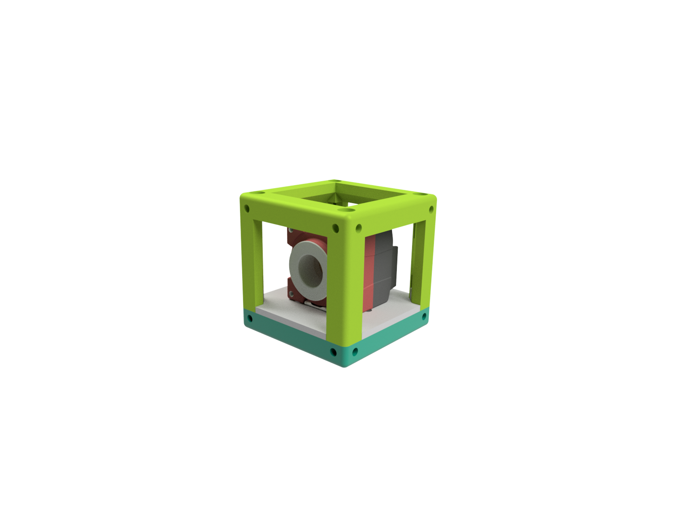](./ASSEMBLY_CUBE_AlliedVision_Alvium)
[Circular Aperture](./ASSEMBLY_CUBE_Aperture_Circular_v2)  |  [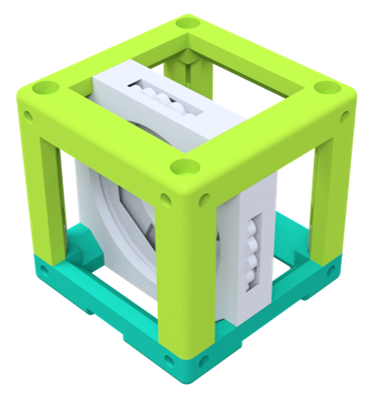](./ASSEMBLY_CUBE_Aperture_Circular_v2)
[Rectangular Aperture](./ASSEMBLY_CUBE_Aperture_Rectangular_v2)  |  [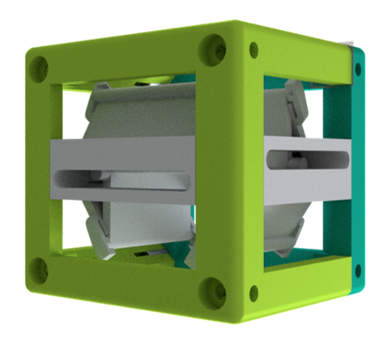](./ASSEMBLY_CUBE_Aperture_Rectangular_v2)
[Basler Cam](./ASSEMBLY_CUBE_BaslerCam) | [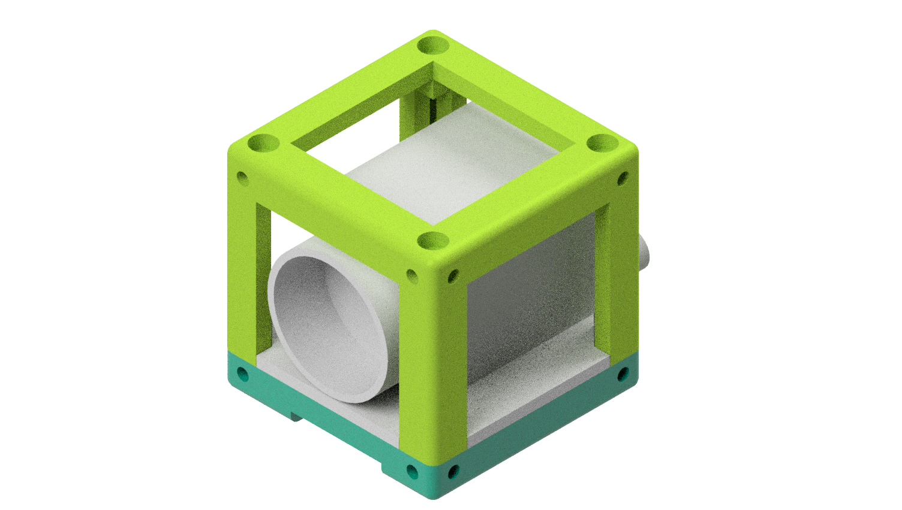](./ASSEMBLY_CUBE_BaslerCam)
[Beam Expander](./ASSEMBLY_CUBE_Beamexpander_v2)  |  
[Beamsplitter](./ASSEMBLY_CUBE_Beamsplitter_v2)  |  
[Dichroic Beamsplitter](./ASSEMBLY_CUBE_Dichroic_Beamsplitter_v2) | [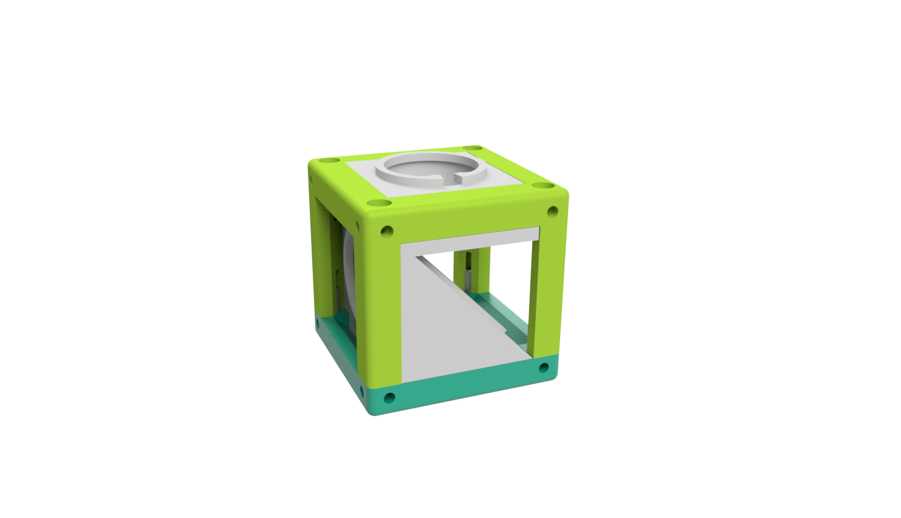](./ASSEMBLY_CUBE_Dichroic_Beamsplitter_v2)
[Eyepiece + Smartphone](./ASSEMBLY_CUBE_Eyepiece_v2) | [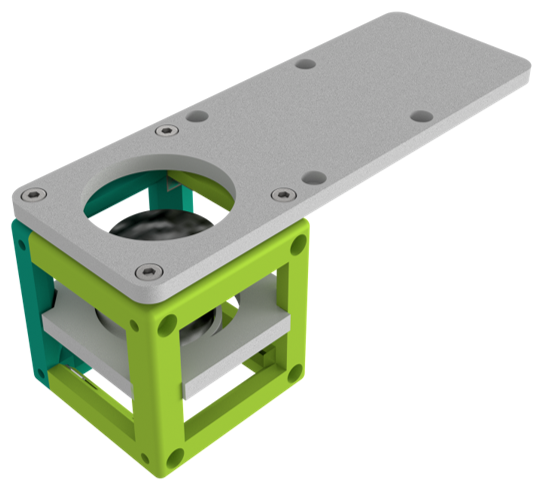](./ASSEMBLY_CUBE_Eyepiece_v2)
[Eyeball Cube ](./ASSEMBLY_CUBE_Eyeball_v2) | 
[Laser](./ASSEMBLY_CUBE_Laser_v2) | [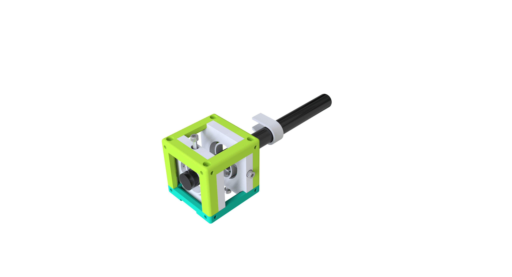](./ASSEMBLY_CUBE_Laser_v2)
[LED Matrix](./ASSEMBLY_CUBE_LED_Matrix_v2) | [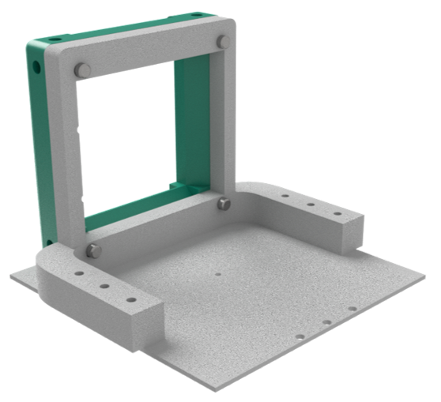](./ASSEMBLY_CUBE_LED_Matrix_v2)
[LED Ring](./ASSEMBLY_CUBE_LED_Ring_v2)  |  [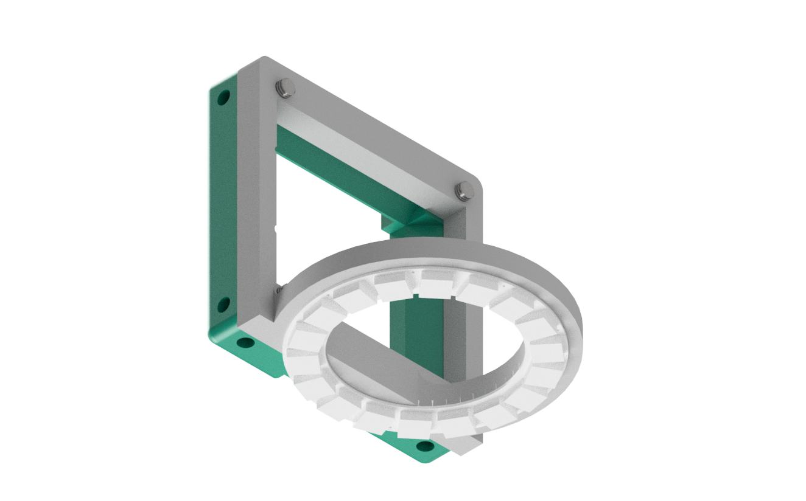](./ASSEMBLY_CUBE_LED_Ring_v2)
[LED Star](./ASSEMBLY_CUBE_LED_v2) | [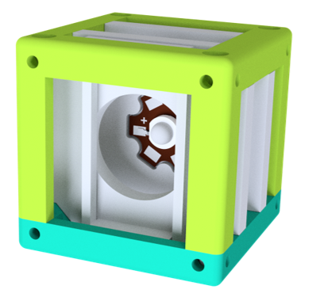](./ASSEMBLY_CUBE_LED_v2)
[Lens (cylindrical)](./ASSEMBLY_CUBE_Lens_CYLINDRICAL_v2) | [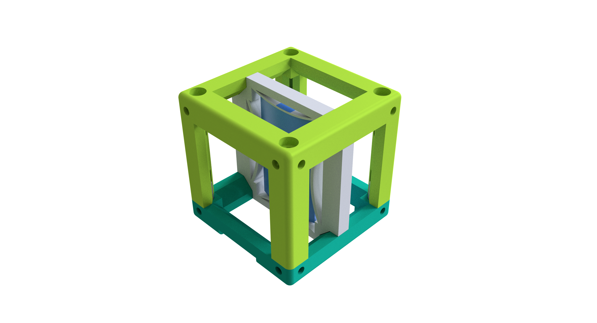](./ASSEMBLY_CUBE_Lens_CYLINDRICAL_v2)
[Lens (standard)](./ASSEMBLY_CUBE_Lens_v2) | [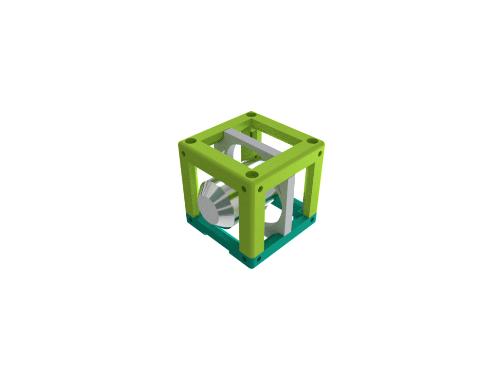](./ASSEMBLY_CUBE_Lens_v2)
[Mirror (45°)](./ASSEMBLY_CUBE_Mirror_45_v2) | [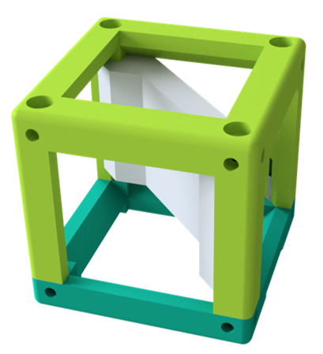](./ASSEMBLY_CUBE_Mirror_45_v2)
[Mirror, kinematic (45°)](./ASSEMBLY_CUBE_Mirror_Kinematic_45_v2) | [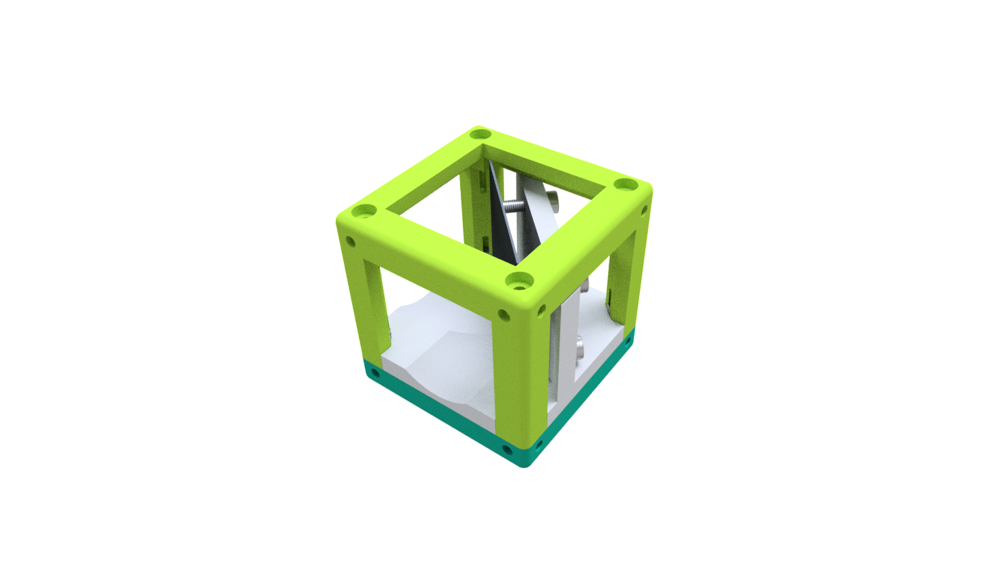](./ASSEMBLY_CUBE_Mirror_Kinematic_45_v2)
[Mirror, kinematic (0°)](./ASSEMBLY_CUBE_Mirror_Kinematic_v2) | [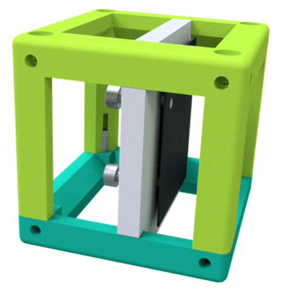](./ASSEMBLY_CUBE_Mirror_Kinematic_v2)
[Raspi Cam](./ASSEMBLY_CUBE_RaspiCam_v2) | [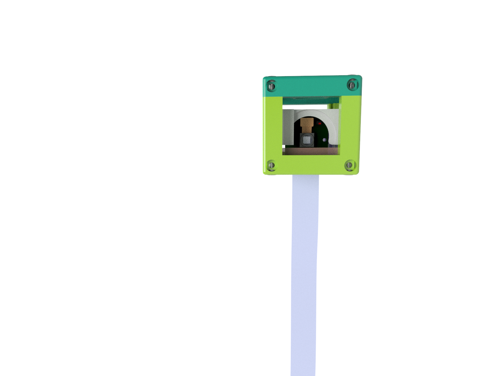](./ASSEMBLY_CUBE_RaspiCam_v2)
[S-Stage v2](./ASSEMBLY_CUBE_S-STAGE_v2) | [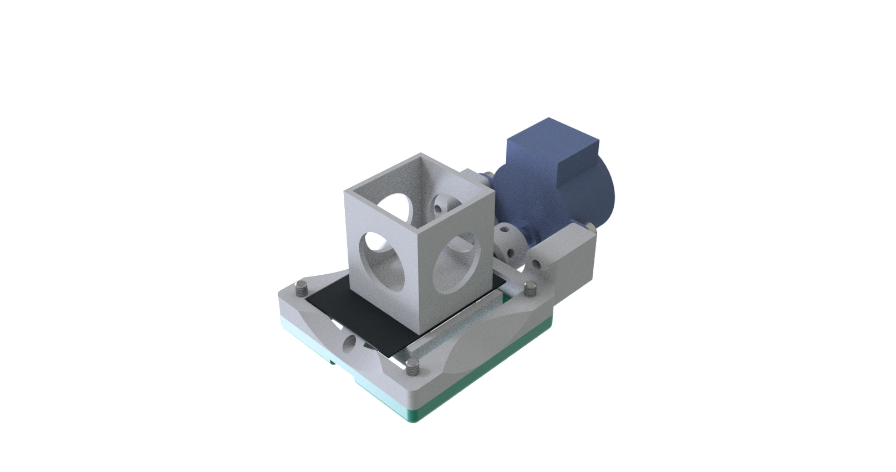](./ASSEMBLY_CUBE_S-STAGE_v2)
[S-Stage v3](./ASSEMBLY_CUBE_S-STAGE_new_v2) | 
[Sample Holder Cube](./ASSEMBLY_CUBE_Sample_Holder_v2) | [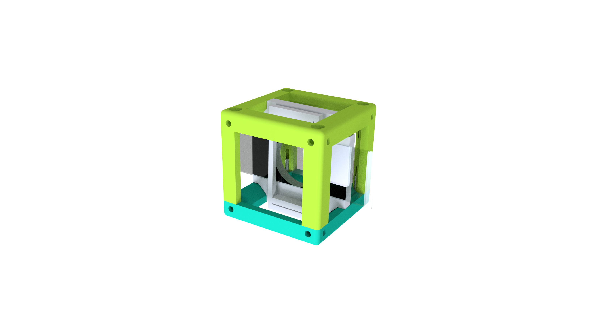](./ASSEMBLY_CUBE_Sample_Holder_v2)
[Magnetic Sample Holder Comb](./ASSEMBLY_CUBE_Sample_Holder_v2) | [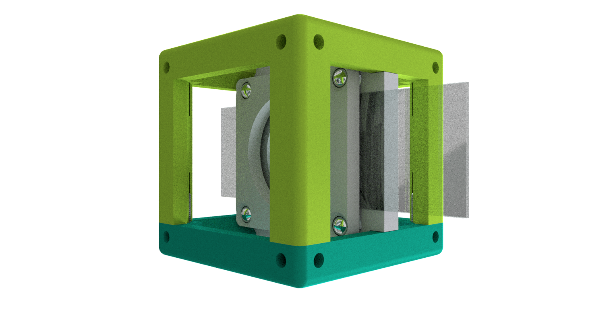](./ASSEMBLY_CUBE_Sample_Holder_v2)
[Thorlabs Adapter](./ASSEMBLY_CUBE_Thorlabs_v2) | [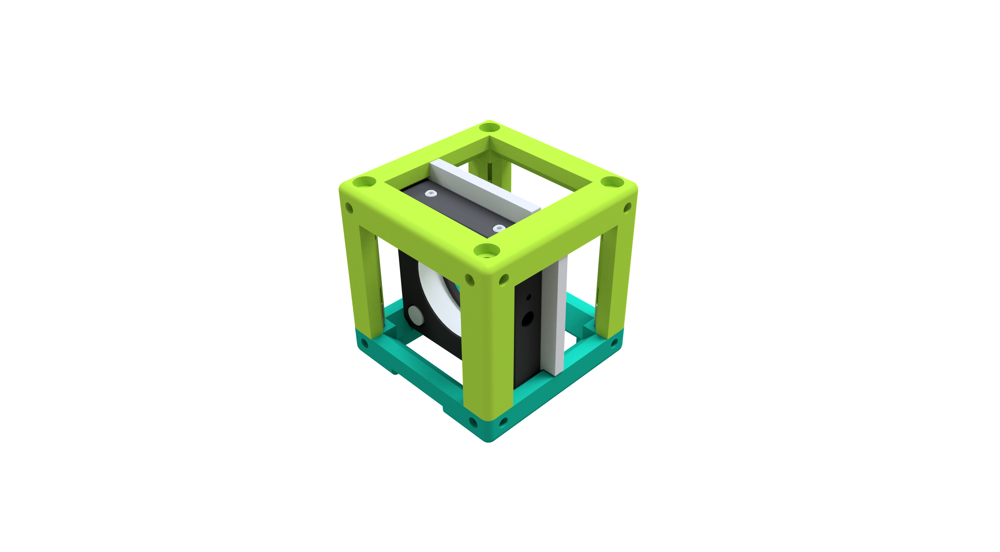](./ASSEMBLY_CUBE_Thorlabs_v2)
[Z-Stage + Fluomodule](./ASSEMBLY_CUBE_Z-STAGE_v2) | [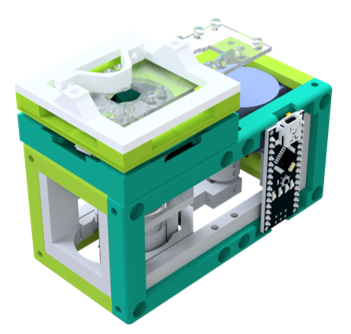](./ASSEMBLY_CUBE_Z-STAGE_v2)
[XYZ-Stage v0](./ASSEMBLY_XYZ-STAGE) | 

## List of available Supplements:
* [ELECTRONICS-RaspiTFT-Case](./EXT_ELECTRONICS-RaspiTFT-Case)
* [ELECTRONICS-Mount](./EXT_ELECTRONICS-Mount)
* [Alignment tool](./EXT_Alignment_Tool)
* [Adapter to openflexure stage](./CUBE_INSERT_OpenFlexure_Deltastage)

##  List of available [Applications (APPs)](../APPLICATIONS)

### Complete overview of setups, modules, parts to buy and parts to print
Find a complete shopping'n'printing list including estimated prices for all modules and setups in this [GoogleDrive Spreadsheet](https://docs.google.com/spreadsheets/d/1U1MndGKRCs0LKE5W8VGreCv9DJbQVQv7O6kgLlB6ZmE/edit?usp=sharing)!

##  Participate
If you have a cool idea, please don't hesitate to contact us, we are happy to incorporate it in our design to make it even better.  
More setups are coming soon!
Inspire us with your ideas - we try to make it work! :-)
