## CAD Files
 Here you can find the necessary .stl parts for the different modules (cubes) and setups ([APPs](../APPLICATIONS)).

* For complete setups go to [APPLICATIONS](../APPLICATIONS)
* For setups compilations go to [TheBOX](../TheBOX)
* For beginner's tutorials, how-to guides and more guidelines go to [TUTORIALS](../TUTORIALS)
* For information on the electronic parts go to [ELECTRONICS](../ELECTRONICS)
* For information on the software go to the dedicated repository [UC2-Software-GIT](https://github.com/bionanoimaging/UC2-Software-GIT)
* For the Bill of Materials go to [RESOURCES](../TUTORIALS/RESOURCES)
* For anything else, have a look at the [SITEMAP](../SITEMAP.md)

This is a growing list of available modules coming along with tutorials and assembly instructions. The most important part is the core building block as you find in every modular toolbox. A detailed description of the **UC2** cube can be found [here](./ASSEMBLY_CUBE_Base_v2/Readme.md).

## General Naming Convention and Structure of UC2

## UC2 version history
When you search through the repository, you find that not all the images show the same cubes and baseplates. This is due to the evolution of the basic building blocks. In order to help you not to get lost, in the [Modular Developer Kit](../MDK#uc2-version-history) is a short explanation of how the cubes evolved.

#### v3 = 3D-printed AND Injection Moulded (*November 2020*)
This is the current version. The cube comes in two versions that are fully compatible with each other. You can either print all the baseplates and cubes and assemble and connect them using screws and magnets, or you can use the IM cubes and baseplate puzzles that connect via the lego-like pins.

The IM cube is shown on the left, the 3DP (3D-printed) cube is on the right. Find the details about the base cube in [ASSEMBLY_CUBE_Base](./ASSEMBLY_CUBE_Base).

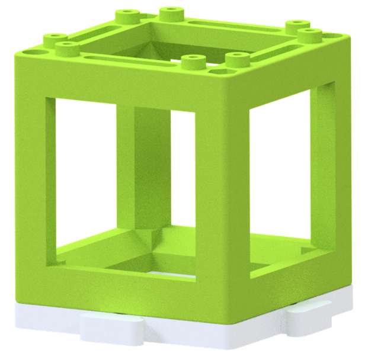

##  Printing
The .stl files of the respective modules can be downloaded and printed. Have a look at our [TUTORIALS](../TUTORIALS) section for some introductory information regarding 3D printing, shopping for components and more.

## List of available Modules (CUBEs):
Each folder contains a step-by-step tutorial which describes how the module has to be assembled.

Link             |  Image of the part
:-------------------------:|:-------------------------:
[Base Plate puzzle](./ASSEMBLY_Baseplate)  |  [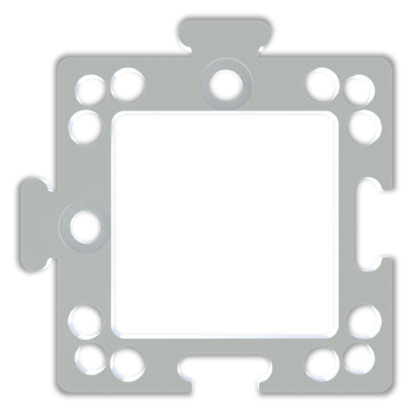](./ASSEMBLY_Baseplate)
[CUBE Base](./ASSEMBLY_CUBE_Base)  |  
[Allied Vision Cam](./ASSEMBLY_CUBE_AlliedVision_Alvium) | [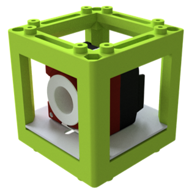](./ASSEMBLY_CUBE_AlliedVision_Alvium)
[Circular Aperture](./ASSEMBLY_CUBE_Aperture_Circular)  |  [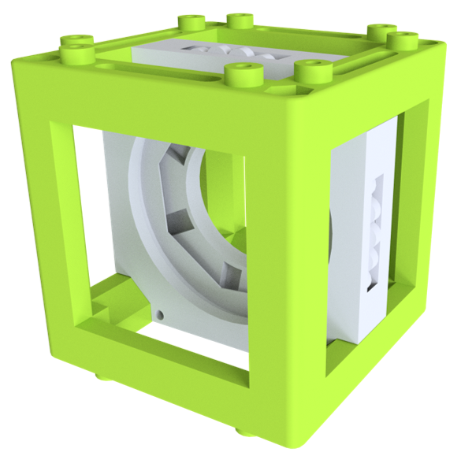](./ASSEMBLY_CUBE_Aperture_Circular)
[Rectangular Aperture](./ASSEMBLY_CUBE_Aperture_Rectangular)  |  [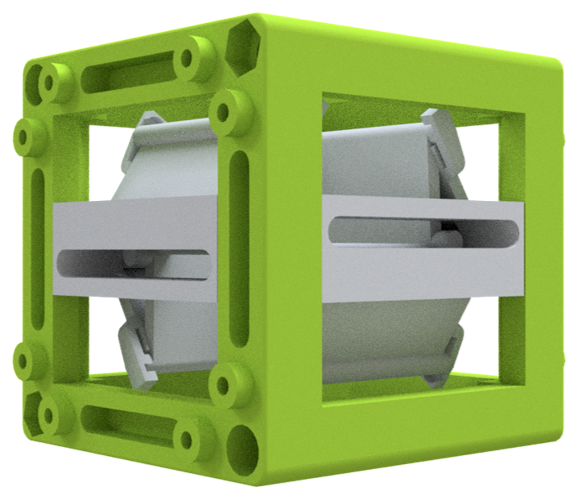](./ASSEMBLY_CUBE_Aperture_Rectangular)
[Basler Cam](./ASSEMBLY_CUBE_BaslerCam) | [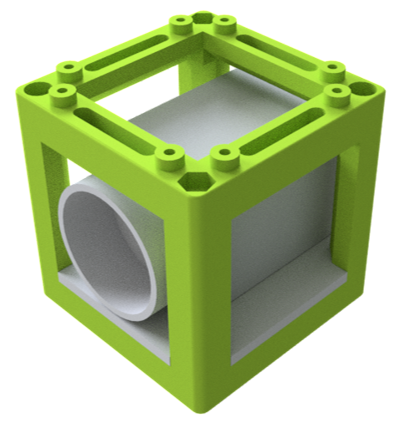](./ASSEMBLY_CUBE_BaslerCam)
[Beam Expander](./ASSEMBLY_CUBE_Beamexpander)  |  [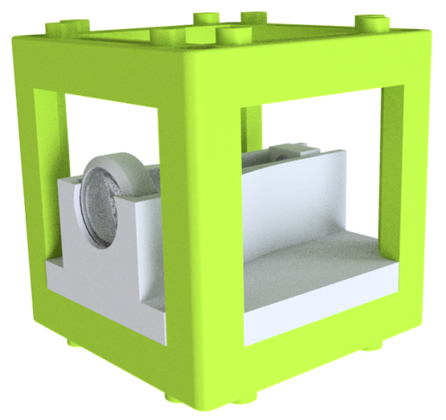](./ASSEMBLY_CUBE_Beamexpander)
[Beam splitter](./ASSEMBLY_CUBE_Beamsplitter)  |  [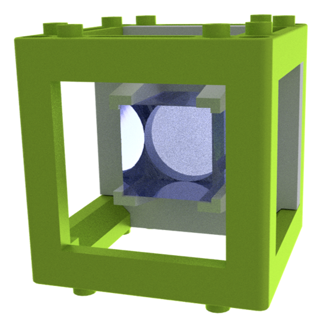](./ASSEMBLY_CUBE_Beamsplitter)
[Dichroic Beam splitter](./ASSEMBLY_CUBE_Dichroic_Beamsplitter) | [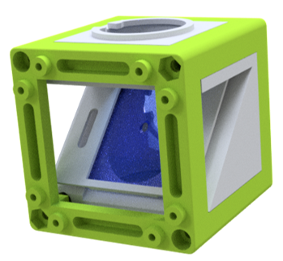](./ASSEMBLY_CUBE_Dichroic_Beamsplitter)
[Eyepiece + Smartphone](./ASSEMBLY_CUBE_Eyepiece) | [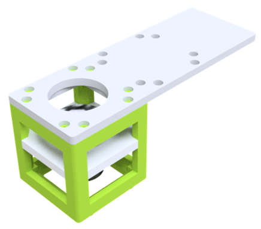](./ASSEMBLY_CUBE_Eyepiece)
[Eyeball Cube ](./ASSEMBLY_CUBE_Eyeball) | [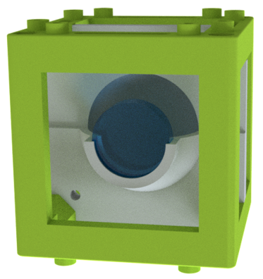](./ASSEMBLY_CUBE_Eyeball)
[Laser](./ASSEMBLY_CUBE_Laser) | [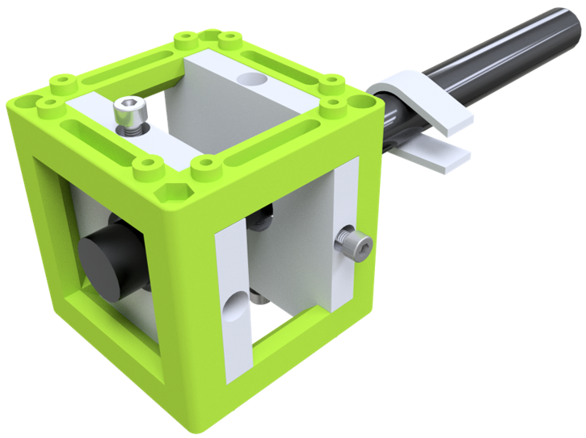](./ASSEMBLY_CUBE_Laser)
[LED Matrix](./ASSEMBLY_CUBE_LED_Matrix) | [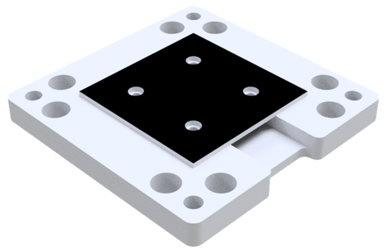](./ASSEMBLY_CUBE_LED_Matrix)
[LED Matrix (simple)](./ASSEMBLY_CUBE_LED_Matrix_simple) | 
[LED Star](./ASSEMBLY_CUBE_LED) | [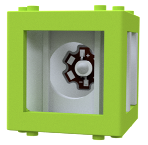](./ASSEMBLY_CUBE_LED)
[Lens (cylindrical)](./ASSEMBLY_CUBE_Lens_CYLINDRICAL) | [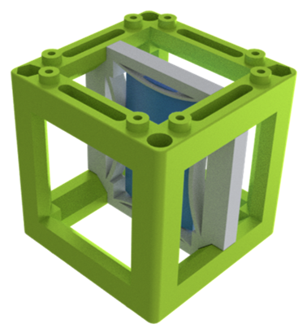](./ASSEMBLY_CUBE_Lens_CYLINDRICAL)
[Lens (standard)](./ASSEMBLY_CUBE_Lens) | [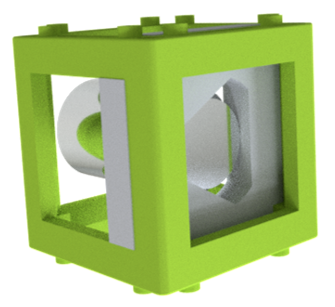](./ASSEMBLY_CUBE_Lens)
[Mirror (45°)](./ASSEMBLY_CUBE_Mirror_45) |  [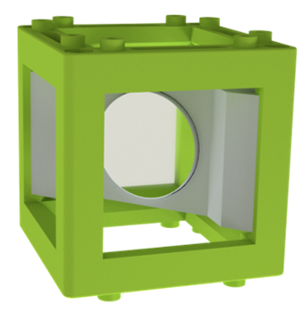](./ASSEMBLY_CUBE_Mirror_45)
[Mirror, kinematic (45°)](./ASSEMBLY_CUBE_Mirror_Kinematic_45) | [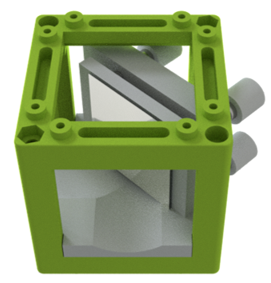](./ASSEMBLY_CUBE_Mirror_Kinematic_45)
[Mirror, kinematic (0°)](./ASSEMBLY_CUBE_Mirror_Kinematic) | [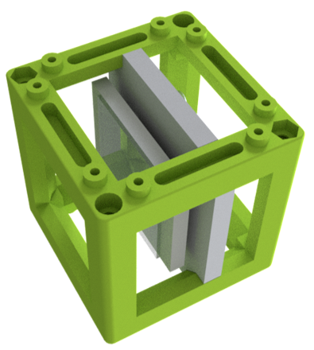](./ASSEMBLY_CUBE_Mirror_Kinematic)
[Raspi Cam](./ASSEMBLY_CUBE_RaspiCam) | [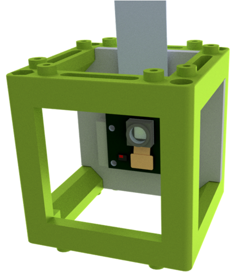](./ASSEMBLY_CUBE_RaspiCam)
[S-Stage v2.1](./ASSEMBLY_CUBE_S-STAGE_v2.1) | [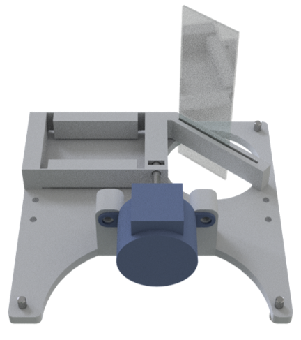](./ASSEMBLY_CUBE_S-STAGE_v2.1)
[Sample Holder Cube](./ASSEMBLY_CUBE_Sample_Holder) | 
[Magnetic Sample Holder](./ASSEMBLY_CUBE_Sample_Holder) | 
[Sample Holder Comb](./ASSEMBLY_CUBE_Sample_Holder) | 
[Thorlabs Adapter](./ASSEMBLY_CUBE_Thorlabs) | 
[Z-Stage (Objective) mechanical](./ASSEMBLY_CUBE_Z-STAGE_mechanical) | 
[Z-Stage (Sample) v3](./ASSEMBLY_CUBE_Z-STAGE_sample) | 
[XYZ-Stage v0](./ASSEMBLY_XYZ-STAGE_v0) | [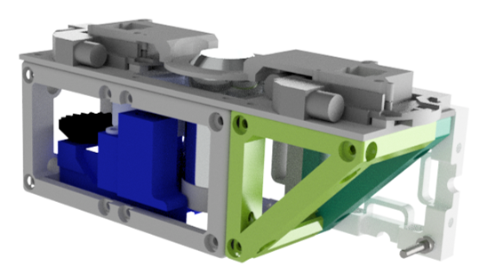](./ASSEMBLY_XYZ-STAGE_v0)

## More external modules 
Link             |  Image of the part
:-------------------------:|:-------------------------:
[Optics rotator (e.g. Diffuser, Polarizer)](https://github.com/openUC2/UC2-Motorized-Rotator) | 
[Microsyringepump](https://github.com/openUC2/UC2-MicroSyringePump) | 
[Multicolour Module](https://github.com/openUC2/UC2-MultiColour) | 
[Waveguide Coupling Module](https://github.com/openUC2/UC2-waveguiding) | 

## List of available Supplements:
* [ELECTRONICS-RaspiTFT-Case](./EXT_ELECTRONICS-RaspiTFT-Case)
* [ELECTRONICS-Mount](./EXT_ELECTRONICS-Mount)
* [Alignment tool](./EXT_Alignment_Tool)
* [Adapter to openflexure stage](./CUBE_INSERT_OpenFlexure_Deltastage)

##  List of available [Applications (APPs)](../APPLICATIONS)

### Complete overview of setups, modules, parts to buy and parts to print
Find a complete shopping'n'printing list including estimated prices for all modules and setups in this [GoogleDrive Spreadsheet](https://docs.google.com/spreadsheets/d/1U1MndGKRCs0LKE5W8VGreCv9DJbQVQv7O6kgLlB6ZmE/edit?usp=sharing)!

##  Participate
If you have a cool idea, please don't hesitate to contact us, we are happy to incorporate it in our design to make it even better.  
More setups are coming soon!
Inspire us with your ideas - we try to make it work! :-)
