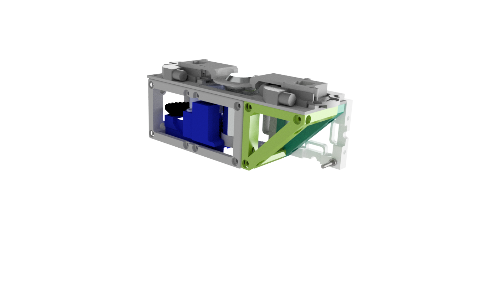

## XYZ-Stage
Here you can find the necessary .stl-parts for the XYZ-Stage. 

A detailed description of the assembly process can be found [here](/DOCUMENTS/TUTORIALS_SETUP/TUT_Assembly_XYZ_Stage.pdf)

## Video
You can find a video of the ready-to-use stage [here](https://www.youtube.com/watch?v=G8IHuMSYpv0&feature=youtu.be).