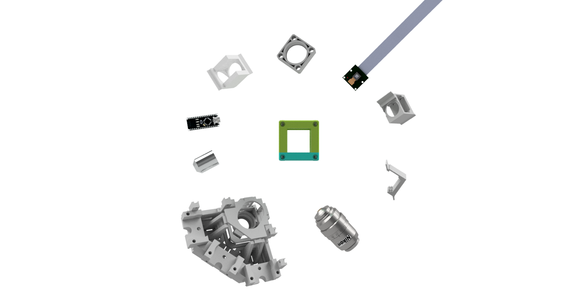
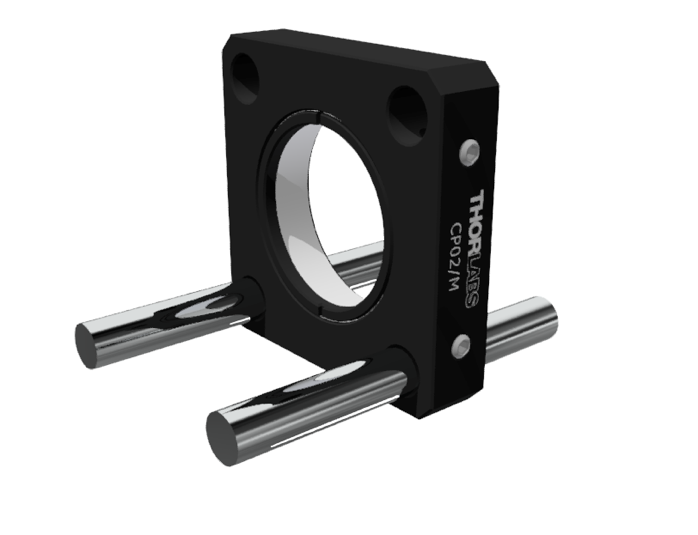
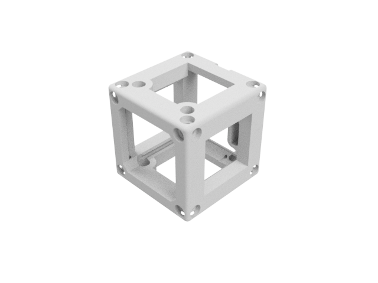

How to design a cube’s inlet/function

V0, 31.08.2018

B. Diederich

Introduction 
=============

The UC2 Toolbox serves as a base system which acts as the skeleton for
holding dindividual functions. Each block has in its base version a
edge-length of 50 mm and can be produced using off-the-shelf 3D
printers. Those cubes are mounted on a grid acting as a base-plate.
Fixed positioning is assured by relying on magnetic fit, where the cubes
have inbuilt screws, fitting directly on the ball-magnets pressed into
the base-plate.

{width="4.0159722222222225in"
height="3.4763888888888888in"}The skeleton itself is not ready for
optical experiments yet. Therefore we have to place individual functions
inside the cubes (e.g. cameras, lenses, mirrors, light sources, etc.).
There is a list of available inlets to realize basic experiments
already. But most devices won’t follow these dimensions, which makes
customized adapters necessary.

This should give a basic guide on how to design a function which fits
into the UC2 cube. Basically there are two ways to mount stuff inside a
cube.

1.  5mm Rod-System for use with popular Cage Systems

2.  Integrated “rail”-system to slide in customized functions

1 – ROD-SYSTEM
==============

We integrated the rod-system from the popular cage system available for
example from Thorlabs, Edmund Optics or Qioptiq. This means, that one
can put lens which are already available in the optical lab directly
into the cubes without any redesigning of the parts. Problem with these
rods is, that they are measured in inch not mm. Thus, Thorlabs has rods
with 2inch=50,8mm not fitting into our cubes, which need &lt;50mm to
work correctly.

{width="6.813497375328084in"
height="2.720657261592301in"}

2 – INLET SYSTEM 
=================

Some components won’T fit intoe the Thorlabs cage system because of
their footprint. Therefore we designed a sliding system which can hold
basically every component, like the Raspberry’s camera for example. It
is slightly bigger as distances between the rods, thus not “slidable”
using the rods. The dimensions can be extracted from the CAD technical
drawing below. The major importance is, that the “wings” can slide
freely in the adapter, but are not too loose to loose contact. We
designed a set of adapters for multiple purposes. Mirrors, camera
adapters or filter mounts are just a few of them. This adapter is
customizable to fit everybodies individual needs. Therefore we invite
you to freely modify it to your needs and publish your results.

{width="6.702979002624672in"
height="2.9073468941382328in"}

The shape of the inlet or the adapter which fits into the sliding system
looks as follow:

{width="4.336692913385827in"
height="2.768193350831146in"}

Dimensions of the inlet System
------------------------------

This is an example for a mirror-mount. It can be modified to your needs
of course.

{width="6.552221128608924in"
height="4.748608923884515in"}
