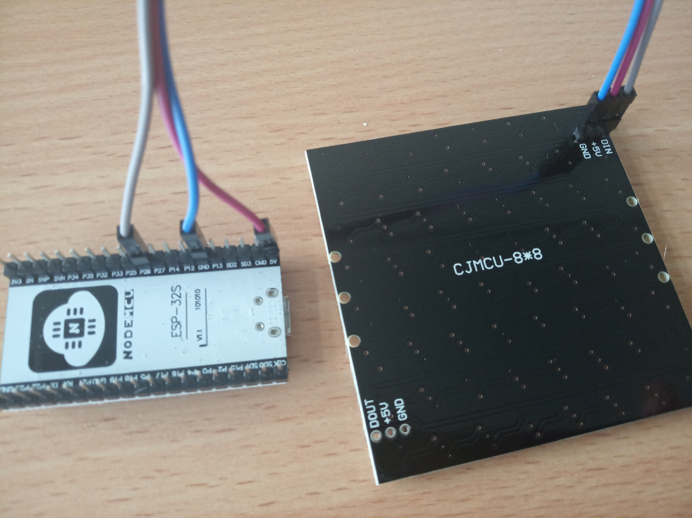
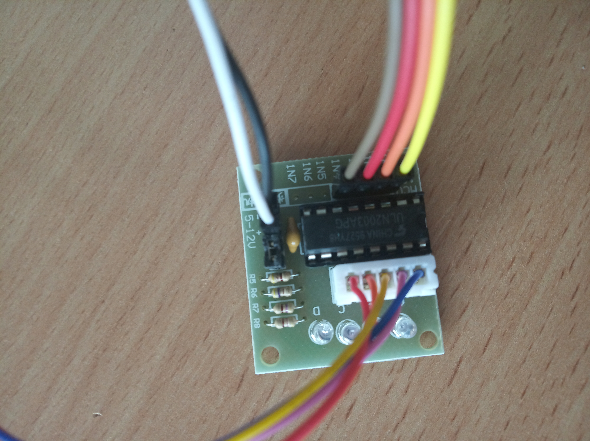
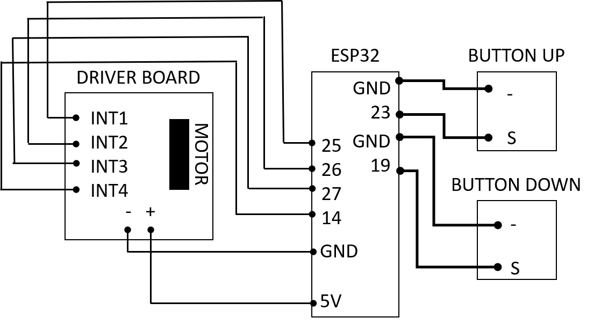

# Electronics (for dummies)

Don't have much experience with electronics? It's actually really simple!

##  Components
* LED-Array, Neopixel, 8x8 [🢂](https://www.amazon.de/AZDelivery-Matrix-CJMCU-8-Arduino-Raspberry/dp/B078HYP681/ref=sr_1_2?__mk_de_DE=%C3%85M%C3%85%C5%BD%C3%95%C3%91&keywords=neopixel+matrix&qid=1565008576&s=gateway&sr=8-2)
* ESP32 [🢂](https://www.amazon.de/AZDelivery-NodeMCU-Development-Nachfolgermodell-ESP8266/dp/B074RGW2VQ/ref=sr_1_3?__mk_de_DE=%C3%85M%C3%85%C5%BD%C3%95%C3%91&keywords=esp32&qid=1565008313&s=gateway&sr=8-3)
* Stepper Motor and Driver Board [🢂](https://www.amazon.de/Elegoo-Stepper-Schrittmotor-28BYJ-48-Treiberplatine/dp/B01MEGIHLF/ref=sr_1_1_sspa?__mk_de_DE=%C3%85M%C3%85%C5%BD%C3%95%C3%91&keywords=stepper+arduino&qid=1565008205&s=gateway&sr=8-1-spons&psc=1)
* Female-Female Jumper Wire, 0.14 mm² [🢂](https://www.amazon.de/ZOORE-120pcs-Multicolored-Female-Breadboard/dp/B07P85V1G3/ref=sr_1_5?__mk_de_DE=%C3%85M%C3%85%C5%BD%C3%95%C3%91&keywords=jumper+male&qid=1565690543&s=industrial&sr=1-5)
* Power cables for ESP32 - USB-microUSB [🢂](https://www.amazon.de/Gritin-Datenkabel-Geflochtene-Robust-Daten%C3%BCbertragung-Grau/dp/B07CJJHVKX/ref=sr_1_3?keywords=usb+c+kabel&qid=1566029225&s=gateway&sr=8-3)

##  Connecting the electronics

* When using [jumper wires](http://blog.sparkfuneducation.com/what-is-jumper-wire) you can avoid most of the soldering.
* **LED array** - 3 wires

* **Z-stage** or **Sample-stage** - 6 wires + motor connection
* Sample stage is the very same as the Z-stage - you just mount it on different 3Dprinted parts.

* Flash them with the right software from our [Software-GIT](https://github.com/bionanoimaging/UC2-Software-GIT).
* Power the ESP32 simply with microUSB cables.
* And it works just like that ;-)

## Electronics for the SIMPLE smartphone microscope
No control via WiFi - just buttons. The Simple Smartphone Microscope is found [here](../../APPLICATIONS/APP_SIMPLE-Smartphone_Microscope/electronic)

* When using jumper wires you can avoid soldering.
* LED array - 3 wires + 2 wires for the button

* Z-stage - 6 wires + motor connection + 2×2 wires for two buttons

* Power the ESP32 simply with microUSB cables.
* And it works just like that ;-)

Further advice:  
[But I don't have such wires...](https://www.youtube.com/watch?v=VB1CrqY_jMg)  
[But how to connect two wires to the same pin?](https://www.youtube.com/watch?v=8W-zdo1AVns)
