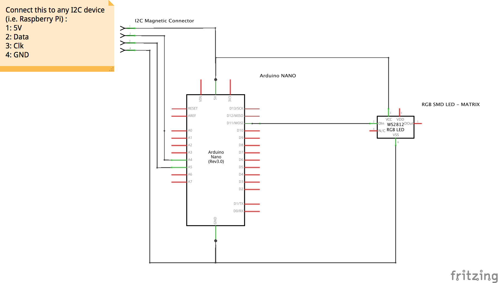

## FLUO-LED

For exciting fluorophores we used power-led's with an appropriate spectrum. 

Our configuration for GFP is:

	- (Royal-Blue) Power LED 
	- LED-Collimator
	- COMAR 480 dichroic 
	- COMAR 520 Emission Filter

	

## Connection Diagram

## Wiring 
This is how it could look like in a cube

This is how it could look like in a cube

