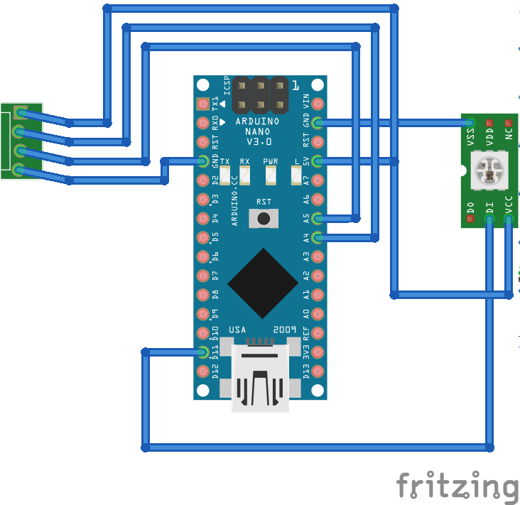

## LED-MATRIX

The following gives you a very brief introduction of the workin principle of the low-cost, but versatile LED-Matrix. In our version we used the Neopixel Matrix, other might work also. 
	
It can be controlled with an ESP32 or Arduino for example. Code is very easy as it relies on the Neopixle library in provided by Adafruit Arduion IDE - Furhter information available [here](https://learn.adafruit.com/adafruit-neopixel-uberguide/neomatrix-library). 

## Connection Diagram

## Schematics

## Wiring 
This is how it could look like in a cube

This is how it could look like in a cube

## Properties
	- 8x8 RGB LEDs
	- 5V Control Voltage
	- WS2812 LED controllers 
	
	
## Code 
The code is from the Adafruit example with the wiring explained above. Please find it also [here](./controleLED.ino):

		// Adafruit_NeoMatrix example for single NeoPixel Shield.
	// Scrolls 'Howdy' across the matrix in a portrait (vertical) orientation.
	
	#include <Adafruit_GFX.h>
	#include <Adafruit_NeoMatrix.h>
	#include <Adafruit_NeoPixel.h>
	#include <CheapStepper.h>
	#include <SoftwareSerial.h>
	
	#ifndef PSTR
	#define PSTR // Make Arduino Due happy
	#endif
	
	
	#define EN        8
	
	//Directi pin
	#define X_DIR     5
	#define Y_DIR     6
	#define Z_DIR     7
	
	//Step pin
	#define X_STP     2
	#define Y_STP     3
	#define Z_STP     4
	
	// LED Pin
	#define PIN 9
	
	
	//DRV8825
	int delayTime = 200; //Delay between each pause (uS)
	int motorSteps = 6; // Steps to move
	
	
	int inByte = 0;
	int lastByte = 0;
	SoftwareSerial mySerial(10, 11); // Arduino: RX (10), TX (11); IOIO: RX (45), TX (46); RX-TX; TX-RX!
	//  pin 10 on the Arduino (RX) to pin 45 of the IOIO(TX) and Blue cable from pin 11(TX) to pin 46 of the IOIO(RX)
	
	const int ledPIN = 13;
	
	
	
	
	// MATRIX DECLARATION:
	// Parameter 1 = width of NeoPixel matrix
	// Parameter 2 = height of matrix
	// Parameter 3 = pin number (most are valid)
	// Parameter 4 = matrix layout flags, add together as needed:
	//   NEO_MATRIX_TOP, NEO_MATRIX_BOTTOM, NEO_MATRIX_LEFT, NEO_MATRIX_RIGHT:
	//     Position of the FIRST LED in the matrix; pick two, e.g.
	//     NEO_MATRIX_TOP + NEO_MATRIX_LEFT for the top-left corner.
	//   NEO_MATRIX_ROWS, NEO_MATRIX_COLUMNS: LEDs are arranged in horizontal
	//     rows or in vertical columns, respectively; pick one or the other.
	//   NEO_MATRIX_PROGRESSIVE, NEO_MATRIX_ZIGZAG: all rows/columns proceed
	//     in the same order, or alternate lines reverse direction; pick one.
	//   See example below for these values in action.
	// Parameter 5 = pixel type flags, add together as needed:
	//   NEO_KHZ800  800 KHz bitstream (most NeoPixel products w/WS2812 LEDs)
	//   NEO_KHZ400  400 KHz (classic 'v1' (not v2) FLORA pixels, WS2811 drivers)
	//   NEO_GRB     Pixels are wired for GRB bitstream (most NeoPixel products)
	//   NEO_RGB     Pixels are wired for RGB bitstream (v1 FLORA pixels, not v2)
	
	
	// Example for NeoPixel Shield.  In this application we'd like to use it
	// as a 5x8 tall matrix, with the USB port positioned at the top of the
	// Arduino.  When held that way, the first pixel is at the top right, and
	// lines are arranged in columns, progressive order.  The shield uses
	// 800 KHz (v2) pixels that expect GRB color data.
	Adafruit_NeoMatrix matrix = Adafruit_NeoMatrix(8, 8, PIN,
	                            NEO_MATRIX_TOP     + NEO_MATRIX_RIGHT +
	                            NEO_MATRIX_COLUMNS + NEO_MATRIX_PROGRESSIVE,
	                            NEO_GRB            + NEO_KHZ800);
	
	
	struct RGB {
	  byte r;
	  byte g;
	  byte b;
	};
	
	
	// Define some colors we'll use frequently
	RGB white = { 255, 255, 255 };
	RGB red = { 255, 0, 0 };
	RGB black = { 0, 0, 0 };
	
	int serIn = 0; //incoming serial byte
	int serInOld = 0;
	
	
	// Some Motor stuff
	int incomingByte = 0;   // for incoming serial data
	int isteps = 0;
	boolean moveClockwise = true; // direction of motor-movement
	
	
	
	void setup() {
	  // init signals by Arduino
	  pinMode(ledPIN, OUTPUT);
	
	  // init Serial-Comm to RaspPi
	  Serial.begin(9600);
	  mySerial.begin(9600);
	  // init Matrix
	  matrix.begin();
	  matrix.setTextWrap(false);
	  matrix.setBrightness(150);
	
	  matrix.fillScreen(matrix.Color(white.r, white.g, white.b));
	  matrix.show();
	  delay(100);
	  drawDark();
	  matrix.show();
	  delay(100);
	
	
	  // Motor-Stuff
	  pinMode(X_DIR, OUTPUT);
	  pinMode(X_STP, OUTPUT);
	
	  pinMode(Y_DIR, OUTPUT);
	  pinMode(Y_STP, OUTPUT);
	
	  pinMode(Z_DIR, OUTPUT);
	  pinMode(Z_STP, OUTPUT);
	
	  pinMode(EN, OUTPUT);
	
	  digitalWrite(EN, LOW);
	
	  clearMotor();
	}
	
	
	
	void loop() {
	
	
	  if (mySerial.available()) {
	
	    Serial.write("Serial Available");
	    char input[1];
	    input[0] = mySerial.read();
	    //This exists for debugging purposes
	    Serial.write(input[0]);
	
	
	
	
	    serIn = input[0];// mySerial.read();
	    
	    
	    if (serIn == 'U' || serIn == 'u' || serIn == 'D' || serIn == 'd') {
	      if (serIn == 'U' || serIn == 'D') {
	        motorSteps = 10 * motorSteps;
	      }
	      if (serIn == 'D' || serIn == 'd') {
	        moveClockwise = false;
	      }
	      for (isteps = 0;  isteps < motorSteps; isteps++) {
	        step(moveClockwise, X_DIR, X_STP, 1); //X, Clockwise
	        step(moveClockwise, Y_DIR, Y_STP, 1); //Y, Clockwise
	        step(moveClockwise, Z_DIR, Z_STP, 1); //Z, Clockwise
	      }
	      motorSteps = 6;
	      if (serIn == 'D' || serIn == 'd') {
	        moveClockwise = true;
	      }
	      clearMotor();
	    }
	
	
	
	    else if ( serIn == 'L' ) { //light: on
	      if (serInOld != serIn) {
	        matrix.fillScreen(matrix.Color(white.r, white.g, white.b));
	        matrix.show();
	        //delay(500);
	      }
	    }
	    else if ( serIn == 'l' ) { //light: off
	      drawDark();
	      matrix.show();
	      //delay(500);
	    }
	    else if ( serIn ==  'I' ) {
	      matrix.fillScreen(matrix.Color(white.r, white.g, white.b));
	      matrix.show();
	      delay(1000);
	      drawDark();
	      matrix.show();
	    }
	    else if ( serIn ==  'Q' ) {
	      drawLeft();
	      matrix.show();
	      delay(1000);
	      drawRight();
	      matrix.show();
	      delay(1000);
	      drawUp();
	      matrix.show();
	      delay(1000);
	      drawDown();
	      matrix.show();
	      delay(1000);
	      drawDark();
	      matrix.show();
	    }
	    else if ( serIn == 'X' ) {
	      drawUp();
	      matrix.show();
	    }
	    else if ( serIn == 'Y' ) {
	      drawDown();
	      matrix.show();
	    }
	    else if ( serIn == 'x' ) {
	      drawLeft();
	      matrix.show();
	    }
	    else if ( serIn == 'y' ) {
	      drawRight();
	      matrix.show();
	    }
	    else {
	    }
	    Serial.print("r");
	    Serial.println();
	    serInOld = serIn;
	  }
	}
	
	
	void step(boolean dir, byte dirPin, byte stepperPin, int steps)
	
	{
	
	  digitalWrite(dirPin, dir);
	
	  //delay(100);
	
	  digitalWrite(stepperPin, HIGH);
	  delayMicroseconds(delayTime);
	  digitalWrite(stepperPin, LOW);
	  delayMicroseconds(delayTime);
	
	}
	
	
	
	void drawLeft() {
	  // This 8x8 array represents the LED matrix pixels.
	  // A value of 1 means we’ll fade the pixel to white
	  int logo[8][8] = {
	    {1, 1, 1, 1, 0, 0, 0, 0},
	    {1, 1, 1, 1, 0, 0, 0, 0},
	    {1, 1, 1, 1, 0, 0, 0, 0},
	    {1, 1, 1, 1, 0, 0, 0, 0},
	    {1, 1, 1, 1, 0, 0, 0, 0},
	    {1, 1, 1, 1, 0, 0, 0, 0},
	    {1, 1, 1, 1, 0, 0, 0, 0},
	    {1, 1, 1, 1, 0, 0, 0, 0}
	  };
	
	  for (int row = 0; row < 8; row++) {
	    for (int column = 0; column < 8; column++) {
	      if (logo[row][column] == 1) {
	        matrix.drawPixel(column, row, matrix.Color(255, 255, 255));
	      }
	      else {
	        matrix.drawPixel(column, row, matrix.Color(0, 0, 0));
	      }
	
	    }
	  }
	}
	
	
	void drawUp() {
	  // This 8x8 array represents the LED matrix pixels.
	  // A value of 1 means we’ll fade the pixel to white
	  int logo[8][8] = {
	    {1, 1, 1, 1, 1, 1, 1, 1},
	    {1, 1, 1, 1, 1, 1, 1, 1},
	    {1, 1, 1, 1, 1, 1, 1, 1},
	    {1, 1, 1, 1, 1, 1, 1, 1},
	    {0, 0, 0, 0, 0, 0, 0, 0},
	    {0, 0, 0, 0, 0, 0, 0, 0},
	    {0, 0, 0, 0, 0, 0, 0, 0},
	    {0, 0, 0, 0, 0, 0, 0, 0}
	  };
	
	  for (int row = 0; row < 8; row++) {
	    for (int column = 0; column < 8; column++) {
	      if (logo[row][column] == 1) {
	        matrix.drawPixel(column, row, matrix.Color(255, 255, 255));
	      }
	      else {
	        matrix.drawPixel(column, row, matrix.Color(0, 0, 0));
	      }
	
	    }
	  }
	}
	
	void drawDown() {
	  // This 8x8 array represents the LED matrix pixels.
	  // A value of 1 means we’ll fade the pixel to white
	  int logo[8][8] = {
	    {0, 0, 0, 0, 0, 0, 0, 0},
	    {0, 0, 0, 0, 0, 0, 0, 0},
	    {0, 0, 0, 0, 0, 0, 0, 0},
	    {0, 0, 0, 0, 0, 0, 0, 0},
	    {1, 1, 1, 1, 1, 1, 1, 1},
	    {1, 1, 1, 1, 1, 1, 1, 1},
	    {1, 1, 1, 1, 1, 1, 1, 1},
	    {1, 1, 1, 1, 1, 1, 1, 1}
	  };
	
	  for (int row = 0; row < 8; row++) {
	    for (int column = 0; column < 8; column++) {
	      if (logo[row][column] == 1) {
	        matrix.drawPixel(column, row, matrix.Color(255, 255, 255));
	      }
	      else {
	        matrix.drawPixel(column, row, matrix.Color(0, 0, 0));
	      }
	
	    }
	  }
	}
	
	void drawDark() {
	  // This 8x8 array represents the LED matrix pixels.
	  // A value of 1 means we’ll fade the pixel to white
	  int logo[8][8] = {
	    {0, 0, 0, 0, 0, 0, 0, 0},
	    {0, 0, 0, 0, 0, 0, 0, 0},
	    {0, 0, 0, 0, 0, 0, 0, 0},
	    {0, 0, 0, 0, 0, 0, 0, 0},
	    {0, 0, 0, 0, 0, 0, 0, 0},
	    {0, 0, 0, 0, 0, 0, 0, 0},
	    {0, 0, 0, 0, 0, 0, 0, 0},
	    {0, 0, 0, 0, 0, 0, 0, 0}
	  };
	
	  for (int row = 0; row < 8; row++) {
	    for (int column = 0; column < 8; column++) {
	      if (logo[row][column] == 1) {
	        matrix.drawPixel(column, row, matrix.Color(255, 255, 255));
	      }
	      else {
	        matrix.drawPixel(column, row, matrix.Color(0, 0, 0));
	      }
	
	    }
	  }
	}
	
	void drawRight() {
	  // This 8x8 array represents the LED matrix pixels.
	  // A value of 1 means we’ll fade the pixel to white
	  int logo[8][8] = {
	    { 0, 0, 0, 0, 1, 1, 1, 1},
	    { 0, 0, 0, 0, 1, 1, 1, 1},
	    { 0, 0, 0, 0, 1, 1, 1, 1},
	    { 0, 0, 0, 0, 1, 1, 1, 1},
	    { 0, 0, 0, 0, 1, 1, 1, 1},
	    { 0, 0, 0, 0, 1, 1, 1, 1},
	    { 0, 0, 0, 0, 1, 1, 1, 1},
	    { 0, 0, 0, 0, 1, 1, 1, 1}
	  };
	
	  for (int row = 0; row < 8; row++) {
	    for (int column = 0; column < 8; column++) {
	      if (logo[row][column] == 1) {
	        matrix.drawPixel(column, row, matrix.Color(255, 255, 255));
	      }
	      else {
	        matrix.drawPixel(column, row, matrix.Color(0, 0, 0));
	      }
	
	    }
	  }
	}
	
	void drawIndividual(int ledColumn, int ledRow, bool ledState){
	  // This 8x8 array represents the LED matrix pixels.
	  // A value of 1 means we’ll fade the pixel to white
	  // This function sets individual leds to on/off state
	      if (ledState) {
	        matrix.drawPixel(ledColumn, ledRow, matrix.Color(255, 255, 255));
	      }
	      else {
	        matrix.drawPixel(ledColumn, ledRow, matrix.Color(0, 0, 0));
	      }
	
	    }
	  }
	}
	
	void clearMotor(){
	  /*
	  digitalWrite(EN, HIGH);
	  digitalWrite(X_DIR, HIGH);
	  digitalWrite(Y_DIR, HIGH);
	  digitalWrite(Z_DIR, HIGH);
	  digitalWrite(X_STP, HIGH);
	  digitalWrite(Y_STP, HIGH);
	  digitalWrite(Z_STP, HIGH);
	*/
	}

	
	
## NOTES
Make sure you're releasing the Motor after usage, otherwise it can get quiet hot!

