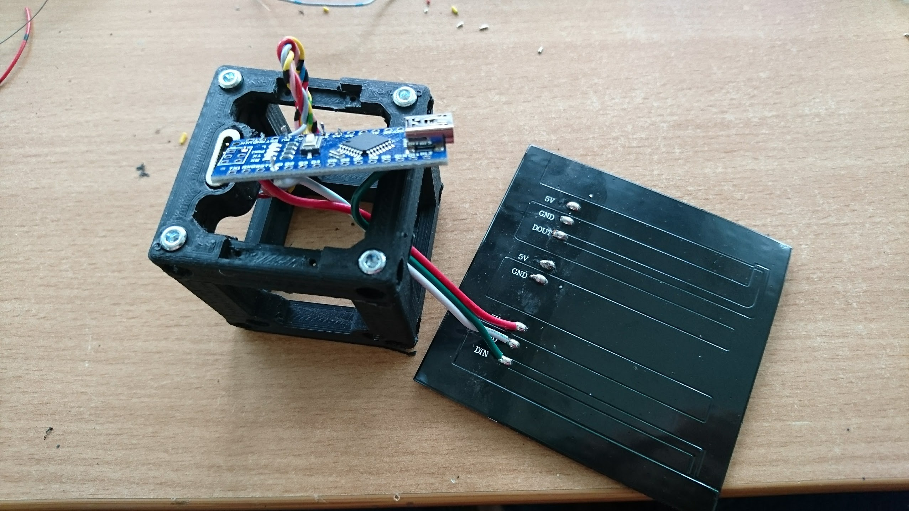

# LED Matrix

The following gives you a very brief introduction of the workin principle of the low-cost, but versatile LED Matrix. In our version we used the Neopixel Matrix, others might work also.

It can be controlled with an ESP32 or Arduino. The code relies on the Neopixle library, provided by Adafruit Arduion IDE - further information available [here](https://learn.adafruit.com/adafruit-neopixel-uberguide/neomatrix-library).

## LED Matrix (Arduino Nano; I2C)

### Properties
* 8x8 RGB LEDs
* 5V Control Voltage
* WS2812 LED controllers

### Connection Diagram
<p align="center">

</p>

### Schematics
<p align="center">

</p>

### Wiring
This is how it looks like in a cube
<p align="center">


</p>

## LED Matrix (ESP32; MQTT)

### Conection pins
```
GND == GND
5V == 5V
DIN == 26
```

## Code
The code can be found in the [Software GIT](https://github.com/bionanoimaging/UC2-Software-GIT).

## Safety
Unplug the power supply when you're not using the LED Matrix!
