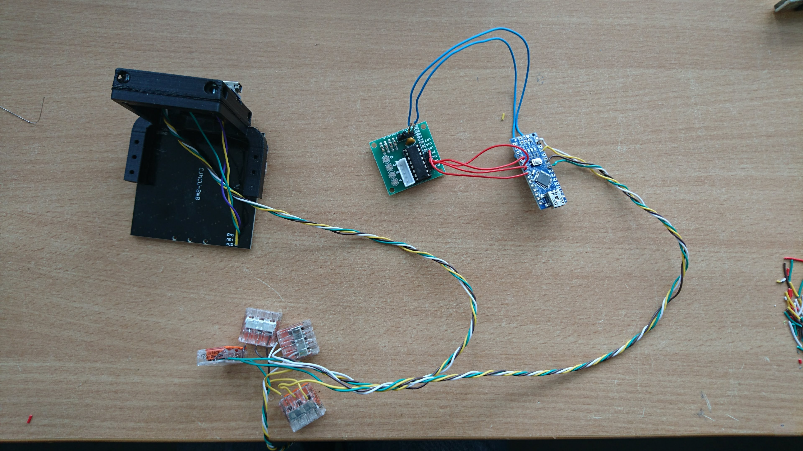

# Electronics
 Here you'll find the schematics for the wiring of the UC2 parts.

* For printing and assembly of all the cubes and modules go to [CAD](../CAD)
* For complete setups go to [APPLICATIONS](../APPLICATIONS)
* For setups compilations go to [TheBOX](../TheBOX)
* For beginner's tutorials, how-to guides and more guidelines go to [TUTORIALS](../TUTORIALS)
* For information on the software go to the dedicated repository [UC2-Software-GIT](https://github.com/bionanoimaging/UC2-Software-GIT)
* For the Bill of Materials go to [RESOURCES](../TUTORIALS/RESOURCES)
* For anything else, have a look at the [SITEMAP](../SITEMAP.md)

---
# If all the wiring scares you, click here 
---

Most connections can be established with pin-connection (male/female), as you see in the [simplified tutorial](./ELECTRONICS_FOR_DUMMIES). For durable connection, please solder everything! You're not expected to have perfect soldering skills though. Have a look in the [TUTORIALS](../TUTORIALS) for some soldering guidelines. Be careful not to mix up +/-, otherwise you might cause shortcuts which would very likely fry the Pi or the Arduinos/ESP32s.

## Available schemes and guidelines
* [Z-stage and Sample-Stage](./Z-Stage)
* [LED matrix](./LED-Matrix)
* [Fluo-LED for Z-stage](./FLUO-LED)
* [XY-Stage](./XY-Stage)
* [Raspberry Pi](./RASPBERRY-PI)
* [Magnetic connectors (v0)](./Magnetic-Connectors)

    This section needs an update!

## Wire Diagrams/Schematics
All schemes are put together with the Open-Source Software [Fritzing](http://fritzing.org/).

## General Wiring (Arduino Nano; I2C)
For the I2C Bus we use a 4-wire colour-code as follows:

- **5V** - White
- **GND** - Yellow
- **Data** - Green
- **CLK** - Brown

The junctions are connected with [WaGo Snapping Clamps, Compact Wago 2273-203 -> Amazon](https://www.amazon.de/Wago-VERBINDUNGSKLEMME-3POL-2273-203/dp/B075ZRQCGZ):

# Done with the wiring? Then it's time for [software](https://github.com/bionanoimaging/UC2-Software-GIT)!
