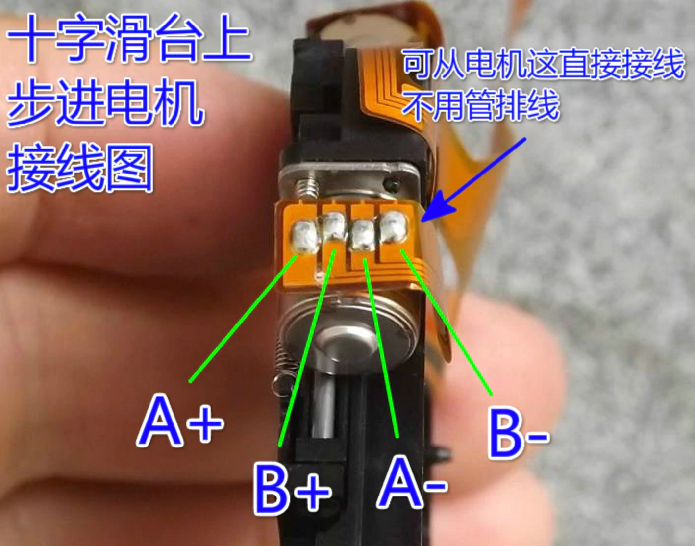
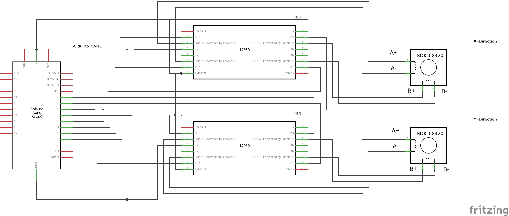

## XY-Stage

The following gives you a very brief introduction of the workin principle of the low-cost, but very precise Z-stage which is used in our setups. You can find a more detailed version of the description at [aliexpress](https://aliexpress.com/item/Micro-stepping-motor-cross-platform-small-mobile-digital-microscope-XY-axis-table-experiment-two-slide/32790147861.html) (chineses though). 
I have absolutely no clue where this piece is actually coming from, but it is working really great! 

It is equipped with two bipolar stepper motors for X and Y direction. The wiring follows (from left to right):

	1 -- A+	
	2 -- B+	
	3 -- A-	
	4 -- B-
	

It can be controlled with an ESP32 or Arduino for example. Code is very easy as it relies on the $stepper.h$ library in Arduion IDE. We tested seveal H-Bridges to amplify the current coming from the Arduino GPIOs. The L293m works fine, but the DRV8833 is also good and even much smaller. The complete tutorial for can also be found at [Adafruit](https://learn.adafruit.com/adafruit-drv8833-dc-stepper-motor-driver-breakout-board/stepper-motor-usage). 

The motor can be connected as follows:

If one uses an H-Bridge one simply need to make sure, that A+/A- and B+/B- are connected to MOTOR A and MOTOR B respectively. 

## Properties
	- Impedance: ~45 ohm
	- Stepsize: 18 degree
	- Voltage: 5 V
	- Peak Current: 100mA 
	- Movement X/Y: 2.4 mm

	
## Code 
The code is from the Adafruit example with the wiring explained above:

	#include <Stepper.h>
 
	// change this to the number of steps on your motor
	#define STEPS 200
	 
	// create an instance of the stepper class, specifying
	// the number of steps of the motor and the pins it's
	// attached to
	Stepper stepper(STEPS, 4, 5, 6, 7);
	 
	 
	void setup()
	{
	  Serial.begin(9600);
	  Serial.println("Stepper test!");
	  // set the speed of the motor to 30 RPMs
	  stepper.setSpeed(60);
	}
	 
	void loop()
	{
	  Serial.println("Forward");
	  stepper.step(STEPS);
	  Serial.println("Backward");
	  stepper.step(-STEPS);
	}
	
	
## NOTES
Make sure you're releasing the Motor after usage, otherwise it can get quiet hot!

