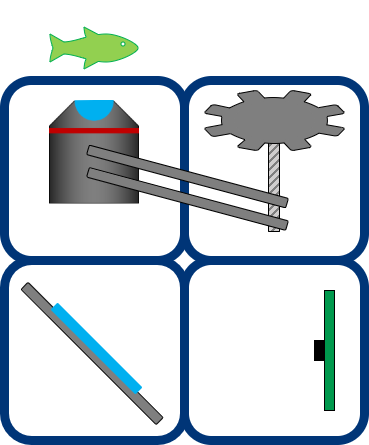
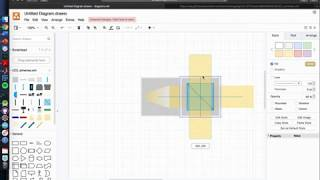

# [draw.io](https://app.diagrams.net/)

draw.io is a free online diagram software. You ca use for sketching your own UC2 setup easily - just import our libraries from tis folder.

There are two libraries - [UC2_schemes](./DRAW.IO/UC2_schemes.xml) and [UC2_simple](./DRAW.IO/UC2_simple.xml).

You can load the libraries directly in draw.io using these links:

[UC2_schemes](https://app.diagrams.net/?splash=0&clibs=Uhttps%3A%2F%2Fraw.githubusercontent.com%2Fbionanoimaging%2FUC2-GIT%2Fmaster%2FMDK%2FDRAW.IO%2FUC2_schemes.xml)

[UC2_simple](https://app.diagrams.net/?splash=0&clibs=Uhttps://app.diagrams.net/?splash=0&clibs=Uhttps%3A%2F%2Fraw.githubusercontent.com%2Fbionanoimaging%2FUC2-GIT%2Fmaster%2FMDK%2FDRAW.IO%2FUC2_simple.xml)

[Both libraries](https://app.diagrams.net/?splash=0&clibs=Uhttps%3A%2F%2Fraw.githubusercontent.com%2Fbionanoimaging%2FUC2-GIT%2Fmaster%2FMDK%2FDRAW.IO%2FUC2_simple.xml;Uhttps%3A%2F%2Fraw.githubusercontent.com%2Fbionanoimaging%2FUC2-GIT%2Fmaster%2FMDK%2FDRAW.IO%2FUC2_schemes.xml)

## [UC2_schemes](./DRAW.IO/UC2_schemes.xml)

## [UC2_simple](./DRAW.IO/UC2_simple.xml)

# Video Tutorial

A quick video on how to integrate it into [draw.io](draw.io) can be found [here](https://youtu.be/BRtv55BRKH4)

