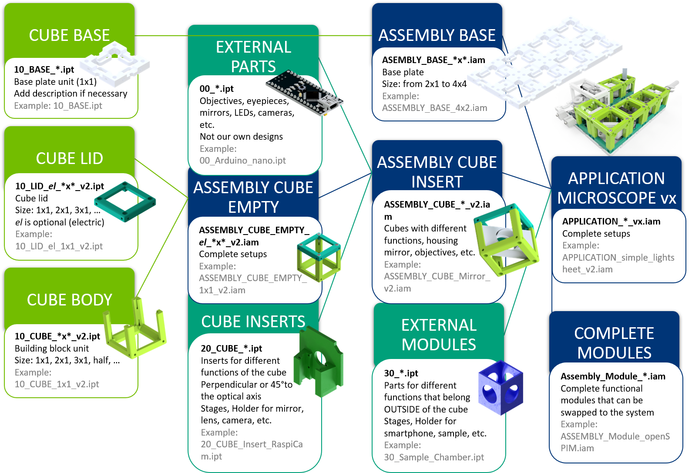
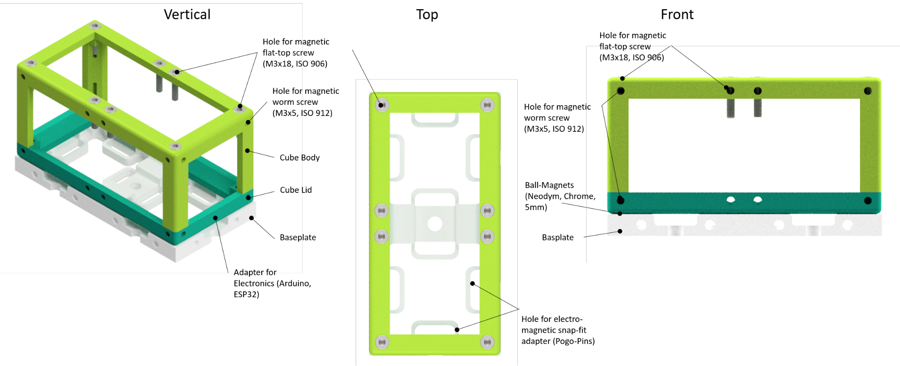
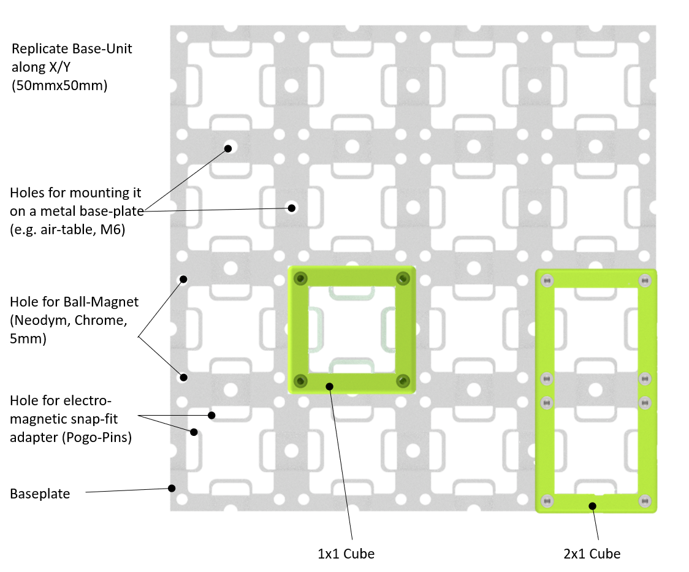
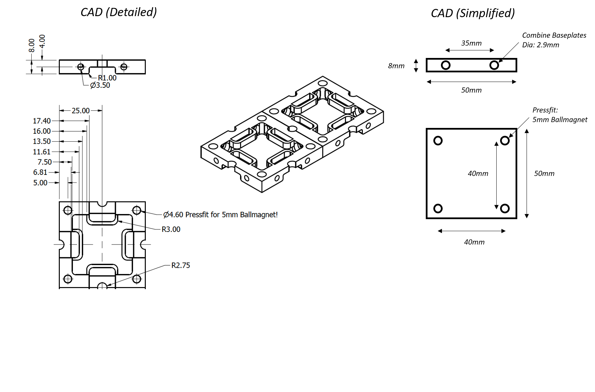
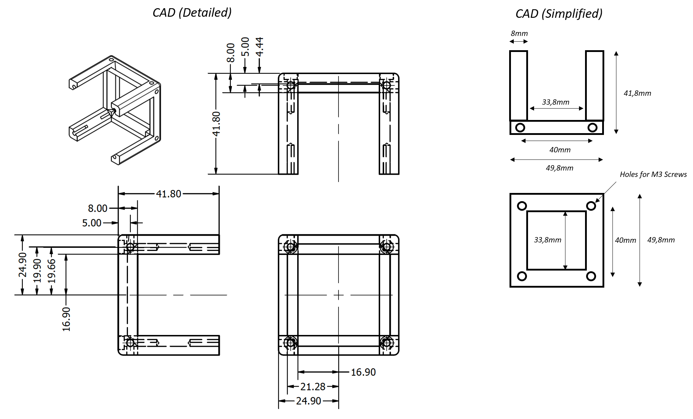
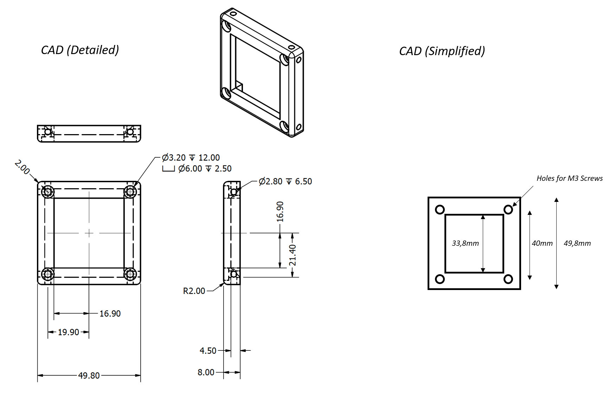
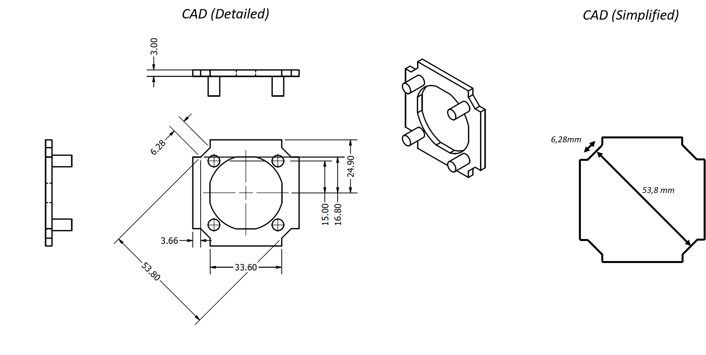
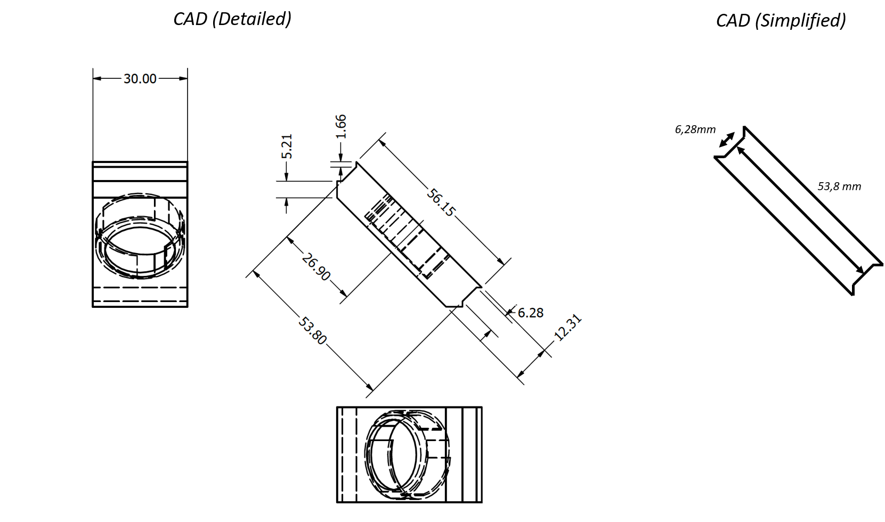

# Modular Devoloper Kit - MDK

V1 – 31.08.2019, Benedict Diederich, Barbora Marsikova

If you want to adapt your ideas to the ***UC2*** framework this document gives you the necessary steps in order to do so. We provide a detailed description of the definitions, intentions and files to do so. Once you have created your idea with this system, please share it so that others can benefit from it!

The CAD templates can be found in the [CAD](./CAD)-folder.

### Definitions

The UC2 framework requires the introduction of several new concepts. These terms are defined in the table below and illustrated in a series of figures.

The Names can be found in the chart below (Fig 1). The chart also represents the logical structure of building a setup using UC2 elements.


<table>
  <tr>
   <td>Name
   </td>
   <td>Description
   </td>
  </tr>
  <tr>
   <td>APPLICATION
   </td>
   <td>Complete microscopes and other optical  setups.
<p>
They are composed of one or more baseplates and modules with different functions. The list of available applications and modules that are necessary for building them can be found in TheBOX.
   </td>
  </tr>
  <tr>
   <td>ASSEMBLY BASE
   </td>
   <td>The Assembly Base plate (“Skeleton” of the setups) is the frame and backplane of the UC2 project, determining the size and layout of the optical system. UC2 modules attach to the baseplate positions, which have a backplane to electrically and logically connect modules together.
   </td>
  </tr>
  <tr>
   <td>ASSEMBLY CUBE Insert
   </td>
   <td>“Assembly Cube”s are the building blocks of a UC2 setup. These are physical components that implement various functions into the system.
<p>
They are assemblies of empty cubes and inserts and external parts. The functionality is provided by the inserts and specialized components while the housing ensures correct position in the optical path.
   </td>
  </tr>
  <tr>
   <td>ASSEMBLY CUBE Empty
   </td>
   <td>Raw cube/basic building block, varying in size (1×1, 2×1, etc.).
<p>
Note that the MDK only details the specification of the Cube and Base to the extent that it is necessary for module developers to develop modules.
   </td>
  </tr>
  <tr>
   <td>CUBE Body
   </td>
   <td>Part of the cube that holds the inserts. Screws can be inserted on all sides in order to build setups in three dimensions.
   </td>
  </tr>
  <tr>
   <td>CUBE Lid
   </td>
   <td>The lid closes the cube when attached by screw to the Body. It can carry electronics. Through the screws of the lid electrical components inside the cube can be powered.
   </td>
  </tr>
  <tr>
   <td>CUBE INSERTS
   </td>
   <td>Interfaces base cube to external components. They fit the inner dimensions of the cube.
<p>
There are two types of inserts: perpendicular (to the optical axis) and diagonal. They serve as holder for lenses, mirrors, cameras, filters, and other components demanded by the application.
<p>
Existing inserts can be adjusted to fit specific parts (i.e. lens diameters).
   </td>
  </tr>
  <tr>
   <td>EXTERNAL MODULES
   </td>
   <td>Interfaces that are outside of a cube.
<p>
Those are stages, sample mounts, smartphone holders and others elements that do not fit inside a cube but give function to it.
<p>
They are attached to an (empty) cube or they use the Cube Lid to attach to the baseplate.
   </td>
  </tr>
  <tr>
   <td>EXTERNAL PARTS
   </td>
   <td>Components that has to be bought externally - objectives, lenses, LEDs, etc.
<p>
Parts that are used by the project but the designs are not our own.
   </td>
  </tr>
  <tr>
   <td>COMPLETE MODULES
   </td>
   <td>Entire Functional modules that can be swapped to the system.  
<p>
They have the correct screws and dimensions to adapt to the magnets on the baseplate.
<p>
Fully independent, but follows the optical path (e.g. SIM-module, ISM-module, projector, etc.)
   </td>
  </tr>
</table>


<p align="center">

<br><br>
    <em>Figure 1: The chart showing logical structure of building a UC2 setup.</em>
</p>


### Concept of the cube

The cube is the cornerstone of UC2 framework. Its purpose is to create a bridge between the toolbox and any external component. The cube itself is universal and thanks to the modular design of inserts, it can be adapted to any application.


*   Interface to bridge UC2 to any external component
*   Dimensions of the "50 mm" Cube unit  
    *   Distance from hole to hole 40 mm
    *   Distance from face to face is 49,8 mm – to incorporate inprecision of the printer
*   Beam-path goes perpendicular and through center of the cubes’ faces
*   Centrosymmetric
*   Screws in the cube fit on Ballmagnets of the Baseplate
*   Compatible with Thorlabs 1" Cage System
*   Electric connection through baseplate (wires connected to magnets, rectifier)
*   Integer of 1x1; Design allows easy adaption to 2×1 modules
*   Magnetic plates can close the open faces (shading)
*   Flat-head screws (DIN ISO 912, M3×18mm) connect lid + cube; also at the bottom of the Cube Body
*   Worm screws (DIN ISO906, M3×5mm) are put in all other holes for magnetic connection
*   Function can be put into the cube by a special insert
*   Electronics
    *   The Lid can carry electronics (e.g. ESP32)
    *   The power (5V, GND) comes through cables, connected to two screws inside the lid; To avoid wrong polaritiy of the voltage, the wires go through a full-rectifier (discrete component) before it reaches the input power of the ESP32
    *   The ESP32 can be controlled through WiFi and MQTT protocol


<p align="center">

<br>
    <em>Figure 2: Basic empty cube 1×1</em>
</p>


<p align="center">

<br><br>
    <em>Figure 3: Basic empty cube 2×1</em>
</p>


### Concept of the Baseplate

The Baseplate is the “skeleton” of the UC2 framework and holds the different modules in place.So far it’s designed the way, that ball-magnets are pressed fit into the 3D printed baseplate which interact with the 3D printed cubes. Knowing that it’s mechanically overdefined, the 4-point interface with screws and magnets gives the degree of freedom to level out mechanical imprecisions e.g. due to 3D printing etc. by adjusting the positions of the screws. The baseplate also offers the ability to connect the cubes to a electronic power-grid by adding wires to the chromium ball-magnets which conduct current when connected to the screws in the cubes.

<p align="center">

<br>
    <em>Figure 4: Baseplate 4×4</em>
</p>


*   5mm Ballmagnets (Neodym) are press fit into the holes
*   Cables can be attached to the magnets before they are pressfit into the holes
*   Dimensions:
    *   Base-plate unit: 50×50mm
    *   Distance: Magnet-Magnet: 40 mm
*   Modules are attached to the base-plate by the magnetic fit mechanism
*   Additional holes for M6 screws to adapt to e.g. metallic (bread) boards (e.g. Thorlabs grid). Distance is 50-50mm
*   Modules can be mounted in 0°/90° orientation
*   Module finds its place on a grid
*   The system can be built in the 3<sup>rd</sup> dimension by using 90° connectors
*   Baseplates can be concatenated by using M3 Screws which find their place at the faces of the base-plate


### Good Practice to transfer an optical system to UC2


*   Fourier optics is happy if the focal lengthes of adjacent lenses follow each other (minimizing vignetting, telecentric systems, etc.)
*   Lenses should be chosen as integer 50 mm of their focal lengthes (ideal lens, real lens => subtract thickness of the lens itself=> focal-focal length 100mm)
*   Think in modules and blocks
*   Divide functions in submodules
*   Concatenate submodules to functions
*   A subunit can be extended in integer of 1x1 cubes in XYZ
*   Example: A simple telescope can be accomplished by concatenating two lenses (50mm, 100mm) with a distance of 150mm wrt. Their back-focal length (BFL) – see figure 5
*   If a function cannot be realized by concatenating cubes/submodules, a dedicated module can be developed which itself interfaces to an existing bigger setup (e.g. a module which holds a video-projector

<p align="center">

<br><br>
    <em>Figure 5: Scheme of two of the possible modular setups: Top: Keplerian telescope; bottom: Smartphone microscope.</em>
</p>


### Cube Inserts

The cube inserts can be fully customized to adapt any optical element to the cubes. So far a perpendicular and diagonal version exists. The design files for Autodesk Inventor and OpenSCAD are available. Once you have a customized version, please share it so that the open-aspect of the system reaches its full potential :)

Since the cube is point symmetric around the origin, the inserts can be rotated in all directions and bridges external components to the modules by acting as an open-standard.

The CAD templates for Autodesk Inventor 2019 (```.ipt```) and ```STL/STEP```-standard can be found in the [CAD](./CAD)-folder.


##### Cube Insert (Perpendicular)


*   This can be slided into the cube
*   Allows variation in the position along the optical axis, three different orientations of the insert inside the cube are possible
*   Important are the following Distances:
    *   from one inner edge of the cube to its opposite counterpart (53,8 mm)
    *   the thickness of the inner edge of the cube is 6,28 mm
    *   plate thickness: 5,0 mm
*   The insert is gripped by a form-fit mechanism – eventually adjust the size when printing the insert so that it fits smoothly
*   Example for an insert which adapts a Thorlabs Cage Components (CP02)
*   An Example is given [here](./CAD)


##### Cube Insert (Diagonal)


*   This can be slided into the cube
*   Allows variation in the position with an angle of 45° w.r.t. the optical axis
*   Important are the following Distances:
    *   from one inner edge of the cube to its opposite counterpart (53,8 mm)
    *   the thickness of the inner edge of the cube is 6,28 mm
*   The insert is gripped by a form-fit mechanism – eventually adjust the size when printing the insert so that it fits smoothly
*   Example for an insert which adapts a Thorlabs round mirror
*   An Example is given [here](./CAD)


### CAD Drawings


##### Baseplate

<p align="center">

</p>

##### Cube Body

<p align="center">

</p>

##### Cube Lid

<p align="center">

</p>


##### Cube Insert (Perpendicular to the optical axis; Thorlabs cage system compatible)

<p align="center">

</p>


##### Cube Insert (Diagonal)

<p align="center">

</p>
