# Modular Devoloper Kit - MDK

V3 – 30.11.2020 Benedict Diederich, Barbora Marsikova

If you want to adapt your ideas to the ***UC2*** framework this document provides you with all the necessary information. We provide a detailed description of the definitions, versions, intentions and files. Once you have introduced your idea into the system, please share it so that others can benefit from it!

The CAD templates can be found in the [CAD](./CAD)-folder.

### Definitions

The UC2 framework requires the introduction of several new concepts. These terms are defined in the table below and illustrated in a series of figures.

The Names can be found in the chart below (Fig 1). The chart also represents the logical structure of building a setup using UC2 elements.

The scheme describes the structure in which the toolbox is designed, therefore its explaining the naming convention of the design files (Inventor, openSCAD). There are a few differences between that and the repository CAD folder - those are noted in the table below.

<p align=center>
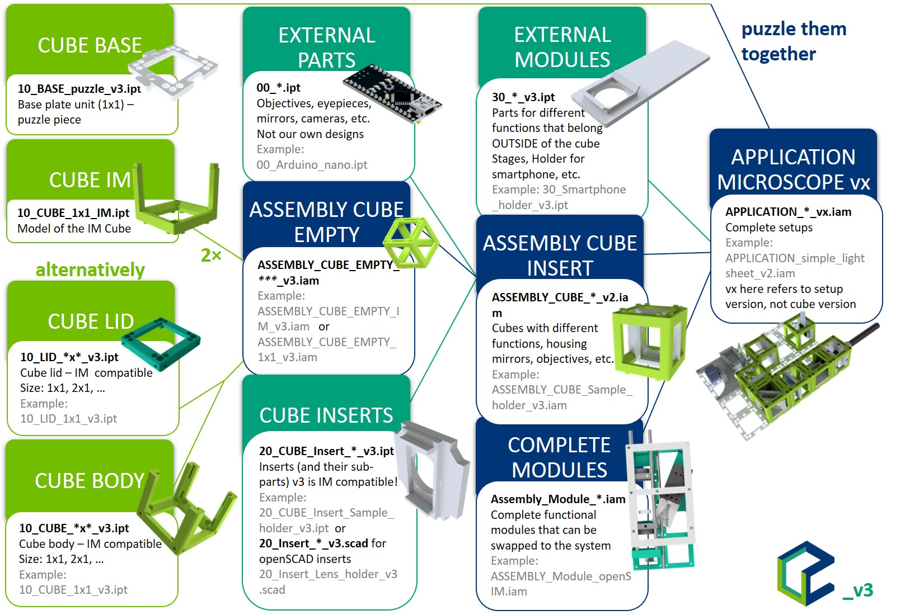
<br> <em>Fig. 1: Modular Developer Kit chart</em>
</p>

Name | Description
:---:|:---:
**CUBE (Baseplate)** | The **BASE puzzle pieces**, the basic units, are joined into the **BASEPLATE** (“skeleton” of the setups). The Baseplate can have any shape any size, depending on how many puzzles you use and how you put them together. It allows you to build setups in three dimensions when you 'sandwich' the layers of cubes and baseplates. This is the frame and backplane of the UC2 project, determining the size and layout of the optical system. 3D-printed UC2 modules attach to the square baseplate positions using ball-magnets and ferro-magnetic screws. The injection moulded cubes attach via their lego-like pins. Find the details of the baseplates on their [CAD page](../CAD/ASSEMBLY_Baseplate). *(Git: ASSEMBLY_Baseplate)*
**CUBE (IM)** | The injection moulded (IM) is a half of the cube. The **ASSEMBLY CUBE (empty)** cube is composed of these two identical halves and can be easily assembled by their press-fit mechanism. The assembled IM cube has two sides with eight lego-like pins each to attach to the baseplate. *(Git: ASSEMBLY_CUBE_BASE)*
**CUBE (Body)** | Alternatively, the whole cube can also be 3D-printed. Then the **ASSEMBLY CUBE (empty)** consist of the body- and the lid-part which get screwed together. Screws can be inserted on all sides in order to build setups in three dimensions.
**CUBE (Lid)** | The lid closes the 3D-printed cube when attached by screw to the body. It can carry electronics like microcontrollers (e.g. Arduino, ESP32). By adding wires to the screws closing the lid electronic components can be supplied with electrical power.
**ASSEMBLY CUBE (empty)** | The raw cube - the basic building block comes in two versions: 3D-printed and injection moulded. Both of them have the same dimensions and symmetry, so the insert fit them all. The similarities and differences of the two systems are explained under this table in the *UC2 version history section*. Note that the MDK only details the specification of the Cube and Base to the extent that it is necessary for module developers to develop modules. Find the details of the Cube on its [CAD page](../CAD/ASSEMBLY_CUBE_Base). *(Git: ASSEMBLY_CUBE_BASE)*
**CUBE INSERTS** | Cube Inserts are physical components that implement various functions into the system by adapting **EXTERNAL PARTS** to the **ASSEMBLY CUBE INSERT**. They fit the inner dimensions of the cube. There are two types of inserts: perpendicular (to the optical axis) and diagonal. They serve as holders for various components like  lenses, mirrors, cameras, filters, and other components demanded by the application. Existing inserts can be adjusted to fit specific parts (i.e. lens diameters).
**EXTERNAL PARTS** | Everything which is not part of the UC2-system or can not be 3D printed is termed as an EXTERNAL PART. This can be commercially available parts like objectives, lenses, LEDs, etc., but also 3D-printed parts from other projects (e.g. openflexure stage).
**ASSEMBLY CUBE (insert)** | This is the combination of the ASSEMBLY CUBE (empty) and a CUBE INSERTS. Since the ASSEMBLY CUBEs are the building blocks of a UC2 setup, adding features is accomplished by hardware plugins also called CUBE INSERTS.
**EXTERNAL MODULES** | Using EXTERNAL MODULES one adapt EXTERNAL PARTS that typically do not fit inside a cube but give function to it. This can be for example cellphones, stages projectors, etc. By providing customized hardware-adapter they interface with the ASSEMBLY CUBE.
**COMPLETE MODULES**  | Entire Functional modules that can be swapped to the system. They have the correct screws and dimensions to adapt to baseplate. They are fully independent, but follow the optical path (e.g. SIM-module, ISM-module, projector, etc.).
**APPLICATION** | APPLICATIONs are complete optical setups or microscopes. They are composed of several baseplate puzzles and modules with different functions. The GitHub-repository provides a list of basic optical systems which are also compiled into a ready-to-use list called "TheBOX".

### UC2 version history
When you search through the repository, you find that not all the images show the same cubes and baseplates. This is due to the evolution of the basic building blocks. In order to help you not to get lost, here is a short explanation of how the cubes evolved.
#### v3 = 3D-printed AND Injection Moulded
*November 2020*  
**This is the current version.** The cube comes in two versions that are fully compatible with each other. You can either print all the baseplates and cubes and assemble and connect them using screws and magnets, or you can use the IM cubes and baseplate puzzles that connect via the lego-like pins.

The IM cube is shown in the first picture. The two identical halves fit perfectly together and each of the two pinned sides of the cube fits to the baseplate.
<p align=center>

</p>

The 3D-printed cube is in the next picture. The body and the lid are held together by the M3 screws that attach to the magnets of the baseplate. Additionally, M5 screws are added to the position of the pins for better alignment precision.
<p align=center>
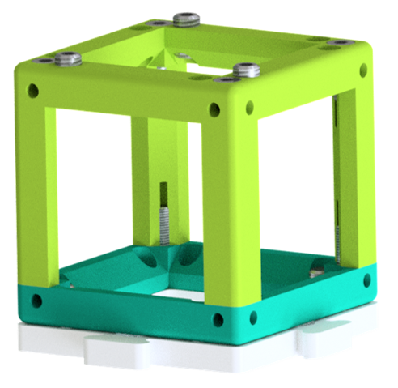
</p>

The 3D-printed baseplate puzzles are fully compatible with both types of cubes and with the IM puzzles. It is important to pay attention to calibration of your printer according to the guide in the [baseplate CAD page](../CAD/ASSEMBLY_Baseplate).

#### v2 = point symmetric
*July 2019*  
The v2 version looks pretty much like v3 without pins. The cube is point symmetric, therefore the insert can be used in various orientations. The baseplates have to be assembled in Inventor and printed in the desired size - mostly 4×1, 4×2, 4×4. The cube is also made of the Body and the Lid and can vary in size (e.g. 1×1, 2×1, etc.).  
They seem to be the same as the IM cubes - but not completely. The dimensions are slightly different. It isn't anything you couldn't fix with a file and sticky tape but it's advisable to use the matching cubes and inserts.
<p align=center>
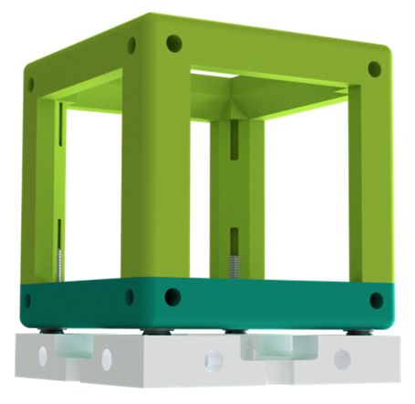
</p>

You can still find a lot of pictures with v2 cubes in the GitHub - many of the applications we tested are simply shown in the version, which we first build them with.   
Knowing that it’s mechanically overdefined, the 4-point interface with screws and magnets gives the degree of freedom to level out mechanical imprecisions e.g. due to 3D printing etc. by adjusting the positions of the screws.

:grey_exclamation: If you are still working with the v2 version of the cube, you find the documentation in the [UC2_v2 branch](https://github.com/bionanoimaging/UC2-GIT/tree/UC2_v2).

#### v0 = the early cube
*2017*  
Why is there no v1? Because all the slow and steady development from the very beginning until the real modular microscopes is covered in this one. The v0 cube had a rail system similar to the cage system used by e.g. Thorlabs or Newport. The baseplate wasn't very different from v2.
<p align=center>
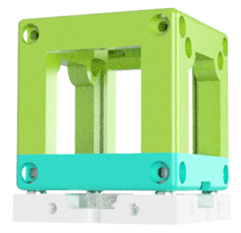
</p>
The old cube is not compatible with the current design and currently isn't shown anywhere in the repository.

### Concept of the cube

The cube is the cornerstone of UC2 framework. Its purpose is to create a bridge between the toolbox and any external component. The cube itself is universal and thanks to the modular design of the inserts, it can be adapted for any application.

*   Interface to bridge UC2 and any external component
*   Dimensions of the "50 mm" Cube unit  
    *  The baseplate puzzle piece has the size of 50×50 mm<sup>2</sup>
    *   Distance from face to face is ~49,8 mm – to incorporate imprecision of the 3D-printer cube and to avoid adding up error in larger setups
    *   Distance from hole to hole (screws in the cube and magnets in the baseplate) 40 mm
*   (3DP) Screws in the cube fit on Ball magnets of the Baseplate
*   (IM) The pins of the cube fit into the holes of the baseplate
    *   The precise position of the pins is depicted in the schemes later on this page
*   Beam path is perpendicular and through center of the cube's faces
*   Centrosymmetric
*   Compatible with Thorlabs 1" Cage System
*   Function can be put into the cube by a special insert
*   Electronics
    *   The ESP32 can be controlled through WiFi and MQTT protocol


**IMPORTANT: Not all screws are magnetic!**  
It is very important to buy the right screws - the M3 screws need to attach to the magnets and therefore it is crucial that they are magnetic. STAINLESS STEEL IS GENERALLY NOT A MAGNETIC MATERIAL. THE SCREWS HAVE TO BE MADE OF GALVANIZED STEEL. If you want to know more about why not all steel is magnetic you can read about it [here](https://monnigindustry.com/2020/12/23/is-galvanized-steel-magnetic-why-or-why-not/). Unfortunately, the DIN 912 / ISO 4762 screws that we propose can be made of both and you can frequently find both at the same vendor.    
The take-home message is: **The M3 screws have be made of galvanized steel and never stainless steel!**  
Check out the [RESOURCES](../TUTORIALS/RESOURCES/Resources_Mechanics.md) for sources of the right screws.

<p align="center">
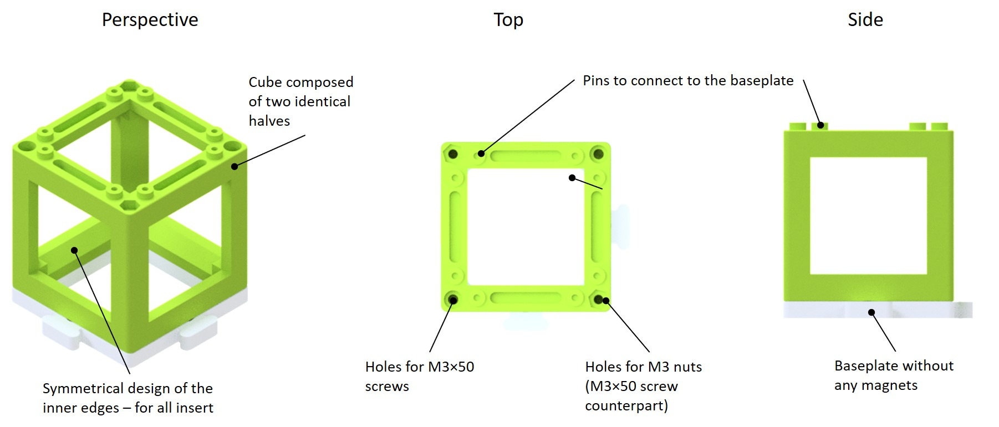
<br><em>Fig. 2: Basic empty cube - Injection Moulded (IM)</em>
</p>

<p align="center">
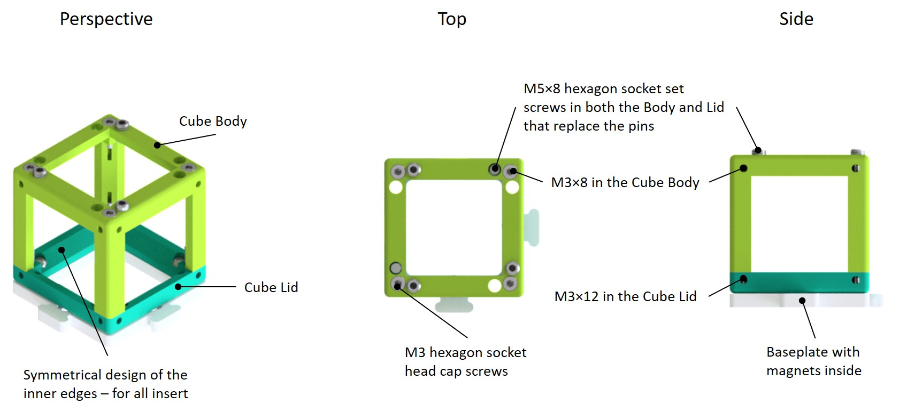
<br><em>Fig. 3: Basic empty cube 1×1 - 3D-printed (3DP)</em>
</p>

<p align="center">
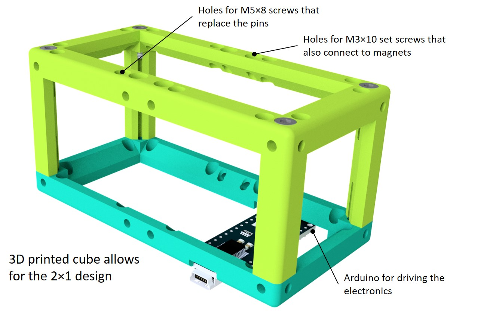
<br><em>Fig. 4: Basic empty cube 2×1 (3DP)</em>
</p>

### Concept of the Baseplate

The Baseplate is the “skeleton” of the UC2 framework and holds the different modules in place and in given mutual position. The baseplate is made of its single units - baseplate puzzles. The Baseplate can have any shape any size, depending on how many puzzles you use and how you put them together. It allows you to build setups in three dimensions when you 'sandwich' the layers of cubes and baseplates.  
The baseplate puzzles are the same whether you print them with a 3D printer or whether you use the IM ones. They can also be freely combined together.  
For attaching the 3DP cubes, you just add magnets in the designated holes of the puzzle piece. The ball magnets are pressed fit into the 3DP or IM baseplate.

<p align="center">
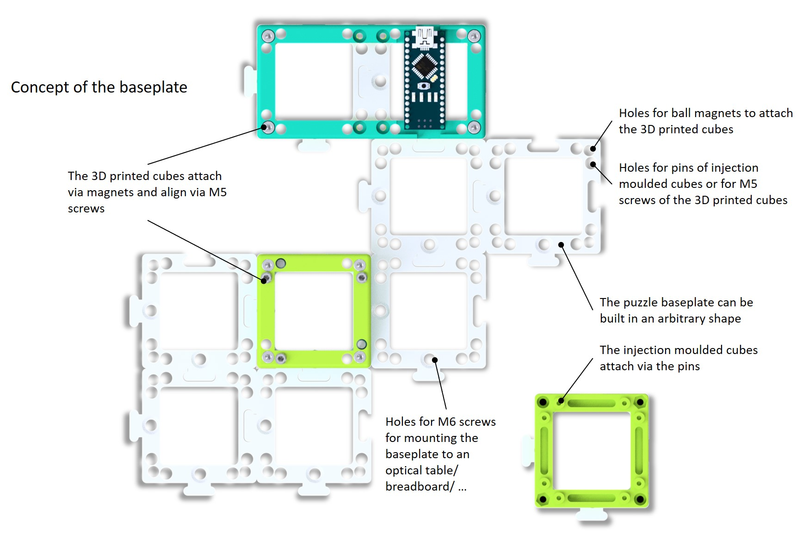
<br><em>Fig. 5: Baseplate and setup building - top view</em>
</p>

<p align="center">

<br><em>Fig. 6: Baseplate and setup building - perspective view</em>
</p>

So far it’s designed the way, that ball-magnets are pressed fit into the 3D printed baseplate which interact with the 3D printed cubes.   

*   Baseplates puzzles can be arbitrarily combined into large or small baseplates
*   Holes for pins to create a stable lego-like connection between the cube and the baseplate
* Holes for 5mm ball magnets (press fit) to attach to the 3DP cube
*   Dimensions:
    *   Base-plate unit: 50×50 mm<sup>2</sup>
    *   Distance: Magnet-Magnet: 40 mm
*   Additional holes for M6 screws to adapt to e.g. metallic (bread) boards (e.g. Thorlabs grid). Distance is 50-50mm
*   Module finds its place on a grid
*   The system can be built in the 3<sup>rd</sup> dimension by sandwiching layers of cubes and baseplates

### Building a UC2_v3 setup
#### Watch the videos in the [UC2_v3 playlist](https://www.youtube.com/playlist?list=PLB7sYInE0vsM_uuHkdbQfF4FY6i0mnbqv) to see how it works!

* The 3DP baseplate puzzles (pink) and IM baseplate puzzles (black) can be combined and one large baseplate can be build using both types.
<p align="center">
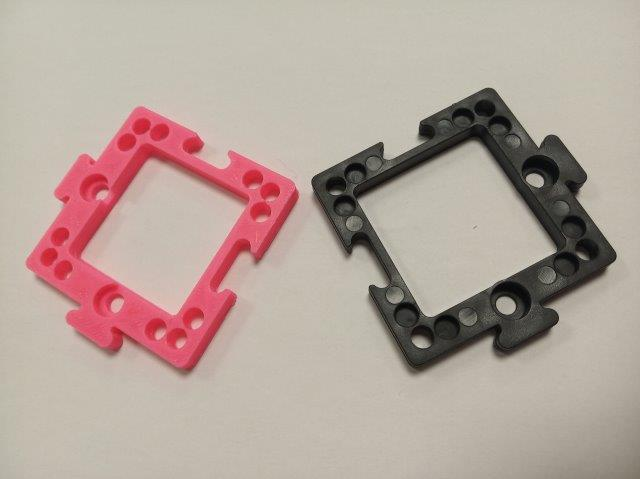
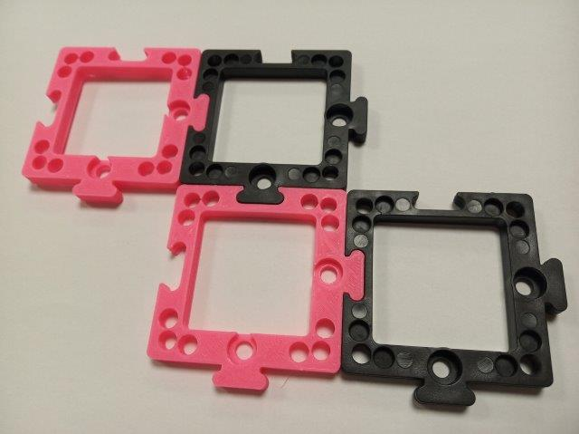
</p>

* The 3DP baseplate puzzles (black) and IM Cube (right) can be used in parallel in the same setup. The IM Cube connects to the baseplate via eight lego-like pins on top and bottom side. The 3DP Cube connect with its screws in the corners to the magnets of the baseplate. Additionally, it has three M5 screws that work like the pins of the IM Cube, for better precision of alignment.
<p align="center">
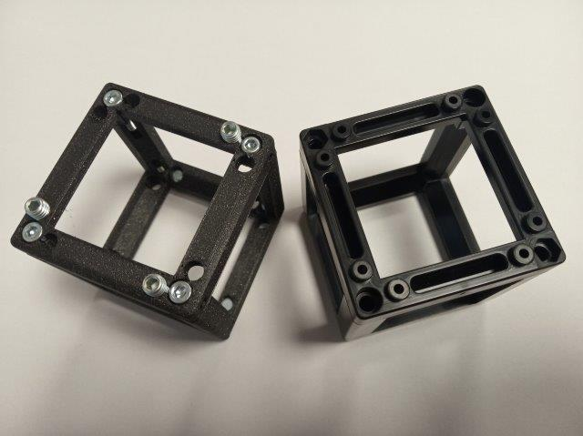
</p>

* The baseplate puzzle can be build into a baseplate of arbitrary shape and size in 2D. Layers of baseplates and cubes can be sandwiched into a three-dimensional setup.
<p align="center">
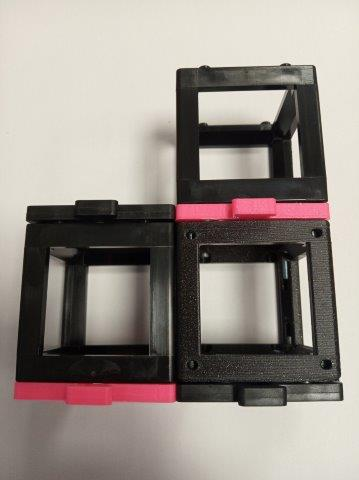
</p>


### Good Practice to transfer an optical system to UC2

*   Fourier optics is happy if the focal lengths of adjacent lenses follow each other (minimizing vignetting, telecentric systems, etc.)
*   Lenses should be chosen as integer 50 mm of their focal lengthes (ideal lens, real lens => subtract thickness of the lens itself=> focal point -focal point 100mm)
*   Think in modules and blocks
*   Divide functions in submodules
*   Concatenate submodules to functions
*   A subunit can be extended in integer of 1x1 cubes in XYZ
*   Example: A simple telescope can be accomplished by concatenating two lenses (50mm, 100mm) with a distance of 150mm wrt. their back-focal length (BFL) – see figure 5
*   If a function cannot be realized by concatenating cubes/submodules, a dedicated module can be developed which itself interfaces to an existing bigger setup (e.g. a module which holds a video-projector

<p align="center">

<br><em>Figure 5: Scheme of two of the possible modular setups: Top: Keplerian telescope; bottom: Smartphone microscope.</em>
</p>


#### Template for UC2-designs

We incorporated a PPT-based layout helper for the creation of arbitrary complex system using UC2. Go to the [PPT](./PPT) Folder and open the file [UC2_Setupcreation.pptx](./PPT/UC2_Setupcreation.pptx) which has  slides for all available components:

<p align="center">
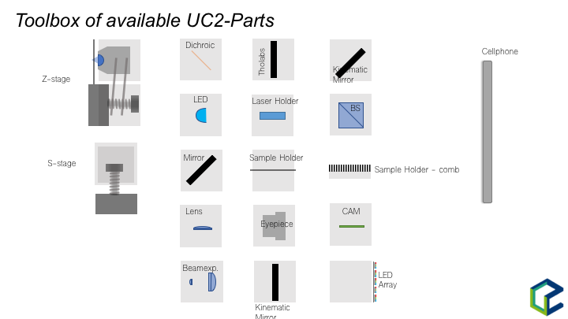
<br><em>Figure 5a: Available UC2 components.</em>
</p>

 and the baseplate to place the components on it in order create the setup:

<p align="center">
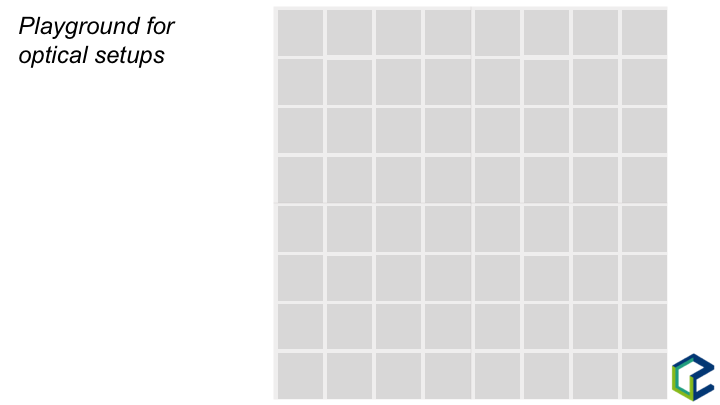
<br><em>Figure 5b: Playground for the UC2 setup creation.</em>
</p>

You can also use the publicly available tool [draw.io](https://app.diagrams.net/). Simply import our libraries from the [DRAW.IO](./DRAW.IO) Folder. You find there one for the schemes - [UC2_schemes](./DRAW.IO/UC2_schemes.xml) (same as in the .ppt) and one for the SIMPLE sketches - [UC2_simple](./DRAW.IO/UC2_simple.xml).

### Cube Inserts

The cube inserts can be fully customized to adapt any optical element to the cubes. So far a perpendicular and diagonal version exists. The design files for Autodesk Inventor and OpenSCAD are available. Once you have a customized version, please share it so that the open-aspect of the system reaches its full potential :)

Since the cube is point symmetric around the origin, the inserts can be rotated in all directions and bridges external components to the modules by acting as an open-standard.

The CAD templates for Autodesk Inventor 2019 (```.ipt```) and ```STL/STEP```-standard can be found in the [CAD](./CAD)-folder.

##### Cube Insert (Perpendicular)

*   This can be slided into the cube
*   Allows variation in the position along the optical axis, three different orientations of the insert inside the cube are possible
*   Important are the following distances:
    *   from one inner edge of the cube to its opposite counterpart (54,0 mm)
    *   the thickness of the inner edge of the cube is 6,20 mm
    *   plate thickness: 5,0 mm (optimal for most modules - provides enough freedom as well as stability)
*   The insert is gripped by a form-fit mechanism – eventually adjust the size when printing the insert so that it fits smoothly
*   Example for an insert which adapts a Thorlabs Cage Components (CP02)
*   An Example is given [here](./CAD)

##### Cube Insert (Diagonal)

*   This can be slided into the cube
*   Allows variation in the position with an angle of 45° w.r.t. the optical axis
*   Important are the following distances:
    *   from one inner edge of the cube to its opposite counterpart (54,0 mm)
    *   the thickness of the inner edge of the cube is 6,20 mm
*   The insert is gripped by a form-fit mechanism – eventually adjust the size when printing the insert so that it fits smoothly
*   Example for an insert which adapts a 30×30 mirror
*   An Example is given [here](./CAD)

### CAD Drawings

##### Baseplate

<p align="center">
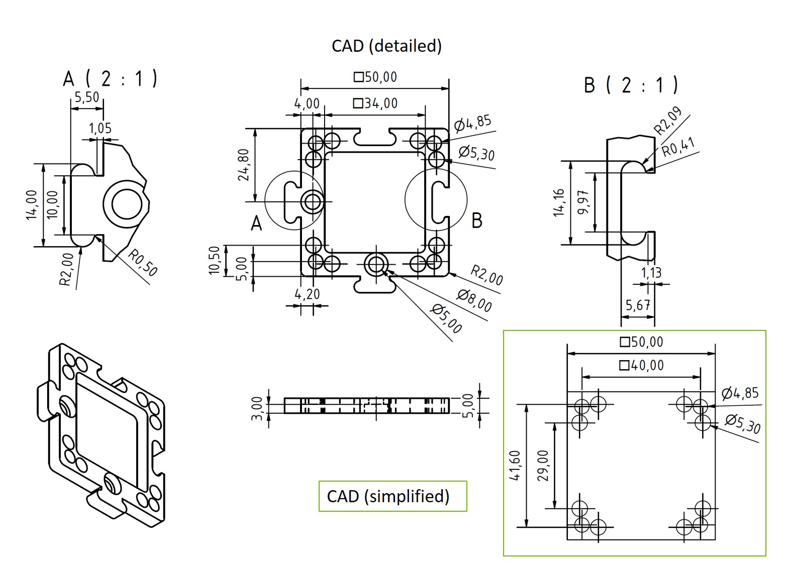
</p>

##### Cube Body

<p align="center">

</p>

##### Cube Lid

<p align="center">
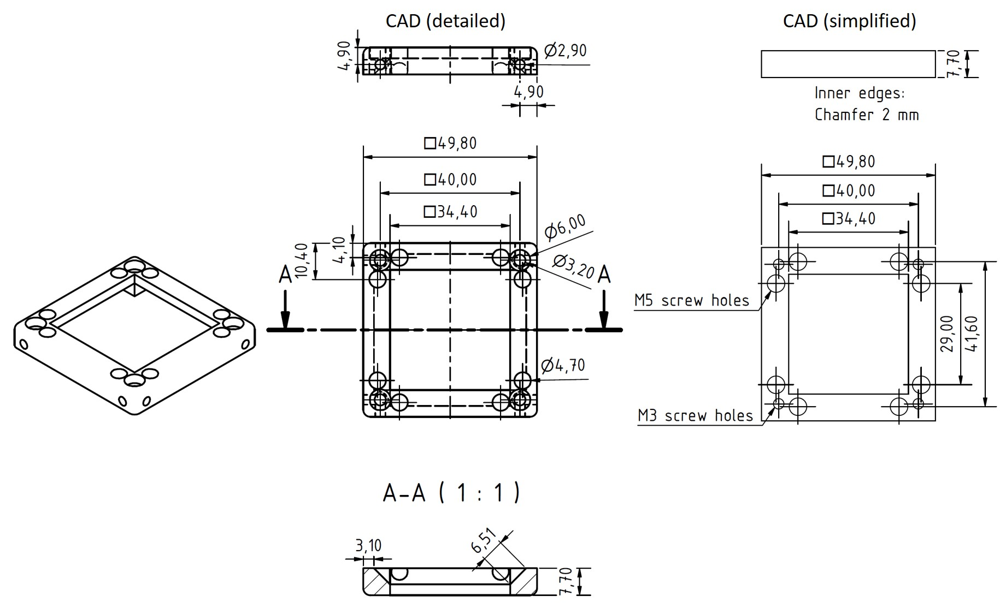
</p>

##### Cube Insert (Perpendicular to the optical axis; Thorlabs cage system compatible) - Sample holder

<p align="center">
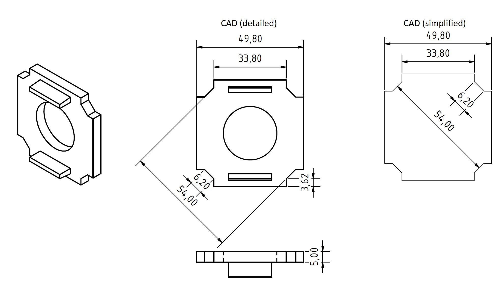
</p>

**Video Tutorial on How to design a Cube Insert (Perpendicular to the optical axis)**  
**The tutorial shows a v2 insert - the principle is the same but the dimensions differ!**

[](https://www.youtube.com/watch?v=q2DNw-Q1KEo&t=2s)

##### Cube Insert (Diagonal) - 45° Mirror holder

<p align="center">
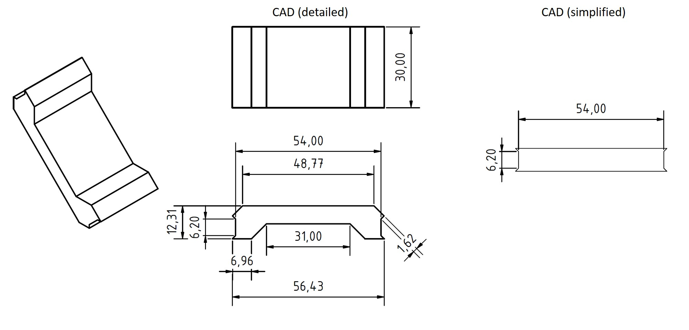
</p>
