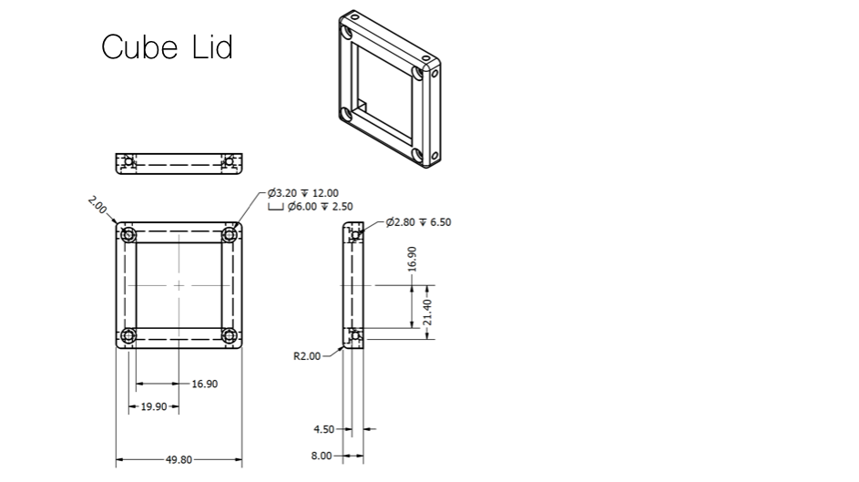
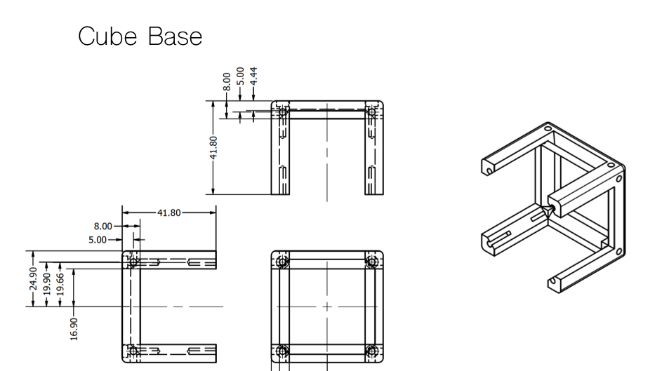
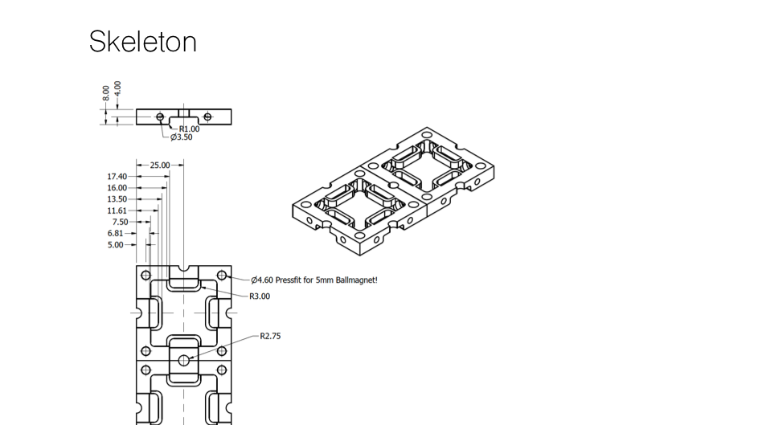
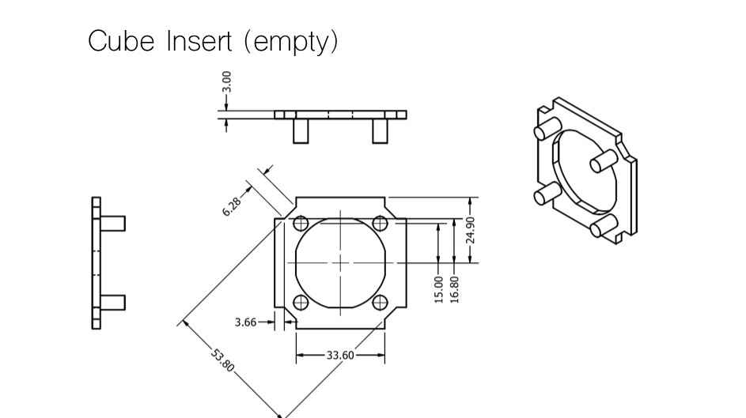
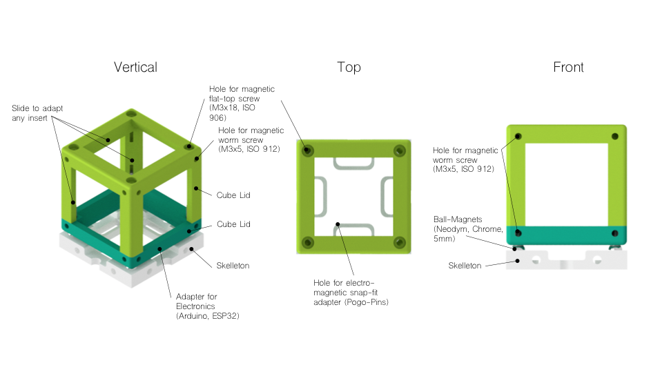
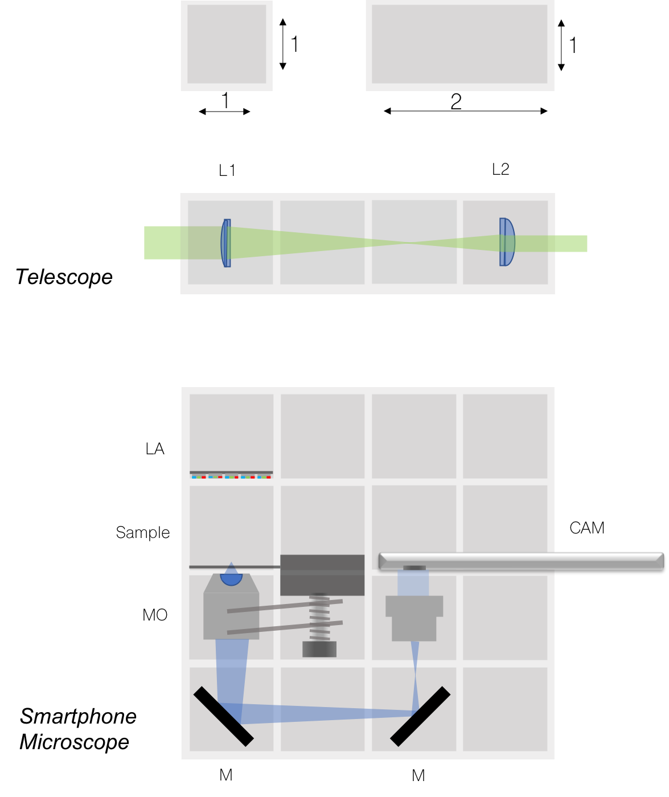

# MDK - Module Developer Kit
In the near future you'll find a detailed explanation of how parts should look like in order to adapt it to our system. 


# Mechanical Dimensions

## Cube Lid
This holds electronics and closes the Cube.

<p align="center">

</p>

## Cube Base
This holds all inserts for the UC2 system. 

<p align="center">

</p>


## Skeleton
This holds the ball magnets (5mm diameter) and serves as a sekeleton for the UC2 system.

<p align="center">

</p>


## Cube Insert
This holds any external parts which should be adapted to the UC2 system. 

<p align="center">

</p>

# Cube Assemblies and Schemes

## 1x1 Cube
A ```1x1```-cube should look like this once assembled:

<p align="center">

</p>

## 2x1 Cube
A ```2x1```-cube should look like this once assembled:

<p align="center">

</p>

## Skeleton
The pre-assembeld cubes go on to the skeleton like this:

<p align="center">

</p>


# Optical Designs and Setups

## 2D and 3D setups
The UC2 system can be assembled in all possible directions. The ```MxN``-cubes can be mounted using the ball-magnets and stacked using a skeleton which is mounted perpendicular to the base plate:

<p align="center">

</p>
