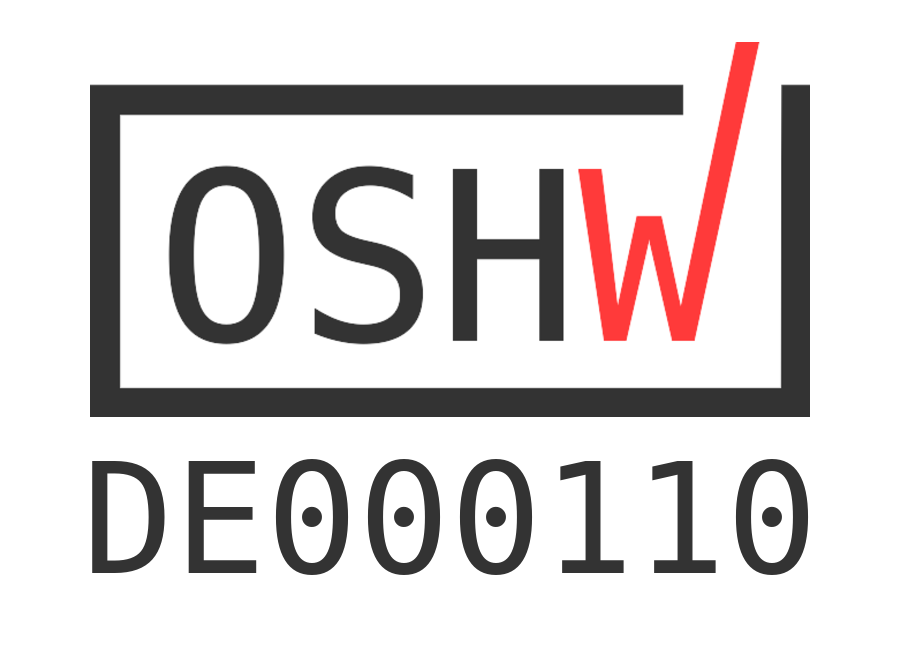
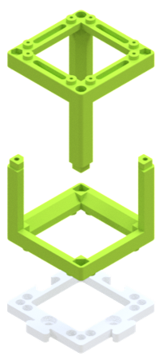
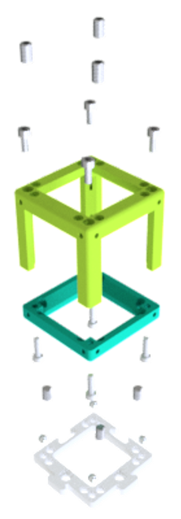

# **UC2 - Open and Modular Optical Toolbox**

---

**New**: :boom: **UC2_v3 is now released!** :boom: [Watch how much time the IM cubes can save!](https://www.youtube.com/watch?v=M_oqieogAOo&feature=youtu.be&ab_channel=openUC2)   
*We are working on making the IM Cubes and Puzzles available for sale, but we are not able to offer a 'BUY' button yet. If you are interested in buying some components, contact us via email info@useetoo.org*

**New**: The Pre-print of "UCsim2: 2D Structured Illumination Microscopy using UC2" is available on [Biorxiv](https://www.biorxiv.org/content/10.1101/2021.01.08.425840v1)  

**New**: The UC2 paper is out in Nature Communications! [A versatile and customizable low-cost 3D-printed open standard for microscopic imaging](https://www.nature.com/articles/s41467-020-19447-9) 

      

Cite this repository: 

This project provides certified open hardware. 

---

#  Start here! Everything is open-source - simply join!

## Steps to reproduce and use the toolbox:

 

## Too many new things? Follow our tutorials [ From a Beginner to a Professional](./TUTORIALS)!

## Already familiar? Click here if you are looking for...
TheBOX | General toolbox  | Specific setup |Workshops
:------:|:------:|:------:|:------:
|||
[Choose a version and build your own BOX.](./TheBOX) | [Explore the toolbox and its applications.](./CAD) | [Alternatives for many Microscopy methods... and more.](./APPLICATIONS) | [Host or join a UC2 workshop.](./WORKSHOP)

## [Get Involved! Contribute to the project!](CONTRIBUTING.md)

## ... or keep on reading to learn more!

---

## Making **open-science** great again!

**UC2** is a general-purpose modular framework for making interactive (electro)-optical projects. Most optical systems such as microscopes follow a simple **4f** or Fourier-optical principle, where lenses are aligned such that focal-planes of adjacent components overlap to limit the amount of aberrations as much as possible and to be able to predict the system-behavior easily using Fourier-transforms.

Following this idea, a microscope as shown in **Fig 1** creates an angular magnification depending on the focal lenghts of the objective fobj and tube lens ftube:

***M4f=  ftube/fobj***

  Fig. 1: Fourier-Optical Setup; Koehler Illumination where the illumination plane is conjugate to the objective pupil plane (BFP)

Besides optical components, the **UC2** building blocks can also host electronics such as **Arduinos** or **ESP32s** to create ''smart'' functions like LED array illumination, Z-stages, et cetera. Communication can be granted through the wired **I²** BUS or the wireless **MQTT** protocol.

**UC2** is in active development. It is meant to be used not only by beginners, but also for professionals dealing with optical setups on a daily basis. Its magnetic click-and-go concept simplifies the process of aligning and adjusting the parts giving new tools acting as rapid-prototyping devices. It also comes with a series of open-source workshops (in the future) explaining the theory behind optics.

People are also encouraged to share their work. We are curious what the community is doing with our little blocks. All necessary details to modify the design of the blocks are given in the sub-folders of the specific folders. Share your ideas through our [@openUC2-Twitter account](https://twitter.com/openuc2).

With the version UC2_v3 we introduced an **injection moulded (IM) cube**. This makes the assembly easier becuase no screws or magnets are needed for the Base Cube. But there is also a **3D-printed (3DP) cube** that is alternative to the IM one an it is fully compatible - the cubes and baseplates can be arbitrarily combined.   
Find out more about the two different Cube designs in [ASSEMBLY_CUBE_Base](./CAD/ASSEMBLY_CUBE_Base) and more about the baseplate puzzles in [ASSEMBLY_Baseplate](./CAD/ASSEMBLY_Baseplate).

*We are working on making the IM Cubes and Puzzles available for sale, but we are not able to offer a 'BUY' button yet. If you are interested in buying some components, contact us via email info@useetoo.org*

A full cube + base-plate looks like that:

  Fig. 2: Assembly of the cube + base-plate;  
LEFT: IM Cube - Two identical halves of the Cube are pressed together, the Cube connects to the baseplate via lego-like pins;  
RIGHT: 3DP Cube - A set of ferro-magnetic screws hold the lid and base-cube in place and connect to four 5mm Neodym ballmagnets sitting in the baseplate, and extra set of M5 screws further fixes the cube to the baseplate and supports the alignment; Optical components find their place inside the cube.

:grey_exclamation: If you are still working with the v2 version of the cube, you find the documentation in the [UC2_v2 branch](https://github.com/bionanoimaging/UC2-GIT/tree/UC2_v2). Check out the Modular Developer Kit to learn about the [UC2 version history](./MDK#uc2-version-history).

**UC2** can be used with cameras from the Raspberry Pi world, but creates even more beautiful images with your cellphone. Thus making cutting edge-research not only affordable, but also available.
A more in-detail project description can be found in the [UC2 White-Paper](./TUTORIALS/DOCUMENTS/UC2_Whitepaper.pdf)

## UC2 as an "open-standard"

The idea is to use **UC2** as an open-standard or bridge to external hardware components and devices such as cameras or lenses. An already existing or customized adapter/insert creates the link to the **UC2** eco-system. A variety of ready-to-use adapters can be found in the folder [CAD](./CAD).

  Fig. 3: The structure of any UC2 assembly follows the green lines; A basic cube can hold an insert thus adapting to different components (i.e. lenses, etc.); A number of assembled cube-modules can form a complex optical system here called application

A more in-detail description of the **MDK** (**M**odular **D**eveloper **K**it) which explains how ***your idea*** can be adapted to the module system can be found in the [MDK](./MDK)-folder. There you also found an explanation about the UC2 version history, if you found some confusing information through the repository.

If you have a new part, we are eager to see it. Please feel free to share it on available websites like Twitter, Thingiverse, Github or any other platform of choice!

### Read more about the project in our papers:
The UC2 paper: A versatile and customizable low-cost 3D-printed open standard for microscopic imaging is available on [Nature Communications](https://www.nature.com/articles/s41467-020-19447-9) 
All data from the paper is available in [Zenodo](https://doi.org/10.5281/zenodo.4018965)   
The Pre-print of the SIM+ISM paper is available on [Biorxiv](https://www.biorxiv.org/content/10.1101/2021.01.08.425840v1)    
The COSI conference paper is out on [OSA](https://www.osapublishing.org/abstract.cfm?uri=ISA-2019-ITh3B.5)  

Where next? 

### Complete overview of setups, modules, parts to buy and parts to print
Find a complete shopping'n'printing list including estimated prices for all modules and setups in this [BILL OF MATERIALS](https://docs.google.com/spreadsheets/d/1U1MndGKRCs0LKE5W8VGreCv9DJbQVQv7O6kgLlB6ZmE/edit?usp=sharing)!

### List of available Setups

Our goal is to make as many setups as possible available, so that people can play with it. Basically everything's possible, you just need to think in blocks! Please have a look in the [APPLICATIONS](./APPLICATIONS/Readme.md) folder for the up to date list of the setups.

  Fig. 4: In-line holographic microscope

### Repositories

Currently, **UC2** consists of the following repositories:

 - [UC2 Hardware Repo (core)](https://github.com/bionanoimaging/UC2-GIT/) (this repository) - [SITEMAP](./SITEMAP.md)
 - [UC2 Software Control Repo](https://github.com/bionanoimaging/UC2-Software-GIT)
 - [UC2+ImJoy Image Processing Repo](https://github.com/bionanoimaging/UC2-ImJoy-Plugins)

### Software

There is a GitHub repository dedicated for the UC2 software. It can be found [here](https://github.com/bionanoimaging/UC2-Software-GIT).
It supports you with controller APPS for the Raspberry Pi and Android Cellphones.

### Workshops

The documented workshops can be found in the folder [WORKSHOP](./WORKSHOP) and give a step-by-step introduction into the system. We have done multiple workshops together with the HHMI Janelia Farm, UiO Oslo, Lichtwerkstatt Jena and Leibniz IPHT Jena e.V.  
If you're interested we are happy to host one near you!

## Get Involved

This project is open so that anyone can get involved. You don't even have to learn CAD designing or programming. Find ways you can contribute in  [CONTRIBUTING](CONTRIBUTING.md)

## Kits, License and Collaboration

<!--?xml version="1.0" encoding="UTF-8" standalone="no"?-->
<svg xmlns:dc="http://purl.org/dc/elements/1.1/" xmlns:cc="http://creativecommons.org/ns#" xmlns:rdf="http://www.w3.org/1999/02/22-rdf-syntax-ns#" xmlns:svg="http://www.w3.org/2000/svg" xmlns="http://www.w3.org/2000/svg" viewBox="0 0 210.51138 109.06277" height="109.06277" width="210.51138" xml:space="preserve" id="svg1011" version="1.1"><metadata id="metadata1017"><rdf:rdf><cc:work rdf:about=""><dc:format>image/svg+xml</dc:format><dc:type rdf:resource="http://purl.org/dc/dcmitype/StillImage"></dc:type><dc:title></dc:title></cc:work></rdf:rdf></metadata><defs id="defs1015"><clipPath id="clipPath1029" clipPathUnits="userSpaceOnUse"><path id="path1027" d="M 0,0 H 365760 V 205740 H 0 Z"></path></clipPath></defs><g transform="matrix(1.3333333,0,0,-1.3333333,-3.4343762,536.56561)" id="g1019"><g transform="matrix(1,0,0,-1,0,405)" id="g1021"><g transform="scale(0.0019685)" id="g1023"><g clip-path="url(#clipPath1029)" id="g1025"><g id="g1037"><g id="g1039"><path id="path1041" style="fill:#ffffff;fill-opacity:1;fill-rule:evenodd;stroke:none" d="M 1499,1499 H 81323 V 42671 H 1499 Z"></path></g><path id="path1043" style="fill:none;stroke:#595959;stroke-width:381;stroke-linecap:butt;stroke-linejoin:round;stroke-miterlimit:8;stroke-dasharray:none;stroke-opacity:1" d="M 1499,1499 H 81323 V 42671 H 1499 Z"></path></g><g id="g1045"><g id="g1047"><g id="g1049"><path id="path1051" style="fill:#000000;fill-opacity:0;fill-rule:evenodd;stroke:none" d="M 3882.196,12543.278 H 78942.195"></path></g></g><path id="path1053" style="fill:none;stroke:#595959;stroke-width:1524;stroke-linecap:butt;stroke-linejoin:round;stroke-miterlimit:8;stroke-dasharray:none;stroke-opacity:1" d="M 3882.196,12543.278 H 78942.195"></path></g><g id="g1055"><g id="g1057"><g id="g1059"><path id="path1061" style="fill:#000000;fill-opacity:0;fill-rule:evenodd;stroke:none" d="M 4509.141,3507.0806 H 78309.14 V 11043.08 H 4509.141 Z"></path></g></g></g><g transform="scale(381)" id="g1063"><g transform="translate(11.835016,9.204936)" id="g1065"><g id="g1067"><text id="text1071" style="font-variant:normal;font-weight:bold;font-size:16px;font-family:'Helvetica Neue','Helvetica',Arial,sans-serif;-inkscape-font-specification:HelveticaNeue-Bold;writing-mode:lr-tb;fill:#000000;fill-opacity:1;fill-rule:nonzero;stroke:none" transform="translate(0,15.749763)"><tspan id="tspan1069" y="0" x="0 12.432 22.191999 31.375999 40.848 45.279999 55.647999 65.407997 74.879997 80.991997 90.176003 99.360001 103.792 113.264 117.376 126.56 135.744 145.216 153.808 162.992 171.584">Open Source Licenses </tspan></text></g></g></g><g transform="scale(381)" id="g1073"></g><g id="g1075"><g id="g1077"><g id="g1079"><path id="path1081" style="fill:#000000;fill-opacity:0;fill-rule:evenodd;stroke:none" d="M 4811.468,13579.788 H 40151.47 v 7535.999 H 4811.468 Z"></path></g></g></g><g transform="scale(381)" id="g1083"><g transform="translate(12.628525,35.642487)" id="g1085"><g id="g1087"><text id="text1091" style="font-variant:normal;font-weight:normal;font-size:10.6667px;font-family:'Helvetica Neue','Helvetica',Arial,sans-;-inkscape-font-specification:HelveticaNeue;writing-mode:lr-tb;fill:#000000;fill-opacity:1;fill-rule:nonzero;stroke:none" transform="translate(0,13.629764)"><tspan id="tspan1089" y="0" x="0 7.7013335 13.429334 16.789333 23.104 31.178667 36.90667 40.266666">Hardware</tspan></text></g></g></g><g transform="scale(381)" id="g1093"></g><g id="g1095"><g id="g1097"><g id="g1099"><path id="path1101" style="fill:#000000;fill-opacity:0;fill-rule:evenodd;stroke:none" d="M 4811.468,22147.285 H 40151.47 v 7536 H 4811.468 Z"></path></g></g></g><g transform="scale(381)" id="g1103"><g transform="translate(12.628525,58.129356)" id="g1105"><g id="g1107"><text id="text1111" style="font-variant:normal;font-weight:normal;font-size:10.6667px;font-family:'Helvetica Neue','Helvetica',Arial,sans-;-inkscape-font-specification:HelveticaNeue;writing-mode:lr-tb;fill:#000000;fill-opacity:1;fill-rule:nonzero;stroke:none" transform="translate(0,13.629764)"><tspan id="tspan1109" y="0" x="0 6.9013333 13.024 16.170668 19.52 27.594667 33.322666 36.682667">Software</tspan></text></g></g></g><g transform="scale(381)" id="g1113"></g><g id="g1115"><g id="g1117"><g id="g1119"><path id="path1121" style="fill:#000000;fill-opacity:0;fill-rule:evenodd;stroke:none" d="m 4811.227,30714.783 h 35340 v 7535.997 h -35340 z"></path></g></g></g><g transform="scale(381)" id="g1123"><g transform="translate(12.627893,80.61623)" id="g1125"><g id="g1127"><text id="text1131" style="font-variant:normal;font-weight:normal;font-size:10.6667px;font-family:'Helvetica Neue','Helvetica',Arial,sans-;-inkscape-font-specification:HelveticaNeue;writing-mode:lr-tb;fill:#000000;fill-opacity:1;fill-rule:nonzero;stroke:none" transform="translate(0,13.629764)"><tspan id="tspan1129" y="0" x="0 7.5093336 13.632 19.360001 25.290667 34.389336 40.117336 46.048 49.397335 55.125336 58.474667 60.84267 66.965332">Documentation</tspan></text></g></g></g><g transform="scale(381)" id="g1133"></g><g id="g1135"><g id="g1137"><g id="g1139"><path id="path1141" style="fill:#000000;fill-opacity:0;fill-rule:evenodd;stroke:none" d="M 3882.196,39149.8 H 78942.195"></path></g></g><path id="path1143" style="fill:none;stroke:#595959;stroke-width:1524;stroke-linecap:butt;stroke-linejoin:round;stroke-miterlimit:8;stroke-dasharray:none;stroke-opacity:1" d="M 3882.196,39149.8 H 78942.195"></path></g><g id="g1145"><g id="g1147"><g id="g1149"><path id="path1151" style="fill:#000000;fill-opacity:0;fill-rule:evenodd;stroke:none" d="M 3255.2507,30714.947 H 78315.25"></path></g></g><path id="path1153" style="fill:none;stroke:#595959;stroke-width:381;stroke-linecap:butt;stroke-linejoin:round;stroke-miterlimit:8;stroke-dasharray:none;stroke-opacity:1" d="M 3255.2507,30714.947 H 78315.25"></path></g><g id="g1155"><g id="g1157"><g id="g1159"><path id="path1161" style="fill:#000000;fill-opacity:0;fill-rule:evenodd;stroke:none" d="M 3882.196,21745.566 H 78942.195"></path></g></g><path id="path1163" style="fill:none;stroke:#595959;stroke-width:381;stroke-linecap:butt;stroke-linejoin:round;stroke-miterlimit:8;stroke-dasharray:none;stroke-opacity:1" d="M 3882.196,21745.566 H 78942.195"></path></g><g id="g1165"><g id="g1167"><g id="g1169"><path id="path1171" style="fill:#000000;fill-opacity:0;fill-rule:evenodd;stroke:none" d="M 42970.066,13638.395 H 78310.06 v 7536.001 H 42970.066 Z"></path></g></g></g><g transform="matrix(381,0,0,381,1709.972,0)" id="g1173"><g transform="translate(112.78233,35.796314)" id="g1175"><g id="g1177"><text y="0" x="71.357224" id="text1181" style="font-variant:normal;font-weight:bold;font-size:10.6667px;font-family:'Helvetica Neue','Helvetica',Arial,sans-;-inkscape-font-specification:HelveticaNeue-Bold;text-align:end;writing-mode:lr-tb;text-anchor:end;fill:#000000;fill-opacity:1;fill-rule:nonzero;stroke:none" transform="translate(16.971207,13.629764)"><tspan y="0" x="71.357224" id="tspan1179">CERN-OHL-1.2</tspan></text></g></g><text id="text1788" y="-45.219803" x="138.91757" style="font-style:normal;font-weight:normal;font-size:40.0001px;line-height:1.25;font-family:sans-serif;fill:#000000;fill-opacity:1;stroke:none;stroke-width:1" xml:space="preserve"><tspan style="stroke-width:1" y="-45.219803" x="138.91757" id="tspan1786"></tspan></text></g><g transform="scale(381)" id="g1183"></g><g id="g1185"><g id="g1187"><g id="g1189"><path id="path1191" style="fill:#000000;fill-opacity:0;fill-rule:evenodd;stroke:none" d="M 42970.066,22205.893 H 78310.06 v 7536 H 42970.066 Z"></path></g></g></g><g transform="scale(381)" id="g1193"><g transform="translate(112.78233,58.283184)" id="g1195"><g id="g1197"><text y="13.629764" x="92.784546" id="text1201" style="font-variant:normal;font-weight:bold;font-size:10.6667px;font-family:'Helvetica Neue','Helvetica',Arial,sans-;-inkscape-font-specification:HelveticaNeue-Bold;text-align:end;writing-mode:lr-tb;text-anchor:end;fill:#000000;fill-opacity:1;fill-rule:nonzero;stroke:none"><tspan style="text-align:end;text-anchor:end" y="13.629764" x="92.784546" id="tspan1199">MIT</tspan></text></g></g></g><g transform="scale(381)" id="g1203"></g><g id="g1205"><g id="g1207"><g id="g1209"><path id="path1211" style="fill:#000000;fill-opacity:0;fill-rule:evenodd;stroke:none" d="M 42969.824,30773.39 H 78309.83 v 7536 H 42969.824 Z"></path></g></g></g><g transform="matrix(381,0,0,381,135.54911,0)" id="g1213"><g transform="translate(112.78169,80.77006)" id="g1215"><g id="g1217"><text y="13.629764" x="92.765083" id="text1221" style="font-variant:normal;font-weight:bold;font-size:10.6667px;font-family:'Helvetica Neue','Helvetica',Arial,sans-;-inkscape-font-specification:HelveticaNeue-Bold;writing-mode:lr-tb;fill:#000000;fill-opacity:1;fill-rule:nonzero;stroke:none"><tspan style="text-align:end;text-anchor:end" y="13.629764" x="92.765083" id="tspan1219">CC-BY-4.0</tspan></text></g></g></g><g transform="scale(381)" id="g1223"></g></g></g></g></g></svg>

This project is open-source and is released under the CERN open hardware license. Our aim is to make the kits commercially available.
We encourage everyone who is using our Toolbox to share their results and ideas, so that the Toolbox keeps improving. It should serve as a easy-to-use and easy-to-access general purpose building block solution for the area of STEAM education. All the design files are generally for free, but we would like to hear from you how is it going.

You're free to fork the project and enhance it. If you have any suggestions to improve it or add any additional functions make a pull-request or file an issue.

Please find the type of licenses [here](./License.md)

REMARK: All files have been designed using Autodesk Inventor 2019 (EDUCATION)

## Showcase

This is the mess you can end up during Fourier-optics session using UC2 components. Pure-fun! :-)

## Credits
If you find this project useful, please like this repository, follow us on Twitter and cite the webpage! :-)

*B. Diederich, R. Lachmann, B. Marsikova, E. Bingöl, S. Carlstedt, X. Uwurukundo, H. Wang, R. Heintzmann, Lichtwerkstatt, IPHT Jena, HHMI Janelia Farm, UiO Oslo, NorMic  and many more*
