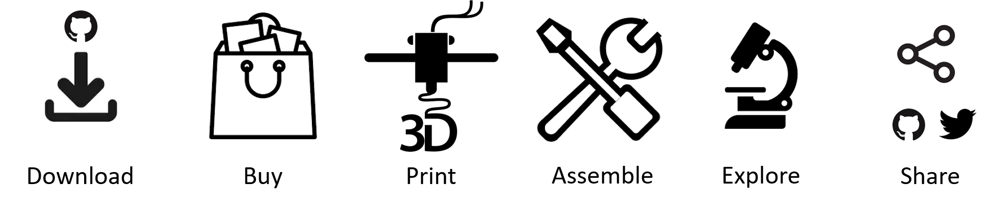
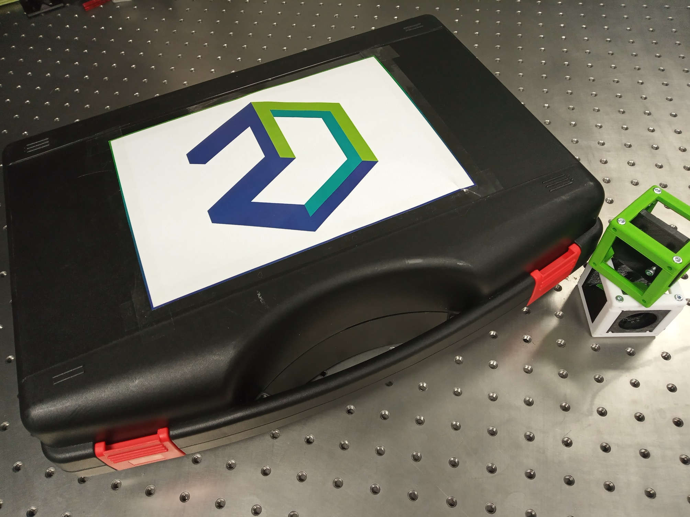
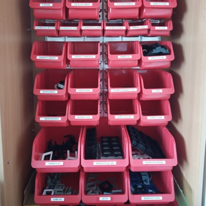
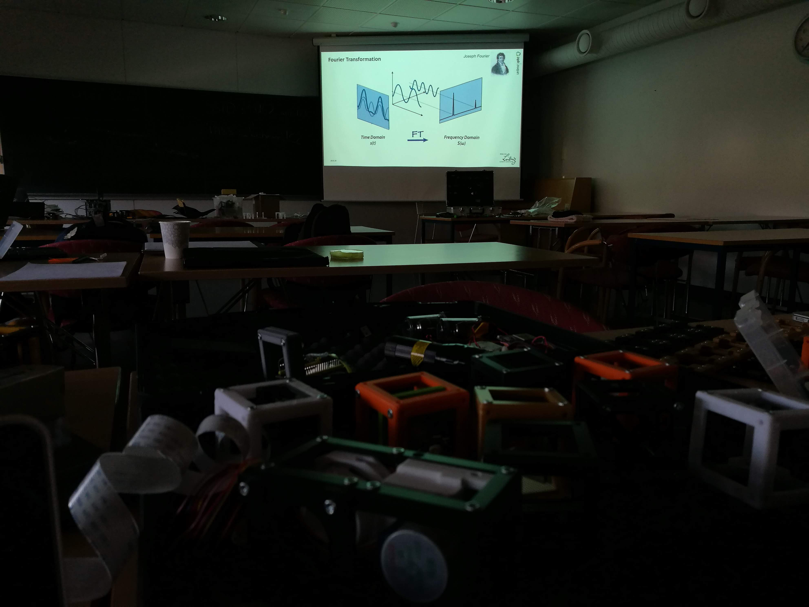
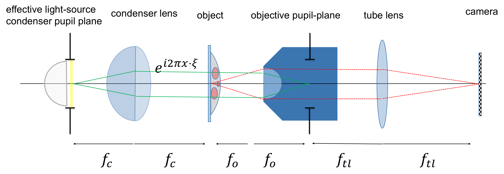
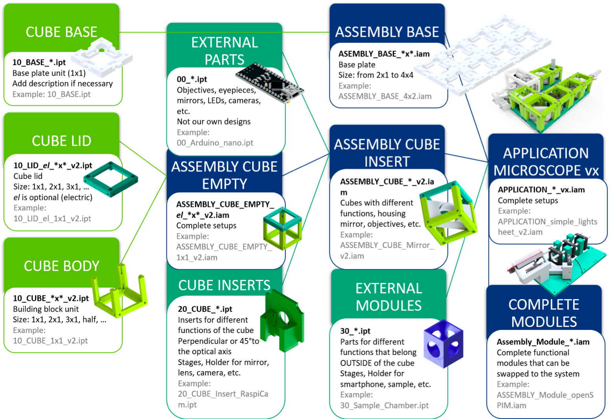
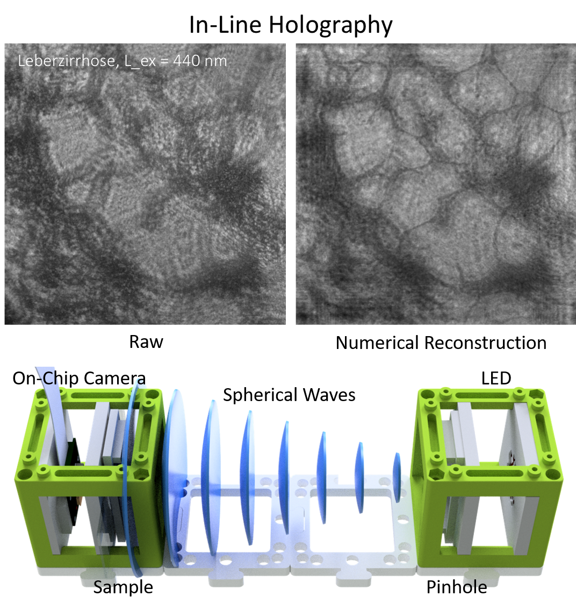
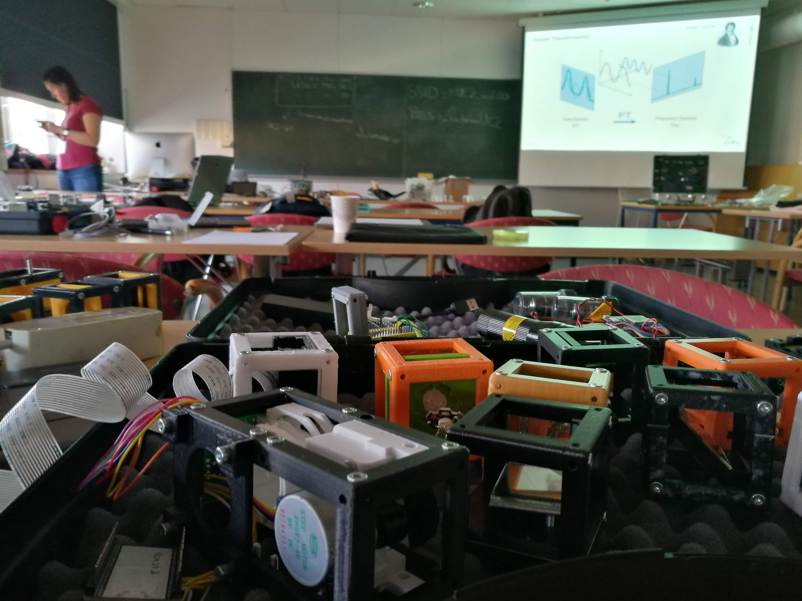

# **UC2 - Open and Modular Optical Toolbox**

---

**New**: Our new Pre-print fresh from the press is available on [Biorxiv](https://www.biorxiv.org/content/10.1101/2020.03.02.973073v1)

**New**: The COSI conference paper is out [on OSA](https://www.osapublishing.org/abstract.cfm?uri=ISA-2019-ITh3B.5)

**New:** We have a new comprehensive 2-day workshop documented in [WORKSHOP](./WORKSHOP)

  

---

# Start here! Everything is open-source - simply join!

## Steps to reproduce and use the toolbox:

## Too many new things? Follow our tutorial [ From a Beginner to a Professional](./TUTORIALS)!

## Already familiar? Click here if you are looking for...
TheBOX | General toolbox |Workshops
:------:|:------:|:------:
||
[Choose a version and build your own BOX.](./TheBOX) | [Explore the toolbox and its applications.](./CAD) | [Host or join a UC2 workshop.](./WORKSHOP)

## [Get Involved! Contribute to the project!](#get-involved)

## ... or keep on reading to learn more about the project!

---

Making **open-science** great again!

**UC2** is a general-purpose modular framework for making interactive (electro)-optical projects. Most optical systems such as microscopes follow a simple **4f** or Fourier-optical principle, where lenses are aligned such that focal-planes of adjacent components overlap to limit the amount of aberrations as much as possible and to be able to predict the system-behavior easily using Fourier-transforms.

Following this idea, a microscope as shown in **Fig 1** creates an angular magnification depending on the focal lenghts of the objective fobj and tube lens ftube:

***M4f=  ftube/fobj***

**Fig 1:** Fourier-Optical Setup; Koehler Illumination where the illumination plane is conjugate to the objective pupil plane (BFP)

Besides optical components, the **UC2** building blocks can also host electronics such as **Arduinos** or **ESP32s** to create ''smart'' functions like LED array illumination, Z-stages, et cetera. Communication can be granted through the wired **I²** BUS or the wireless **MQTT** protocol.

**UC2** is in active development. It is meant to be used not only by beginners, but also for professionals dealing with optical setups on a daily basis. Its magnetic click-and-go concept simplifies the process of aligning and adjusting the parts giving new tools acting as rapid-prototyping devices. It also comes with a series of open-source workshops (in the future) explaining the theory behind optics.

People are also encouraged to share their work. We are curious what the community is doing with our little blocks. All necessary details to modify the design of the blocks are given in the sub-folders of the specific folders. Share your ideas through our [@openUC2-Twitter account](https://twitter.com/openuc2).

A full cube + base-plate looks like that:

**Fig 2:** Assembly of the cube + base-plate; A set of ferro-magnetic screws hold the lid and base-cube in place and connect to 4 5mm NeoDym ballmagnets sitting in the base-plate; Optical components find their place inside the cube.

**UC2** can be used with cameras from the Raspberry Pi world, but creates even more beautiful images with your cellphone. Thus making cutting edge-research not only affordable, but also available.
A more in-detail project description can be found in the [UC2 White-Paper](./TUTORIALS/DOCUMENTS/UC2_Whitepaper.pdf)

## UC2 as an "open-standard"

The idea is to use **UC2** as an open-standard or bridge to external hardware components and devices such as cameras or lenses. An already existing or customized adapter/insert creates the link to the **UC2** eco-system. A variety of ready-to-use adapters can be found in the folder [CAD](./CAD).

**FIG 3:** The structure of any UC2 assembly follows the green lines; A basic cube can hold an insert thus adapting to different components (i.e. lenses, etc.); A number of assembled cube-modules can form a complex optical system here called application

A more in-detail description of the **MDK** (**M**odule **D**eveloper **K**it) which explains how ***your idea*** can be adapted to the module system can be found in the [MDK](./MDK)-folder.

If you have a new part, we are eager to see it. Please feel free to share it on available resources like Twitter, Thingiverse, Github or any other platform of choice!

## List of available Setups

Our goal is to make as many setups as possible available, so that people can play with it. Basically everything's possible, you just need to think in blocks! Please go to the [CAD](./CAD/Readme.md)-folder to have the updated version of the list below.

### Compilations

* [**THE**Box: Concept of a ready-to-use box containing multiple setups at once](./TheBOX/)
* [**SIMPLE**Box: Optical setups for elementary- to high-schools ](./TheBOX/SimpleBOX)
* [**FULL**Box: Optical setups for high-schools to universities (contains electronics)](./TheBOX/FullBOX)
* [**CORE**Box: Optical setups for Optics and Microscopy courses](./TheBOX/CoreBOX)

### SIMPLE Setups
* [*SIMPLE* - Projector](./CAD/APP_SIMPLE-Projector)
* [*SIMPLE* - Telescope](./CAD/APP_SIMPLE-Telescope)
* [*SIMPLE* - Smartphone Microscope](./CAD/APP_SMARTPHONE_MICROSCOPE)

### BASIC Setups
* [In-Incubator Microscope with X/Y/Z-control and adaptive illumination](./CAD/APP_Incubator_Microscope)
* [Light-Sheet Microscope](./CAD/APP_LIGHTSHEET_Workshop)
* [In-Line Holographical Microscope](./CAD/APP_INLINE_HOLOGRAM)
* [Abbe Experiment (Diffraction-effect of light)](./CAD/APP_Abbe_Setup)
* [Michelson interferometer (Interference-effect of light)](./CAD/APP_Michelson_Interferometer)
* [Mach Zehnder interferometer (Interference-effect of light)](./CAD/APP_Mach-Zehnder_Interferometer)
* [Double Slit Experiment (Interference-effect of light)](./CAD/APP_Double-slit_Experiment)

### COMPLEX Setups
* [*openSIM* - Structured Illumination Microscopy (2-Beam Interference Super-Resolution)](./CAD/APP_openSIM)
* [*openISM* - Image Scanning Microscopy (Confocal or Super-confocal imaging)](./CAD/APP_openISM)
* [*openKOEHLER* - Phase Contrast enhancement using an adaptive Koehler illumination](./CAD/APP_openKOEHLER)

## Repositories

Currently, **UC2** consists of the following repositories:

 - [UC2 Hardware Repo (core)](https://github.com/bionanoimaging/UC2-GIT/) (this repository)
 - [UC2 Software Control Repo](https://github.com/bionanoimaging/UC2-Software-GIT)
 - [UC2+ImJoy Image Processing Repo](https://github.com/bionanoimaging/UC2-ImJoy-Plugins)

## SOFTWARE

There is a new Software repository dedicated for the UC2 stuff. It can be found [here](https://github.com/bionanoimaging/UC2-Software-GIT).
It supports you with controler APPS for the Raspberry Pi and Android Cellphones.

### Modify the UC2 design-files

The basic cube can directly be printed using the [STL](./CAD/ASSEMBLY_CUBE_Base_v2/STL)-files or imported in Autodesk's Inventor/Fusion360. Therefor we wrote a little tutorial which can be found [here](./CAD/ASSEMBLY_CUBE_Base_v2).
A video is coming soon!

A quick tutorial where you find a guide on how an inlet could look like can be found here: [Guide to design a customized function](./TUTORIALS/DOCUMENTS/TUTORIALS/TUT_Basic_Design_Cube_Inlet_Function_v0.pdf).

### Workshops

The documented workshops can be found in the folder [WORKSHOP](./WORKSHOP) and give a step-by-step introduction into the system. We have done multiple workshops together with the HHMI Janelia Farm, UiO Oslo, Lichtwerkstatt Jena and Leibniz IPHT Jena e.V. If you're interested we are happy to host one near you.

### Bill of Material

All the parts are from typical distributors like Amazon, Alibaba, Ebay, etc. to provide an easy-to-build solution not relying on special components. The project is heavily benefiting from the wide variety and availability of components brought up by the open-source community.

Recent lists can be found [here](https://github.com/bionanoimaging/UC2-GIT/tree/master/DOCUMENTS). It includes shops for the low-cost components we use in our setups as well as the List of all parts for the Boxes.

The [GoogleDrive Spreadsheet](https://docs.google.com/spreadsheets/d/1U1MndGKRCs0LKE5W8VGreCv9DJbQVQv7O6kgLlB6ZmE/edit?usp=sharing) is an always up-to-date version of the list.

## Get Involved

This project is open so that anyone can get involved. You don't even have to learn CAD designing or programming. Ways you can contribute include:

* **Firstly, have a look into the [Contributor guidelines](.TUTORIALS)**
* General / Documentation
  * Share your results - setups you've built or things you've seen with them - on Twitter using [#openUc2](https://twitter.com/search?q=%23openUc2&src=typed_query)
  * Get involved in discussions in the [ISSUE-section](https://github.com/bionanoimaging/UC2-GIT/issues).
  * Raise an issue if you spot something that's wrong, or something that could be improved. This includes the instructions/documentation.
  * Suggest better text or images for the instructions.
  * Fork it, and make pull requests - documentation improvements are every bit as useful as a new design or software improvement.
* Hardware / Design
  * We support you with the basic CAD design files, so that you can develop specific hardware-function which can fit in our cubes.
  * We provide a brief tutorial on how to design an insert which adapts any part to the UC2 system. Please find it [here](./CAD/ASSEMBLY_CUBE_Base_v2/#tutorial-on-how-to-design-an-insert-in-inventor) on how to design an insert in Inventor.
  * Improve the design of parts STL files or descriptions of changes are helpful, even if you don't use OpenSCAD or Inventor.
* Software
  * Our software-oriented [UC2-SOFTWARE-GIT](https://github.com/bionanoimaging/UC2-Software-GIT) provides you with all the different programs that you need to automate your blocks.
  * Run our GUI on [RasPi](https://github.com/bionanoimaging/UC2-Software-GIT/tree/master/GUI/RASPBERRY_PI/RASPIapp_py3) or [Android-Phone](https://github.com/bionanoimaging/UC2-Software-GIT/tree/master/GUI/Android/UC2-TheBox).
  * Setup your [Arduino](https://github.com/bionanoimaging/UC2-Software-GIT/tree/master/HARDWARE_CONTROL/ARDUINO) or [ESP32](https://github.com/bionanoimaging/UC2-Software-GIT/tree/master/HARDWARE_CONTROL/ESP32).
  * We want to generalize our Software to even integrate more with community standards and have an overall compatibility with different Operating Systems. Get **INVOLVED** by:
    * switching to a new browser-based GUI
	* improving our MQTT based connection routines and trying to improve the necessary hardware-flashes
	* adding totally unknown functions
	* making our Software as modular as possible
* Things in need of attention are currently described in issues so have a look there if you'd like to work on something but aren't sure what.

REMARK: All files have been designed using Autodesk Inventor 2019 (EDUCATION)

## Kits, License and Collaboration
----- THIS SECTION NEEDS REVISION -------
This project is open-source and is released under the CERN open hardware license. Our aim is to make the kits commercially available.
We encourage everyone who is using our Toolbox to share their results and ideas, so that the Toolbox keeps improving. It should serve as a easy-to-use and easy-to-access general purpose building block solution for the area of STEAM education. All the design files are general for free, but we would like to hear how it is going.

You're free to fork the project and enhance it. If you have any suggestions to improve it or add any additional functions make a pull-request or file an issue.

Please find the type of licenses [here](./LICENSE.md)

## Showcase

This is the mess you can end up during Fourier-optics session using UC2 components. Pure-fun! :-)

## Credits
If you find this project useful, please like this repository and cite the webpage! :-)

*B. Diederich, R. Lachmann, B. Marsikova, E. Bingöl, S. Carlstedt, X. Uwurukundo, H. Wang, R. Heintzmann, Lichtwerkstatt, IPHT Jena, HHMI Janelia Farm, UiO Oslo, NorMic  and many more*
