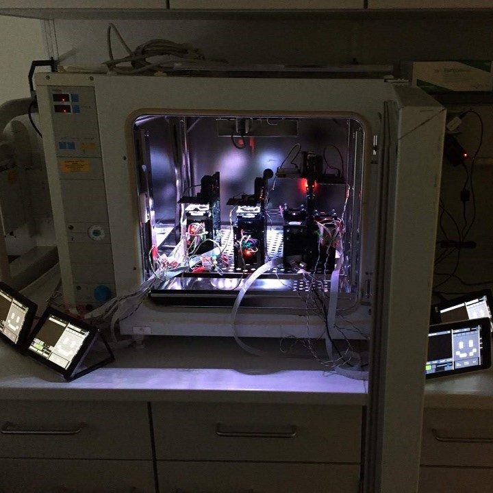
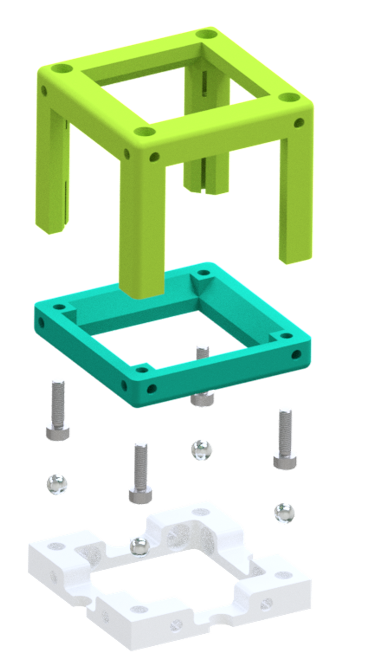

# **UC2 - Open and Modular Optical Toolbox**

---
**New**: The [Lens Holder](./CAD/ASSEMBLY_CUBE_Lens_v2) works now for lenses with the diameter up to 50 mm!

**New**: New module: [Rectangular Aperture](./CAD/ASSEMBLY_CUBE_Aperture_Rectangular_v2); Simpler and better modules: [Mechanical Z-stage](./CAD/ASSEMBLY_CUBE_Z-STAGE_mechanical_v2), [Sample-stage for light sheet microscope](./CAD/ASSEMBLY_CUBE_S-STAGE_new_v2), [Magnetic Sample Holder](./CAD/ASSEMBLY_CUBE_Sample_Holder_v2) and [openSCAD Lens Holder](./CAD/ASSEMBLY_CUBE_Lens_v2)

**New**: Our new Pre-print fresh from the press is available on [Biorxiv](https://www.biorxiv.org/content/10.1101/2020.03.02.973073v1)

      

---

#  Start here! Everything is open-source - simply join!

## Steps to reproduce and use the toolbox:

 

## Too many new things? Follow our tutorials [ From a Beginner to a Professional](./TUTORIALS)!

## Already familiar? Click here if you are looking for...
TheBOX | General toolbox  | Specific setup |Workshops
:------:|:------:|:------:|:------:
|||
[Choose a version and build your own BOX.](./TheBOX) | [Explore the toolbox and its applications.](./CAD) | [Alternatives for many Microscopy methods... and more.](./APPLICATIONS) | [Host or join a UC2 workshop.](./WORKSHOP)

## [Get Involved! Contribute to the project!](CONTRIBUTING.md)

## ... or keep on reading to learn more!

---

## Making **open-science** great again!

**UC2** is a general-purpose modular framework for making interactive (electro)-optical projects. Most optical systems such as microscopes follow a simple **4f** or Fourier-optical principle, where lenses are aligned such that focal-planes of adjacent components overlap to limit the amount of aberrations as much as possible and to be able to predict the system-behavior easily using Fourier-transforms.

Following this idea, a microscope as shown in **Fig 1** creates an angular magnification depending on the focal lenghts of the objective fobj and tube lens ftube:

***M4f=  ftube/fobj***

  Fig. 1: Fourier-Optical Setup; Koehler Illumination where the illumination plane is conjugate to the objective pupil plane (BFP)

Besides optical components, the **UC2** building blocks can also host electronics such as **Arduinos** or **ESP32s** to create ''smart'' functions like LED array illumination, Z-stages, et cetera. Communication can be granted through the wired **I²** BUS or the wireless **MQTT** protocol.

**UC2** is in active development. It is meant to be used not only by beginners, but also for professionals dealing with optical setups on a daily basis. Its magnetic click-and-go concept simplifies the process of aligning and adjusting the parts giving new tools acting as rapid-prototyping devices. It also comes with a series of open-source workshops (in the future) explaining the theory behind optics.

People are also encouraged to share their work. We are curious what the community is doing with our little blocks. All necessary details to modify the design of the blocks are given in the sub-folders of the specific folders. Share your ideas through our [@openUC2-Twitter account](https://twitter.com/openuc2).

A full cube + base-plate looks like that:

  Fig. 2: Assembly of the cube + base-plate; A set of ferro-magnetic screws hold the lid and base-cube in place and connect to four 5mm Neodym ballmagnets sitting in the base-plate; Optical components find their place inside the cube.

**UC2** can be used with cameras from the Raspberry Pi world, but creates even more beautiful images with your cellphone. Thus making cutting edge-research not only affordable, but also available.
A more in-detail project description can be found in the [UC2 White-Paper](./TUTORIALS/DOCUMENTS/UC2_Whitepaper.pdf)

## UC2 as an "open-standard"

The idea is to use **UC2** as an open-standard or bridge to external hardware components and devices such as cameras or lenses. An already existing or customized adapter/insert creates the link to the **UC2** eco-system. A variety of ready-to-use adapters can be found in the folder [CAD](./CAD).

  Fig. 3: The structure of any UC2 assembly follows the green lines; A basic cube can hold an insert thus adapting to different components (i.e. lenses, etc.); A number of assembled cube-modules can form a complex optical system here called application

A more in-detail description of the **MDK** (**M**odular **D**eveloper **K**it) which explains how ***your idea*** can be adapted to the module system can be found in the [MDK](./MDK)-folder.

If you have a new part, we are eager to see it. Please feel free to share it on available websites like Twitter, Thingiverse, Github or any other platform of choice!

### Read more about the project in our papers:
Our new Pre-print  is available on [Biorxiv](https://www.biorxiv.org/content/10.1101/2020.03.02.973073v1)    
The COSI conference paper is out on [OSA](https://www.osapublishing.org/abstract.cfm?uri=ISA-2019-ITh3B.5)  

Where next? 

### Complete overview of setups, modules, parts to buy and parts to print
Find a complete shopping'n'printing list including estimated prices for all modules and setups in this [BILL OF MATERIALS](https://docs.google.com/spreadsheets/d/1U1MndGKRCs0LKE5W8VGreCv9DJbQVQv7O6kgLlB6ZmE/edit?usp=sharing)!

### List of available Setups

Our goal is to make as many setups as possible available, so that people can play with it. Basically everything's possible, you just need to think in blocks! Please have a look in the [APPLICATIONS](./APPLICATIONS/Readme.md) folder for the up to date list of the setups.

  Fig. 4: In-line holographic microscope

### Repositories

Currently, **UC2** consists of the following repositories:

 - [UC2 Hardware Repo (core)](https://github.com/bionanoimaging/UC2-GIT/) (this repository) - [SITEMAP](./SITEMAP.md)
 - [UC2 Software Control Repo](https://github.com/bionanoimaging/UC2-Software-GIT)
 - [UC2+ImJoy Image Processing Repo](https://github.com/bionanoimaging/UC2-ImJoy-Plugins)

### Software

There is a GitHub repository dedicated for the UC2 software. It can be found [here](https://github.com/bionanoimaging/UC2-Software-GIT).
It supports you with controller APPS for the Raspberry Pi and Android Cellphones.

### Workshops

The documented workshops can be found in the folder [WORKSHOP](./WORKSHOP) and give a step-by-step introduction into the system. We have done multiple workshops together with the HHMI Janelia Farm, UiO Oslo, Lichtwerkstatt Jena and Leibniz IPHT Jena e.V.  
If you're interested we are happy to host one near you!

## Get Involved

This project is open so that anyone can get involved. You don't even have to learn CAD designing or programming. Find ways you can contribute in  [CONTRIBUTING](CONTRIBUTING.md)

## Kits, License and Collaboration

This project is open-source and is released under the CERN open hardware license. Our aim is to make the kits commercially available.
We encourage everyone who is using our Toolbox to share their results and ideas, so that the Toolbox keeps improving. It should serve as a easy-to-use and easy-to-access general purpose building block solution for the area of STEAM education. All the design files are generally for free, but we would like to hear from you how is it going.

You're free to fork the project and enhance it. If you have any suggestions to improve it or add any additional functions make a pull-request or file an issue.

Please find the type of licenses [here](./License.md)

REMARK: All files have been designed using Autodesk Inventor 2019 (EDUCATION)

## Showcase

This is the mess you can end up during Fourier-optics session using UC2 components. Pure-fun! :-)

## Credits
If you find this project useful, please like this repository, follow us on Twitter and cite the webpage! :-)

*B. Diederich, R. Lachmann, B. Marsikova, E. Bingöl, S. Carlstedt, X. Uwurukundo, H. Wang, R. Heintzmann, Lichtwerkstatt, IPHT Jena, HHMI Janelia Farm, UiO Oslo, NorMic  and many more*
