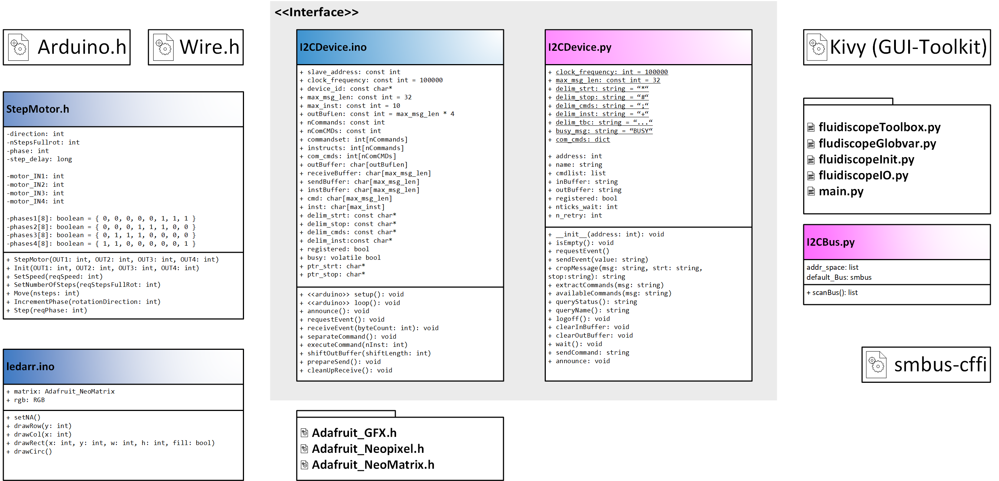

# Tutorial I2C for Arduino+Raspi 

Here we describe stuff


## Preparation 
1. Install Arduino IDE 
2. Install the libraries from the library folder
3. Flash the Arduino with an ```.ino```-File
4. Enable ``Ì2C```on the raspberry Pi
5. Connect the Arduino to the Raspi via ***I2C***
6. Execute the ```I2CExample.py```file by calling ```python I2CExample.py``` from the terminal on the Pi

## Files 
In the folder [./PYTHON](./PYTHON) you'll find the following files:

- ```I2CBus.py``` - Description
- ```I2CDevice.py``` - Description
- ```I2CExample.py``` - Example file to control **XXX**

In the folder [./ARDUINO](./ARDUINO) you'll find the following files in there folders:

- ```fluo_and_motor.ino``` - Description
- ```ledarr.ino``` - Description
- ```motors.ino``` - Description
- ```libraries``` - Copy to your Arduino IDE library-folder  to install the stuff


## Sending a customized code 
To send an arbitrary code over ```Ì2C``` use you can use the following commands: ```I2CDevice.sendCommand```or ```I2CDevice.send```in a Python file. 

Für den Fall, dass du auch die Formatierung (start-, stop-signal, usw.) weglassen möchtest
brauchst du die folgenden Zeilen und musst (nur) I2CBus.py in den gleichen Ordner kopieren und importieren 

```
===========

from I2CBus import I2CBus

slave_adresse = 0x07
deine_nachricht = "irgendeine nachricht"
 
deine_byte_nachrichht = [ord(x) for x in deine_nachricht]
I2CBus.defaultBus.write_i2c_block_data(slave_adresse, 1, deine_byte_nachricht)

=============
```

Das sollte es sein. Obiger code ist jetz nicht als lauffähig getestet. Aber nahezu identisch mit der Funktion I2CDevice.sendEvent.)


## Class Diagram
<p align="center">

</p>


## Raspi - Arduino Communication
<p align="center">

</p>


Further information can be found in this document: [WORD](./IMAGES/QuickStartGuide_I2C.docx).

