# Building The CourseBOX

This is a guide for building the [CourseBOX](../CourseBOX). If you were looking for another BOX version, [click here](../../).

This guide currently describes how to build both the [finite-corrected version](#finite-corrected-optics) and the [infinity version](#inifinity-optics) of the CourseBOX.

### Content of each section
1. Shopping
1. 3D printing
1. Tools
1. Assembly

# Infinity Optics

* Total price: 230 € without a Raspberry Pi (190 €)
* Printing time including preparation: 4 days
* Assembly time: 1 day

##  Shopping
### What to buy

Link - name of part             |  Amount |  Comment | Price
  :-------------------------:|:----------------------------:|:-------------------------:|:-------------------------:
  3D printing material|~580 g| Choose material that works with your 3D printer. If unsure, have a look at the guide in [3D printing section](#3d-printing)|15 €
  [Lens 50 mm](https://www.thorlabs.com/thorproduct.cfm?partnumber=LA1131)  |  5 pieces ||á 21 €
  [Lens 100 mm](https://optikbaukasten.de/)  |  3 pieces |Artikel 2004|á 6 €
  [Lens for Eye Cube](https://optikbaukasten.de/)  |  1 piece |Artikel 2002|á 5 €
  [Beamsplitter](https://optikbaukasten.de/)  |  1 piece |Artikel 2137|á 27 €
  [Flashlight](https://www.pollin.de/p/led-taschenlampe-alu-5-w-cree-led-3xmicro-schwarz-b-ware-535448)  |  1 piece | Light source for microscope.|á 7 €
  [Laser Pointer](https://www.conrad.de/de/p/ansmann-laserpointer-2in1-reichweite-max-im-freifeld-50-m-2162622.html)  |  1 piece | Light source for the Abbe experiment. With this very one you don't even need the flashlight. More information below.|á 5 €
  [Magnets](https://www.magnetladen.de/kugelmagnet-5-mm-n42-nickel/)  |  80 pieces | Ball magnets, diameter 5 mm.|25 €
  [Screws](https://eshop.wuerth.de/Zylinderschraube-mit-Innensechskant-SHR-ZYL-ISO4762-88-IS25-A2K-M3X12/00843%20%2012.sku/de/DE/EUR/) |   ~150 pieces | M3×12, galvanized steel - ~72  pieces; (optional M3×8, galvanized steel - ~72 pieces); M3×18, galvanized steel - 4 pieces; M2*12 screws with nuts - 6  pieces | ~15 €
  Raspberry Pi with accessories ||Have a look in our [Bill-of-Materials](https://docs.google.com/spreadsheets/d/1U1MndGKRCs0LKE5W8VGreCv9DJbQVQv7O6kgLlB6ZmE/edit?usp=sharing) for a complete list and links. | 190 €
  [Chocolate](https://www.milka.de/produkte/milka-standard-tafeln/milka-wei%c3%9fe-schokolade?p=137&provider={D193998A-4A6D-4EA5-BAA8-209357B27A09}&categoryId=1395)|1 bar| Use it as a reward when you're done.

* Check out the [RESOURCES](../../../TUTORIALS/RESOURCES) for more information!

#### 2 in 1 light source
We propose the use of this [Laser Pointer](https://www.conrad.de/de/p/ansmann-laserpointer-2in1-reichweite-max-im-freifeld-50-m-2162622.html), because it also has a white LED. But we need to smartly adapt this for our experiments.
* For beam expansion of the laser light, print a laser cap from the STL folder and put in it the RasPi lens that you removed from the camera
* The LED here has a lens which cannot be removed. To be able to find a focussed image of your light source, take a thin permanent marker and make a cross on the surface of this lens. Now you'll be able to see a focussed image of the cross in the Field set of Aperture planes

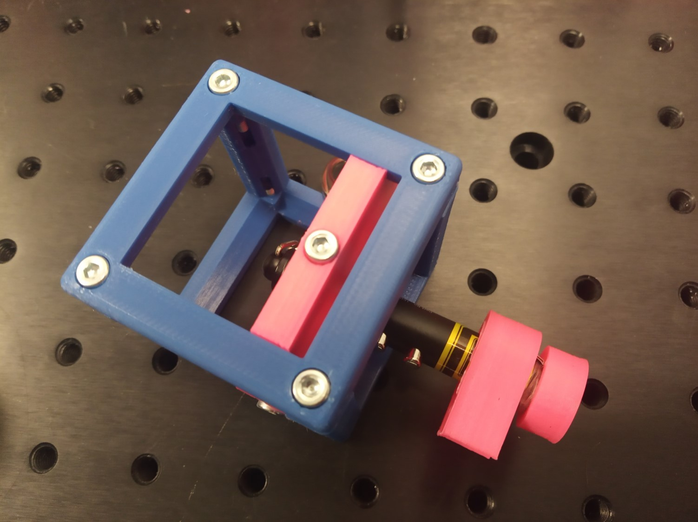
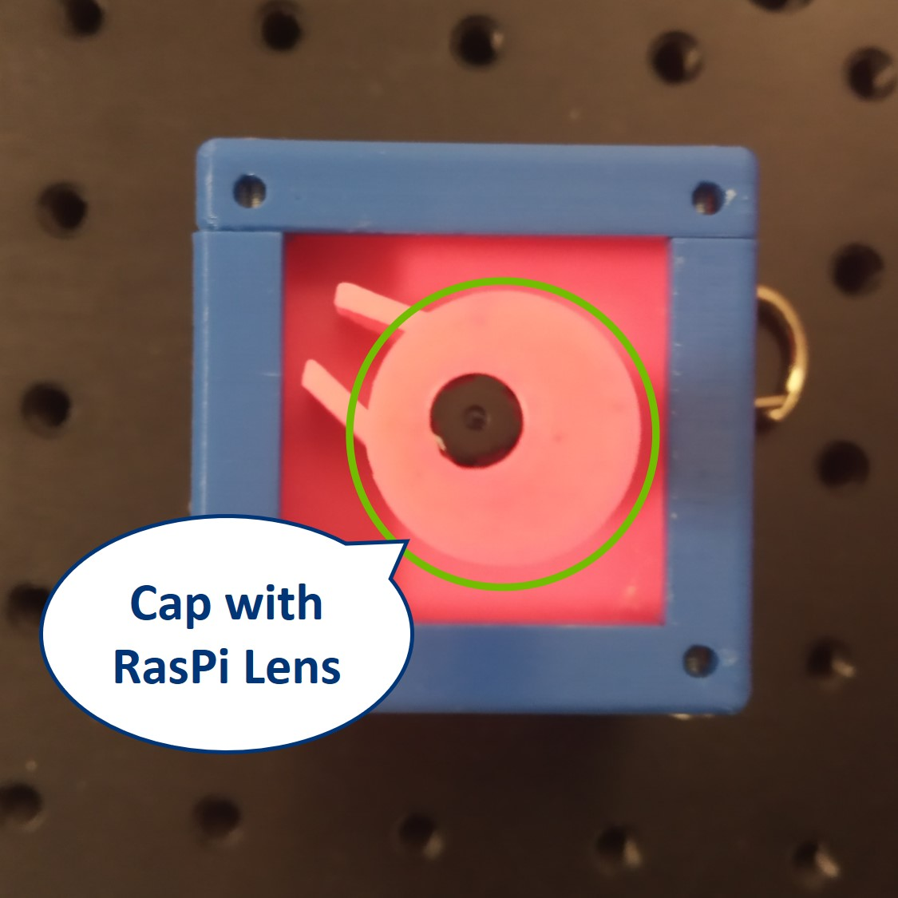
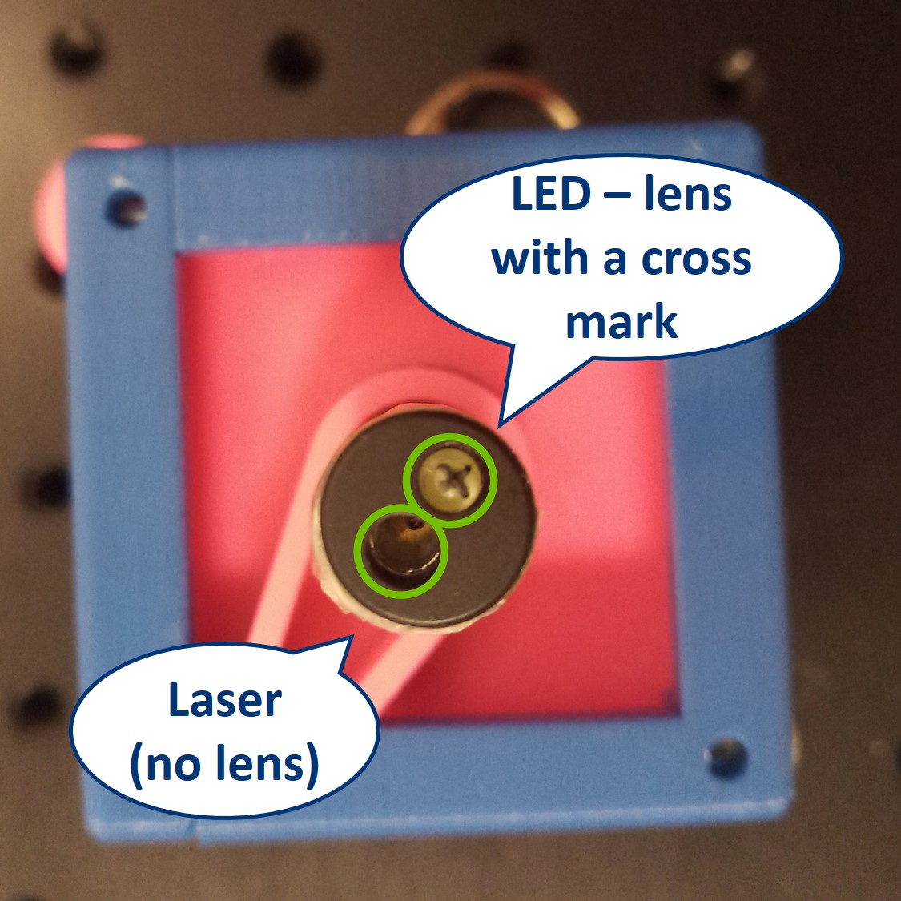

##  3D Printing:

Completely new to 3D printing? Have a look into this [beginner's guide](https://www.makeuseof.com/tag/beginners-guide-3d-printing/)!

Our quick printing tutorial can be found here:

We have a good experience with this printer and settings:
* Prusa i3/MK3S
  * Prusament PLA 1,75 mm, for one Box: 0,58 kg = 195 m = 90 hours = 15 €
  * Profile Optimal 0,15 mm, infill 20%, no support, 215/60°C

###   Housing
Name of part - Link to STL file             |  Amount
:-------------------------:|:----------------------------:
[(03) Basic Cube 1×1](./STL/03_10_Cube_1x1_v2.stl)  |  18 pieces
[(04) Basic Lid 1×1](./STL/04_10_Lid_1x1_v2.stl)  |  18 pieces
[(05) Baseplate 4×1](./STL/05_Assembly_base_4x1.stl)  |  5 pieces

###  Inserts

Name of part - Link to STL file            |  Amount |  Comment
:-------------------------:|:-------------------------:|:-------------------------:
[Lens Holder with Clamp](https://www.thingiverse.com/thing:4377691)  |  8 pieces | Generate and STL for the lenses you have at hand usng our lens holder in Thingiverse Customizer.
[(16) Generic Sample Holder](./STL/16_20_Cube_insert_Sample_holder.stl)  |  2 pieces | To hold the sample and the screen.
[(17) Generic Sample Holder Clamp](./STL/17_20_Cube_Insert_Sample_clamp.stl)  |  2 pieces |
[(19) Flashlight Holder](./STL/19_20_Cube_Insert_Flashlight_Holder.stl)  |  1 pieces |
[(20) Circular Aperture Guide](./STL/20_20_Cube_Insert_CirAp_Guide.stl)  |  2 pieces |
[(21) Circular Aperture Wheel](./STL/21_20_Cube_Insert_CirAp_Wheel.stl)  |  2 pieces |
[(22) Circular Aperture Lid](./STL/22_20_Cube_Insert_CirAp_Lid.stl)  |  2 pieces |
[(23) Circular Aperture Leaf](./STL/23_20_Cube_Insert_CirAp_Leaf1.stl)  |  14 pieces |7 leaves per aperture
[(28) Beamsplitter Insert](./STL/28_20_Cube_Insert_Beamsplitter.stl)  |  1 piece |
[(29) Rectangular Aperture Insert](./STL/29_20_Cube_Insert_RectAp_v2.stl)  |  1 piece |
[(30) Rectangular Aperture Door Hinge](./STL/30_20_Rect_Aperture_door_hinge.stl)  |  4 pieces |
[(31) Rectangular Aperture Door Slide](./STL/31_20_Rect_Aperture_door_slide.stl)  |  4 pieces |
[(32) Eyeball Insert](./STL/32_Assembly_Cube_Eyeball_v2_20_Cube_Insert_Eye_1.stl)  |  1 piece |optional
[(33) Eyeball Lens Insert](./STL/33_Assembly_Cube_Eyeball_v2_20_Cube_Insert_Eye_Lens_2.stl)  |  1 piece |optional
[(34) RasPi Camera Insert](./STL/34_20_Cube_Insert_RaspiCam.stl)  |  1 piece |
[(35) Laser Holder](./STL/35_20_Cube_Insert_Laser_Holder_fixed_v2.stl)  |  1 pieces |
[(36) Laser Clamp](./STL/36_00_Laser_Clamp_OnOffSwitch_thin.stl)  |  1 piece |
[(37) Laser RasPi Lens Cap](./STL/37_30_raspi_lens_to_laser_2in1.stl)  |  1 piece |
[(38) Alignment Tool](./STL/38_30_alignment_template.stl)  |  1 piece | Optional but useful!

##  Which tools to use
Tool             |  Image|  Comment
:-------------------------:|:----------------------------:|:-------------------------:
[Electric screw driver with 2,5 mm hex bit](https://www.amazon.de/Bosch-Akkuschrauber-Generation-Bits-Ladeger%C3%A4t/dp/B00TTZU566/ref=asc_df_B00TTZU566/?tag=googshopde-21&linkCode=df0&hvadid=255989693737&hvpos=1o1&hvnetw=g&hvrand=6125749874385941808&hvpone=&hvptwo=&hvqmt=&hvdev=c&hvdvcmdl=&hvlocint=&hvlocphy=9042960&hvtargid=pla-421346020200&psc=1&th=1&psc=1) | | For putting the cubes together using M3×12 and M3×8 screws.
[2,5 mm hex key](https://www.amazon.de/Presch-Innensechskant-Satz-Kugelkopf-Innensechskantschl%C3%BCssel/dp/B079V335CR/ref=sr_1_2_sspa?__mk_de_DE=%C3%85M%C3%85%C5%BD%C3%95%C3%91&crid=2K89GU3MY8P26&keywords=hex+key+set&qid=1575997133&s=diy&sprefix=hex+%2Cdiy%2C160&sr=1-2-spons&psc=1&spLa=ZW5jcnlwdGVkUXVhbGlmaWVyPUEzRENMU0hKWkJRR0FEJmVuY3J5cHRlZElkPUEwMDIzMjIyMzFBWVIyOEpORU1FSCZlbmNyeXB0ZWRBZElkPUEwMzk0NjQwMlA0NFZDTVk0Tk9LUSZ3aWRnZXROYW1lPXNwX2F0ZiZhY3Rpb249Y2xpY2tSZWRpcmVjdCZkb05vdExvZ0NsaWNrPXRydWU=) | [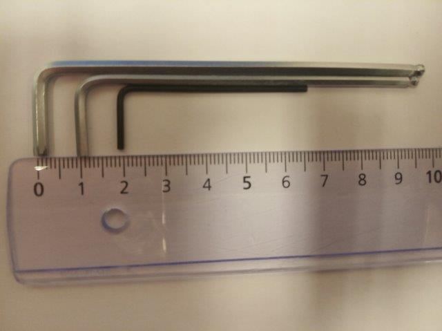](https://www.amazon.de/Presch-Innensechskant-Satz-Kugelkopf-Innensechskantschl%C3%BCssel/dp/B079V335CR/ref=sr_1_2_sspa?__mk_de_DE=%C3%85M%C3%85%C5%BD%C3%95%C3%91&crid=2K89GU3MY8P26&keywords=hex+key+set&qid=1575997133&s=diy&sprefix=hex+%2Cdiy%2C160&sr=1-2-spons&psc=1&spLa=ZW5jcnlwdGVkUXVhbGlmaWVyPUEzRENMU0hKWkJRR0FEJmVuY3J5cHRlZElkPUEwMDIzMjIyMzFBWVIyOEpORU1FSCZlbmNyeXB0ZWRBZElkPUEwMzk0NjQwMlA0NFZDTVk0Tk9LUSZ3aWRnZXROYW1lPXNwX2F0ZiZhY3Rpb249Y2xpY2tSZWRpcmVjdCZkb05vdExvZ0NsaWNrPXRydWU=)| For fine adjustment of all the M3 screws if needed.
[Needle-nose Pliers](https://www.amazon.de/Br%C3%BCder-Mannesmann-Telefonzange-gerade-M10948/dp/B003A63EIG/ref=sr_1_3?__mk_de_DE=%C3%85M%C3%85%C5%BD%C3%95%C3%91&keywords=needle+nose+pliers&qid=1575997091&s=diy&sr=1-3) |[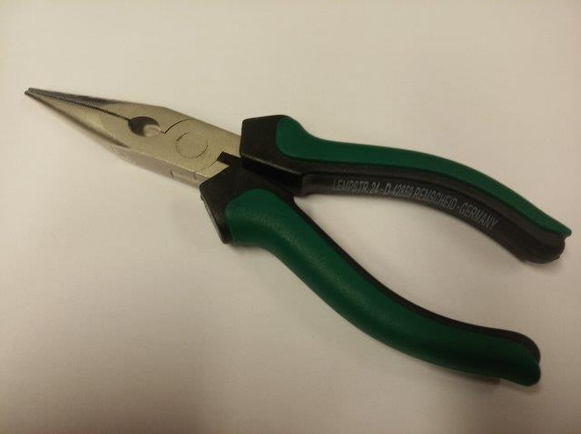](https://www.amazon.de/Br%C3%BCder-Mannesmann-Telefonzange-gerade-M10948/dp/B003A63EIG/ref=sr_1_3?__mk_de_DE=%C3%85M%C3%85%C5%BD%C3%95%C3%91&keywords=needle+nose+pliers&qid=1575997091&s=diy&sr=1-3) | Might come handy

##   Assembly
Part - link             |  Result|  Comment
:-------------------------:|:----------------------------:|:-------------------------:
[Baseplates](../../../CAD/ASSEMBLY_Baseplate_v2)|[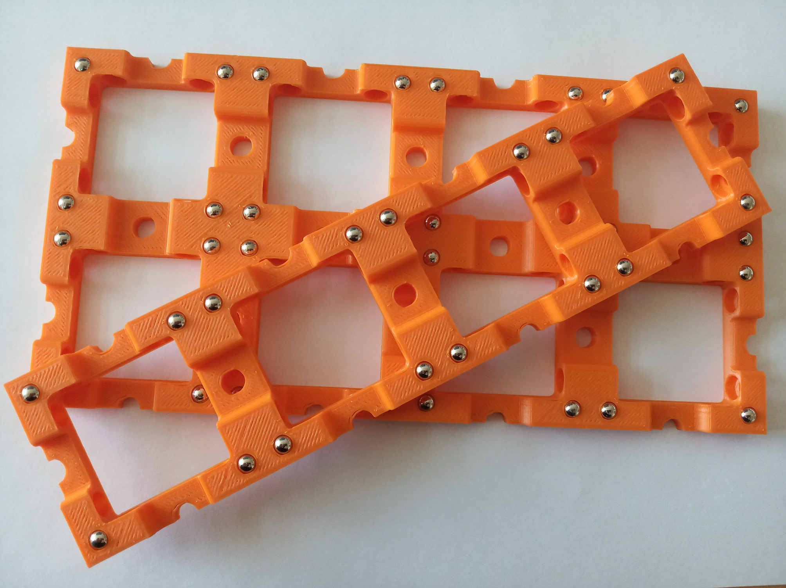](../../../CAD/ASSEMBLY_Baseplate_v2)|5× baseplate (4×1)
[Lens Cubes](../../../CAD/ASSEMBLY_CUBE_Lens_v2)|[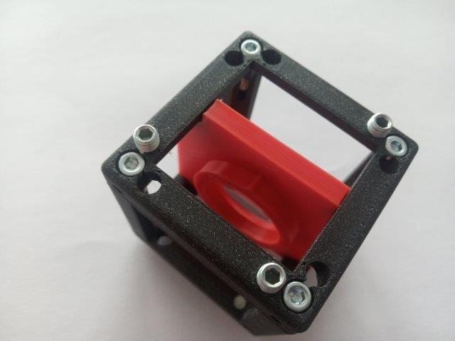](../../../CAD/ASSEMBLY_CUBE_Lens_v2)| 8× Lens Cube: 5× Lens Cube with 50 mm lens; 3× Lens Cube with 100 mm lens. You can write the focal lengths on the inserts of print the housing is different colours to distinguish between them, so you can always easily find the right one when building the setups.
[Sample Cubes](../../../CAD/ASSEMBLY_CUBE_Sample_Holder_v2)||2× Sample Holder Cube
[Flashlight Cube](../../../CAD/ASSEMBLY_Lens_v2)|| 1× Flashlight Cube
[Circular Aperture Cube](../../../CAD/ASSEMBLY_CUBE_Aperture_Circular_v2)|[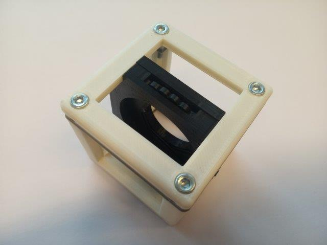](../../../CAD/ASSEMBLY_CUBE_Aperture_Circular_v2)|2× Circular Aperture Cube
[Rectangular Aperture Cube](../../../CAD/ASSEMBLY_CUBE_Aperture_Rectangular_v2)|[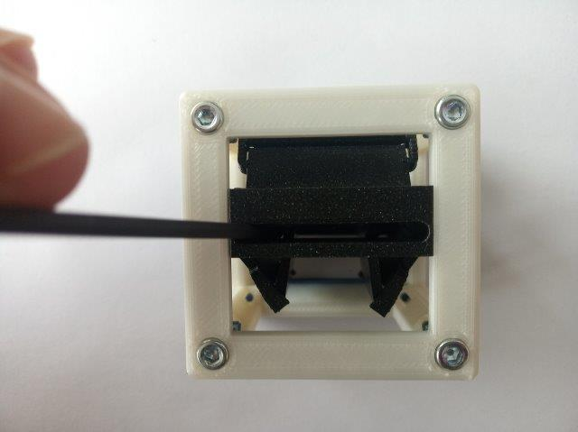](../../../CAD/ASSEMBLY_CUBE_Aperture_Rectangular_v2)|1× Rectangular Aperture Cube
[Beamsplitter Cube](../../../CAD/ASSEMBLY_CUBE_Beamsplitter_v2)|[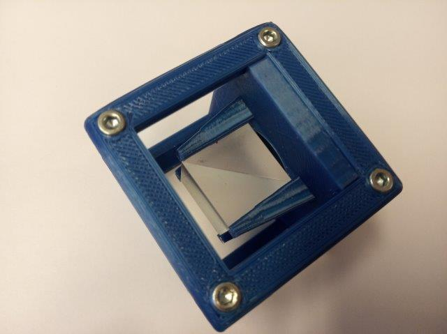](../../../CAD/ASSEMBLY_CUBE_Beamsplitter_v2)|1× Beam Expander Cube
[RasPi Camera Cube](../../../CAD/ASSEMBLY_CUBE_RaspiCam_v2)|[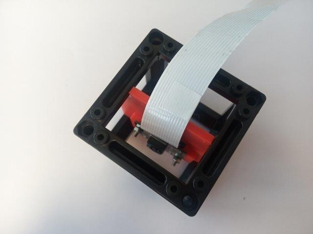](../../../CAD/ASSEMBLY_CUBE_RaspiCam_v2)|1× Camera Cube with Raspberry Pi camera with the lens removed
[Laser Cube](../../../CAD/ASSEMBLY_CUBE_Laser_v2)|[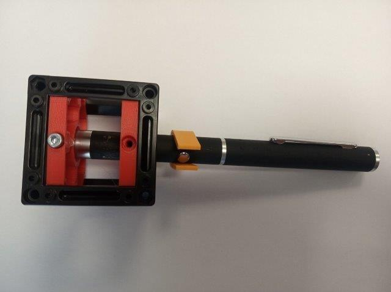](../../../CAD/ASSEMBLY_CUBE_Laser_v2)|1× Laser Holder Cube and Laser Clamp with a cap for RasPi lens
[Eye Cube](../../../CAD/ASSEMBLY_CUBE_Eyeball_v2)|[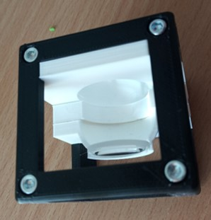](../../../CAD/ASSEMBLY_CUBE_Eyeball_v2)|optional: 1× Eyeball Cube  

##   Software
Prepare the Raspberry Pi following our [tutorial in UC2-Software-GIT](https://github.com/bionanoimaging/UC2-Software-GIT/tree/master/GUI/RASPBERRY_PI)!

##  Done! Great job!

---

# Finite-corrected Optics

* Total price: 300 €
* Printing time including preparation: 5 days
* Assembly time: 1 day

##  Shopping
### What to buy

Link - name of part             |  Amount |  Comment | Price per amount used
  :-------------------------:|:----------------------------:|:-------------------------:|:-------------------------:
  3D printing material|~620 g| Choose material that works with your 3D printer. If unsure, have a look at the guide in [3D printing section](#3d-printing)|20 €
  [Microscope objective 4×](https://de.aliexpress.com/item/32947647522.html?spm=a2g0x.search0104.3.54.6cf57a4c3DwsTO&transAbTest=ae803_3&ws_ab_test=searchweb0_0%2Csearchweb201602_6_10065_10130_10068_10890_10547_319_10546_317_10548_10545_10696_10084_453_454_10083_10618_10307_537_536_10902_10059_10884_10887_321_322_10103%2Csearchweb201603_6%2CppcSwitch_0&algo_pvid=06d972be-b176-4446-8665-56d9e61a8d2c&algo_expid=06d972be-b176-4446-8665-56d9e61a8d2c-7)  |  1 piece | | 10 €
  [Lens 35 mm](https://www.thorlabs.com/thorproduct.cfm?partnumber=LA1027)  |  1 piece |We did the alignment with lenses of these focal lengths, but other combination are also possible. The alignment principle stays the same, but the positions of the element will be different. |22 €
  [Lens 40 mm](https://www.thorlabs.com/thorproduct.cfm?partnumber=LA1422)  |  2 pieces ||44 €
  [Lens 50 mm](https://www.thorlabs.com/thorproduct.cfm?partnumber=LA1131)  |  1 piece ||21 €
  [Lens 75 mm](https://www.thorlabs.com/thorproduct.cfm?partnumber=LA1608)  |  1 piece ||20 €
  [Lens 100 mm](https://www.thorlabs.com/thorproduct.cfm?partnumber=LA1509)  |  1 piece ||20 €
  [Flashlight](https://www.pollin.de/p/led-taschenlampe-alu-5-w-cree-led-3xmicro-schwarz-b-ware-535448)  |  1 piece | Light source for the projector and microscope.|7 €
  [Magnets](https://www.magnetladen.de/kugelmagnet-5-mm-n42-nickel/)  |  128 pieces | Ball magnets, diameter 5 mm.|30 €
  [Screws](https://eshop.wuerth.de/Zylinderschraube-mit-Innensechskant-SHR-ZYL-ISO4762-88-IS25-A2K-M3X12/00843%20%2012.sku/de/DE/EUR/) |   ~120 pieces | M3×12, galvanized steel - ~90  pieces; M3×8, galvanized steel - ~90 pieces; M3×18, galvanized steel - 2 pieces; M3×30, not magnetic - 1 piece; M3 nut | ~15 €
  [Chocolate](https://www.milka.de/produkte/milka-standard-tafeln/milka-wei%c3%9fe-schokolade?p=137&provider={D193998A-4A6D-4EA5-BAA8-209357B27A09}&categoryId=1395)|1 bar| Use it as a reward when you're done.

* Check out the [RESOURCES](../../../TUTORIALS/RESOURCES) for more information!

##  3D Printing:

Completely new to 3D printing? Have a look into this [beginner's guide](https://www.makeuseof.com/tag/beginners-guide-3d-printing/)!

Our quick printing tutorial can be found here:

We have a good experience with this printer and settings:
* Prusa i3/MK3S
  * PLA 1,75 mm, for one Box: 0,6 kg = 235 m = 85 hours = 20 €
  * Profile Optimal 0,15 mm, infill 20%, no support, 215/60°C
  * [Hint](./IMAGES/prusa_printing_courseBOX.pdf)

### Note: The design of the mechanical Z-stage has recently been changed. The files here are not yet up-to-date. Please check the [Mechanical Z-stage](../../../CAD/ASSEMBLY_CUBE_Z-STAGE_mechanical_v2) for the latest version. Same applies to the Lens Holder available [here](../../../CAD/ASSEMBLY_CUBE_Lens_v2)

###   Housing
Name of part - Link to STL file             |  Amount
:-------------------------:|:----------------------------:
[(01) Basic Cube 2×1](./STL/01_10_Cube_2x1_v2.stl)  |  1 piece
[(02) Basic Lid 2×1](./STL/02_10_Lid_el_2x1_v2.stl)  |  1 piece
[(03) Basic Cube 1×1](./STL/03_10_Cube_1x1_v2.stl)  |  20 pieces
[(04) Basic Lid 1×1](./STL/04_10_Lid_1x1_v2.stl)  |  20 pieces
[(05) Baseplate 4×1](./STL/05_Assembly_base_4x1.stl)  |  4 pieces
[(06) Baseplate 4×2](./STL/06_Assembly_base_4x2.stl)  |  1 piece
[(07) Baseplate 1×1](./STL/07_10_Base_v2.stl)  |  1 piece
[(08) Baseplate Connector 1×1](./STL/08_Baseplate_Connector_v2.stl)  |  1 piece

###  Inserts

Name of part - Link to STL file            |  Amount |  Comment
:-------------------------:|:-------------------------:|:-------------------------:
[(09) Z-Stage Focusing Insert](./STL/09_20_focus_inlet_linearflexure_v0_1.stl)  |  1 piece  | Rotate the part in your slicer before printing. Always print it laying on the flat side.
[(10) Z-Stage Objective Mount](./STL/10_30_focus_inlet_objective_mount_v7_7.stl) |  1 piece   | For mounting the objective lens (RMS thread).
[(11a) Z-Stage Bottom Plate](./STL/11a_20_focus_inlet_plate_bottom_2.stl) |  1 piece   | The plate holds the gear and screw in position, allowing the only to rotate but not to wobble.
[(11b) Z-Stage Top Plate](./STL/11b_20_focus_inlet_plate_top_3.stl) |  1 piece   | The plate holds the gear and screw in position, allowing the only to rotate but not to wobble.
[(12) Z-Stage Gear](./STL/12_20_focus_inlet_gear.stl) |  1 piece   | Kindly borrowed from [openflexure](https://openflexure.org).
[(13) Lens Holder](./STL/13_1inch_Assembly_Insert_Lens_mount_fixed_20_Lens_holder.stl)  |  6 pieces | Diameter fits for the listed lenses (25 mm).
[(14) Lens Holder Clamp](./STL/14_1inch_Assembly_Insert_Lens_mount_fixed_20_Lens_holder_clamp.stl)  |  6 pieces | Diameter fits for the listed lenses (25 mm).
[(15) Cylindrical Lens Holder](./STL/15_20_Cube_Insert_Lens_Cylindrical.stl)  |  1 piece | Diameter fits for the listed lenses (25 mm).
[(16) Generic Sample Holder](./STL/16_20_Cube_insert_Sample_holder.stl)  |  5 pieces | In the SimpleBOX, it is used to hold the object in the projector setup.
[(17) Generic Sample Holder Clamp](./STL/17_20_Cube_Insert_Sample_clamp.stl)  |  5 pieces | To fix the sample.
[(18) Mirror Holder 45° 30×30mm²](./STL/18_20_Cube_Insert_Mirror_Holder_30x30Mirror_v2.stl)  |  1 piece | Size fits for the listed mirrors.
[(19) Flashlight Holder](./STL/19_20_Cube_Insert_Flashlight_Holder.stl)  |  2 pieces |
[(20) Circular Aperture Guide](./STL/20_20_Cube_Insert_CirAp_Guide.stl)  |  2 pieces |
[(21) Circular Aperture Wheel](./STL/21_20_Cube_Insert_CirAp_Wheel.stl)  |  2 pieces |
[(22) Circular Aperture Lid](./STL/22_20_Cube_Insert_CirAp_Lid.stl)  |  2 pieces |
[(23) Circular Aperture Leaf](./STL/23_20_Cube_Insert_CirAp_Leaf1.stl)  |  14 pieces |
[(24) Laser Holder](./STL/24_20_Cube_Insert_Laser_Mount.stl)  |  2 pieces |
[(25) Laser Clamp](./STL/25_00_Laser_Clamp_OnOffSwitch.stl)  |  1 piece |
[(26) Beam Expander Insert](./STL/26_20_Cube_Insert_Beamexpander.stl)  |  1 piece |
[(27) Beam Expander Lens Adapter](./STL/27_30_Lens_Adapter_Beamexpander.stl)  |  1 piece |
[(28) Beamsplitter Insert](./STL/28_20_Cube_Insert_Beamsplitter.stl)  |  1 piece |

##  Which tools to use
Tool             |  Image|  Comment
:-------------------------:|:----------------------------:|:-------------------------:
[Electric screw driver with 2,5 mm hex bit](https://www.amazon.de/Bosch-Akkuschrauber-Generation-Bits-Ladeger%C3%A4t/dp/B00TTZU566/ref=asc_df_B00TTZU566/?tag=googshopde-21&linkCode=df0&hvadid=255989693737&hvpos=1o1&hvnetw=g&hvrand=6125749874385941808&hvpone=&hvptwo=&hvqmt=&hvdev=c&hvdvcmdl=&hvlocint=&hvlocphy=9042960&hvtargid=pla-421346020200&psc=1&th=1&psc=1) | | For putting the cubes together using M3×12 and M3×8 screws.
[2,5 mm hex key](https://www.amazon.de/Presch-Innensechskant-Satz-Kugelkopf-Innensechskantschl%C3%BCssel/dp/B079V335CR/ref=sr_1_2_sspa?__mk_de_DE=%C3%85M%C3%85%C5%BD%C3%95%C3%91&crid=2K89GU3MY8P26&keywords=hex+key+set&qid=1575997133&s=diy&sprefix=hex+%2Cdiy%2C160&sr=1-2-spons&psc=1&spLa=ZW5jcnlwdGVkUXVhbGlmaWVyPUEzRENMU0hKWkJRR0FEJmVuY3J5cHRlZElkPUEwMDIzMjIyMzFBWVIyOEpORU1FSCZlbmNyeXB0ZWRBZElkPUEwMzk0NjQwMlA0NFZDTVk0Tk9LUSZ3aWRnZXROYW1lPXNwX2F0ZiZhY3Rpb249Y2xpY2tSZWRpcmVjdCZkb05vdExvZ0NsaWNrPXRydWU=) | | For fine adjustment of all the M3 screws if needed.
[1,5 mm hex key](https://www.amazon.de/Presch-Innensechskant-Satz-Kugelkopf-Innensechskantschl%C3%BCssel/dp/B079V335CR/ref=sr_1_2_sspa?__mk_de_DE=%C3%85M%C3%85%C5%BD%C3%95%C3%91&crid=2K89GU3MY8P26&keywords=hex+key+set&qid=1575997133&s=diy&sprefix=hex+%2Cdiy%2C160&sr=1-2-spons&psc=1&spLa=ZW5jcnlwdGVkUXVhbGlmaWVyPUEzRENMU0hKWkJRR0FEJmVuY3J5cHRlZElkPUEwMDIzMjIyMzFBWVIyOEpORU1FSCZlbmNyeXB0ZWRBZElkPUEwMzk0NjQwMlA0NFZDTVk0Tk9LUSZ3aWRnZXROYW1lPXNwX2F0ZiZhY3Rpb249Y2xpY2tSZWRpcmVjdCZkb05vdExvZ0NsaWNrPXRydWU=) |↑↑ | For mounting worm screws.
[Needle-nose Pliers](https://www.amazon.de/Br%C3%BCder-Mannesmann-Telefonzange-gerade-M10948/dp/B003A63EIG/ref=sr_1_3?__mk_de_DE=%C3%85M%C3%85%C5%BD%C3%95%C3%91&keywords=needle+nose+pliers&qid=1575997091&s=diy&sr=1-3) | | Might come handy

##   Assembly
Part - link             |  Result|  Comment
:-------------------------:|:----------------------------:|:-------------------------:
[Baseplates](../../../CAD/ASSEMBLY_Baseplate_v2)||1× "big" baseplate (4×2), 4× "small" baseplate (4×1), 1× "unit" baseplate (1×1), 1× "unit" baseplate connector (1×1)
[Z-Stage Cube](../../../CAD/ASSEMBLY_CUBE_Z-STAGE_mechanical_v2)|[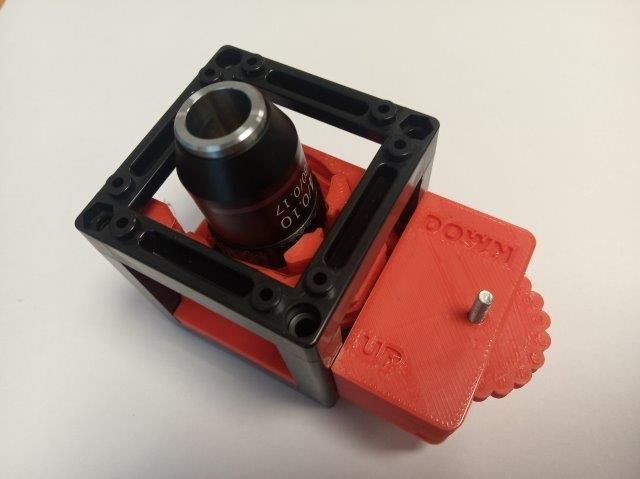](../../../CAD/ASSEMBLY_CUBE_Z-STAGE_mechanical_v2)|1× mechanical Z-Stage, Sample Clamp not necessary
[Lens Cubes](../../../CAD/ASSEMBLY_CUBE_Lens_v2)|| 6× Lens Cube; Write the focal lenghts of the lenses on the holders, so you can always easily find the right one when building the setups.
[Cylindrical Lens Cube](../../../CAD/ASSEMBLY_CUBE_Lens_CYLINDRICAL_v2)|[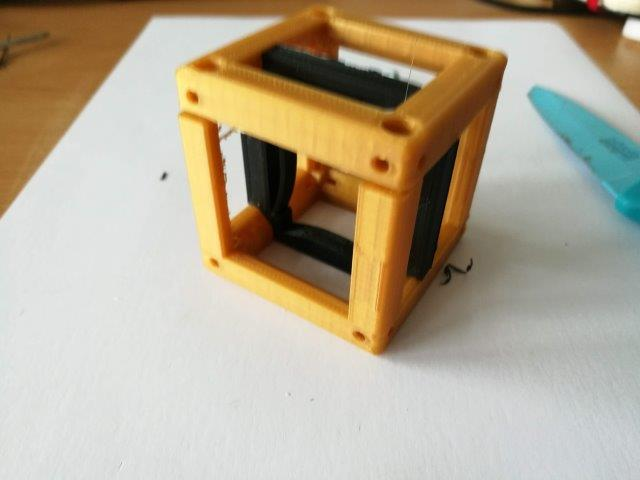](../../../CAD/ASSEMBLY_CUBE_Lens_CYLINDRICAL_v2)| 1× Cylindrical Lens Cube
[Sample Cubes](../../../CAD/ASSEMBLY_CUBE_Sample_Holder_v2)||5× Sample Holder Cube
[Mirror Cube](../../../CAD/ASSEMBLY_CUBE_Mirror_45_v2)|[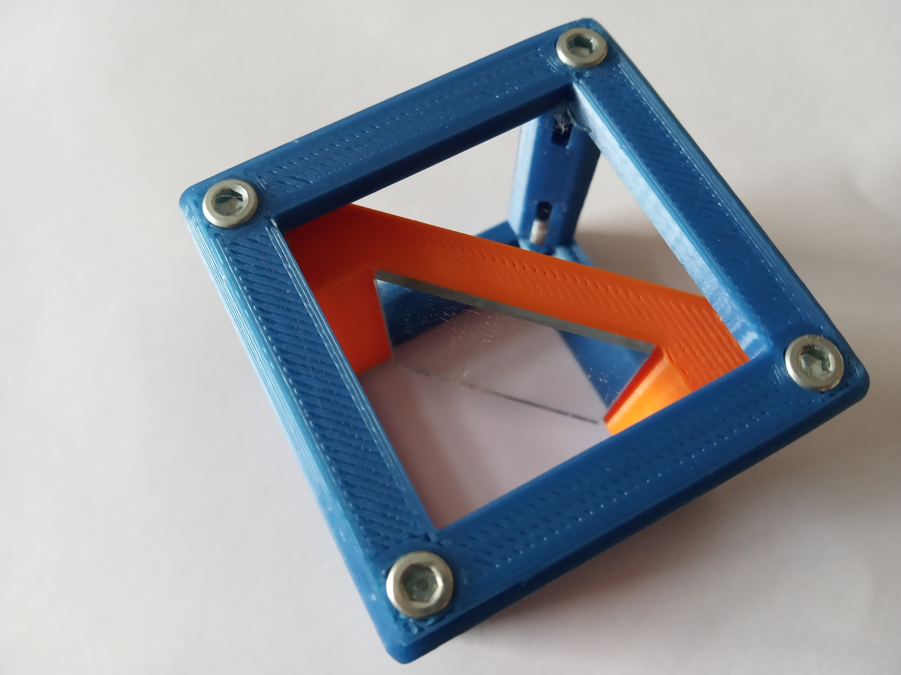](../../../CAD/ASSEMBLY_CUBE_Mirror_45_v2)| 1× Mirror Cube
[Flashlight Cube](../../../CAD/ASSEMBLY_Lens_v2)|| 1× Flashlight Cube
[Circular Aperture Cube](../../../CAD/ASSEMBLY_CUBE_Aperture_Circular_v2)||2× Circular Aperture Cube
[Laser Cube](../../../CAD/ASSEMBLY_CUBE_Laser_v2)||1× Laser Holder Cube and Laser Clamp
[Beam Expander Cube](../../../CAD/ASSEMBLY_CUBE_Beamexpander_v2)|[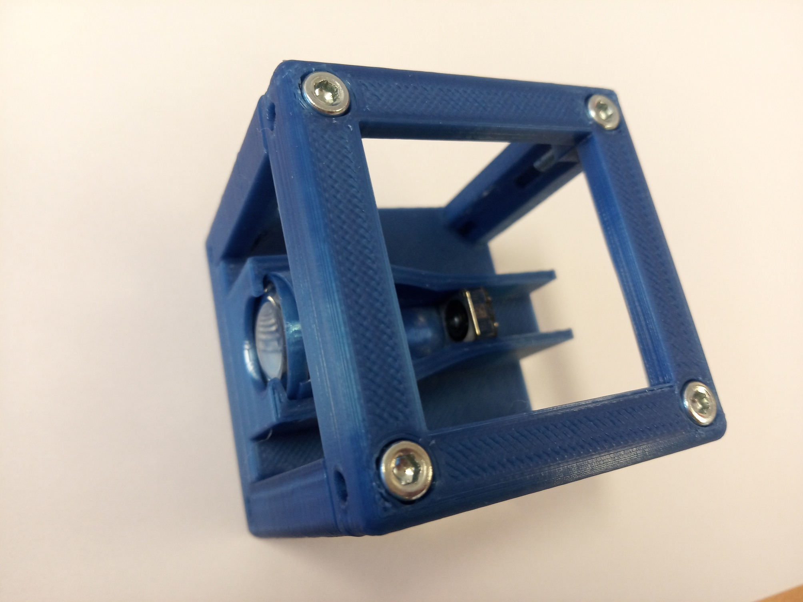](../../../CAD/ASSEMBLY_CUBE_Beamexpander_v2)|1× Beam Expander Cube
[Beamsplitter Cube](../../../CAD/ASSEMBLY_CUBE_Beamsplitter_v2)||1× Beam Expander Cube

##  Done! Great job!
