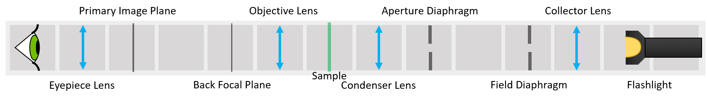
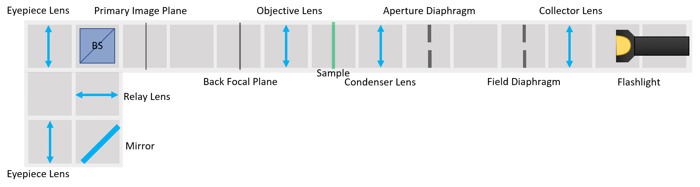
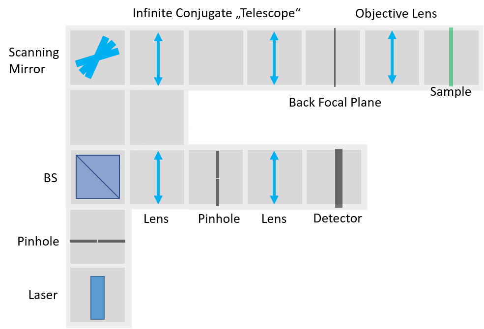

# Course BOX

This BOX was designed for the ["Principles of Light Microscopy" Course](https://www.biodip.de/resources/courses/light-microscopy/) of the Light Microscopy Facility of MPI-CBG in Dresden. The alignment procedure was developed and optimised by Sebastian Bundschuh. It follows the lectures of Peter Evennett that can be found [here](https://www.biodip.de/resources/teaching-material/basic-optical-concepts/).

CourseBOX teaches the core principles of microscopy and basics of optical alignment. It is intended for microscopy courses for students that are rather on the side of users than designers. This BOX provides a hands-on experience with insight into the black box that microscope often seems to be. It comes with alignment tutorials and relies on basic components. By reusing the components and starting from the common ground, it shows that all the microscopy methods are based on only a few principles.

##  Build the BOX
A list of 3D-printed parts and necessary components is found in [BUILD_ME](./BUILD_ME), together with assembly guidelines and some printing tips and tricks.

##  Setups
What can you build with the CourseBOX?

### Compound microscope with proper Köhler illumination
A finite corrected microscope with proper Köhler illumination. All conjugate planes are accessible.

[LINK](./ALIGNMENT) for the detailed alignment procedure with image tutorial.

### Abbe Diffraction Experiment
Classical experiment for explaining Fourier transform done by a lens. The illumination stays the same as in the previous experiment, but a beamsplitter and a relay lens are added, for simultaneous observation the Primary Image Plane and the Back Focal Plane.  

[LINK](./ALIGNMENT) for the detailed alignment procedure with image tutorial.

#### Coming soon

### Laser Scanning Confocal Microscope
Laser Scanning system is built on the detection side of the same setup. Scanning mirror can be rotated around one axis, which results in the translation of the point on the sample.

### Light Sheet Microscope
The principle of Selective Plane illumination Microscopy is demonstrated with white light. The illumination path stays the same, only the collector lens is exchanged for a cylindrical one. The detection path is rotated by 90°.

##  Participate
If you have a cool idea, please don't hesitate to write us a line, we are happy to incorporate it in our design to make it even better.
