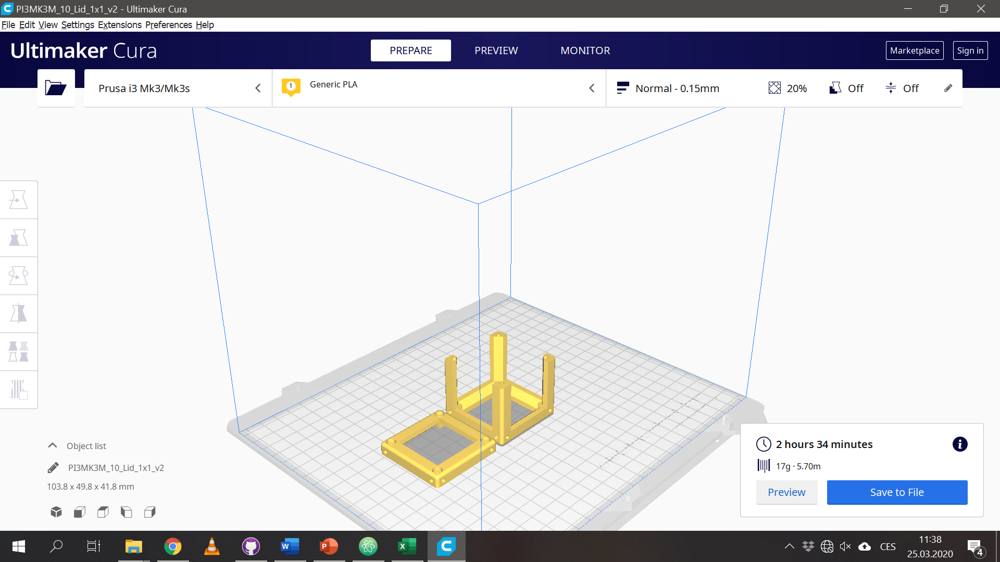
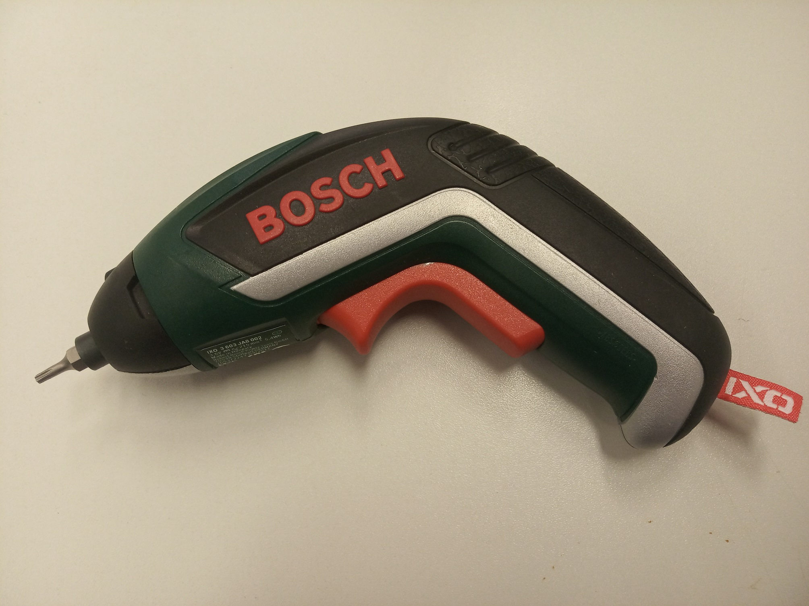
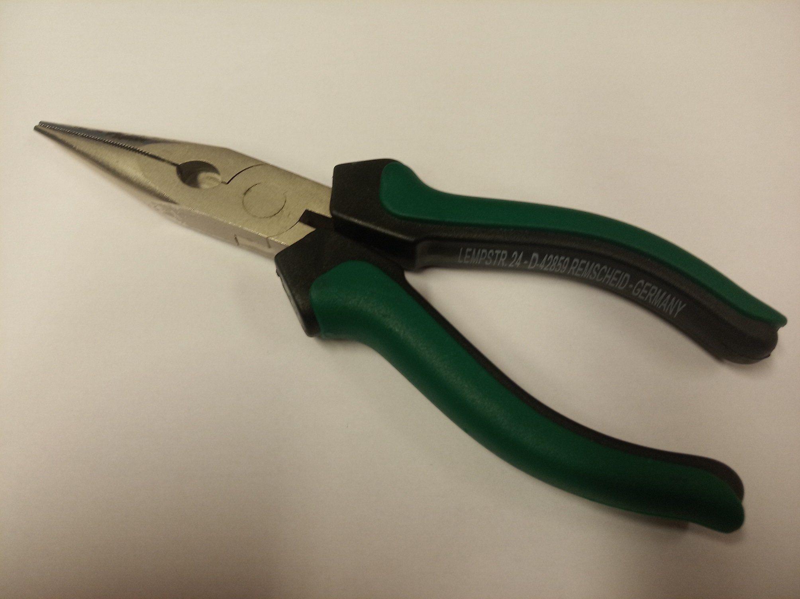

# Building The FullBOX

This is a guide for building the [FullBOX](../). If you were looking for another BOX version, [click here](../../).

### Content
1. [Necessary Parts](#-necessary-parts)
1. [What's inside the FullBOX](#current-state-of-art)
1. [3D printing](#-3d-printing)
1. [Tools](#-which-tools-to-use)

##  Necessary Parts
The complete overview of setups, modules, parts to buy and parts to print can be found in this [google-spreadsheet](https://docs.google.com/spreadsheets/d/1U1MndGKRCs0LKE5W8VGreCv9DJbQVQv7O6kgLlB6ZmE/edit?usp=sharing).

* Check out the [RESOURCES](../../../TUTORIALS/RESOURCES) for more information!

The overall price-tag is around 620€ including the Raspberry Pi, Camera, Optics, 3D printed parts and all additional components.

## Currect state-of-art
What is inside the Box?

Click on the arrow (🢂) to find the STLs and assembly tutorials of the respective cubes and baseplates.

  * Baseplate  4×4 [🢂](../../../CAD/ASSEMBLY_Baseplate)

  

  
  

  * Baseplate 4×2 [🢂](../../../CAD/ASSEMBLY_Baseplate)
  * Baseplate 4×1 - 2× [🢂](../../../CAD/ASSEMBLY_Baseplate)
  * Raspberry Pi [🢂](https://github.com/bionanoimaging/UC2-Software-GIT/tree/master/GUI/RASPBERRY_PI)

  

  
  

  * Cube 2×1: Z-stage with 10× objective and sample holder [🢂](../../../CAD/ASSEMBLY_CUBE_Z-STAGE_objective)

  

  
  

  * Fluomodule Cube [🢂](../../../CAD/ASSEMBLY_CUBE_Dichroic_Beamsplitter)

  

  
  

  * LED Cube [🢂](../../../CAD/ASSEMBLY_CUBE_LED)

  

  
  

  * Eyepiece Cube (20×) with Smartphone holder [🢂](../../../CAD/ASSEMBLY_CUBE_Eyepiece)

  

  
  

  * Laser Cube [🢂](../../../CAD/ASSEMBLY_CUBE_Laser)

  

  
  

  * 45° mirror Cube - 2× [🢂](../../../CAD/ASSEMBLY_CUBE_Mirror_45)

  

  
  

  * Kinematic mirror mount Cube – perpendicular to optical path [🢂](../../../CAD/ASSEMBLY_CUBE_Mirror_Kinematic)

  

  
  

  * Kinematic mirror mount Cube – 45° to optical path [🢂](../../../CAD/ASSEMBLY_CUBE_Mirror_Kinematic_45)

  

  
  

  * RaspiCam Cube [🢂](../../../CAD/ASSEMBLY_CUBE_RaspiCam)

  

  
  

  * Beamsplitter Cube [🢂](../../../CAD/ASSEMBLY_CUBE_Beamsplitter)
  

  
  

  * Beamexpander Cube with an iPhone lens and +26 mm lens [🢂](../../../CAD/ASSEMBLY_CUBE_Beamexpander)

  

  
  

  * Lens Cube - 2× [🢂](../../../CAD/ASSEMBLY_CUBE_Lens) & [🢂](../../../CAD/ASSEMBLY_CUBE_Lens_CYLINDRICAL)

    *  +100 mm – blue label holder, in cube

    * +39,5 mm – yellow label holder, in cube
    * Negative – white label holder with *f* written on the label
    * 4× Objective – green label holder
    * Cylindrical lens in its holder

  * Bag with three lenses - +156 mm, +40 mm, +25 mm in an adapter for Beamexpander

    

    
    

    

    
    

  * Generic sample holder Cube and Sample chamber [🢂](../../../CAD/ASSEMBLY_CUBE_Sample_Holder)

  

  
  

  * Generic sample holder – comb structure [🢂](../../../CAD/ASSEMBLY_CUBE_Sample_Holder)
  * LED array [🢂](../../../CAD/ASSEMBLY_CUBE_LED_Matrix)
  * Sample stage [🢂](../../../CAD/ASSEMBLY_CUBE_S-STAGE_v2.1)
  * Flashlight [🢂](../../../CAD/ASSEMBLY_CUBE_Flashlight)
  * Blue laser pointer with switch [🢂](../../../CAD/ASSEMBLY_CUBE_Laser)

  

  
  

  * Long an short micro-USB cable
  * USB power cable
  * Short Raspi cable
  * Raspi C-power supply
  * Bag with extra screws – M3 with head: 8 mm, 12 mm, 18 mm, 30 mm; M3 no head 5 mm
  * Coupling screw for M3 and M4 screws (for Sample stage and Z-stage)
  * Z-stage sample clamp for microscope slides
  * Z-stage spiral fixing clamp
  * SD card

##  3D Printing:

Completely new to 3D printing? Have a look into our [TUTORIALS](../../../TUTORIALS)!

Our quick printing tutorial can be found here:

We have a good experience with this printer and settings:
* Prusa i3/MK3S
  * PLA 1,75 mm, for one Box: ??? kg = ??? m = ??? hours = ??? €
  * Profile Optimal 0,15 mm, infill 20%, no support, 215/60°C

##  Which tools to use
Tool             |  Image|  Comment
:-------------------------:|:----------------------------:|:-------------------------:
[Electric screw driver with 2,5 mm hex bit](https://www.amazon.de/Bosch-Akkuschrauber-Generation-Bits-Ladeger%C3%A4t/dp/B00TTZU566/ref=asc_df_B00TTZU566/?tag=googshopde-21&linkCode=df0&hvadid=255989693737&hvpos=1o1&hvnetw=g&hvrand=6125749874385941808&hvpone=&hvptwo=&hvqmt=&hvdev=c&hvdvcmdl=&hvlocint=&hvlocphy=9042960&hvtargid=pla-421346020200&psc=1&th=1&psc=1) | | For putting the cubes together using M3×12 and M3×8 screws.
[2,5 mm hex key](https://www.amazon.de/Presch-Innensechskant-Satz-Kugelkopf-Innensechskantschl%C3%BCssel/dp/B079V335CR/ref=sr_1_2_sspa?__mk_de_DE=%C3%85M%C3%85%C5%BD%C3%95%C3%91&crid=2K89GU3MY8P26&keywords=hex+key+set&qid=1575997133&s=diy&sprefix=hex+%2Cdiy%2C160&sr=1-2-spons&psc=1&spLa=ZW5jcnlwdGVkUXVhbGlmaWVyPUEzRENMU0hKWkJRR0FEJmVuY3J5cHRlZElkPUEwMDIzMjIyMzFBWVIyOEpORU1FSCZlbmNyeXB0ZWRBZElkPUEwMzk0NjQwMlA0NFZDTVk0Tk9LUSZ3aWRnZXROYW1lPXNwX2F0ZiZhY3Rpb249Y2xpY2tSZWRpcmVjdCZkb05vdExvZ0NsaWNrPXRydWU=) | | For fine adjustment of all the M3 screws if needed.
[1,5 mm hex key](https://www.amazon.de/Presch-Innensechskant-Satz-Kugelkopf-Innensechskantschl%C3%BCssel/dp/B079V335CR/ref=sr_1_2_sspa?__mk_de_DE=%C3%85M%C3%85%C5%BD%C3%95%C3%91&crid=2K89GU3MY8P26&keywords=hex+key+set&qid=1575997133&s=diy&sprefix=hex+%2Cdiy%2C160&sr=1-2-spons&psc=1&spLa=ZW5jcnlwdGVkUXVhbGlmaWVyPUEzRENMU0hKWkJRR0FEJmVuY3J5cHRlZElkPUEwMDIzMjIyMzFBWVIyOEpORU1FSCZlbmNyeXB0ZWRBZElkPUEwMzk0NjQwMlA0NFZDTVk0Tk9LUSZ3aWRnZXROYW1lPXNwX2F0ZiZhY3Rpb249Y2xpY2tSZWRpcmVjdCZkb05vdExvZ0NsaWNrPXRydWU=) |↑↑ | For assembly of the Z-Stage - mounting worm screws.
[Needle-nose Pliers](https://www.amazon.de/Br%C3%BCder-Mannesmann-Telefonzange-gerade-M10948/dp/B003A63EIG/ref=sr_1_3?__mk_de_DE=%C3%85M%C3%85%C5%BD%C3%95%C3%91&keywords=needle+nose+pliers&qid=1575997091&s=diy&sr=1-3) | | Might come handy

##  Done! Great job!
