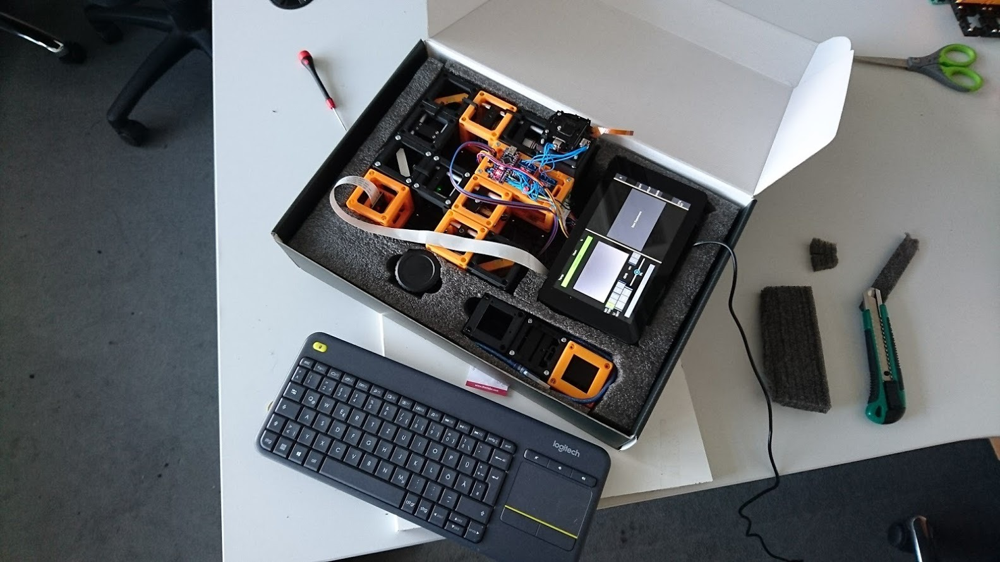
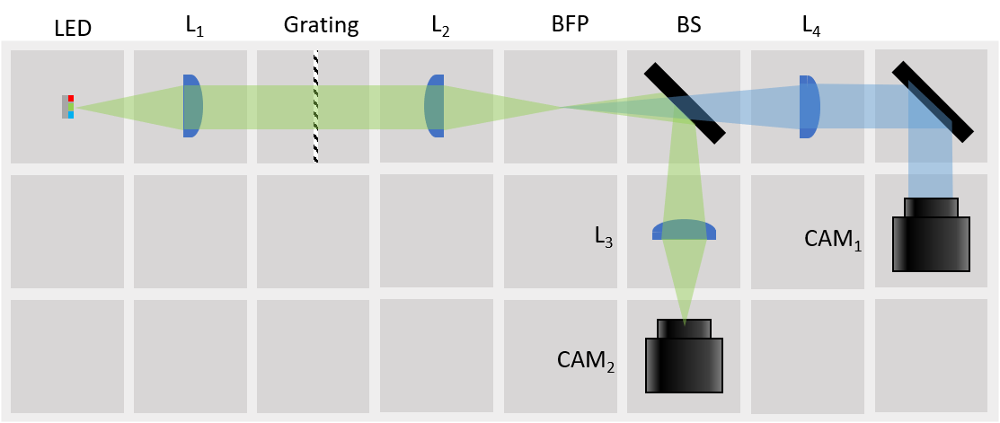
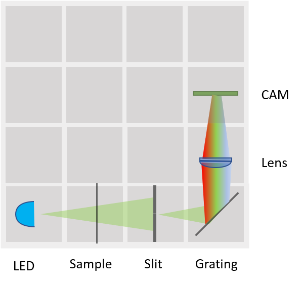

# Full BOX

The FullBOX is the home off all possible experiments that can be built using the UC2 toolbox. Therefore, the actual content changes from time to time.

## Watch [HERE](https://www.youtube.com/watch?v=ey4uEFEG6MY) how to build a bright field and light sheet microscope from the BOX in less than 5 minutes! 

That's how it could look like:

Useful for Workshops. Get back to us if you want to organize one together with us!

##  Build the BOX
A list of 3D-printed parts and necessary components is found in [BUILD_ME](./BUILD_ME), together with assembly guidelines and some printing tips and tricks.

##  Possible Setups
What could be inside the box?

### Projector
[LINK](../../CAD/APP_SIMPLE-Projector)
 Simple one lens projector. Direct illumination. 4× magnification for *f(L)* = +40 mm, object to lens 50 mm and lens to screen 200 mm.

### Telescope
[LINK](../../CAD/APP_SIMPLE-Telescope)
Three classical telescope principles. 2× magnification for *f(L1)* = +100 mm, *f(L2)* = +50 mm, *f(L3)* = -50 mm.

### Incubator Microscope
[LINK](../../CAD/APP_Incubator_Microscope)
Trasmission microscope. LED array serves as light source - different illumination modes possible.

### Incubator Microscope w/ Fluorescence
[LINK](../../CAD/APP_Incubator_Microscope_fluorescence)
Epi-Fluorescence microscope.

### Cellphone Microscope
[LINK](../../CAD/APP_SMARTPHONE_MICROSCOPE)
Trasmission microscope, uses smartphone for image acquisition. LED array serves as light source - different illumination modes possible.

### Abbe Diffraction Experiment
[LINK](../../CAD/APP_Abbe_Setup)
Classical experiment for explaining Fourier transform done by a lens. CAM1 images the grating, CAM2 images the Back Focal Plane. Different filters can be inserted in the BFP.

### Light-sheet Microscope
[LINK](../../CAD/APP_LIGHTSHEET_Workshop)
Light-sheet combined with fluorescence. Low-magnification Microscope objective in illumination path for focusing the light-sheet. Sample stage for obtaining stacks of image slices.

### Double-Slit experiment
[LINK](../../CAD/APP_Double-slit_Experiment)
Young's experiment.

### In-Line Holographic Microscope
[LINK](../../CAD/APP_INLINE_HOLOGRAM)
Imaging without lenses. Blue LED as a light source. For weakly scattering samples.

### Michelson Interferometer
[LINK](../../CAD/APP_Michelson_Interferometer)
Reflection interferometry. Fine adjustment with kinematic mirror (perpendicular). One beamsplitter.

### Mach-Zehnder Interferometer
[LINK](../../CAD/APP_Mach-Zehnder_Interferometer)
Transmission interferometry. Fine adjustment with kinematic mirrors (diagonal). Two beamsplitters.

### Spectrometer
[LINK](../../CAD/APP_Spectrometer)

##  Participate
If you have a cool idea, please don't hesitate to write us a line, we are happy to incorporate it in our design to make it even better.
