# Building The PolarBOX

This is a guide for building the PolarBOX.

* Total price: ~129 € (calculated in February 2021 )
* Printing time of module parts: 94h 7m = 3 days 22 h 7 mins (50 % infill)
* Assembly time: 1 day

### Content
1. [Shopping](#-shopping)
1. [3D printing](#-3d-printing)
1. [Tools](#-which-tools-to-use)
1. [Assembly](#-assembly)

## All Modules
Link - name of part  |  Numbers |  Additional Components | Price Module (Feb 2021)
  :-------------------------:|:----------------------------:|:-------------------------:|:-------------------------:
  4×1 Baseplate | 1 | 16x magnet balls | 5,47 €
  4x4 Baseplate  | 1 | 64x magnet balls | 21,79 €
  Linear Polarizer Cube  | 3 | 24x M3 screws, 6x M2 screws | 13,43 €
  Active Solution Chambers  | 1 | 8x magnet balls, 4x M3 screws, 8x rectangular cover slips, 1 silicon tape | 7,32 €
  Circular Polarizer Cube  | 1 | 8x M3 screws, 3D cinema goggles | 2,96 €
  Kinematic Microscope Slide Holder | 1 | 3x magnet balls, 11x M3 screws, 1x microscope slide | 3,70 €
  Laser Cube  | 1 | 12x M3 screws, 1x Laser pointer | 17,68 €
  Sample Holder Comb (Display Screen)  | 1 | 4x M3 screws, 9x microscope slides | 2,11 €      
  Sample Holder Cube  | 1 | 8x M3 screws | 3,47 €
  Plano-convex lens-Microscope Slide Holder  | 1 | 8x M3 screws, 1x plano-convex lens, 1x microscope slide | 7,54 €
  Beam Expander Cube  | 1 | 8x M3 screws, 1x iPhone Camera Lens, 1 plano-convex lens | 13,55 €
  Beam Splitter Cube  | 1 | 8x M3 screws, 1x beam splitter | 29,17 €

##  Shopping
### What to buy

Link - name of part             |  Amount |  Comment | Price per amount used
  :-------------------------:|:----------------------------:|:-------------------------:|:-------------------------:
  3D printing material, PLA |~736 g| Choose material that works with your 3D printer. If unsure, have a look at the guide in 3D printing section |~23 €
  [Linear Polarization Sheet A4](https://www.amazon.de/-/en/Polarizing-A4-Sheet-Polarizer-Educational-Polarized/dp/B06XWXRB75/ref=pd_sbs_421_3/262-2115536-7173904?_encoding=UTF8&pd_rd_i=B06XWXRB75&pd_rd_r=b88e7340-b061-4e0b-8daa-8ec533fd7c71&pd_rd_w=qlkAY&pd_rd_wg=At9EZ&pf_rd_p=a03ac387-6e4d-4f6b-96b6-1853da0bb37b&pf_rd_r=49HX2Z4Q5KRZSQ2FWRQR&psc=1&refRID=49HX2Z4Q5KRZSQ2FWRQR)  |  1 piece | We used them to obtain linearly s- or p- polarized light. Normally we only very small piece of all sheet. | 20 €
  [3D Cinema Goggles](https://www.amazon.de/-/en/Circular-Polarized-Passive-Glasses-Special/dp/B08SHWPVCM/ref=sr_1_3?crid=3QX263CJ6CK2G&keywords=polarisierte+3d+kino+brille&qid=1668681118&sprefix=polarize+3d+kino+brille%2Caps%2C105&sr=8-3)  |  1 piece | Quarter-wave plate for the creation of the circular polarized light  | 5 €
  [Beamsplitter Cube (Art. 2137)](https://optikbaukasten.de/)  |  1 piece | Beam splitter cube 20x20 m2  | 27 € (was bought in 2021)
  [Plano-Convex Lens](https://www.comaroptics.com/components/lenses/simple-convex-lenses/plastic-lenses)  |  1 piece | For Newton's rings application.  | ~7 €
  [iPhone 5 Lens f'=3mm ](https://www.ebay.com/itm/172395994496)  |  1 piece | Separated from an iPhone camera spare part for the beam expander module.  | 6 €
  [Achromat Lens f' = 26,5 mm](https://pgi-shop.de/achromat-2-lens-oe-15-mm-f-26.5-mm/)  |  1 piece | For the beam expander module. | 6,50 €
  [5 mW Blue UV Laser Pointer](https://www.laserlands.net/5mw-450nm-blue-laser-pointer-pen.html)  |  1 piece | Laser light source  | ~ 17 €
  [Microscope Rectangular Coverslips](https://www.ebay.de/itm/223260964391?hash=item33fb63f627:g:pukAAOSwsGpb%7E14N)  |  11 pieces | As a glass surface in different applications.  | 4,52 € (for 100 pieces)
  [Magnets](https://www.magnetladen.de/kugelmagnet-5-mm-n42-nickel/)  |  91 pieces | Ball magnets, diameter 5 mm.| 30 €
  [Screws](https://eshop.wuerth.de/Zylinderschraube-mit-Innensechskant-SHR-ZYL-ISO4762-88-IS25-A2K-M3X12/00843%20%2012.sku/de/DE/EUR/) |   ~120 pieces | M3×12, galvanized steel - ~90  pieces; M3×8, galvanized steel - ~90 pieces; M3×18, galvanized steel - 2 pieces; M3×30, not magnetic - 1 piece; M3 nut | ~15 €
  [Chocolate](https://www.milka.de/produkte/milka-standard-tafeln/milka-wei%c3%9fe-schokolade?p=137&provider={D193998A-4A6D-4EA5-BAA8-209357B27A09}&categoryId=1395)|1 bar| Use it as a reward when you're done.

* Check out the [RESOURCES](../../../TUTORIALS/RESOURCES) for more information!

##  3D Printing:

Completely new to 3D printing? Have a look into this [beginner's guide](https://www.makeuseof.com/tag/beginners-guide-3d-printing/)!

Our quick printing tutorial can be found here:       

###   Housing
Name of part - Link to STL file             |  Amount
:-------------------------:|:----------------------------:
[(01) Baseplate 4×1](./STL/Assembly_Cube_Baseplate_4x1_v2.stl)  |  1 piece
[(02) Baseplate 4×4](./STL/Assembly_Cube_Baseplate_4x4_v2.stl)  |  1 piece
[(03) Basic Cube 1×1](./STL/10_Cube_1x1_v2.stl)  |  10 pieces
[(04) Basic Lid 1×1](./STL/10_Lid_1x1_v2.stl) |  11 pieces
[(05) Basic Lid 2×1](./STL/10_Lid_el_2x1_v2.stl) |  1 piece

###  Inserts

Name of part - Link to STL file            |  Amount |  Comment
:-------------------------:|:-------------------------:|:-------------------------:
[(06) Polarizer Lid](./STL/20_POL_Insert_Linear_Polarizer_Lid.stl)  |  3 piece  | For inserting linear polarization filter into cube, and rotate it.
[(07) Polarizer Guide](./STL/20_POL_Insert_Linear_Polarizer_Guide.stl)  |  3 piece  | For inserting linear polarization filter into cube, and rotate it.
[(08) Polarizer Wheel](./STL/20_POL_Insert_Linear_Polarizer_Wheel.stl)  |  3 piece  | For inserting linear polarization filter into cube, and rotate it.
[(09) Circular Polarizer Holder](./STL/20_POL_Circular_Polarizer_holder.stl) |  1 piece   | For mounting the filter of §D cinema glasses.
[(10) Circular Polarizer Holder Clamp](./STL/20_POL_Circular_Polarizer_clamp.stl) |  1 piece   | For mounting the filter of 3D cinema glasses.
[(11) Generic Sample Holder](./STL/20_Cube_insert_Sample_holder.stl)  |  1 piece | For holding the samples.
[(12) Generic Sample Holder Clamp](./STL/20_Cube_Insert_Sample_clamp.stl)  |  1 piece | To fix the sample.
[(13) Multiple Sample Holder ](./STL/20_Cube_Sampleholder.stl)  |  1 piece | Inserting many slides together as parallel.
[(14) Beam splitter Insert](./STL/20_Cube_Insert_Beamsplitter.stl)  |  1 piece | Holding the beam splitter cube 20x20 mm^2
[(15) Beam Expander Insert](./STL/20_Cube_Insert_Beamexpander.stl)  |  1 piece | Holding the lens and camera lens for the telescope module.
[(16) Laser Holder](./STL/20_Cube_Insert_Laser_Holder_v2.stl)  |  2 pieces | Holding the pen laser.
[(17) Laser Clamp](./STL/00_Laser_Clamp_OnOffSwitch.stl)  |  1 piece | Turning on/off the laser.
[(18) Active Solution Chamber with 2 reservoirs ](./STL/10_POL_Active_Solution_Chamber_90long_40High_Double_TOP.stl)  |  1 piece | Carrying solutions.
[(19) Active Solution Chamber with 1 reservoir ](./STL/10_POL_Active_Solution_Chamber_90long_40High_TOP.stl)  |  1 piece | Carrying solutions.
[(20) Kinematic Mirror Holder Base 57 degrees ](./STL/20_POL_Cube_Insert_Brewster_Angle_Kinematic_Mount_Base_57_degrees.stl)  |  1 piece | Mirror holder at Brewster angle, 57 degrees for the glass.
[(21) Kinematic Mirror Holder Plate 57 degrees ](./STL/20_POL_Cube_Insert_Brewster_Angle_Kinematic_Mount_Plate_57_degrees.stl)  |  1 piece | Mirror holder at Brewster angle, 57 degrees for the glass.
[(22) Kinematic Mirror Holder Clamp 57 degrees ](./STL/20_POL_Cube_Insert_Brewster_Angle_Kinematic_Mount_Clamp_57_degrees.stl)  |  1 piece | Mirror holder at Brewster angle, 57 degrees for the glass.
[(23) Plano-convex Lens and Plate glass surface combined Holder](./STL/20_POL_Cube_Insert_Newtons_Rings_LensHolder.stl)  |  1 piece | The holder for lens and microscope glass for Newton's rings experiment.
[(24) Plano-convex Lens and Plate glass surface combined Holder Clamp](./STL/20_POL_Cube_Insert_Newtons_Rings_Lens_Clamp.stl)  |  1 piece | The holder for lens and microscope glass for Newton's rings experiment.

##  Which tools to use
Tool             |  Comment
:-------------------------:|:-------------------------:
[Electric screw driver with 2,5 mm hex bit](https://www.amazon.de/Bosch-Akkuschrauber-Generation-Bits-Ladeger%C3%A4t/dp/B00TTZU566/ref=asc_df_B00TTZU566/?tag=googshopde-21&linkCode=df0&hvadid=255989693737&hvpos=1o1&hvnetw=g&hvrand=6125749874385941808&hvpone=&hvptwo=&hvqmt=&hvdev=c&hvdvcmdl=&hvlocint=&hvlocphy=9042960&hvtargid=pla-421346020200&psc=1&th=1&psc=1) | For putting the cubes together using M3×12 and M3×8 screws.
[2,5 mm hex key](https://www.amazon.de/Presch-Innensechskant-Satz-Kugelkopf-Innensechskantschl%C3%BCssel/dp/B079V335CR/ref=sr_1_2_sspa?__mk_de_DE=%C3%85M%C3%85%C5%BD%C3%95%C3%91&crid=2K89GU3MY8P26&keywords=hex+key+set&qid=1575997133&s=diy&sprefix=hex+%2Cdiy%2C160&sr=1-2-spons&psc=1&spLa=ZW5jcnlwdGVkUXVhbGlmaWVyPUEzRENMU0hKWkJRR0FEJmVuY3J5cHRlZElkPUEwMDIzMjIyMzFBWVIyOEpORU1FSCZlbmNyeXB0ZWRBZElkPUEwMzk0NjQwMlA0NFZDTVk0Tk9LUSZ3aWRnZXROYW1lPXNwX2F0ZiZhY3Rpb249Y2xpY2tSZWRpcmVjdCZkb05vdExvZ0NsaWNrPXRydWU=) | For fine adjustment of all the M3 screws if needed.
[1,5 mm hex key](https://www.amazon.de/Presch-Innensechskant-Satz-Kugelkopf-Innensechskantschl%C3%BCssel/dp/B079V335CR/ref=sr_1_2_sspa?__mk_de_DE=%C3%85M%C3%85%C5%BD%C3%95%C3%91&crid=2K89GU3MY8P26&keywords=hex+key+set&qid=1575997133&s=diy&sprefix=hex+%2Cdiy%2C160&sr=1-2-spons&psc=1&spLa=ZW5jcnlwdGVkUXVhbGlmaWVyPUEzRENMU0hKWkJRR0FEJmVuY3J5cHRlZElkPUEwMDIzMjIyMzFBWVIyOEpORU1FSCZlbmNyeXB0ZWRBZElkPUEwMzk0NjQwMlA0NFZDTVk0Tk9LUSZ3aWRnZXROYW1lPXNwX2F0ZiZhY3Rpb249Y2xpY2tSZWRpcmVjdCZkb05vdExvZ0NsaWNrPXRydWU=) | For mounting worm screws.
[Needle-nose Pliers](https://www.amazon.de/Br%C3%BCder-Mannesmann-Telefonzange-gerade-M10948/dp/B003A63EIG/ref=sr_1_3?__mk_de_DE=%C3%85M%C3%85%C5%BD%C3%95%C3%91&keywords=needle+nose+pliers&qid=1575997091&s=diy&sr=1-3) | Might come handy

##   Assembly
Part - link             |  Result|  Comment
:-------------------------:|:----------------------------:|:-------------------------:
[Baseplates](../../../CAD/ASSEMBLY_Baseplate)|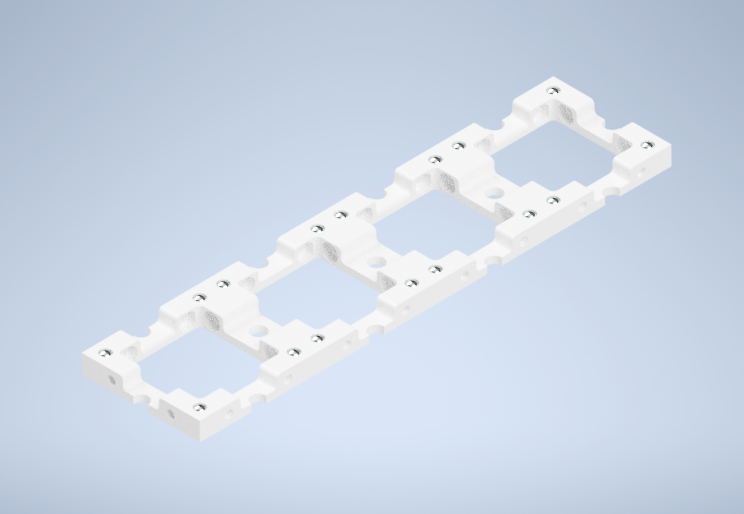|1× "big" baseplate (4×4) and 1× "small" baseplate (4×1)
[Linear Polarizer Cube](../../../CAD/ASSEMBLY_POL_Linear_Polarizer)|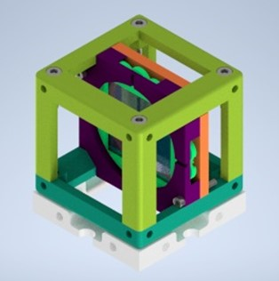| 3x linearly polarizing filter holder modules
[Circular Polarizer Cube](../../../CAD/ASSEMBLY_POL_Circular_Polarizer)|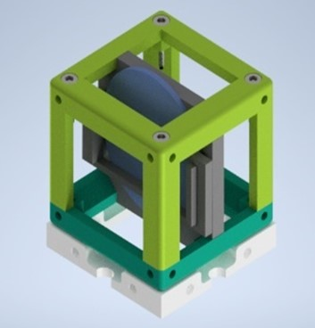| 1x quarter wave plate from 3D cinema googles to obtain circular polarizing light
[Active Solution Chambers](../../../CAD/ASSEMBLY_POL_Active_Solution_Chamber)|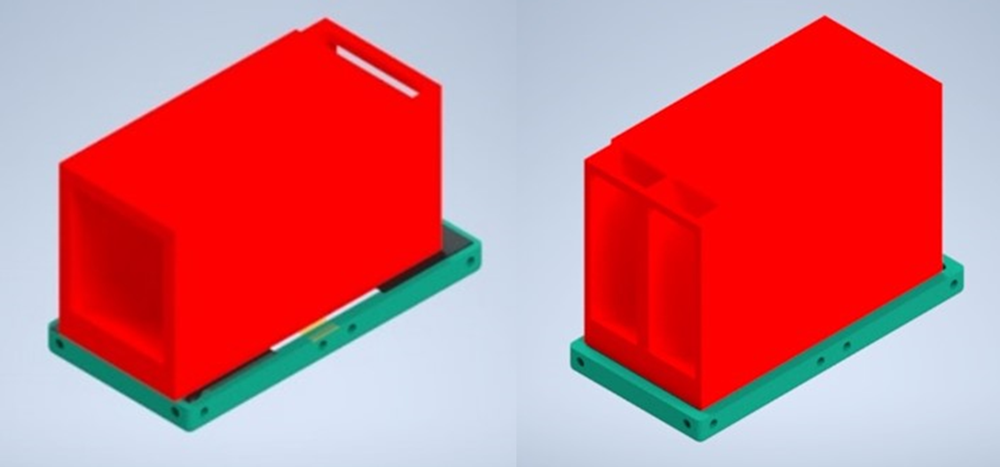| Two different chamber design with one or two	reservoirs
[Kinematic Mirror Cube at Brewster Angle (57-degrees)](../../../CAD/ASSEMBLY_CUBE_Mirror_Kinematic_45)|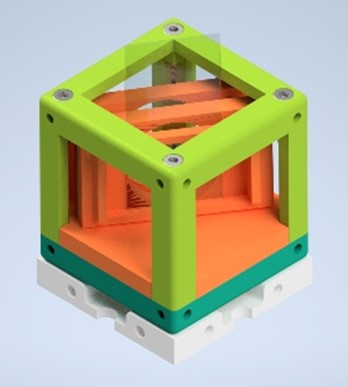| 1× Mirror Cube
[Newton's Rings Lens-Plate glass Combined Module](../../../CAD/ASSEMBLY_POL_Newtons_Rings_Module)|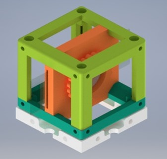| 1× Newton's Rings Generator Holder Module
[Sample Holder Cube](../../../CAD/ASSEMBLY_CUBE_Sample_Holder)|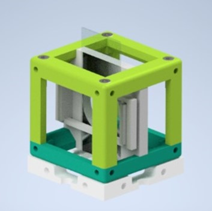|1× Sample Holder Cube for inserting birefringent samples
[Sample Comb Holder Cube](../../../CAD/ASSEMBLY_CUBE_Sample_Comb)|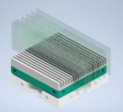|1× Sample Comb insert, 9x microscope glass  rectangular cover slides.
[Beam Expander Cube](../../../CAD/ASSEMBLY_CUBE_Beamexpander)|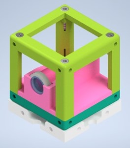|1× Beam Expander Cube
[Beamsplitter Cube](../../../CAD/ASSEMBLY_CUBE_Beamsplitter)|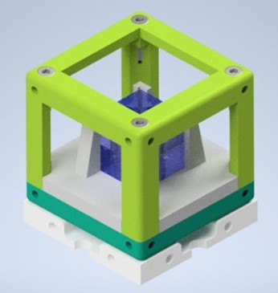|1× Beam Expander Cube
[Laser Cube](../../../CAD/ASSEMBLY_CUBE_Laser)|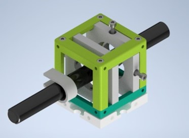|1× Laser Holder Cube and Laser Clamp
[Flashlight Cube](../../../CAD/ASSEMBLY_CUBE_Flashlight)|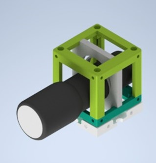| 1× Flashlight Cube

## Done! Great job!
