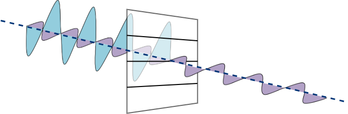
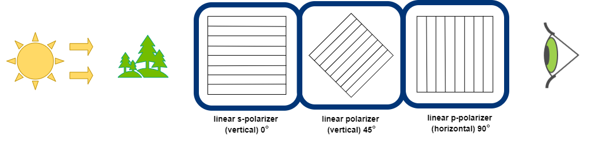
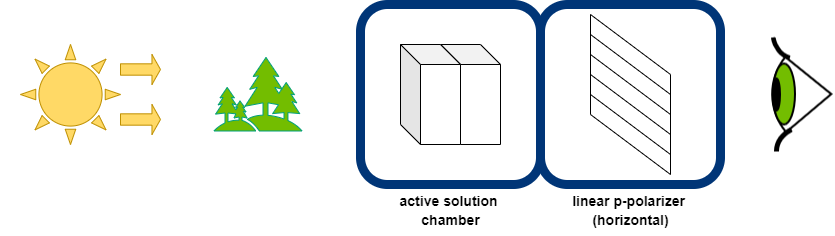
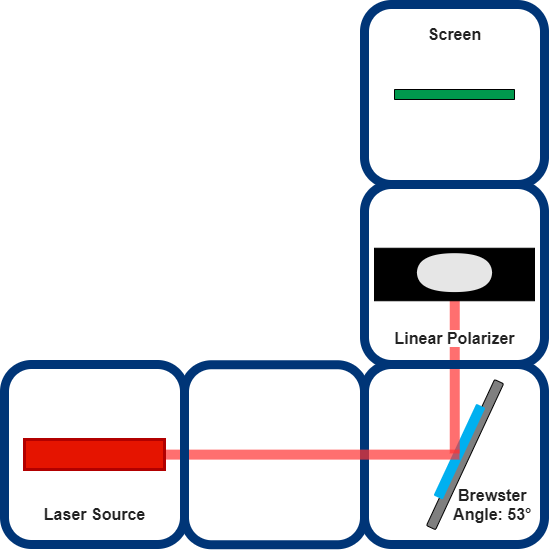
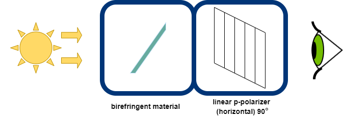

# PolarBOX

The PolarBOX is an UC2 ready-to-use toolbox that can be built 7 different polarization experiments using 3D printed blocks. You just need some basic and cheap components for preparing your own PolarBOX.  

I can hear the questions inside your head (Yes, I read your mind).     

*What is the polarization of the light?*   
Polarization is a one of the fundamental properties of  the light and is related to the internal geometry of the source radiation.

Our life is surrounded by unpolarized light in daily life, sunlight. Light is an electromagnetic wave. Electric field vectors of sunlight/unpolarized light vibrate in all planes randomly along the direction of propagation. When the electric field vectors are limited using a filtration mechanism to a single plane, linearly or plane polarized light is obtained with respect to the direction of propagation. In the plane-parallel or plane-polarized light, all waves vibrate in a single plane along the propagation direction.

Most common filtration mechanism is using the polarizing filter. Polarizers can be used to filter, modify, or analyze the polarization states of light in an optical system. The electric field of light can be polarized as parallel to the plane of incidence, p-polarized, or perpendicular to this plane, s-polarized using a linear polarizer.  

Let's see s-polarized light in the scheme:

And the rings bell for p-polarized light:

Polarized light can be produced from the common physical processes such as absorption, reflection, diffraction (or scattering), and birefringence.

*add box photo here*

##  Build the BOX
A list of 3D-printed parts and necessary components is found in [BUILD_ME](./BUILD_ME), together with assembly guidelines and some printing tips and tricks.

##  Possible Setups

Which experiments can we build with this box? Let's see!

### 1. Crossed Polarizers
[LINK](../../APPLICATIONS/APP_POL_Crossed_Polarizers)

### 2. Three Polarizers
[LINK](../../APPLICATIONS/APP_POL_Three_Polarizers)

### 3. Circular Polarizer
[LINK](../../APPLICATIONS/APP_POL_Circular_Polarizer)

clockwise circular Polarizer:

Counter-clockwise circular Polarizer:

### 4. Polarization of light using optically active solution
[LINK](../../APPLICATIONS/APP_POL_Polarization_using_optically_active_solution)

### 5. Brewster Angle Experiment
[LINK](../../APPLICATIONS/APP_POL_Brewster_Angle_Experiment)

### 6. Newton’s Rings Experiment
[LINK](../../APPLICATIONS/APP_POL_Newtons_Rings_Experiment)

### 7. Stress Birefringence
[LINK](../../APPLICATIONS/APP_POL_Stress_Birefringence)

##  Participate
Dear Participant,

you tasted our cake recipe. I'm sure that you have new ideas to try. Don't be afraid!
Buy the ingredients, use basic cooking techniques and add your imagination and creativity for your new cake recipe!

Don't forget to share your recipe with us!
