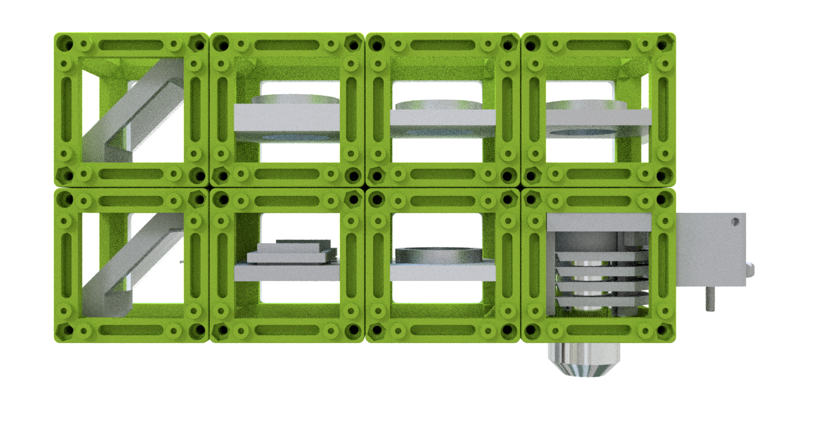
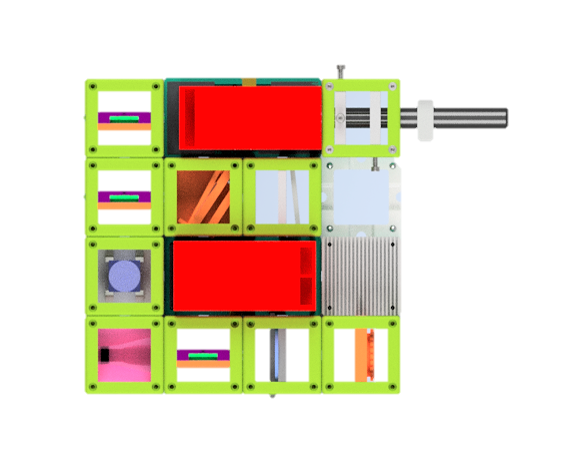
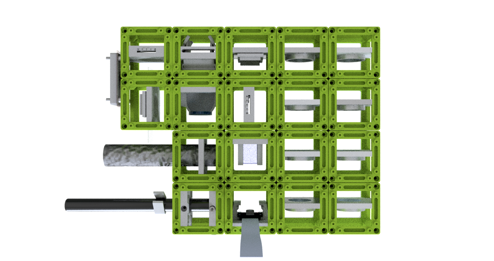
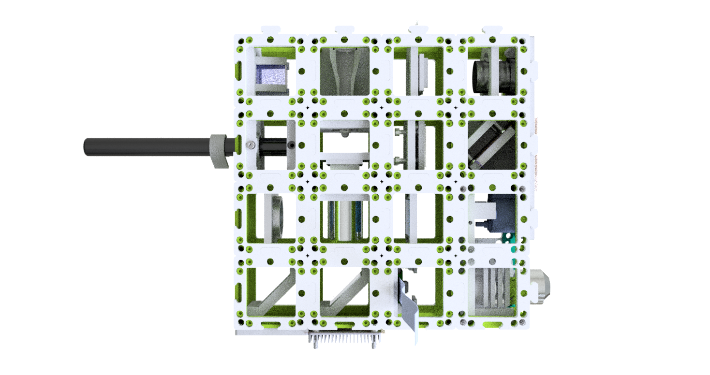

# The BOX
Our BOXes are still a work-in-progress - we test them, optimize them and continually improve them. The renderings on this page show the BOXes in v3 version, but you still find the documentation of their assembly and alignment relying on images of v2 cubes.

TheBOX is a number of optical experiments compiled into a ready-to-use box. We created three variants for different levels of knowledge and skills. SimpleBOX covers the basic experiments of ray optics for secondary and high schools. CourseBOX  teaches the core principles of microscopy from a simple lens to laser scanning confocal microscopy. FullBOX is meant to be used by university students and researchers for the everyday labwork or advanced courses. The PolarBOX includes eight experiments to explain the light polarization via basic and easy setups.

## Choose [MiniBOX / SimpleBOX](./SimpleBOX) for schools and demonstration of basic optical principles:

## Choose [PolarBOX](./PolarBOX) for demonstration of the polarization effects of light:

## Choose [CourseBOX](./CourseBOX) for Basic Microscopy and Optical Alignment courses:

## Choose [FullBOX](./FullBOX) for adventurous biologists and microscopy enthusiasts:

Useful for [Workshops](../WORKSHOP). Get back to us if you want to organize one together with us!

### Complete overview of setups, modules, parts to buy and parts to print
Find a complete shopping'n'printing list including estimated prices for all modules and setups in this [GoogleDrive Spreadsheet](https://docs.google.com/spreadsheets/d/1U1MndGKRCs0LKE5W8VGreCv9DJbQVQv7O6kgLlB6ZmE/edit?usp=sharing)!

##  Participate
If you have a cool idea, please don't hesitate to write us a line, we are happy to incorporate it in our design to make it even better.
