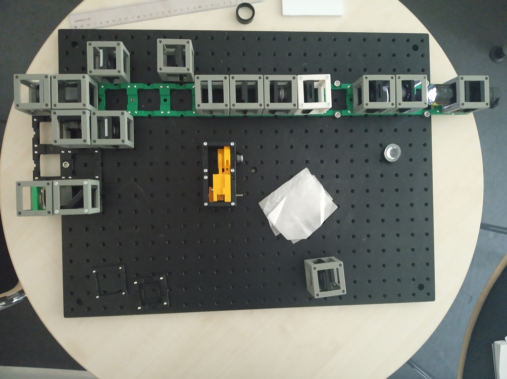

# The BOX
We would like to offer a ready-to-use box containing a growing number of optical experiments. Our BOXes are still a work-in-progress - we test them, optimize them and continually improve them.

## Choose [SimpleBOX](./SimpleBOX) for schools and demonstration of basic optical principles:

## Choose [CourseBOX](./CourseBOX) for Basic Microscopy and Optical Alignment courses:

## Choose [FullBOX](./FullBOX) for adventurous biologists and microscopy enthusiasts:

Useful for [Workshops](../WORKSHOP). Get back to us if you want to organize one together with us!

##  Participate
If you have a cool idea, please don't hesitate to write us a line, we are happy to incorporate it in our design to make it even better.
