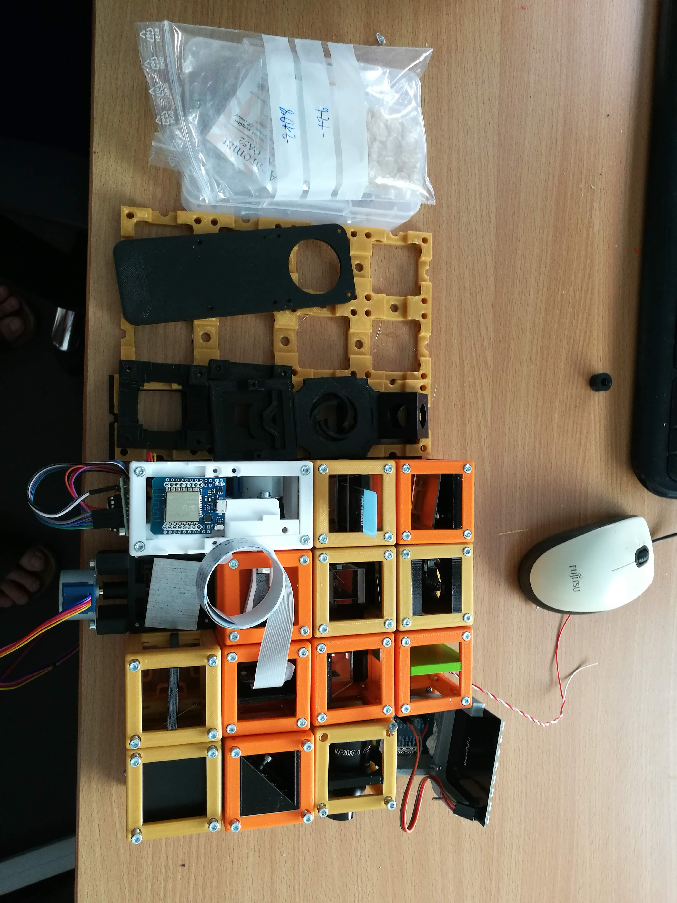

# The BOX
Very soon we would like to offer a ready-to-use box being able to make a growing number of different optical experiments possible.

That's how it could look like:

Useful for Workshops. Get back to use if you want to organize one together with us!

## Assembly
A description on how to assemble the parts can be found in each Application-folder following the "LINK". It gives also a list of additional components to print/buy.

## Necessary Parts
The detailed up-to-date list of all components can be found in this [google-spreadsheet](https://docs.google.com/spreadsheets/d/1U1MndGKRCs0LKE5W8VGreCv9DJbQVQv7O6kgLlB6ZmE/edit?usp=sharing).

The overall price-tag is around 600€ including the Raspberry Pi, Camera, Optics, 3D printed parts and all additional components.

## Possible Setups
What's inside the box?

### Image Scanning Microscopy (ISM)

### Abbe Diffraction Experiment
[LINK](../CAD/APP_Abbe_Setup)

### Incubator Microscope
[LINK](../CAD/APP_Incubator_Microscope)

### Incubator Microscope w/ Fluorescence
[LINK](../CAD/APP_Incubator_Microscope)

### Light-sheet Microscope
[LINK](../CAD/APP_LIGHTSHEET_Workshop)

### Telescope
[LINK](../CAD/APP_SIMPLE-Telescope)

### In-Line Holographic Microscope
[LINK](../CAD/APP_INLINE_HOLOGRAM)

### Michelson Interferometer
[LINK](../CAD/APP_Michelson_Interferometer)

### Cellphone Microscope
[LINK](../CAD/APP_SMARTPHONE_MICROSCOPE)

### Spectrometer
[LINK](../CAD/APP_Spectrometer)

## Participate
If you have a cool idea, please don't hesitate to write us a line, we are happy to incorporate it in our design to make it even better.
