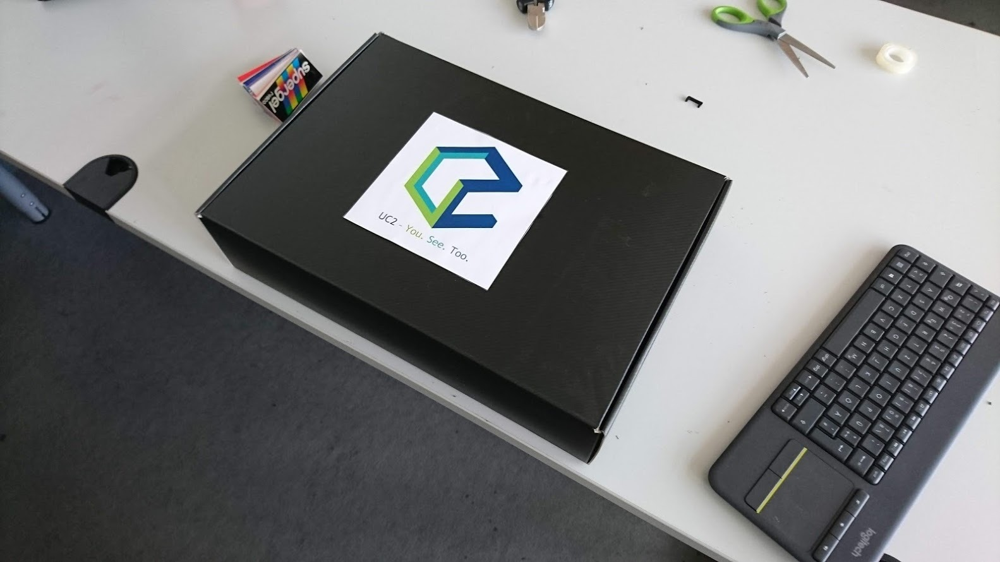
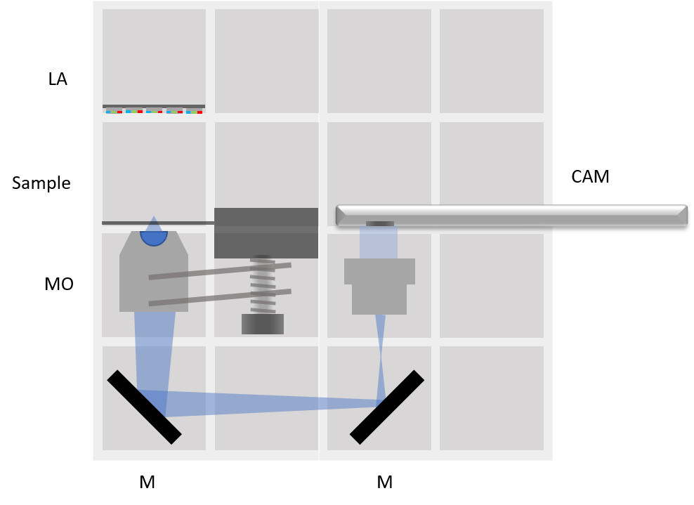
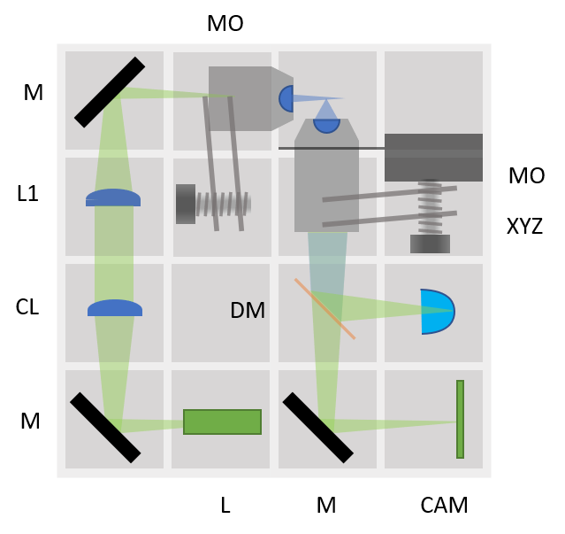
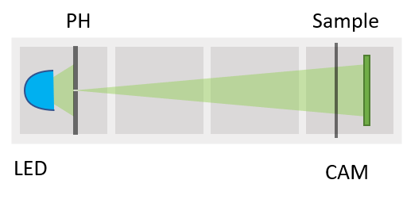

# The BOX
Very soon we would like to offer a ready-to-use box being able to make a growing number of different optical experiments possible.

That's how it could look like:

Useful for Workshops. Get back to us if you want to organize one together with us!

## Assembly
A description on how to assemble the parts can be found in each Application-folder following the "LINK". It gives also a list of additional components to print/buy.

## 3D printing
A list of 3D-printed parts is found in [STL](./STL), together with some printing tips and tricks.

## Necessary Parts
The detailed up-to-date list of all components can be found in this [google-spreadsheet](https://docs.google.com/spreadsheets/d/1U1MndGKRCs0LKE5W8VGreCv9DJbQVQv7O6kgLlB6ZmE/edit?usp=sharing).

The overall price-tag is around 600€ including the Raspberry Pi, Camera, Optics, 3D printed parts and all additional components.

## Possible Setups
What could be inside the box?

### Projector
[LINK](../CAD/APP_SIMPLE-Projector)
 Simple one lens projector. Direct illumination. 4× magnification for *f(L)* = +40 mm, object to lens 50 mm and lens to screen 200 mm.

### Telescope
[LINK](../CAD/APP_SIMPLE-Telescope)
Three classical telescope principles. 2× magnification for *f(L1)* = +100 mm, *f(L2)* = +50 mm, *f(L3)* = -50 mm.

### Incubator Microscope
[LINK](../CAD/APP_Incubator_Microscope)
Trasmission microscope. LED array serves as light source - different illumination modes possible.

### Incubator Microscope w/ Fluorescence
[LINK](../CAD/APP_Incubator_Microscope_fluorescence)
Epi-Fluorescence microscope.

### Cellphone Microscope
[LINK](../CAD/APP_SMARTPHONE_MICROSCOPE)
Trasmission microscope, uses smartphone for image acquisition. LED array serves as light source - different illumination modes possible.

### Abbe Diffraction Experiment
[LINK](../CAD/APP_Abbe_Setup)
Classical experiment for explaining Fourier transform done by a lens. CAM1 images the grating, CAM2 images the Back Focal Plane. Different filters can be inserted in the BFP.

### Light-sheet Microscope
[LINK](../CAD/APP_LIGHTSHEET_Workshop)
Light-sheet combined with fluorescence. Low-magnification Microscope objective in illumination path for focusing the light-sheet. Sample stage for obtaining stacks of image slices.

### Double-Slit experiment
[LINK](../CAD/APP_Double-slit_Experiment)
Young's experiment.

### In-Line Holographic Microscope
[LINK](../CAD/APP_INLINE_HOLOGRAM)
Imaging without lenses. Blue LED as a light source. For weakly scattering samples.

### Michelson Interferometer
[LINK](../CAD/APP_Michelson_Interferometer)
Reflection interferometry. Fine adjustment with kinematic mirror (perpendicular). One beamsplitter.

### Mach-Zehnder Interferometer
[LINK](../CAD/APP_Mach-Zehnder_Interferometer)
Transmission interferometry. Fine adjustment with kinematic mirrors (diagonal). Two beamsplitters.

### Spectrometer
[LINK](../CAD/APP_Spectrometer)

## Currect state-of-art
What is inside the Box?

  * Baseplate  4×4 [🢂](../CAD/ASSEMBLY_Baseplate_v2)

  

  
  

  * Baseplate 4×2 [🢂](../CAD/ASSEMBLY_Baseplate_v2)
  * Baseplate 4×1 - 2× [🢂](../CAD/ASSEMBLY_Baseplate_v2)
  * Raspberry Pi

  

  
  

  * Cube 2×1: Z-stage with 10× objective and sample holder [🢂](../CAD/ASSEMBLY_CUBE_Z-STAGE_v2)

  

  
  

  * Fluomodule Cube [🢂](../CAD/ASSEMBLY_CUBE_Dichroic_Beamsplitter_v2)

  

  
  

  * LED Cube [🢂](../CAD/ASSEMBLY_CUBE_LED_v2)

  

  
  

  * Eyepiece Cube (20×) with Smartphone holder [🢂](../CAD/ASSEMBLY_CUBE_Cellphonemount) & [🢂](../CAD/ASSEMBLY_CUBE_Eyepiece_v2)

  

  
  

  * Laser Cube [🢂](../CAD/ASSEMBLY_CUBE_Laser_v2)

  

  
  

  * 45° mirror Cube - 2× [🢂](../CAD/ASSEMBLY_CUBE_Mirror_45_v2)

  

  
  

  * Kinematic mirror mount Cube – perpendicular to optical path [🢂](../CAD/ASSEMBLY_CUBE_Mirror_Kinematic_v2)

  

  
  

  * Kinematic mirror mount Cube – 45° to optical path [🢂](../CAD/ASSEMBLY_CUBE_Mirror_Kinematic_45_v2)

  

  
  

  * RaspiCam Cube [🢂](../CAD/ASSEMBLY_CUBE_RaspiCam_v2)

  

  
  

  * Beamsplitter Cube [🢂](../CAD/ASSEMBLY_CUBE_Beamsplitter_v2)
  

  
  

  * Beamexpander Cube with an iPhone lens and +26 mm lens [🢂](../CAD/ASSEMBLY_CUBE_Beamexpander_v2)

  

  
  

  * Lens Cube - 2× [🢂](../CAD/ASSEMBLY_CUBE_Lens_v2) & [🢂](../CAD/ASSEMBLY_CUBE_Lens_CYLINDRICAL_v2)

    *  +100 mm – blue label holder, in cube

    * +39,5 mm – yellow label holder, in cube
    * Negative – white label holder with *f* written on the label
    * 4× Objective – green label holder
    * Cylindrical lens in its holder

  * Bag with three lenses - +156 mm, +40 mm, +25 mm in an adapter for Beamexpander

    

    
    

    

    
    

  * Generic sample holder Cube and Sample chamber [🢂](../CAD/ASSEMBLY_CUBE_Sample_Holder_v2)

  

  
  

  * Generic sample holder – comb structure
  * LED array [🢂](../CAD/ASSEMBLY_CUBE_LED_Matrix_v2)
  * Sample stage [🢂](../CAD/ASSEMBLY_CUBE_S-STAGE_v2)
  * Flashlight
  * Blue laser pointer with switch

  

  
  

  * Long an short micro-USB cable
  * USB power cable
  * Short Raspi cable
  * Raspi C-power supply
  * Bag with extra screws – M3 with head: 8 mm, 12 mm, 18 mm, 30 mm; M3 no head 5 mm
  * Coupling screw for M3 and M4 screws (for Sample stage and Z-stage)
  * Z-stage sample clamp for microscope slides
  * Z-stage spiral fixing clamp
  * SD card

## Participate
If you have a cool idea, please don't hesitate to write us a line, we are happy to incorporate it in our design to make it even better.
