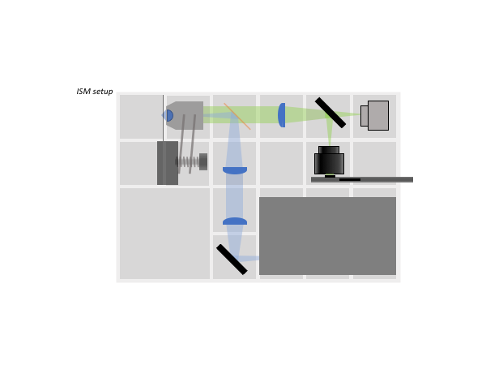
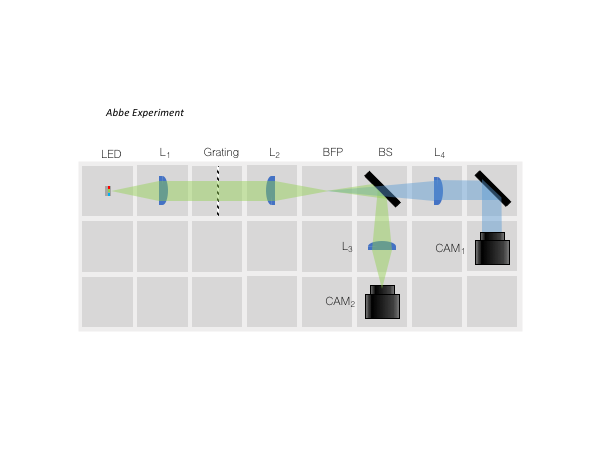
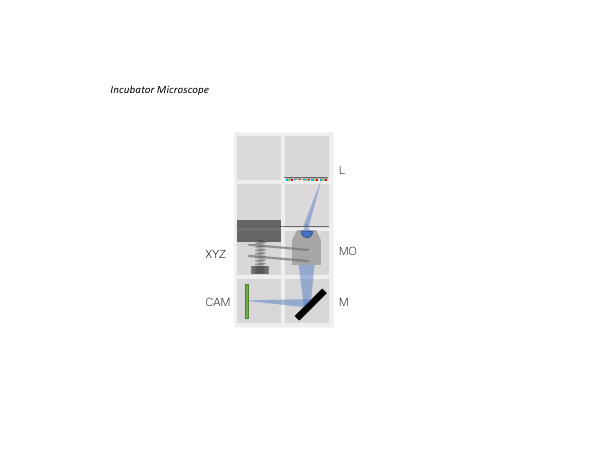
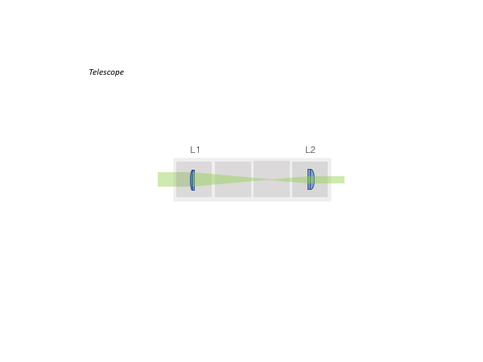
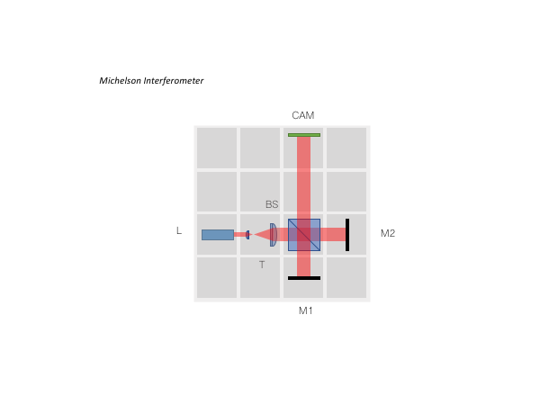
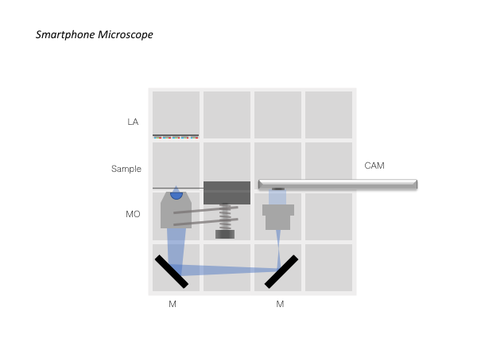
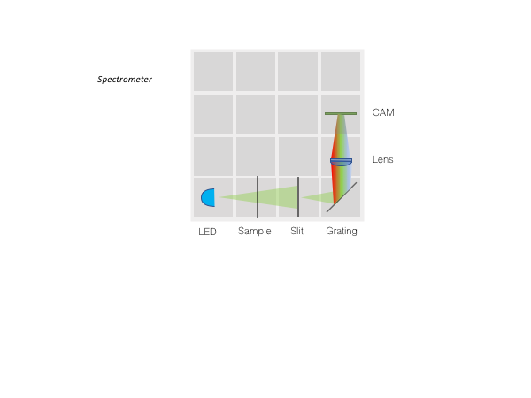

# The BOX
Very soon we would like to ofer a ready-to-use box being able to make a growing number of different optical experiments possible. 

Useful for Workshops. Get back to use if you want to organize one together with us!

## Necessary Parts 
A file which lists all modules and components necessary to build one of those boxes can be found [here](./DOCUMENTS/Bill_of_Materials_In-Incubator-Microscope_v0.xlsx).

The overall price-tag is around 600€ including the Raspberry Pi, Camera, Optics, 3D printed parts and all additional components. 

## Possible Setups
What's inside the box? 

### Image Scanning Microscopy (ISM)

### Abbe Diffraction Experiment

### Incubator Microscope 

### Incubator Microscope w/ Fluorescence

### Light-sheet Microscope

### Telescope

### In-Line Holographic Microscope

### Michelson Interferometer

### Cellphone Microscope

### Spectrometer

## Participate
If you have a cool idea, please don't hesitate to write us a line, we are happy to incorporate it in our design to make it even better. 