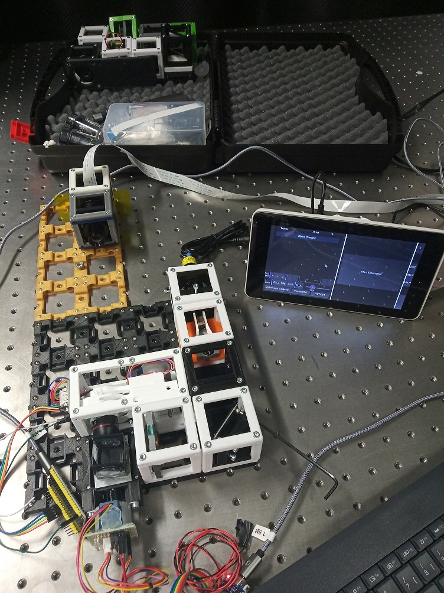

# The BOX
Very soon we would like to offer a ready-to-use box being able to make a growing number of different optical experiments possible.

## Choose [SimpleBOX](./SimpleBOX) for schools and demonstration of basic optical principles:

## Choose [FullBOX](./FullBOX) for adventurous biologists and microscopy enthusiasts:

Useful for Workshops. Get back to us if you want to organize one together with us!

## Participate
If you have a cool idea, please don't hesitate to write us a line, we are happy to incorporate it in our design to make it even better.
