# Building The MiniBOX and SimpleBOX

This is a guide for building the [SimpleBOX and MiniBOX](../). If you were looking for another BOX version, [click here](../../).

([TUT09 of TUTORIALS](../../../TUTORIALS)), assuming that you already went through the previous tutorials, the instructions here should be easy to follow. If you jump in directly, consider starting with the basic tutorials.

* Total price: under 130 € for SimpleBOX, under 80 € for MiniBOX (assuming only material costs and printing everything yourself)
* Printing time including preparation: under 4 days for SimpleBOX, under 2 days for MiniBOX
Laser cutting the inserts takes less than 10 minutes
* Assembly time: under 1 day

### Content
1. [Shopping](#-shopping)
1. [3D printing](#-3d-printing)
1. [Tools](#-which-tools-to-use)
1. [Assembly](#-assembly)
1. [Laser cutting](#-laser-cutting)

##  Shopping
### What to buy
Check out the [RESOURCES](../../../TUTORIALS/RESOURCES) for more information! The parts here are the cheapest or easily accessible for universities, but almost everything has an alternative in Amazon!

Note: Getting the right lenses is always a bit of an issue. The important thing is that you have one 100 mm convex lens, one 50 mm concave lens and two 40-50 mm convex lenses. If you find the lenses somewhere else and they have a different diameter, you can use the [customizable lens insert](../../../CAD/ASSEMBLY_CUBE_Lens/OPENSCAD) to fit them into the cube.

Link - name of part             |  Amount |  Comment | Price
  :-------------------------:|:----------------------------:|:-------------------------:|:-------------------------:
  3D printing material|~260 g| Choose material that works with your 3D printer. If unsure, have a look at the guide in [3D printing section](#-3d-printing)|8 €
  [Microscope objective 4×](https://de.aliexpress.com/item/4000427537503.html?spm=a2g0o.productlist.0.0.67751923tf28yw&algo_pvid=d7e0bea4-603e-411b-bfe1-e91922089544&algo_exp_id=d7e0bea4-603e-411b-bfe1-e91922089544-0&pdp_ext_f=%7B%22sku_id%22%3A%2210000001769780340%22%7D&pdp_npi=2%40dis%21EUR%2114.77%2110.93%21%21%21%21%21%400b0a187916687190391142217efb81%2110000001769780340%21sea&curPageLogUid=rjBSQLfsavAW)  |  1 piece | It is possible to use 10× objective as well, but we recommend 4× for this setup.| 11 €
  [Lens 100 mm](https://optikbaukasten.de/)  |  1 piece |Artikel 2004|6 €
  [Lens 40 mm](https://optikbaukasten.de/)  |  2 pieces |Artikel 2120|12 €
  [Lens -50 mm](https://www.thorlabs.com/thorproduct.cfm?partnumber=LC1259)  |  1 piece |LC1259|19 €
  [Alternative: Lens 100 mm](https://ajaxscientific.com/product/bi-convex-lens/)  |  1 piece |LI150-0100|2,5 €
  [Alternative: Lens 50 mm](https://ajaxscientific.com/product/bi-convex-lens/)  |  2 pieces |LI150-0050|2,5 €
  [Alternative: Lens -50 mm](https://ajaxscientific.com/product/bi-concave-lens/)  |  1 piece |LI140-0050|3 €
  [Mirror](https://www.rayher.com/de/spiegelmosaik-selbstklebend-14548606)  |  2 pieces | 45 pieces package, only 2 pieces needed.|0,50 €
  [Magnets](https://www.magnetladen.de/kugelmagnet-5-mm-n42-nickel/)  |  32 pieces | When using 3DP Cubes and baseplates. Ball magnets, diameter 5 mm.|total 10 €
  [Screws](https://eshop.wuerth.de) |   7 pieces | (Art.-Nr. 00843  12) M3×12, galvanized steel - 2  pieces; (Art.-Nr. 00843  8) M3×8, galvanized steel - 4 pieces ; (Art.-Nr. 00943  30) M3×30, not magnetic - 1 piece; (Art.-Nr. 03223) M3 nut | total ~2 €
  [Screws](https://eshop.wuerth.de) |   112 pieces | For 3DP Cubes extra: (Art.-Nr. 00843  12) M3×12, galvanized steel - 32  pieces; (Art.-Nr. 00843  8) M3×8, galvanized steel - 32 pieces (or 64 pieces of M3×12) ; (Art.-Nr. 025505 8) M5×8, galvanized steel - 48  pieces | total ~3 €
  [Chocolate](https://prod-cd-origin.milka.de/produkte/milka-weisse-schokolade)|1 bar| Use it as a reward when you're done.

### Extra parts for SimpleBOX
Link - name of part             |  Amount |  Comment | Price
  :-------------------------:|:----------------------------:|:-------------------------:|:-------------------------:
  3D printing material|some more| |2-5 €
  [Eyepiece 10×](https://de.aliexpress.com/item/32897739739.html?spm=a2g0s.9042311.0.0.466f4c4dehniSH)  |  1 piece | The holder is designed for an eyepiece of this diameter. Sold in pairs.|13 €
  Lens 100 mm  |  1 piece |An extra one above the MiniBOX|? €
  [Flashlight](https://www.pollin.de/p/led-taschenlampe-alu-5-w-cree-led-3xmicro-schwarz-b-ware-535448)  |  1 piece | Light source for the projector and microscope.|7 €
  [Screws](https://eshop.wuerth.de/Zylinderschraube-mit-Innensechskant-SHR-ZYL-ISO4762-88-IS25-A2K-M3X12/00843%20%2012.sku/de/DE/EUR/) |   ~20 pieces | For 3DP Cubes extra: M3×12, galvanized steel - 12  pieces; M3×8, galvanized steel - 12 pieces extra for putting screws to all sides of all cubes (or 24 pieces of M3×12); M5×8, galvanized steel - 18  pieces | total ~2 €
  [Chocolate](https://prod-cd-origin.milka.de/produkte/milka-weisse-schokolade)|1 bar| One more won't kill you if you already ate the previous one ;-)

##  3D Printing:

###  Parts
To acquire the STL-files use the [UC2-Configurator](https://uc2configurator.netlify.app/). The files themselves are in the [RAW](../../../CAD/RAW/STL) folder. The BOXes can be built using injection-moulded (IM) or 3D-printed (3DP) cubes.

Note on the lens holders: If you use some other lens, you can generate a holder for it using our openSCAD design. Go to the [Thingiverse page of this lens holder](https://www.thingiverse.com/thing:4377691) and use their in-built customizer to change the parameters of the insert.

Completely new to 3D printing? Have a look into this [beginner's guide](https://www.makeuseof.com/tag/beginners-guide-3d-printing/)!

Our quick printing tutorial can be found here:

We have a good experience with this printer and settings:
* Prusa i3/MK3S
  * For MiniBOX: Prusament PLA 1,75 mm, for one Box: 0,26 g = 88 m = 35 hours = 8 €
  * For MiniBOX - Inserts only (using IM cubes): Prusament PLA 1,75 mm, for one Box: 0,12 g = 38 m = 12 hours = 3 €
  * For SimpleBOX in total: Prusament PLA 1,75 mm, for one Box: 0,455 kg = 152,53 m = 69 hours = 13 €
  * Profile Optimal 0,15 mm, infill 20%, no support, 215/60°C

Printing hint:

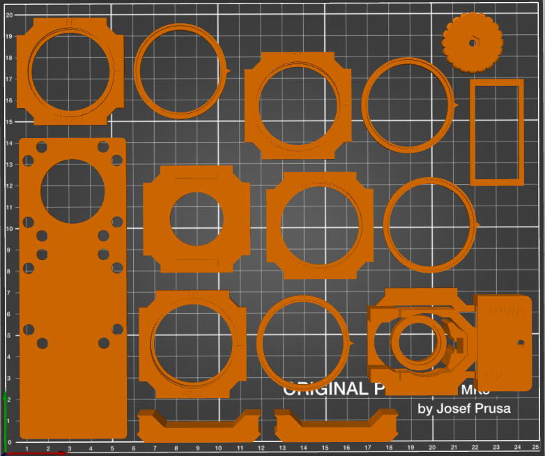

##  Which tools to use
Tool             |  Image|  Comment
:-------------------------:|:----------------------------:|:-------------------------:
[Electric screw driver with 2,5 mm hex bit](https://www.amazon.de/Bosch-Akkuschrauber-Generation-Bits-Ladeger%C3%A4t/dp/B00TTZU566/ref=asc_df_B00TTZU566/?tag=googshopde-21&linkCode=df0&hvadid=255989693737&hvpos=1o1&hvnetw=g&hvrand=6125749874385941808&hvpone=&hvptwo=&hvqmt=&hvdev=c&hvdvcmdl=&hvlocint=&hvlocphy=9042960&hvtargid=pla-421346020200&psc=1&th=1&psc=1) | | For putting the cubes together using M3×12 and M3×8 screws.
[2,5 mm hex key](https://www.amazon.de/Presch-Innensechskant-Satz-Kugelkopf-Innensechskantschl%C3%BCssel/dp/B079V335CR/ref=sr_1_2_sspa?__mk_de_DE=%C3%85M%C3%85%C5%BD%C3%95%C3%91&crid=2K89GU3MY8P26&keywords=hex+key+set&qid=1575997133&s=diy&sprefix=hex+%2Cdiy%2C160&sr=1-2-spons&psc=1&spLa=ZW5jcnlwdGVkUXVhbGlmaWVyPUEzRENMU0hKWkJRR0FEJmVuY3J5cHRlZElkPUEwMDIzMjIyMzFBWVIyOEpORU1FSCZlbmNyeXB0ZWRBZElkPUEwMzk0NjQwMlA0NFZDTVk0Tk9LUSZ3aWRnZXROYW1lPXNwX2F0ZiZhY3Rpb249Y2xpY2tSZWRpcmVjdCZkb05vdExvZ0NsaWNrPXRydWU=) | | For fine adjustment of all the M3 screws if needed. The middle one in the picture.
[Needle-nose Pliers](https://www.amazon.de/Br%C3%BCder-Mannesmann-Telefonzange-gerade-M10948/dp/B003A63EIG/ref=sr_1_3?__mk_de_DE=%C3%85M%C3%85%C5%BD%C3%95%C3%91&keywords=needle+nose+pliers&qid=1575997091&s=diy&sr=1-3) | | Might come handy

##   Assembly
Part - link             |  Result|  Comment
:-------------------------:|:----------------------------:|:-------------------------:
[Baseplates](../../../CAD/ASSEMBLY_Baseplate)||8× baseplate puzzle
[Lens Cubes](../../../CAD/ASSEMBLY_CUBE_Lens)|| 4× Lens Cube;  1× extra lens cube for SimpleBOX
[Mirror Cubes](../../../CAD/ASSEMBLY_CUBE_Mirror_45)|| 2× Mirror Cube
[Sample Cube](../../../CAD/ASSEMBLY_CUBE_Sample_Holder)||1× Sample Holder Cube
[Z-Stage Cube](../../../CAD/ASSEMBLY_CUBE_Z-STAGE_mechanical)||1× mechanical Z-Stage
[Flashlight Cube](../../../CAD/ASSEMBLY_CUBE_Flashlight)|| 1× Flashlight Cube for SimpleBOX
[Eyepiece and Smartphone Cube](../../../CAD/ASSEMBLY_CUBE_Eyepiece)||1× Eyepiece Cube with Smartphone Holder for SimpleBOX; Smartphone holder is also useful for MiniBOX

##  Laser cutting
Alternatively, all the inserts of the MiniBOX can be produced using a laser cutter in just a few minutes. In the [LC_inserts](./LC_inserts) folder you find the .pdf and .svg file for all the inserts you need. The Inventor .ipt files and the .dwg drawing (editable) are in the [RAW](../../../CAD/RAW/LC) folder.

**What you should know about the LC inserts:**
* They are compatible with both the IM and 3DP Cubes
* A 3D printer always makes the parts a little bigger than in the design. A laser cutter always makes the parts a little smaller than in the design. This is why the LC inserts are designed bigger that the 3DP ones
* The printing time of the inserts is around 12 hours. The laser cutting time is under 10 minutes.
* There might be a local maker space at your university or town with a laser cutter available
* The inserts are designed for being made of acrylic, 3 mm thick
* Additionally, for the lenses, use some kind of fluffy foam material (see pictures below) as a padding around the lens and between the acrylic plates
* The inserts are made of one or more layers and held together by screws and nuts. Stainless steel is a good option here.
* The optical components are the same as listed above. If you print the cubes and baseplates you will also need the respective screws and magnets. The screws that hold together the 3DP cubes have to be magnetic in order to attach to the baseplate magnets - no stainless steel!
* We are still new to this method, so if you have any suggestions for improvements, let us know! :-)

Link - name of part             |  Amount |  Comment | Price
:-------------------------:|:----------------------------:|:-------------------------:|:-------------------------:
Acrylic|~A4 size|3 mm thick|~4€
Screws and nuts |   52 pieces | M3×12 - 2  pieces; M3×16 - 20  pieces; M3×18 - 4  pieces; M3 nut - 26 pieces | total ~4 €
Spring|2 pieces| Diameter 4-6 mm, Length 5 mm (or cut a 10 mm on e in half) |0,01€
Optics||Lenses, mirrors and an objective as listed above. The LC inserts are designed for the lenses from Ajax Scientific.|~22€

#### Objective holder
The objective holder is a single part with a triangle-like hole, in which the objective is pressed into.

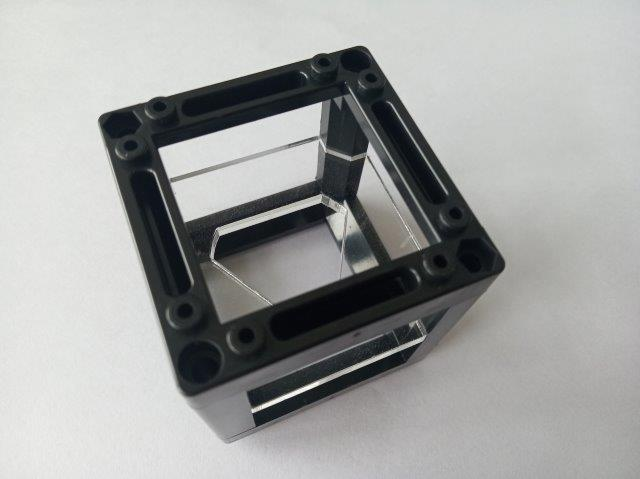
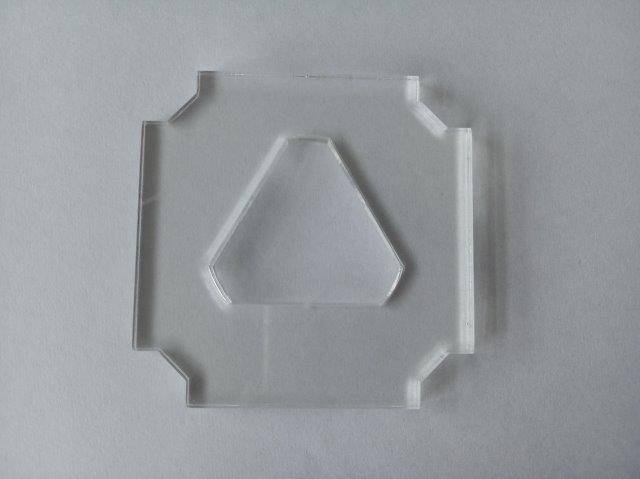
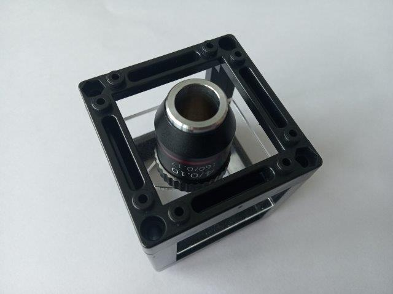

#### Lens holders
Each lens holder is composed of two acrylic plates and a foam layer. It is held together by four M3 screw + nuts. For the negative lens, use the M3×18 screws (it's very thick).

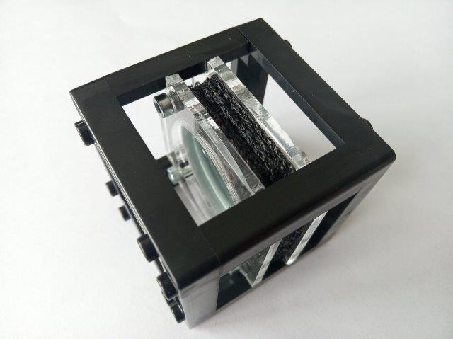
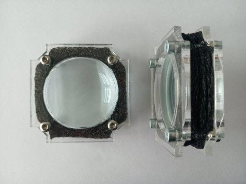

#### Mirror holders
The mirror holder is composed of four layers, as shown in the renderings below. The reason is that we have to create a "groove" that will hold the mirror on the edges of the cube. Therefore, the biggest plate goes in the back, followed by the smaller plate on which the mirror is glued. The mirror is tightly surrounded by two plates (the bigger pair). The smaller pair is on top, as it has a little overhang on the outer side.

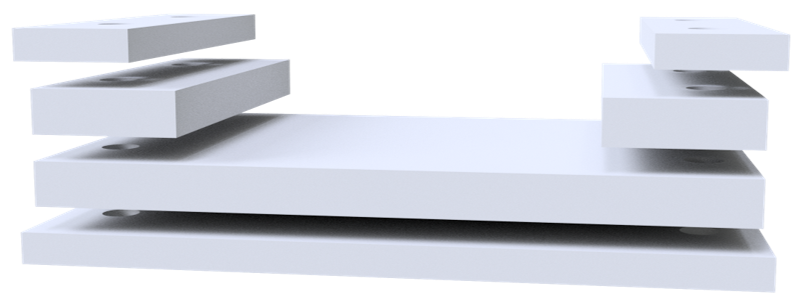
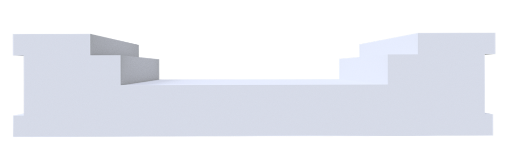

The plates are held together by four M3 screws with nuts.

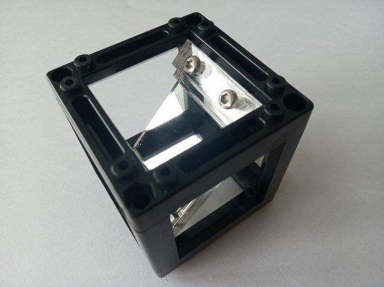

#### Sample holder
Two arms are attached to the insert, holding a microscope slide in position. The springs are placed between the arm and the insert and the screw is fixed using a nut on the other side.

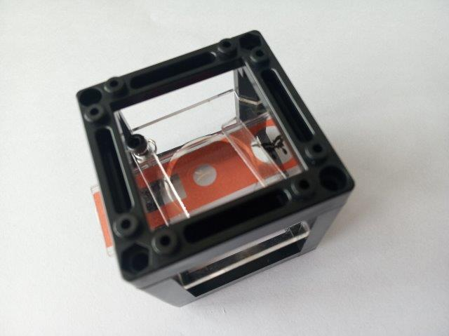
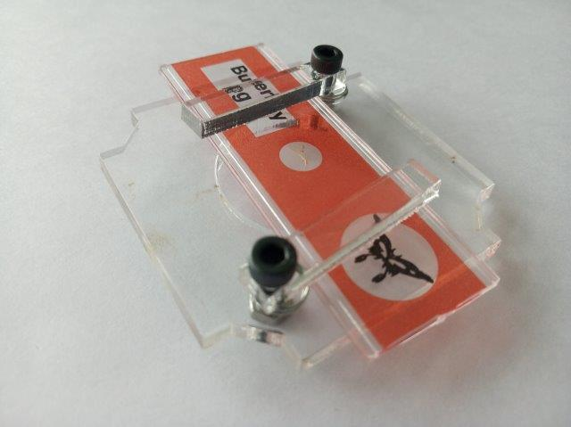

#### Smartphone holders
The Smartphone holder plate is pressed on top of a cube or two neighbouring cubes, just as the printed one.

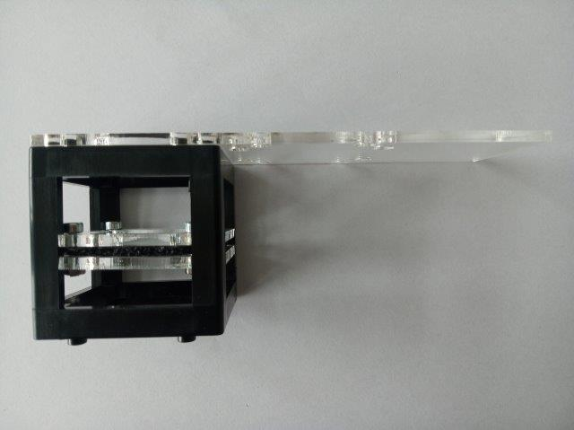
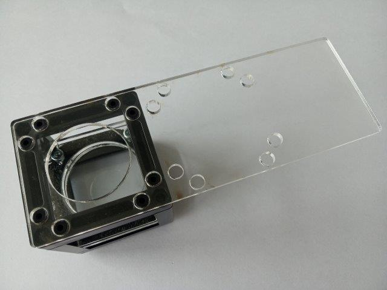

#### Complete Box
This is a prototype of the MiniBOX for mass production. Using the laser cutter decreases the production time significantly and to maker spaces and such it's usually as available as 3D printing. There is surely space for improvement - please let us know what you think about it!

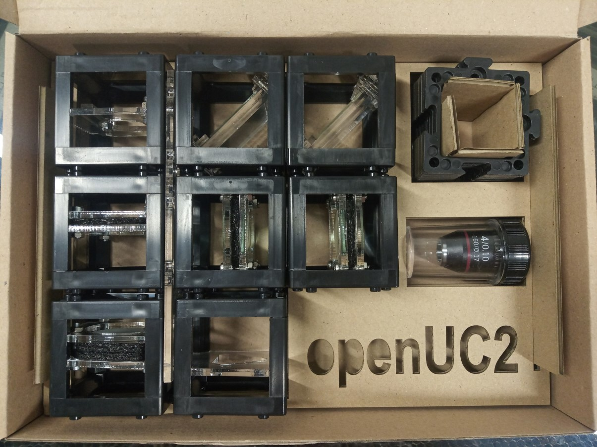

Laser cutter Icon source: Icons made by <a href="https://www.flaticon.com/authors/smashicons" title="Smashicons">Smashicons</a> from <a href="https://www.flaticon.com/" title="Flaticon">www.flaticon.com</a>

##  Done! Great job! Explore the experiments with our [work sheets](../DOCUMENTS/SimpleBOX/UC2_simpleBOX_EN.pdf) now.
