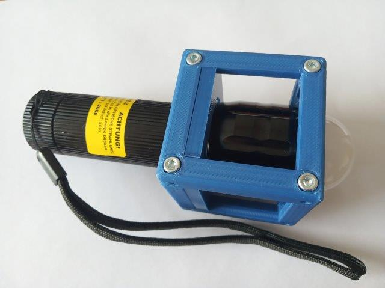
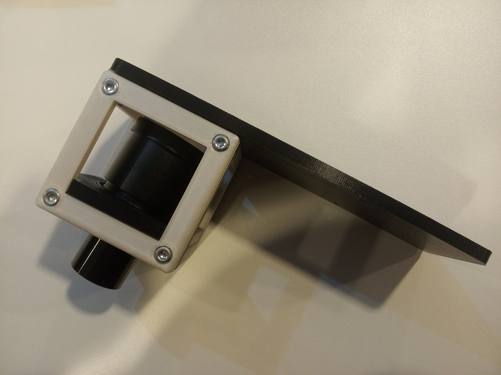

# Building The MiniBOX and SimpleBOX

This is a guide for building the [SimpleBOX and MiniBOX](../SimpleBOX). If you were looking for another BOX version, [click here](../../).

* Total price: under 150 € for SimpleBOX, around 80 € for MiniBOX
* Printing time including preparation: under 4 days for SimpleBOX, under 2 days for MiniBOX
* Assembly time: under 1 day

### Content
1. [Shopping](#-shopping)
1. [3D printing](#-3d-printing)
1. [Tools](#-which-tools-to-use)
1. [Assembly](#-assembly)

##  Shopping
### What to buy
Check out the [RESOURCES](../../../TUTORIALS/RESOURCES) for more information! The parts here are the cheapest or easily accessible for universities, but almost everything has an alternative in Amazon!

Link - name of part             |  Amount |  Comment | Price
  :-------------------------:|:----------------------------:|:-------------------------:|:-------------------------:
  3D printing material|~260 g| Choose material that works with your 3D printer. If unsure, have a look at the guide in [3D printing section](#-3d-printing)|8 €
  [Microscope objective 4×](https://de.aliexpress.com/item/32947647522.html?spm=a2g0x.search0104.3.54.6cf57a4c3DwsTO&transAbTest=ae803_3&ws_ab_test=searchweb0_0%2Csearchweb201602_6_10065_10130_10068_10890_10547_319_10546_317_10548_10545_10696_10084_453_454_10083_10618_10307_537_536_10902_10059_10884_10887_321_322_10103%2Csearchweb201603_6%2CppcSwitch_0&algo_pvid=06d972be-b176-4446-8665-56d9e61a8d2c&algo_expid=06d972be-b176-4446-8665-56d9e61a8d2c-7)  |  1 piece | It is possible to use 10× objective as well, but we recommend 4× for this setup.| 11 €
  [Lens 100 mm](https://optikbaukasten.de/)  |  1 piece |Artikel 2004|6 €
  [Lens 40 mm](https://optikbaukasten.de/)  |  2 pieces |Artikel 2120|12 €
  [Lens -50 mm](https://www.thorlabs.com/thorproduct.cfm?partnumber=LC1259)  |  1 piece |LC1259|19 €
  [Mirror](https://www.rayher.com/de/spiegelmosaik-selbstklebend-14548606)  |  2 pieces | 45 pieces package, only 2 pieces needed.|0,50 €
  [Magnets](https://www.magnetladen.de/kugelmagnet-5-mm-n42-nickel/)  |  32 pieces | When using 3DP Cubes and baseplates. Ball magnets, diameter 5 mm.|total 10 €
  [Screws](https://eshop.wuerth.de) |   7 pieces | (Art.-Nr. 00843  12) M3×12, galvanized steel - 2  pieces; (Art.-Nr. 00843  8) M3×8, galvanized steel - 4 pieces ; (Art.-Nr. 00943  30) M3×30, not magnetic - 1 piece; (Art.-Nr. 03223) M3 nut | total ~2 €
  [Screws](https://eshop.wuerth.de) |   112 pieces | For 3DP Cubes extra: (Art.-Nr. 00843  12) M3×12, galvanized steel - 32  pieces; (Art.-Nr. 00843  8) M3×8, galvanized steel - 32 pieces (or 64 pieces of M3×12) ; (Art.-Nr. 025505 8) M5×8, galvanized steel - 48  pieces | total ~3 €
  [Chocolate](https://prod-cd-origin.milka.de/produkte/milka-weisse-schokolade)|1 bar| Use it as a reward when you're done.

### Extra parts for SimpleBOX
Link - name of part             |  Amount |  Comment | Price
  :-------------------------:|:----------------------------:|:-------------------------:|:-------------------------:
  3D printing material|some more| |2-5 €
  [Eyepiece 10×](https://de.aliexpress.com/item/32897739739.html?spm=a2g0s.9042311.0.0.466f4c4dehniSH)  |  1 piece | The holder is designed for an eyepiece of this diameter. Sold in pairs.|11 €
  [Lens 100 mm](https://optikbaukasten.de/)  |  1 piece |Artikel 2004|6 €
  [Flashlight](https://www.pollin.de/p/led-taschenlampe-alu-5-w-cree-led-3xmicro-schwarz-b-ware-535448)  |  1 piece | Light source for the projector and microscope.|7 €
  [Screws](https://eshop.wuerth.de/Zylinderschraube-mit-Innensechskant-SHR-ZYL-ISO4762-88-IS25-A2K-M3X12/00843%20%2012.sku/de/DE/EUR/) |   ~20 pieces | For 3DP Cubes extra: M3×12, galvanized steel - 12  pieces; M3×8, galvanized steel - 12 pieces extra for putting screws to all sides of all cubes (or 24 pieces of M3×12); M5×8, galvanized steel - 18  pieces | total ~2 €
  [Chocolate](https://prod-cd-origin.milka.de/produkte/milka-weisse-schokolade)|1 bar| One more won't kill you if you already ate the previous one ;-)

##  3D Printing:

###  Parts
To acquire the STL-files use the [UC2-Configurator](https://uc2configurator.netlify.app/). The files themselves are in the [RAW](../RAW/STL) folder. The BOXes can be built using injection-moulded (IM) or 3D-printed (3DP) cubes.

Note on the lens holders: If you use some other lens, you can generate a holder for it using our openSCAD design. Go to the [Thingiverse page of this lens holder](https://www.thingiverse.com/thing:4377691) and use their in-built customizer to change the parameters of the insert.

Completely new to 3D printing? Have a look into this [beginner's guide](https://www.makeuseof.com/tag/beginners-guide-3d-printing/)!

Our quick printing tutorial can be found here:

We have a good experience with this printer and settings:
* Prusa i3/MK3S
  * For MiniBOX: Prusament PLA 1,75 mm, for one Box: 0,26 g = 88 m = 38 hours = 8 €
  * For SimpleBOX in total: Prusament PLA 1,75 mm, for one Box: 0,455 kg = 152,53 m = 69 hours = 13 €
  * Profile Optimal 0,15 mm, infill 20%, no support, 215/60°C

##  Which tools to use
Tool             |  Image|  Comment
:-------------------------:|:----------------------------:|:-------------------------:
[Electric screw driver with 2,5 mm hex bit](https://www.amazon.de/Bosch-Akkuschrauber-Generation-Bits-Ladeger%C3%A4t/dp/B00TTZU566/ref=asc_df_B00TTZU566/?tag=googshopde-21&linkCode=df0&hvadid=255989693737&hvpos=1o1&hvnetw=g&hvrand=6125749874385941808&hvpone=&hvptwo=&hvqmt=&hvdev=c&hvdvcmdl=&hvlocint=&hvlocphy=9042960&hvtargid=pla-421346020200&psc=1&th=1&psc=1) | | For putting the cubes together using M3×12 and M3×8 screws.
[2,5 mm hex key](https://www.amazon.de/Presch-Innensechskant-Satz-Kugelkopf-Innensechskantschl%C3%BCssel/dp/B079V335CR/ref=sr_1_2_sspa?__mk_de_DE=%C3%85M%C3%85%C5%BD%C3%95%C3%91&crid=2K89GU3MY8P26&keywords=hex+key+set&qid=1575997133&s=diy&sprefix=hex+%2Cdiy%2C160&sr=1-2-spons&psc=1&spLa=ZW5jcnlwdGVkUXVhbGlmaWVyPUEzRENMU0hKWkJRR0FEJmVuY3J5cHRlZElkPUEwMDIzMjIyMzFBWVIyOEpORU1FSCZlbmNyeXB0ZWRBZElkPUEwMzk0NjQwMlA0NFZDTVk0Tk9LUSZ3aWRnZXROYW1lPXNwX2F0ZiZhY3Rpb249Y2xpY2tSZWRpcmVjdCZkb05vdExvZ0NsaWNrPXRydWU=) | | For fine adjustment of all the M3 screws if needed. The middle one in the picture.
[Needle-nose Pliers](https://www.amazon.de/Br%C3%BCder-Mannesmann-Telefonzange-gerade-M10948/dp/B003A63EIG/ref=sr_1_3?__mk_de_DE=%C3%85M%C3%85%C5%BD%C3%95%C3%91&keywords=needle+nose+pliers&qid=1575997091&s=diy&sr=1-3) | | Might come handy

##   Assembly
Part - link             |  Result|  Comment
:-------------------------:|:----------------------------:|:-------------------------:
[Baseplates](../../../CAD/ASSEMBLY_Baseplate)||1× baseplate puzzle
[Lens Cubes](../../../CAD/ASSEMBLY_CUBE_Lens)|| 4× Lens Cube;  1× extra lens cube for SimpleBOX
[Mirror Cubes](../../../CAD/ASSEMBLY_CUBE_Mirror_45)|| 2× Mirror Cube
[Sample Cube](../../../CAD/ASSEMBLY_CUBE_Sample_Holder)||1× Sample Holder Cube
[Z-Stage Cube](../../../CAD/ASSEMBLY_CUBE_Z-STAGE_mechanical)||1× mechanical Z-Stage
[Flashlight Cube](../../../CAD/ASSEMBLY_CUBE_Flashlight)|| 1× Flashlight Cube for SimpleBOX
[Eyepiece and Smartphone Cube](../../../CAD/ASSEMBLY_CUBE_Eyepiece)||1× Eyepiece Cube with Smartphone Holder for SimpleBOX; Smartphone holder is also useful for MiniBOX

##  Done! Great job! Explore the experiments with our [work sheets](../DOCUMENT/UC2_simpleBOX.pdf) now.
