# MiniBOX
MiniBOX has only 8 cubes but shows the same experiments as the SimpleBOX. When you print the parts at home, the overall price is around 80 €.

SimpleBOX, equipped with passive components only, covers the basic experiments of ray optics. It is compact and cheap and therefore can be handed to children of all age. It completely covers the classical optics experiments of 7th-8th grade with an overhang to the high school experiments.

That's how it could look like:

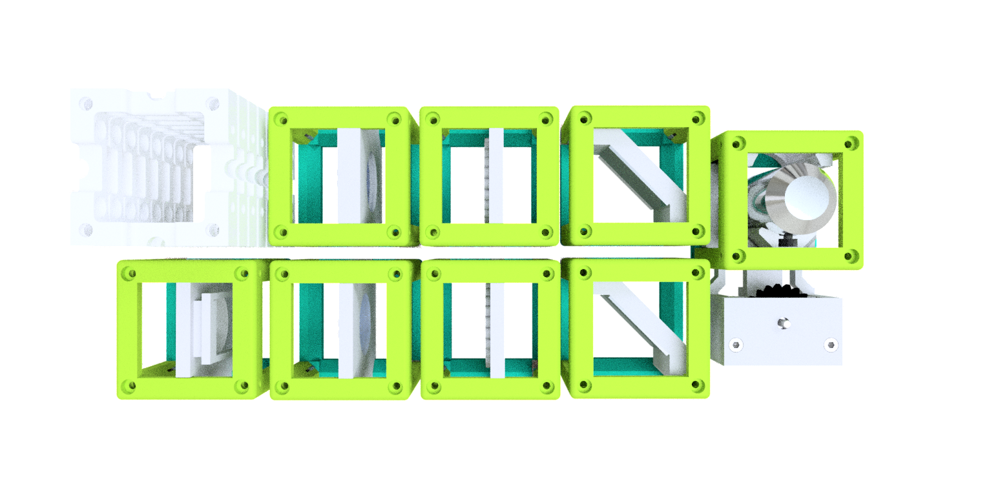

##  Build the BOX

###  Shopping

Link - name of part             |  Amount |  Comment | Price per amount used
  :-------------------------:|:----------------------------:|:-------------------------:|:-------------------------:
  3D printing material|~260 g| Choose material that works with your 3D printer. If unsure, have a look at the guide in [3D printing section](#3d-printing)|8 €
  [Microscope objective 4×](https://de.aliexpress.com/item/32947647522.html?spm=a2g0x.search0104.3.54.6cf57a4c3DwsTO&transAbTest=ae803_3&ws_ab_test=searchweb0_0%2Csearchweb201602_6_10065_10130_10068_10890_10547_319_10546_317_10548_10545_10696_10084_453_454_10083_10618_10307_537_536_10902_10059_10884_10887_321_322_10103%2Csearchweb201603_6%2CppcSwitch_0&algo_pvid=06d972be-b176-4446-8665-56d9e61a8d2c&algo_expid=06d972be-b176-4446-8665-56d9e61a8d2c-7)  |  1 piece | It is possible to use 10× objective as well, but we recommend 4× for this setup.| 11 €
  [Lens 100 mm](https://optikbaukasten.de/)  |  1 piece |Artikel 2004|6 €
  [Lens 40 mm](https://optikbaukasten.de/)  |  2 pieces |Artikel 2120|12 €
  [Lens -50 mm](https://www.thorlabs.com/thorproduct.cfm?partnumber=LC1259)  |  1 piece |LC1259|19 €
  [Mirror](https://www.rayher.com/de/spiegelmosaik-selbstklebend-14548606)  |  2 pieces | 45 pieces package, only 2 pieces needed.|0,50 €
  [Magnets](https://www.magnetladen.de/kugelmagnet-5-mm-n42-nickel/)  |  32 pieces | Ball magnets, diameter 5 mm.|12 €
  [Screws](https://eshop.wuerth.de) |   ~40 pieces | (Art.-Nr. 00843  12) M3×12, galvanized steel - ~34  pieces; (Art.-Nr. 00843  8) M3×8, galvanized steel - ~3 pieces (35 pieces for putting screws to all sides of all cubes); (Art.-Nr. 00943  30) M3×30, not magnetic - 1 piece; (Art.-Nr. 03223) M3 nut | ~3 €
  [Chocolate](https://www.milka.de/produkte/milka-standard-tafeln/milka-wei%c3%9fe-schokolade?p=137&provider={D193998A-4A6D-4EA5-BAA8-209357B27A09}&categoryId=1395)|1 bar| Use it as a reward when you're done.

###  3D Printing:

Completely new to 3D printing? Have a look into this [beginner's guide](https://www.makeuseof.com/tag/beginners-guide-3d-printing/)!

Our quick printing tutorial can be found here:

We have a good experience with this printer and settings:
* Prusa i3/MK3S
  * PLA 1,75 mm, for one Box: 0,26 g = 88 m = 38 hours = 8 €
  * Profile Optimal 0,15 mm, infill 20%, no support, 215/60°C

###   Housing
Name of part - Link to STL file             |  Amount
:-------------------------:|:----------------------------:
[(03) Basic Cube 1×1](./BUILD_ME/STL/03_10_Cube_1x1_v2.stl)  |  8 pieces
[(04) Basic Lid 1×1](./BUILD_ME/STL/04_10_Lid_1x1_v2.stl)  |  8 pieces
[(05) Baseplate 4×1](./BUILD_ME/STL/05_Assembly_base_4x1.stl)  |  2 pieces

###  Inserts

Name of part - Link to STL file            |  Amount |  Comment
:-------------------------:|:-------------------------:|:-------------------------:
[(07) Z-Stage Focusing Insert](./BUILD_ME/STL/07_20_focus_inlet_linearflexure_v0_1.stl)  |  1 piece  | Rotate the part in your slicer before printing. Always print it laying on the flat side.
[(08) Z-Stage Bottom Plate](./BUILD_ME/STL/08_20_focus_inlet_plate_bottom_2.stl) |  1 piece   | The plate holds the gear and screw in position, allowing the only to rotate but not to wobble.
[(09) Z-Stage Top Plate](./BUILD_ME/STL/09_20_focus_inlet_plate_top_3.stl) |  1 piece   | The plate holds the gear and screw in position, allowing the only to rotate but not to wobble.
[(10) Z-Stage Gear](./BUILD_ME/STL/10_20_focus_inlet_gear.stl) |  1 piece   | Kindly borrowed from [openflexure](https://openflexure.org).
[(11) Z-Stage Objective Mount](./BUILD_ME/STL/11_30_focus_inlet_objective_mount_v7_7.stl) |  1 piece   | For mounting the objective lens (RMS thread).
[(15) Mirror Holder 45° 30×30mm²](./BUILD_ME/STL/15_20_Cube_Insert_Mirror_Holder_30x30Mirror_v2.stl)  |  2 pieces | Size fits for the listed mirrors.
[(16) Generic Sample Holder](./BUILD_ME/STL/16_20_Cube_insert_Sample_holder.stl)  |  1 piece | It is used to hold the object in the projector setup and in the microscopes.
[(17) Generic Sample Holder Clamp](./BUILD_ME/STL/17_20_Cube_Insert_Sample_clamp.stl)  |  1 piece | To fix the sample.
[(18) Lens Holder - Thick lens](./BUILD_ME/STL/18_20_Lens_mount_thick_lens.stl)  |  1 piece | Diameter fits for 25 mm lenses. The thick holder is for the diverging lens.
[(19) Lens Holder - Thin lens](./BUILD_ME/STL/19_20_Lens_mount_Thin_lens.stl)  |  3 pieces | Diameter fits for 25 mm lenses. The thin holder is for the converging lenses.
[(20) Lens Holder Clamp](./BUILD_ME/STL/20_20_Lens_mount_clamp.stl)  |  4 pieces | Diameter fits for the listed lenses (25 mm).

###  Which tools to use
Tool             |  Image|  Comment
:-------------------------:|:----------------------------:|:-------------------------:
[Electric screw driver with 2,5 mm hex bit](https://www.amazon.de/Bosch-Akkuschrauber-Generation-Bits-Ladeger%C3%A4t/dp/B00TTZU566/ref=asc_df_B00TTZU566/?tag=googshopde-21&linkCode=df0&hvadid=255989693737&hvpos=1o1&hvnetw=g&hvrand=6125749874385941808&hvpone=&hvptwo=&hvqmt=&hvdev=c&hvdvcmdl=&hvlocint=&hvlocphy=9042960&hvtargid=pla-421346020200&psc=1&th=1&psc=1) |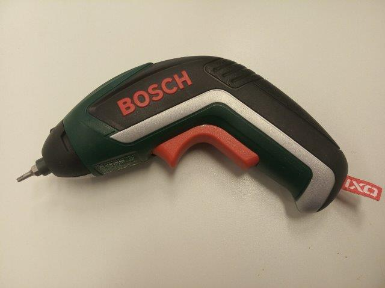 | For putting the cubes together using M3×12 and M3×8 screws.
[2,5 mm hex key](https://www.amazon.de/Presch-Innensechskant-Satz-Kugelkopf-Innensechskantschl%C3%BCssel/dp/B079V335CR/ref=sr_1_2_sspa?__mk_de_DE=%C3%85M%C3%85%C5%BD%C3%95%C3%91&crid=2K89GU3MY8P26&keywords=hex+key+set&qid=1575997133&s=diy&sprefix=hex+%2Cdiy%2C160&sr=1-2-spons&psc=1&spLa=ZW5jcnlwdGVkUXVhbGlmaWVyPUEzRENMU0hKWkJRR0FEJmVuY3J5cHRlZElkPUEwMDIzMjIyMzFBWVIyOEpORU1FSCZlbmNyeXB0ZWRBZElkPUEwMzk0NjQwMlA0NFZDTVk0Tk9LUSZ3aWRnZXROYW1lPXNwX2F0ZiZhY3Rpb249Y2xpY2tSZWRpcmVjdCZkb05vdExvZ0NsaWNrPXRydWU=) | | For fine adjustment of all the M3 screws if needed.

##   Assembly
Part - link             |  Result|  Comment
:-------------------------:|:----------------------------:|:-------------------------:
[Baseplates](../../../CAD/ASSEMBLY_Baseplate_v2)||2× baseplate 4×1
[Lens Cubes](../../../CAD/ASSEMBLY_CUBE_Lens_v2)|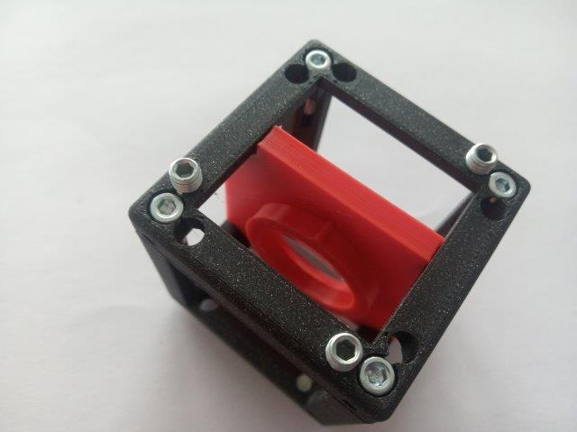| 4× Lens Cube; Write the focal lenghts of the lenses on the holders, so you can always easily find the right one when building different setups.
[Mirror Cubes](../../../CAD/ASSEMBLY_CUBE_Mirror_45_v2)|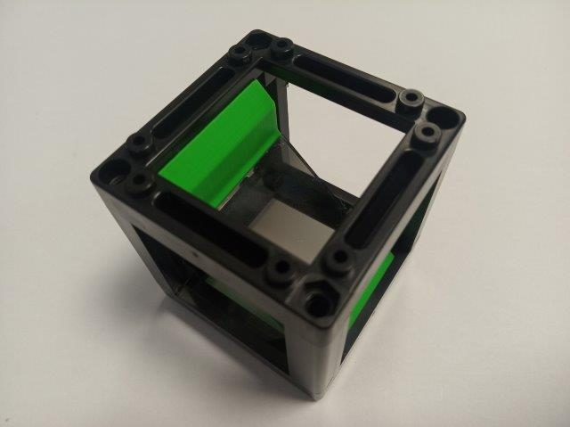| 2× Mirror Cube
[Sample Cube](../../../CAD/ASSEMBLY_CUBE_Sample_Holder_v2)||1× Sample Holder Cube
[Z-Stage Cube](../../../CAD/ASSEMBLY_CUBE_Z-STAGE_mechanical_v2)|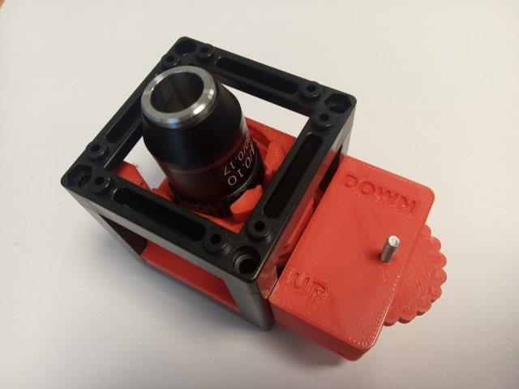|Attention! Here, the stage is put into a 1×1 cube - assembly is mostly the same but have a look at the following section 

#### Z-stage in 1×1 cube
The assembly is not very different when putting the Z-stage inside a 1×1 cube. In the pictures, you see how it should look like in the end:

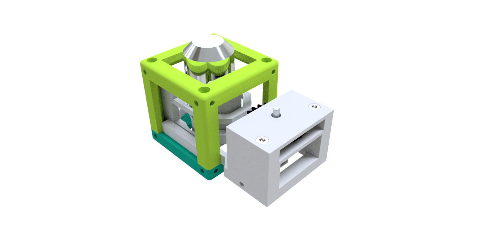

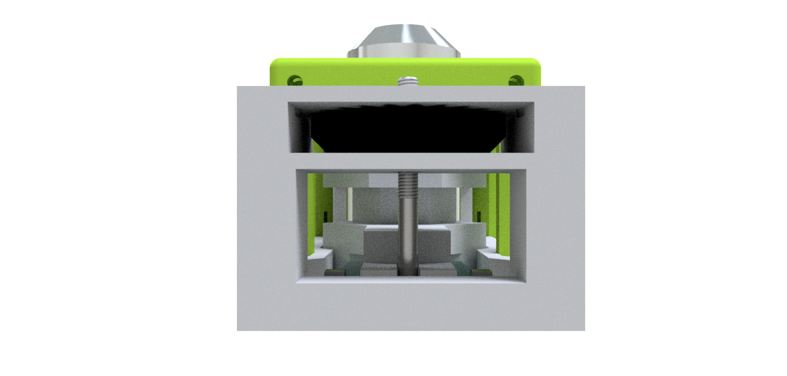
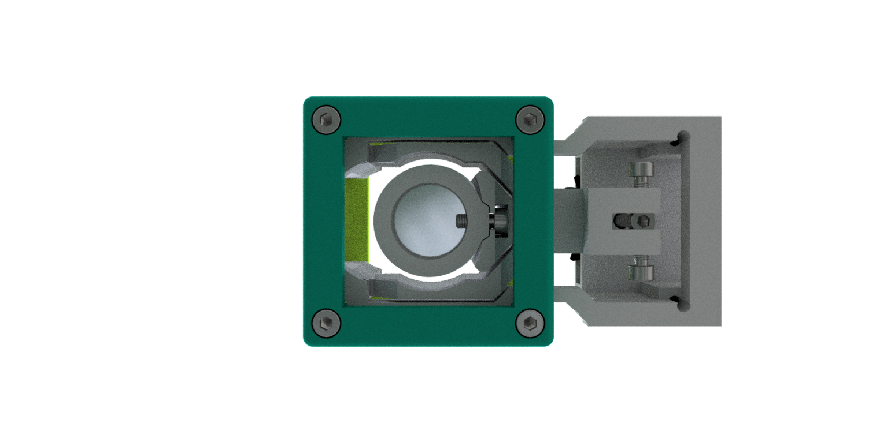

##  Done! Great job!

##  Setups
What can you build with the SimpleBOX?

### Projector
[LINK](../../APPLICATIONS/APP_SIMPLE-Projector)
 Simple one lens projector. Direct illumination. 4× magnification for *f(L)* = +40 mm, object to lens 50 mm and lens to screen 200 mm.

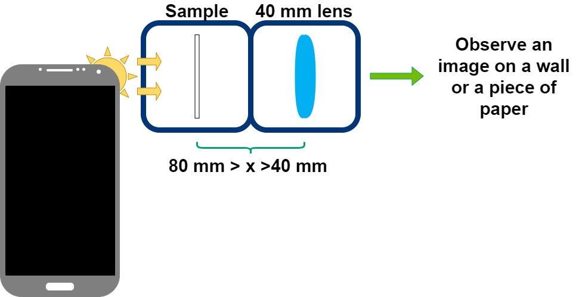

### Telescopes
[LINK](../../APPLICATIONS/APP_SIMPLE-Telescope)
Three classical telescope principles. 2× magnification for *f(L1)* = +100 mm, *f(L2)* = +40 mm, *f(L3)* = -50 mm.

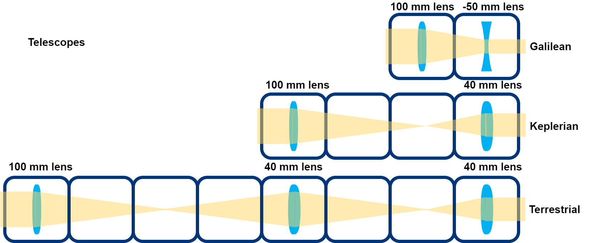

  

### Infinity-corrected microscope

### Smartphone Microscope
[LINK](../../APPLICATIONS/APP_SMARTPHONE_MICROSCOPE)
Trasmission microscope (finite corrected), uses smartphone for image acquisition. LED array serves as light source - different illumination modes possible.

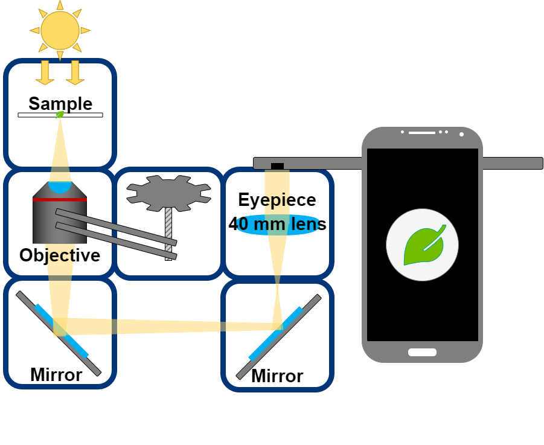

You also find some education material and more about the setups in DOCUMENTs in [ENGLISH](./DOCUMENTS/UC2_simpleBOX_EN.pdf), [GERMAN](./DOCUMENTS/UC2_simpleBOX_DE.pdf), [FRENCH](./DOCUMENTS/UC2_simpleBOX_FR.pdf) and [CZECH](./DOCUMENTS/UC2_simpleBOX_CZ.pdf).

##  Participate
If you have a cool idea, please don't hesitate to write us a line, we are happy to incorporate it in our design to make it even better.
