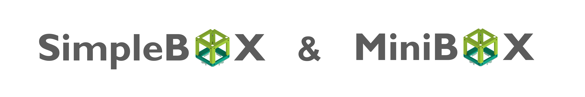
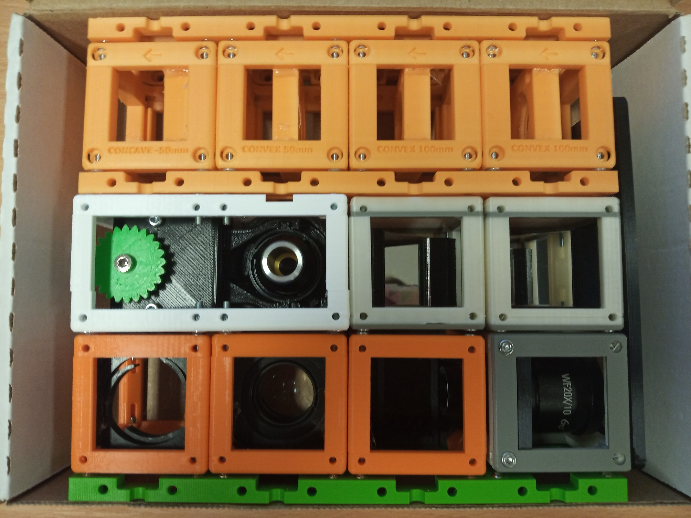
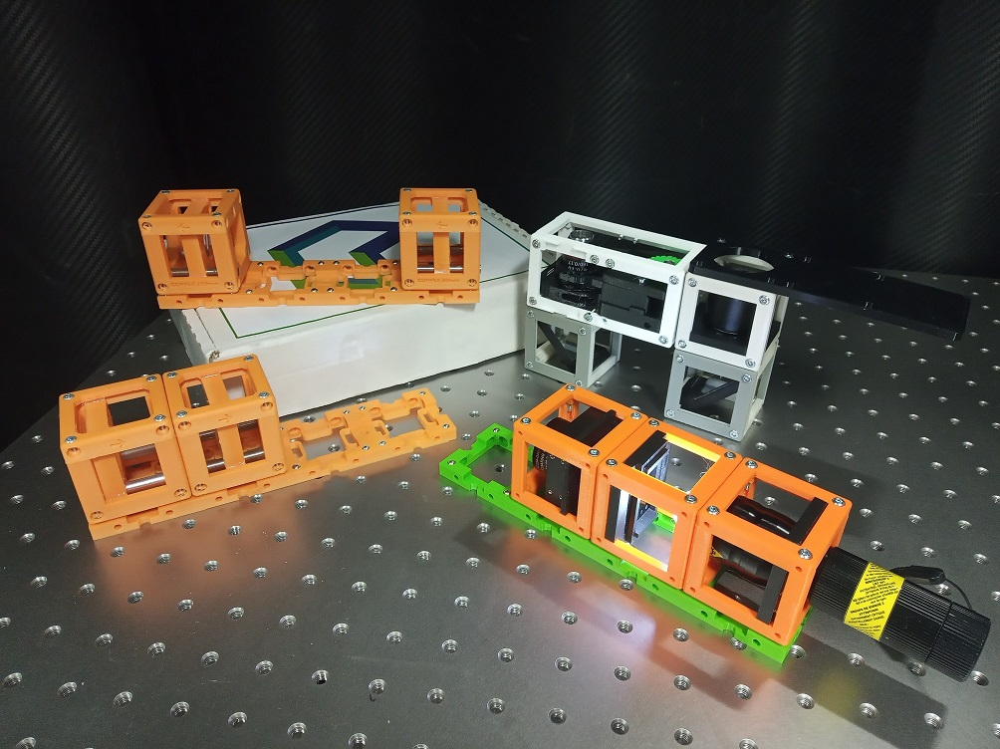
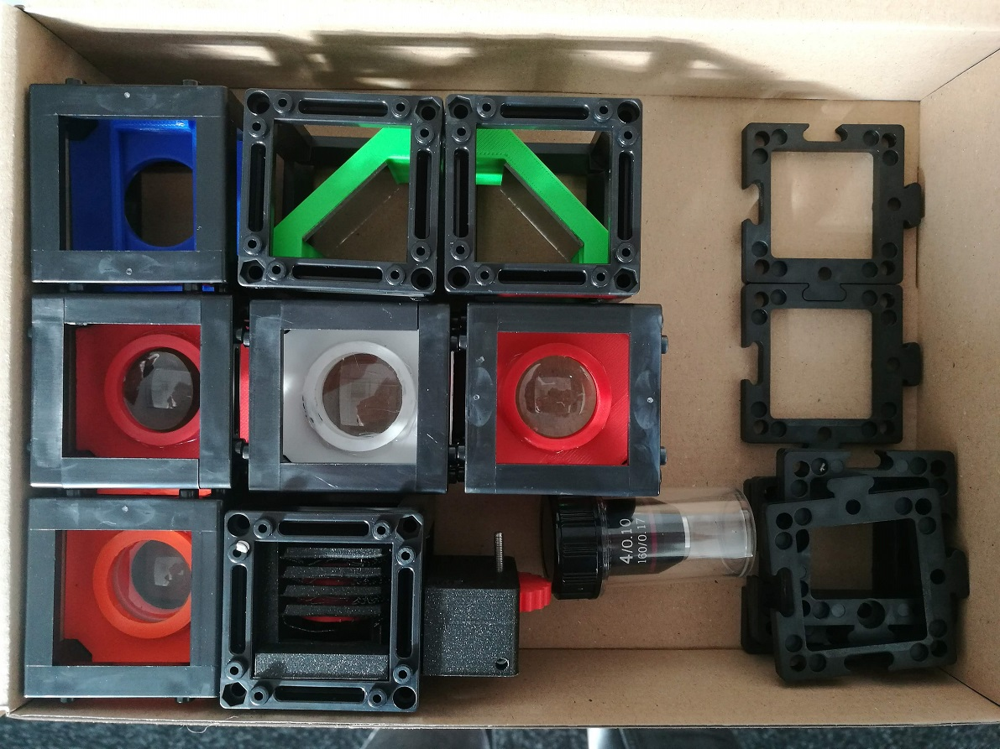
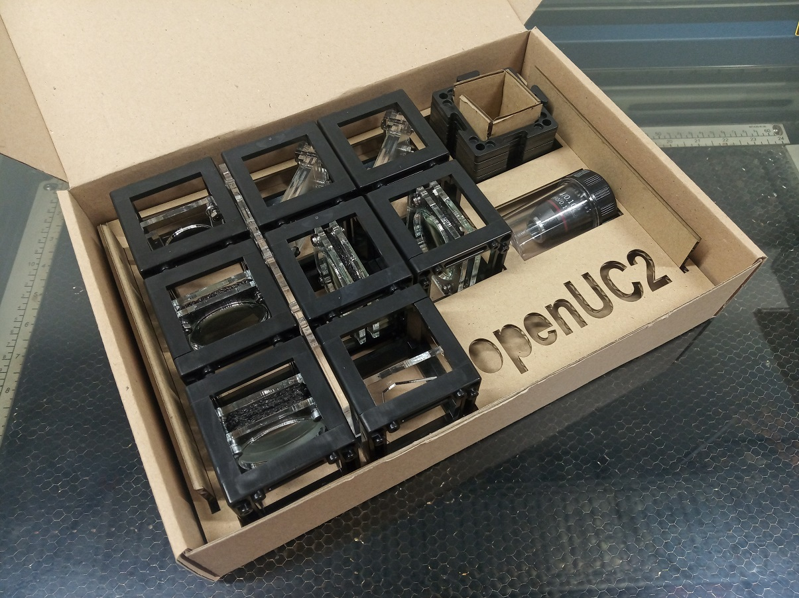

SimpleBOX, equipped with passive components only, covers the basic experiments of ray optics. It is compact and cheap and therefore can be handed to children of all age. It completely covers the classical optics experiments of 7th-8th grade with an overhang to the high school experiments.

Over time, we optimised the SimpleBOX to be even cheaper and even simpler and this is what we call the MiniBOX. MiniBOX has only 8 cubes but shows the same experiments as the SimpleBOX. When you print the parts at home, the overall price is around 80 €.

The MiniBOX is intended for mass production using injection moulding and laser cutting. We are now using and improving the MiniBOX more that the SimpleBOX but you can still build any of them.

This is a SimpleBOX (v0/v2 cubes):

This is a MiniBOX (v3 cubes, IM - injection moulded): Right - 3D-printed inserts, Left - laser cut inserts

</a>
</a>

Useful for Secondary schools and Hight schools and for Workshops. Get back to us if you want to organize one together with us!

## The difference between MiniBOX and SimpleBOX
What are the actual differences between those two?
* The SimpleBOX has an eyepiece. This is useful especially for the Smartphone microscope but of course makes the whole BOX more expensive
* The SimpleBOX has a flashlight as a light source. This is very practical, but again it's an extra thing you have to buy. Also, the flashlight we propose is a very strong one and if you're using the BOX with some younger children, you might not want to give the a flashlight for safety reasons
* The SimpleBOX has enough lenses to perform multiple experiments in parallel. This might be useful for demonstrations but it's not necessary for the use in a lecture

You can always advance your MiniBOX with a cube or two.

##  Build the BOX
A list of 3D-printed parts and necessary components is found in [BUILD_ME](./BUILD_ME), together with assembly guidelines and some printing tips and tricks.

##  Use the MiniBOX
It can be confusing the first time you see it but it's not complicated at all ;-) The guidelines for working with the MiniBOX are found in [USE_ME](./USE_ME). There you find what kind of experiments you can do with it, how to build a system using the cubes and baseplates and more.  

## Buy the MiniBOX?
*We are working on making the IM Cubes and Puzzles available for sale, but we are not able to offer a 'BUY' button yet. If you are interested in buying some components, contact us via email info@useetoo.org*

##  Participate
If you have a cool idea, please don't hesitate to write us a line, we are happy to incorporate it in our design to make it even better.
