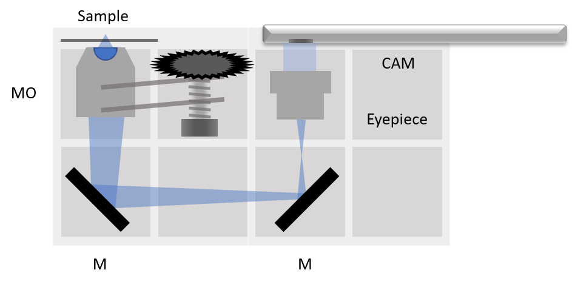

# Simple BOX
SimpleBOX, equipped with passive components only, covers the basic experiments of ray optics. It is compact and cheap and therefore can be handed to children of all age. It completely covers the classical optics experiments of 7th-8th grade with an overhang to the high school experiments.

That's how it could look like:

Useful for Workshops. Get back to us if you want to organize one together with us!

**Coming soon:** [MiniBOX](MiniBOX.md) with 8 cubes only but the same amount of experiments as the SimpleBOX! Price is reduced, effect remains.

##  Build the BOX
A list of 3D-printed parts and necessary components is found in [BUILD_ME](./BUILD_ME), together with assembly guidelines and some printing tips and tricks.

##  Setups
What can you build with the SimpleBOX?

### Projector
[LINK](../../APPLICATIONS/APP_SIMPLE-Projector)
 Simple one lens projector. Direct illumination. 4× magnification for *f(L)* = +40 mm, object to lens 50 mm and lens to screen 200 mm.

### Telescopes
[LINK](../../APPLICATIONS/APP_SIMPLE-Telescope)
Three classical telescope principles. 2× magnification for *f(L1)* = +100 mm, *f(L2)* = +50 mm, *f(L3)* = -50 mm.

### Smartphone Microscope
[LINK](../../APPLICATIONS/APP_SIMPLE-Smartphone_Microscope)
Trasmission microscope, uses smartphone for image acquisition. LED array serves as light source - different illumination modes possible.

You also find some education material and more about the setups in DOCUMENTs in [ENGLISH](./DOCUMENTS/UC2_simpleBOX_EN.pdf), [GERMAN](./DOCUMENTS/UC2_simpleBOX_DE.pdf), [FRENCH](./DOCUMENTS/UC2_simpleBOX_FR.pdf) and [CZECH](./DOCUMENTS/UC2_simpleBOX_CZ.pdf).

##  Participate
If you have a cool idea, please don't hesitate to write us a line, we are happy to incorporate it in our design to make it even better.
