#  Use the MiniBOX
It can be confusing the first time you see it but it's not complicated at all ;)

([TUT10 of TUTORIALS](../../../TUTORIALS))

## [Watch this video](https://www.youtube.com/watch?v=glL_bdoeETM&t=2s&ab_channel=openUC2) to get an overview of what is inside the MiniBOX and how to work with it
The video was prepared for a course at the university here but a lot of the advice applies even when you build your own box.

## Useful tips to start exploring - for total beginners to openUC2
* Build a baseplate of the desired shape and size from the puzzle pieces

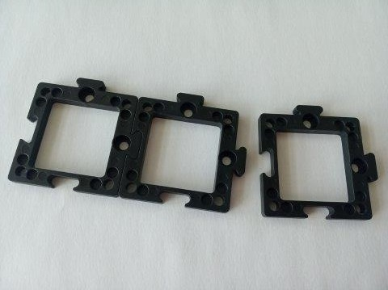

* Press the cubes on the baseplates, they attach via their Lego-like pins

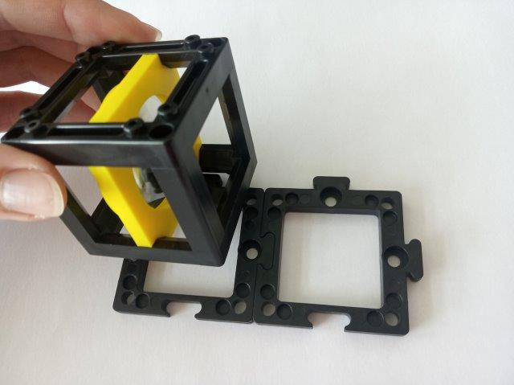
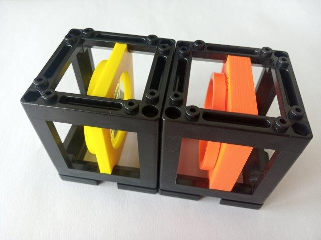

* Align the position of the insert by shifting it back and forth. For telescopes and microscope, do it while looking through it

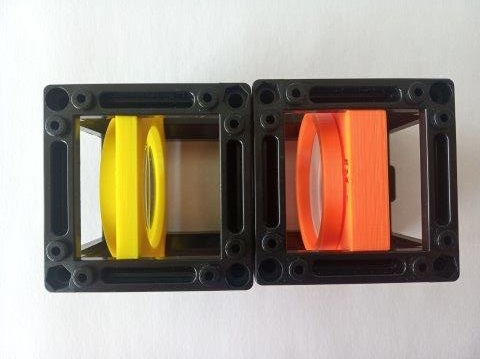
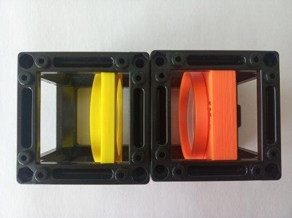

* Build a three dimensional setup when needed - add another layer of baseplates and cubes on top of the first one, creating a sandwich structure

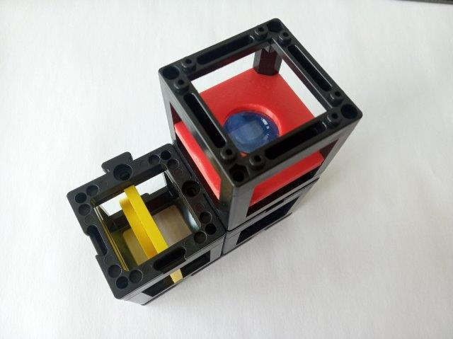

* There are two different orientations for the inserts, with respect to the pins. Open the cube and change the orientation when needed

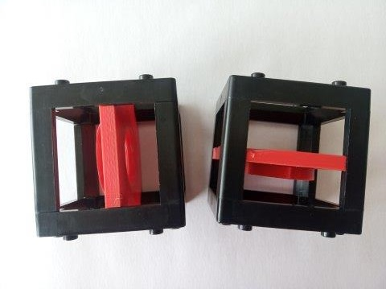
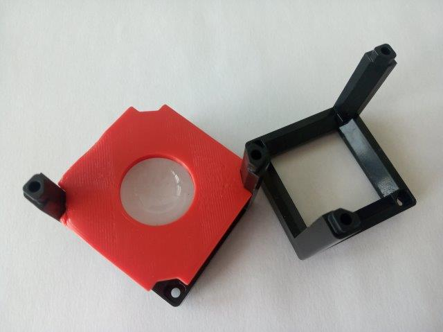

* The Z-stage: it might look like a complicated, easy-to-break part, but don't worry!
  * The Z-stage has a ring that holds the objective. Slide it out of the stage

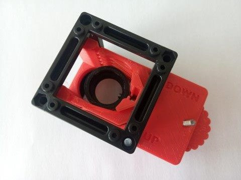
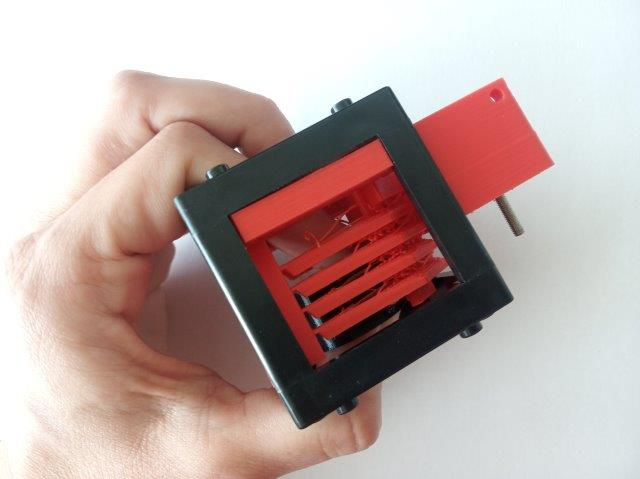

  * Once the ring is out, press the objective into it. There is no threading, just use force

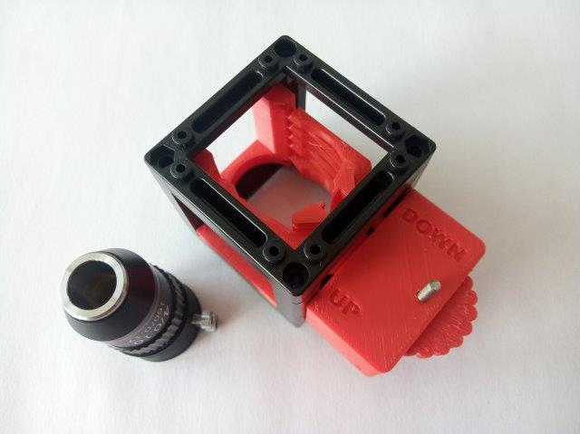

  * Slide the objective into the stage, putting the screws of the ring into the rail

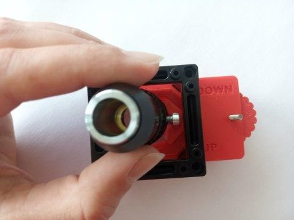
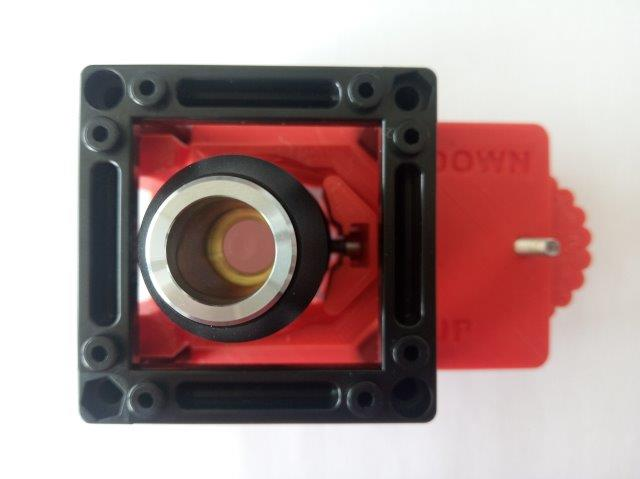

  * Adjust the position of the objective in a large range by sliding the ring in the rail. The gear is for fine focusing when you already observe the sample with the microscope and it has a very small range

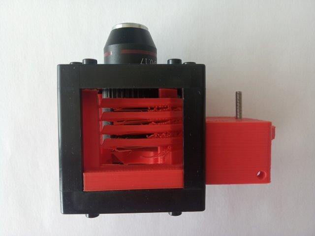
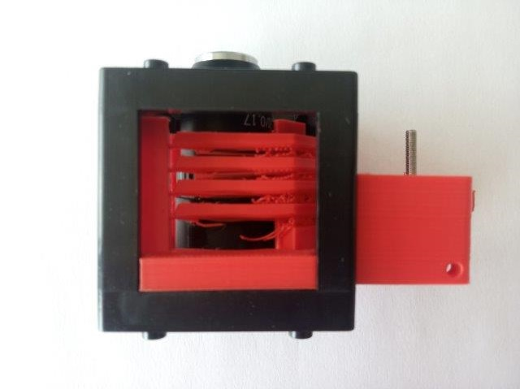

* Smartphone microscope is the biggest and coolest experiment you can do and when you build that, you can move from the realm of Physics to Biology and start observing real samples from around you. But it's very important that you build it correctly
  * Build a 4×1 baseplate

  * Add the two mirrors to their positions, facing each other

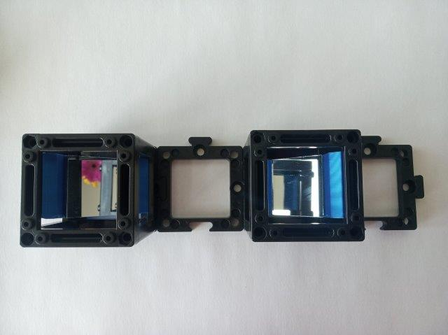

  * Add an additional cube (empty or one you won't need for this microscope). The scheme is mirror - empty - mirror - random cube

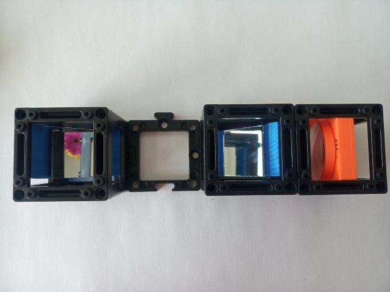

  * Add an additional cube (empty or one you won't need for this microscope). The scheme is mirror - empty - mirror - random cube

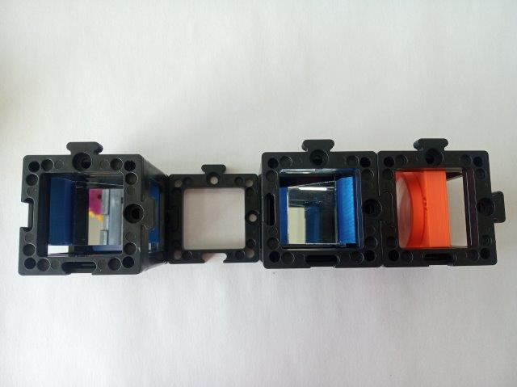

  *  Add the next layer of cubes: Z-stage - (empty because there is no first layer) - 40 mm lens or eyepiece - random cube for support

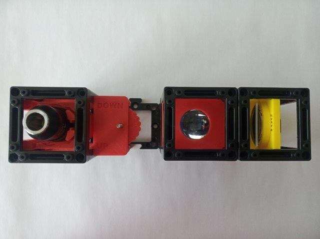

  *  Add one baseplate puzzle on top of the Z-stage

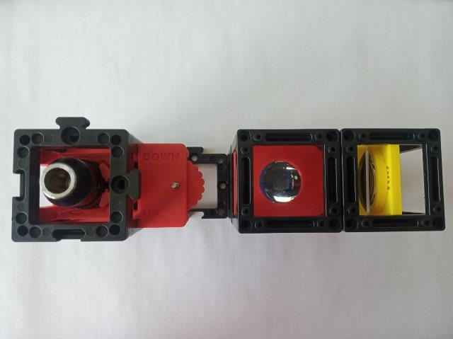

  *  Add the Sample holder cube above the Z-stage - above the objective

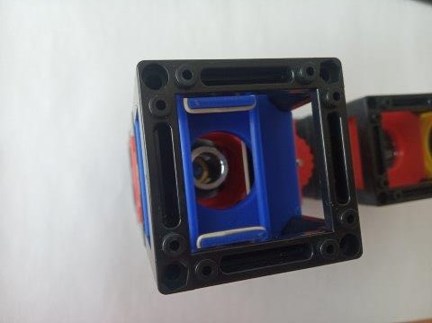

  *  Place the Smartphone holder over the 40 mm lens (eyepiece) and the support cube. It attaches do the pins of the cube the same way the baseplates do

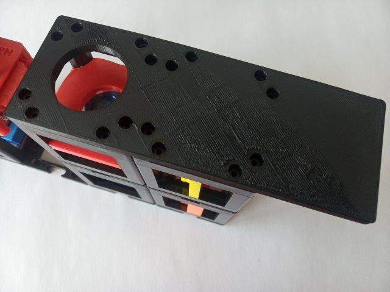

  *  This is how the finished microscope looks like

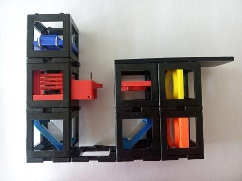

  *  The sample goes into the holder, above the objective

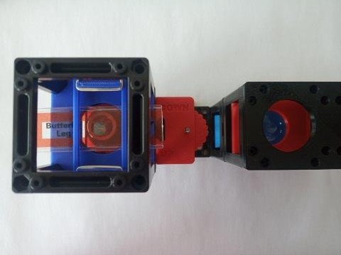

  *  Then you can observe it through the eyepiece

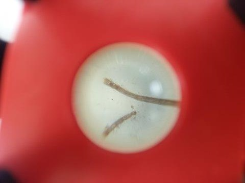

  * Tips and trick for the alignment:
      * The objective has to be quite high up - the plane where the ring and the objective housing touch should be 160 mm from the mirror that is below the eyepiece
      * Every phone is a little different and in order to match the pupils you might need to take of the case of your phone (to get closer) or introduce some extra spacer, like a folded piece of paper (to get further from the eyepiece lens)
      * Before assembling the microscope completely, align the objective by shifting it in the rail of the Z-stage. Mind the required distance of 160 mm to the mirror. Roughly, the red stripe on the objective should be just above the cube's face
      * With the microscope assembled and the sample on top, look through the eyepiece and move the sample holder insert in its cube by hand to get roughly into focusing. You can start by moving the sample through the whole range of the cube to get a feeling for where the focus lies

##  Setups
What can you build with the MiniBOX or SimpleBOX? This is just to give you a taste of it - there's more than that ;-)

### Projector
[LINK](../../../APPLICATIONS/APP_SIMPLE-Projector)
 Simple one lens projector. Direct illumination. 4× magnification for *f(L)* = +40 mm, object to lens 50 mm and lens to screen 200 mm.

### Telescopes
[LINK](../../../APPLICATIONS/APP_SIMPLE-Telescope)
Three classical telescope principles. 2× magnification for *f(L1)* = +100 mm, *f(L2)* = +40 mm, *f(L3)* = -50 mm.

  

### Infinity-corrected microscope

### Smartphone Microscope
[LINK](../../../APPLICATIONS/APP_SMARTPHONE_MICROSCOPE)
Trasmission microscope (finite corrected), uses smartphone for image acquisition. LED array serves as light source - different illumination modes possible.

You also find some education material and more about the setups in DOCUMENTs in English, German, French and Czech (condensed materials for some of the experiments [here](../DOCUMENTS/SimpleBOX)). These materials are not completely up to date, as we're currently developing the **MiniBOX booklet**, a comprehensive guide through the experiments and theory of Optics that will support the MiniBOX as a teaching tool. You can find it [here](../DOCUMENTS/MiniBOX_booklet) but keep in mind it's still work in progress. If you have some suggestions for improvement, we'll be happy to hear them!   

##  Participate
If you have a cool idea, please don't hesitate to write us a line, we are happy to incorporate it in our design to make it even better.
